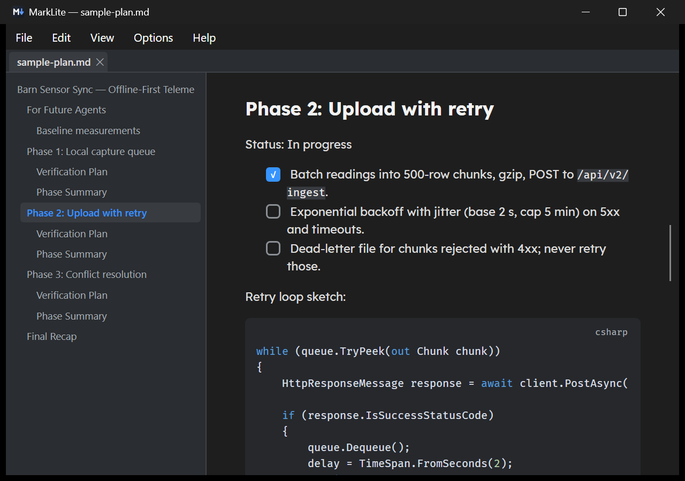
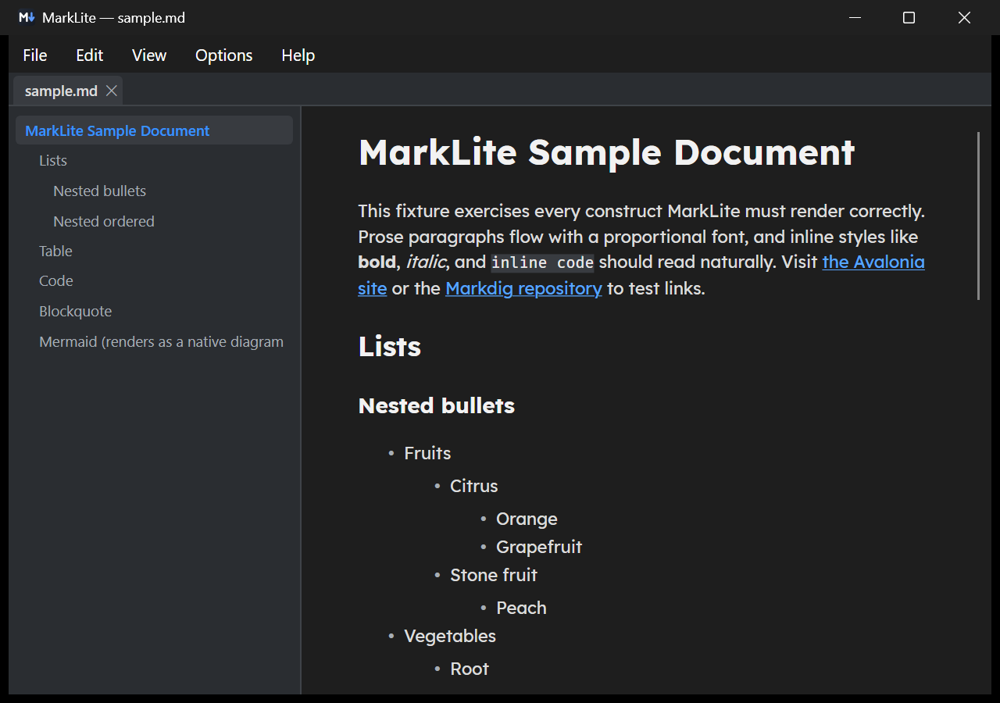
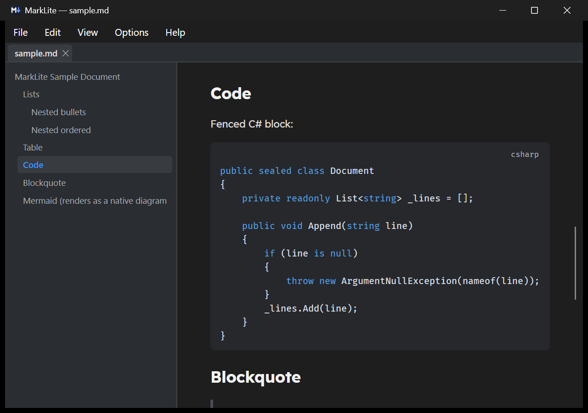
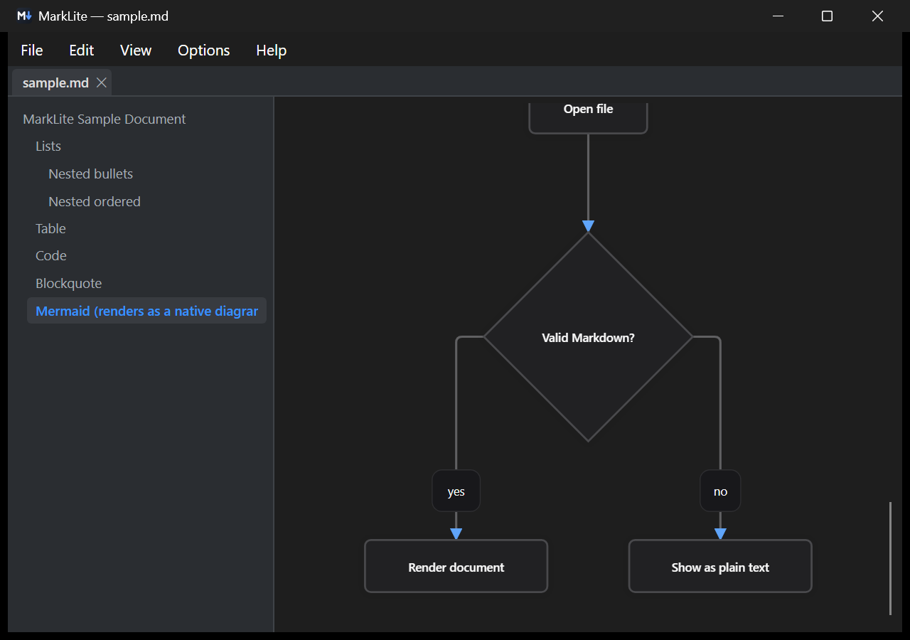

# MarkLite

A genuinely native Windows Markdown **viewer** — no web engine, no Electron, no
WebView2, no Node. Avalonia 12 + Skia, C#, .NET 10, Markdig parsing through
[MarkView.Avalonia](https://github.com/Kryptos-FR/MarkView.Avalonia), published
NativeAOT + trimmed. Built as a lightweight *plan viewer*: open a Markdown plan,
see real checkboxes, tables, and highlighted code — editing stays in your editor
of choice.

## Install

Grab `MarkLite-win-Setup.exe` from the
[latest release](https://github.com/PneutronixJeremy/MarkLite/releases/latest) —
per-user install, no admin prompt, updates itself from GitHub Releases. Prefer
no installer? `MarkLite-win-Portable.zip` from the same page runs from any
folder (portable copies don't auto-update).



## Why

Every mainstream Markdown viewer on Windows drags in a browser engine. MarkLite
does not:

| Viewer           | Working set (MB) | Web engine        |
|------------------|-----------------:|-------------------|
| glow (terminal)  |            20–40 | no                |
| **MarkLite**     |        **68–86** | **no**            |
| Notepad          |             ~160 | yes (WebView2)    |
| Markpad          |             ~375 | yes               |
| Markdown Monster |             ~402 | yes (WebView2)    |

Measured on this machine (Windows 11, 32 GB) against the committed fixtures:
published AOT build, fixed 1400x1000 window, `Process.WorkingSet64` read from
the app itself after the idle trim.

| Document | Size | First content render | Working set |
|---|---:|---:|---:|
| `sample.md` | 1.6 KB | 81 ms | 72.3 MB |
| `sample-plan.md` | 3.5 KB | 88 ms | 67.8 MB |
| `stress-large.md` | 528 KB | 105 ms | 85.9 MB |
| all three, open as tabs | 533 KB | 105 ms | 78.1 MB |

Rendering is virtualized — only the blocks near the viewport are built as
controls — so the working set tracks the window rather than the file: 528 KB of
markdown costs 14 MB more than 1.6 KB does, about 0.03 MB per KB. And only the
active tab holds a rendered tree, so three documents open cost no more than
one. Zero `msedgewebview2.exe` children, ever.

## Features

- Markdown Monster–style dark theme; follows the Windows app theme live
  (dark/light), including syntax-highlight palettes.
- CommonMark + GFM via Markdig: pipe tables (with column alignment), task lists
  as prominent read-only checkboxes, fenced code with syntax highlighting (C#,
  JS/TS, PowerShell, JSON, XML, and more via ColorCode), inline code chips,
  blockquotes, nested lists, setext headings, autolinks, strikethrough, emoji.
- **Mermaid diagrams render natively** — real flowcharts drawn with
  [Mermaider](https://github.com/Kryptos-FR/Mermaider), pure .NET. Still no JS
  runtime, still no browser.
- **Math**: inline and block TeX typeset natively (CSharpMath).
- Bundled fonts, no system dependency: Fira Code Retina for code; body font
  selectable under View > Body font (Roboto, Lexend, Segoe UI).
- **Virtualized rendering**: the document is parsed once, and only the blocks
  near the viewport are built as controls, so a 500 KB file opens as fast as a
  1 KB one and costs a fraction of the memory. Scrolling, the contents sidebar,
  find and copy all work over the whole document regardless of what is on
  screen.
- Tabs: multiple documents, per-tab scroll/search/watcher; only the active tab
  holds a rendered tree, so open tabs cost their text and nothing else. A second
  launch hands its file to the running instance over a named pipe.
- Contents sidebar (Ctrl+T) built from the document's heading tree, with
  current-section tracking and working in-document `#anchor` links.
- Find in document (Ctrl+F): live highlighting, F3 / Shift+F3 navigation with
  wraparound, match counter, survives live reload.
- Live reload: edits from any editor appear ~150 ms after save, scroll position
  preserved; deleted/locked files show a stale banner and recover automatically.
- Open via CLI argument, File > Open, drag-drop, or relative links between
  Markdown files.
- Text selection, with **Ctrl+C giving back the Markdown source** the selection
  covers rather than the rendered text — Ctrl+A copies the file. Selections are
  addressed by block and character, so they can span parts of the document that
  were never rendered.
- View > Show line numbers: a source-line gutter, numbering every line inside
  fenced code and the starting line of everything else.
- View > Show HTML comments: `<!-- … -->` shown dimmed rather than hidden, so a
  document's own markers stay visible. Other raw HTML stays dropped.
- Installer + auto-update via [Velopack](https://velopack.io): per-user install
  (no admin), background update check against GitHub Releases, silent download,
  applies on restart. Portable zip for the no-install crowd.
- Optional "Open with" registration for `.md`/`.markdown` (Options menu, or the
  one-time offer on first launch) — HKCU only, never touches your default
  handler, fully removed on uninstall.

## Screenshots

Document top — headings, nested lists, links, tab strip, contents sidebar:



Fenced code with syntax highlighting and its language chip:



A ```` ```mermaid ```` fence rendered as a real native diagram — no browser, no
JS:



## Build

Requires .NET 10 SDK. Plain build:

```powershell
dotnet build MarkLite.slnx -c Release
```

NativeAOT publish (writes `publish\MarkLite.exe`):

```powershell
.\build\publish.ps1
```

Note: `publish.ps1` encodes this machine's VS-less linker setup (MSVC toolset
path + Windows SDK import libs staged from the `Microsoft.Windows.SDK.CPP.x64`
NuGet package). On a machine with the "Desktop development with C++" workload
installed, a stock `dotnet publish -c Release -r win-x64` works instead.

Contributors: activate the repo's hooks once per clone — the pre-commit hook
runs `tools/scrub-check.ps1` so no local path, account name or token reaches a
commit:

```powershell
git config core.hooksPath .githooks
```

## Usage

```powershell
MarkLite.exe path\to\file.md
```

No argument opens the welcome page. `MARKLITE_DEBUG=1` prints diagnostics
(startup timing, file loads, reloads, link routing, search, TOC, updates) to
stderr; `MARKLITE_STANDALONE=1` skips the single-instance handoff so a launch
always gets its own window (useful for scripted checks); `MARKLITE_UPDATE_URL`
points the updater at a local folder or custom URL instead of GitHub.

## Packaging a release

```powershell
.\build\pack.ps1        # AOT publish + vpk pack -> releases\ (Setup.exe, nupkg, portable zip)
.\build\release.ps1     # upload releases\ to GitHub Releases (needs a repo-scope token, see script)
```

The version comes from `<Version>` in `src/MarkLite/MarkLite.csproj` — bump it
there, pack, release. Installed copies pick the new version up automatically:
checked in the background after startup (or Help > Check for updates),
downloaded silently, applied on the next restart.

Full procedure, prerequisites and artifact list: [docs/RELEASING.md](docs/RELEASING.md).

## Deployment (manual)

Copy `publish\MarkLite.exe` (37.9 MB) + `libSkiaSharp.dll` (11.6 MB) +
`libHarfBuzzSharp.dll` (2.0 MB) anywhere — 51.4 MB in total. No runtime, no
registry, no symbols.

## License

MIT — see [LICENSE](LICENSE). Bundled fonts, library dependencies and the two
pieces of vendored MarkView source are covered in
[THIRD-PARTY-NOTICES.md](THIRD-PARTY-NOTICES.md).
