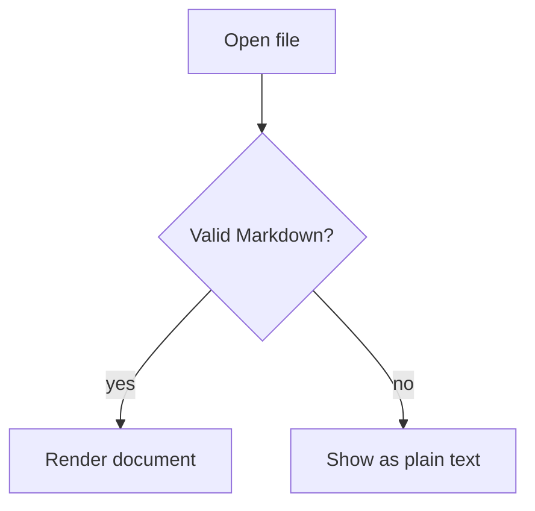

# MarkLite Sample Document

This fixture exercises every construct MarkLite must render correctly. Prose
paragraphs flow with a proportional font, and inline styles like **bold**,
*italic*, and `inline code` should read naturally. Visit
[the Avalonia site](https://avaloniaui.net) or the
[Markdig repository](https://github.com/xoofx/markdig) to test links.

## Lists

### Nested bullets

- Fruits
  - Citrus
    - Orange
    - Grapefruit
  - Stone fruit
    - Peach
- Vegetables
  - Root
    - Carrot

### Nested ordered

1. Prepare
   1. Gather tools
   2. Read instructions
      1. Twice
2. Execute
3. Verify

## Table

| Viewer           | Working set (MB) | Correct rendering |
|------------------|-----------------:|-------------------|
| glow             |            20–40 | terminal only     |
| Notepad          |              160 | no                |
| Markdown Monster |              402 | yes               |
| MarkLite         |            < 100 | yes               |

## Code

Fenced C# block:

```csharp
public sealed class Document
{
    private readonly List<string> _lines = [];

    public void Append(string line)
    {
        if (line is null)
        {
            throw new ArgumentNullException(nameof(line));
        }
        _lines.Add(line);
    }
}
```

## Blockquote

> Markdown is intended to be as easy-to-read and easy-to-write as is feasible.
> Readability, however, is emphasized above all else.

## Mermaid (expected: plain code block, no diagram)


