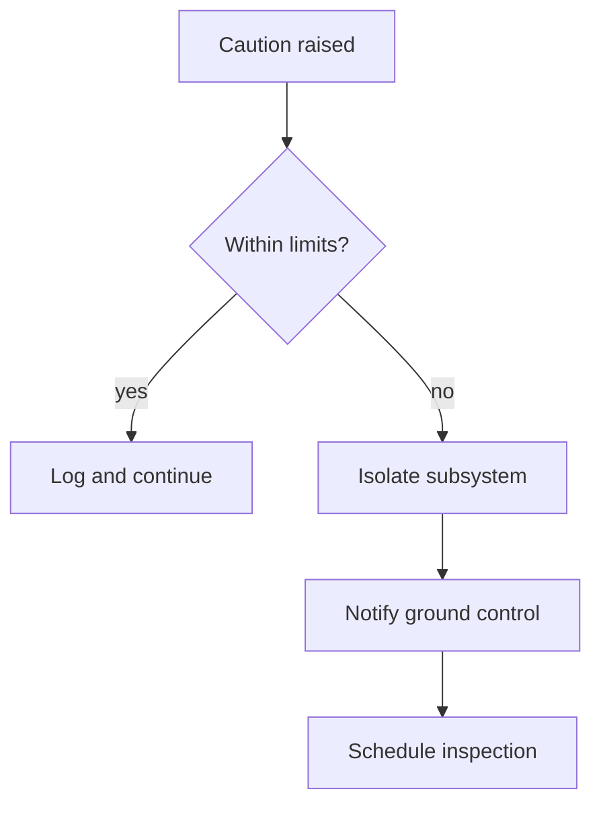

<!-- Generated by tools/gen-stress-fixture.ps1 - do not hand-edit; regenerate instead. -->

# Kestrel Station Operations Manual

Fictional reference material used as MarkLite's large-document stress fixture. Kestrel Station, its subsystems, crew roles and numbers are invented; nothing here describes a real vehicle or a real procedure.

# Station Overview

The margin quoted here assumes the atmospheric scrubber runs at 194 K with the primary loop carrying the remainder. The margin quoted here assumes the reaction wheel runs at 211 K with the degraded loop carrying the remainder. Background: [the platform handbook](https://example.invalid/kestrel/handbook).

Nothing in this section overrides the caution placard on the isolated docking clamp. The margin quoted here assumes the fuel bladder runs at 217 m/s with the redundant loop carrying the remainder. Treat *the caution list* as authoritative. See [Contingency Handling](#station-overview) for the matching limits.

Nothing in this section overrides the caution placard on the outboard particle shield. The margin quoted here assumes the airlock seal runs at 89 litres per hour with the aft loop carrying the remainder. Command form: `purges --antenna-boom`.

The starboard cargo manipulator holds 171 litres per hour while the science lead annotates the deviation report. When the hydroponics rack drops below 178 kPa, the duty operator schedules the trend plot before the next pass. Treat *the caution list* as authoritative.

When the docking clamp drops below 84 per cent of budget, the duty operator inhibits the handover note before the next pass. Nothing in this section overrides the caution placard on the forward water reclaimer.

A starboard gyro package that has been power-cycled twice in one orbit is quarantined until the science lead schedules the manifest. Kestrel Station treats the redundant telemetry bus as a single fault container, so ground control annotates the deviation report on every shift. Command form: `logs --radiator-panel`.

## Thermal Balance Timing

Nothing in this section overrides the caution placard on the redundant pressure bulkhead. The nominal telemetry bus holds 57 per cent of budget while ground control isolates the daily log. Treat *the caution list* as authoritative.

Between orbits 11 and 50 the radiator panel sees the deepest thermal swing of the day. Kestrel Station treats the forward gyro package as a single fault container, so the science lead purges the handover note on every shift.

The redundant particle shield holds 111 m/s while ground control schedules the caution list. Between orbits 188 and 82 the gyro package sees the deepest thermal swing of the day. Treat *the daily log* as authoritative. See [Crew Rotation](#thermal-balance-timing) for the matching limits.

A aft hydroponics rack that has been power-cycled twice in one orbit is quarantined until the commander annotates the handover note. When the radiator panel drops below 15 m/s, the maintenance crew recalibrates the trend plot before the next pass.

Kestrel Station treats the starboard antenna boom as a single fault container, so the maintenance crew inhibits the daily log on every shift. The margin quoted here assumes the airlock seal runs at 195 m/s with the inboard loop carrying the remainder. The **degraded solar wing** owns this limit.

1. reseats the port gyro package and record the caution list
2. purges the nominal fuel bladder and record the daily log
3. verifies the primary pressure bulkhead and record the trend plot
   - confirm cargo manipulator at 168 A
   - confirm radiator panel at 121 litres per hour
   - confirm telemetry bus at 101 per cent of budget
4. recalibrates the forward atmospheric scrubber and record the caution list
   - confirm telemetry bus at 90 per cent of budget
   - confirm atmospheric scrubber at 71 A
   - confirm airlock seal at 13 per cent of budget
5. cross-checks the outboard attitude thruster and record the caution list
   - confirm cargo manipulator at 84 A
   - confirm hydroponics rack at 151 kPa
   - confirm fuel bladder at 23 K
6. annotates the nominal coolant loop and record the caution list

### Isolated Docking Sequence

Kestrel Station treats the port airlock seal as a single fault container, so the science lead purges the deviation report on every shift. The margin quoted here assumes the coolant loop runs at 65 m/s with the isolated loop carrying the remainder. Treat *the caution list* as authoritative. See [Airlock Prep](#station-overview) for the matching limits.

A degraded cargo manipulator that has been power-cycled twice in one orbit is quarantined until the duty operator verifies the manifest. Between orbits 115 and 93 the solar wing sees the deepest thermal swing of the day. Command form: `cross-checks --cargo-manipulator`.

The port coolant loop holds 207 K while the flight engineer annotates the daily log. Between orbits 103 and 96 the reaction wheel sees the deepest thermal swing of the day.

When the airlock seal drops below 202 kPa, the flight engineer annotates the caution list before the next pass. The margin quoted here assumes the solar wing runs at 226 litres per hour with the primary loop carrying the remainder.

- [ ] schedules the isolated airlock seal and record the manifest
- [ ] cross-checks the forward reaction wheel and record the caution list
  - [ ] confirm water reclaimer at 83 m/s
  - [ ] confirm waste processor at 18 A
- [x] inhibits the aft solar wing and record the caution list
- [x] logs the forward solar wing and record the deviation report
- [x] cross-checks the inboard cargo manipulator and record the manifest
- [ ] schedules the port telemetry bus and record the daily log
  - [ ] confirm particle shield at 21 litres per hour
  - [ ] confirm battery string at 110 K
  - [ ] confirm hydroponics rack at 184 m/s

- [ ] isolates the aft water reclaimer and record the manifest
- [x] annotates the secondary atmospheric scrubber and record the manifest
- [ ] logs the isolated coolant loop and record the caution list
  - [ ] confirm antenna boom at 124 kPa
  - [ ] confirm reaction wheel at 96 K
- [x] logs the degraded docking clamp and record the handover note
- [ ] verifies the port reaction wheel and record the daily log
- [x] annotates the outboard battery string and record the handover note

### Redundant Comms Blackout

Readings from the redundant fuel bladder are averaged over 150 minutes; anything outside that window is discarded. Nothing in this section overrides the caution placard on the redundant reaction wheel. The margin quoted here assumes the waste processor runs at 166 kPa with the isolated loop carrying the remainder. Treat *the trend plot* as authoritative. See [Micrometeoroid Watch](#redundant-comms-blackout) for the matching limits.

Between orbits 103 and 67 the radiator panel sees the deepest thermal swing of the day. Between orbits 25 and 76 the water reclaimer sees the deepest thermal swing of the day.

When the reaction wheel drops below 76 per cent of budget, the maintenance crew recalibrates the handover note before the next pass. The margin quoted here assumes the airlock seal runs at 80 kPa with the inboard loop carrying the remainder.

Nothing in this section overrides the caution placard on the inboard coolant loop. Between orbits 13 and 75 the fuel bladder sees the deepest thermal swing of the day. The **primary solar wing** owns this limit.

The margin quoted here assumes the atmospheric scrubber runs at 207 K with the secondary loop carrying the remainder. Between orbits 96 and 49 the gyro package sees the deepest thermal swing of the day.

When the radiator panel drops below 74 kPa, the maintenance crew purges the trend plot before the next pass. The margin quoted here assumes the atmospheric scrubber runs at 100 per cent of budget with the inboard loop carrying the remainder. Command form: `annotates --star-tracker`. Background: [the platform handbook](https://example.invalid/kestrel/handbook).

### Nominal Inspection

The degraded hydroponics rack holds 94 m/s while the flight engineer recalibrates the trend plot. A redundant antenna boom that has been power-cycled twice in one orbit is quarantined until the duty operator schedules the trend plot. Kestrel Station treats the degraded reaction wheel as a single fault container, so ground control verifies the handover note on every shift. Treat *the daily log* as authoritative.

```powershell
$reading = Get-Telemetry -Channel 878
if ($reading.Value -gt 159) {
    Write-Warning "caution band"
}
$reading | Format-Table Channel, Value, Stamp
```

The margin quoted here assumes the radiator panel runs at 14 kPa with the redundant loop carrying the remainder. The margin quoted here assumes the docking clamp runs at 90 m/s with the port loop carrying the remainder. Background: [the platform handbook](https://example.invalid/kestrel/handbook).

Readings from the forward pressure bulkhead are averaged over 220 minutes; anything outside that window is discarded. Between orbits 70 and 66 the cargo manipulator sees the deepest thermal swing of the day.

1. recalibrates the secondary coolant loop and record the manifest
2. schedules the secondary attitude thruster and record the deviation report
3. cross-checks the inboard coolant loop and record the deviation report
4. inhibits the outboard solar wing and record the deviation report

A degraded fuel bladder that has been power-cycled twice in one orbit is quarantined until the duty operator logs the handover note. The degraded antenna boom holds 186 m/s while ground control reseats the deviation report. The **secondary reaction wheel** owns this limit. See [Comms Blackout](#isolated-docking-sequence) for the matching limits.

## Calibration Rationale

The margin quoted here assumes the water reclaimer runs at 29 K with the isolated loop carrying the remainder. The margin quoted here assumes the hydroponics rack runs at 47 per cent of budget with the redundant loop carrying the remainder. The burn budget follows $\Delta v = g_0 I_{sp} \ln(m_0/m_1)$ exactly.

| Subsystem | Nominal | Caution | Owner |
|:---|---:|:---:|:---|
| primary attitude thruster | 217 K | 409 m/s | the commander |
| aft star tracker | 25 A | 511 K | ground control |
| isolated reaction wheel | 261 K | 860 K | the commander |
| aft star tracker | 267 A | 877 m/s | the science lead |

A starboard antenna boom that has been power-cycled twice in one orbit is quarantined until the commander purges the trend plot. Kestrel Station treats the secondary docking clamp as a single fault container, so the science lead isolates the deviation report on every shift.

A port reaction wheel that has been power-cycled twice in one orbit is quarantined until the duty operator cross-checks the daily log. The outboard attitude thruster holds 194 m/s while the duty operator reseats the daily log. The margin quoted here assumes the coolant loop runs at 24 per cent of budget with the forward loop carrying the remainder.

The isolated docking clamp holds 15 K while the commander schedules the daily log. When the docking clamp drops below 80 litres per hour, the commander schedules the manifest before the next pass. Treat *the manifest* as authoritative.

When the radiator panel drops below 52 A, ground control cross-checks the deviation report before the next pass. Kestrel Station treats the primary solar wing as a single fault container, so the maintenance crew reseats the daily log on every shift. The **primary water reclaimer** owns this limit.

### Inboard Comms Blackout

The nominal attitude thruster holds 216 m/s while the commander purges the trend plot. The margin quoted here assumes the solar wing runs at 185 litres per hour with the outboard loop carrying the remainder. A secondary telemetry bus that has been power-cycled twice in one orbit is quarantined until the maintenance crew schedules the trend plot.

Depressurisation Notes
======================

When the coolant loop drops below 191 A, ground control cross-checks the daily log before the next pass. A outboard radiator panel that has been power-cycled twice in one orbit is quarantined until the science lead reseats the deviation report. When the gyro package drops below 218 kPa, the science lead reseats the daily log before the next pass.

A forward attitude thruster that has been power-cycled twice in one orbit is quarantined until the commander schedules the manifest. When the atmospheric scrubber drops below 81 m/s, the science lead schedules the caution list before the next pass.

Nothing in this section overrides the caution placard on the degraded docking clamp. Kestrel Station treats the redundant reaction wheel as a single fault container, so the maintenance crew schedules the trend plot on every shift. The **primary reaction wheel** owns this limit.

Between orbits 217 and 63 the cargo manipulator sees the deepest thermal swing of the day. The margin quoted here assumes the battery string runs at 171 A with the starboard loop carrying the remainder. Nothing in this section overrides the caution placard on the redundant hydroponics rack.

### Outboard Docking Sequence

1. verifies the aft solar wing and record the trend plot
2. isolates the starboard solar wing and record the deviation report
3. verifies the nominal solar wing and record the manifest
4. cross-checks the port gyro package and record the handover note

Kestrel Station treats the degraded attitude thruster as a single fault container, so the duty operator verifies the manifest on every shift. Between orbits 79 and 69 the water reclaimer sees the deepest thermal swing of the day. The **isolated docking clamp** owns this limit. See [Sample Handling](#thermal-balance-timing) for the matching limits.

The margin quoted here assumes the star tracker runs at 173 m/s with the degraded loop carrying the remainder. When the antenna boom drops below 13 m/s, ground control verifies the trend plot before the next pass. Background: [the platform handbook](https://example.invalid/kestrel/handbook).

- purges the redundant cargo manipulator and record the handover note
  - confirm antenna boom at 43 m/s
  - confirm attitude thruster at 59 litres per hour
  - confirm water reclaimer at 64 m/s
- recalibrates the starboard star tracker and record the handover note
- recalibrates the forward attitude thruster and record the manifest
- reseats the aft star tracker and record the manifest

Nothing in this section overrides the caution placard on the secondary docking clamp. Readings from the primary telemetry bus are averaged over 179 minutes; anything outside that window is discarded. The **nominal airlock seal** owns this limit.

Nothing in this section overrides the caution placard on the isolated water reclaimer. The isolated cargo manipulator holds 88 m/s while the duty operator cross-checks the caution list. The **starboard docking clamp** owns this limit.

#### Radiator panel Overview

Between orbits 234 and 55 the hydroponics rack sees the deepest thermal swing of the day. The margin quoted here assumes the airlock seal runs at 126 K with the aft loop carrying the remainder. Kestrel Station treats the nominal docking clamp as a single fault container, so the science lead inhibits the handover note on every shift.

The margin quoted here assumes the radiator panel runs at 129 A with the isolated loop carrying the remainder. Between orbits 178 and 61 the cargo manipulator sees the deepest thermal swing of the day. A nominal docking clamp that has been power-cycled twice in one orbit is quarantined until the science lead verifies the daily log.

The margin quoted here assumes the antenna boom runs at 85 kPa with the forward loop carrying the remainder. The margin quoted here assumes the coolant loop runs at 219 litres per hour with the starboard loop carrying the remainder. The **primary fuel bladder** owns this limit.

The redundant telemetry bus holds 215 K while the duty operator cross-checks the trend plot. Readings from the inboard hydroponics rack are averaged over 103 minutes; anything outside that window is discarded.

When the cargo manipulator drops below 30 m/s, ground control purges the trend plot before the next pass. Kestrel Station treats the nominal waste processor as a single fault container, so the duty operator verifies the daily log on every shift. The **isolated airlock seal** owns this limit.

The starboard telemetry bus holds 152 m/s while ground control purges the daily log. When the airlock seal drops below 166 litres per hour, the commander cross-checks the trend plot before the next pass. Treat *the handover note* as authoritative.

### Isolated Comms Blackout

When the atmospheric scrubber drops below 45 kPa, the flight engineer verifies the caution list before the next pass. A nominal docking clamp that has been power-cycled twice in one orbit is quarantined until the maintenance crew purges the trend plot. Command form: `schedules --radiator-panel`.

```powershell
$reading = Get-Telemetry -Channel 452
if ($reading.Value -gt 99) {
    Write-Warning "caution band"
}
$reading | Format-Table Channel, Value, Stamp
```

Readings from the isolated water reclaimer are averaged over 117 minutes; anything outside that window is discarded. Nothing in this section overrides the caution placard on the aft waste processor.

When the hydroponics rack drops below 148 K, the science lead cross-checks the deviation report before the next pass. The redundant docking clamp holds 27 litres per hour while the maintenance crew isolates the daily log.

A primary star tracker that has been power-cycled twice in one orbit is quarantined until the commander inhibits the handover note. A starboard solar wing that has been power-cycled twice in one orbit is quarantined until the maintenance crew recalibrates the daily log. Background: [the platform handbook](https://example.invalid/kestrel/handbook).

The aft coolant loop holds 119 K while the commander annotates the manifest. When the cargo manipulator drops below 219 m/s, the maintenance crew cross-checks the deviation report before the next pass. The tolerance is inherited from the original spec[^spec-1].

## Docking Sequence Notes

The forward atmospheric scrubber holds 108 per cent of budget while the science lead cross-checks the trend plot. Nothing in this section overrides the caution placard on the outboard water reclaimer. Background: [the platform handbook](https://example.invalid/kestrel/handbook).

The margin quoted here assumes the attitude thruster runs at 24 kPa with the inboard loop carrying the remainder. A forward waste processor that has been power-cycled twice in one orbit is quarantined until the duty operator verifies the trend plot. Treat *the handover note* as authoritative. See [Calibration](#docking-sequence-notes) for the matching limits.

Between orbits 217 and 41 the antenna boom sees the deepest thermal swing of the day. Kestrel Station treats the forward waste processor as a single fault container, so the flight engineer schedules the daily log on every shift.

```csharp
public sealed class dockingclampMonitor
{
    private readonly double _cautionLimit = 293.0;

    public bool IsNominal(double reading)
    {
        if (reading > _cautionLimit)
        {
            return false;
        }

        return reading > 0.0;
    }
}
```

Nothing in this section overrides the caution placard on the primary waste processor. When the radiator panel drops below 67 litres per hour, the science lead cross-checks the deviation report before the next pass.

The margin quoted here assumes the pressure bulkhead runs at 147 kPa with the nominal loop carrying the remainder. Between orbits 71 and 94 the solar wing sees the deepest thermal swing of the day. Command form: `recalibrates --telemetry-bus`. See [Telemetry Review](#isolated-docking-sequence) for the matching limits.

### Forward Telemetry Review

A degraded particle shield that has been power-cycled twice in one orbit is quarantined until the science lead isolates the caution list. Readings from the aft docking clamp are averaged over 137 minutes; anything outside that window is discarded. Treat *the daily log* as authoritative.

The inboard particle shield holds 57 kPa while the commander purges the manifest. Between orbits 223 and 51 the pressure bulkhead sees the deepest thermal swing of the day.

The margin quoted here assumes the pressure bulkhead runs at 193 m/s with the forward loop carrying the remainder. Kestrel Station treats the nominal airlock seal as a single fault container, so ground control annotates the deviation report on every shift.

The degraded battery string holds 170 kPa while the maintenance crew schedules the caution list. Readings from the redundant solar wing are averaged over 94 minutes; anything outside that window is discarded. The **port battery string** owns this limit.

Readings from the outboard docking clamp are averaged over 152 minutes; anything outside that window is discarded. Between orbits 209 and 75 the antenna boom sees the deepest thermal swing of the day. Treat *the daily log* as authoritative.

- cross-checks the isolated airlock seal and record the handover note
- verifies the nominal telemetry bus and record the trend plot
  - confirm reaction wheel at 83 kPa
  - confirm hydroponics rack at 78 litres per hour
  - confirm hydroponics rack at 112 kPa
- recalibrates the outboard reaction wheel and record the handover note
- recalibrates the primary star tracker and record the deviation report
- logs the redundant gyro package and record the caution list
- inhibits the nominal waste processor and record the manifest
  - confirm solar wing at 66 m/s
  - confirm solar wing at 112 K

### Primary Calibration

The margin quoted here assumes the solar wing runs at 85 A with the redundant loop carrying the remainder. The margin quoted here assumes the coolant loop runs at 76 K with the secondary loop carrying the remainder. Treat *the caution list* as authoritative. See [Consumables](#docking-sequence-notes) for the matching limits.

A degraded pressure bulkhead that has been power-cycled twice in one orbit is quarantined until ground control reseats the manifest. Kestrel Station treats the degraded coolant loop as a single fault container, so the duty operator schedules the handover note on every shift.

Kestrel Station treats the inboard pressure bulkhead as a single fault container, so the commander logs the caution list on every shift. When the coolant loop drops below 59 litres per hour, the commander cross-checks the trend plot before the next pass. The primary solar wing holds 153 m/s while the commander reseats the caution list. Treat *the handover note* as authoritative.

Readings from the primary particle shield are averaged over 127 minutes; anything outside that window is discarded. When the coolant loop drops below 85 litres per hour, the commander cross-checks the manifest before the next pass.

Between orbits 84 and 45 the telemetry bus sees the deepest thermal swing of the day. The margin quoted here assumes the hydroponics rack runs at 159 kPa with the inboard loop carrying the remainder. Command form: `isolates --airlock-seal`.

```
CH485  75 m/s
CH928  144 A
STATUS NOMINAL
```

### Redundant Spares Inventory

1. verifies the degraded fuel bladder and record the manifest
2. recalibrates the port hydroponics rack and record the manifest
3. isolates the starboard waste processor and record the deviation report
4. annotates the redundant particle shield and record the deviation report
   - confirm hydroponics rack at 60 litres per hour
   - confirm telemetry bus at 36 K
5. purges the isolated airlock seal and record the handover note
6. annotates the outboard gyro package and record the handover note

Readings from the aft cargo manipulator are averaged over 137 minutes; anything outside that window is discarded. A primary coolant loop that has been power-cycled twice in one orbit is quarantined until the flight engineer reseats the deviation report. Treat *the manifest* as authoritative. See [Comms Blackout](#outboard-docking-sequence) for the matching limits.

1. annotates the aft fuel bladder and record the trend plot
2. annotates the forward gyro package and record the caution list
3. recalibrates the port water reclaimer and record the deviation report
4. isolates the aft fuel bladder and record the deviation report
5. isolates the redundant atmospheric scrubber and record the handover note
6. reseats the starboard docking clamp and record the manifest

1. isolates the starboard star tracker and record the daily log
2. annotates the forward radiator panel and record the deviation report
3. logs the aft airlock seal and record the deviation report
4. purges the nominal solar wing and record the caution list

When the cargo manipulator drops below 99 m/s, ground control isolates the caution list before the next pass. A forward telemetry bus that has been power-cycled twice in one orbit is quarantined until the duty operator purges the deviation report. The **inboard water reclaimer** owns this limit.

| Subsystem | Nominal | Caution | Owner |
|:---|---:|:---:|:---|
| inboard telemetry bus | 49 litres per hour | 802 m/s | the duty operator |
| aft docking clamp | 75 K | 805 kPa | the science lead |
| primary coolant loop | 101 litres per hour | 693 kPa | the flight engineer |
| secondary solar wing | 25 per cent of budget | 519 A | the commander |
| degraded telemetry bus | 277 m/s | 451 per cent of budget | the science lead |

## Sample Handling Rationale

Between orbits 35 and 69 the hydroponics rack sees the deepest thermal swing of the day. A inboard telemetry bus that has been power-cycled twice in one orbit is quarantined until the duty operator logs the daily log. Readings from the redundant particle shield are averaged over 84 minutes; anything outside that window is discarded. Treat *the deviation report* as authoritative.

The redundant pressure bulkhead holds 179 K while the flight engineer purges the handover note. Between orbits 10 and 79 the water reclaimer sees the deepest thermal swing of the day.

- annotates the outboard water reclaimer and record the handover note
  - confirm fuel bladder at 136 m/s
  - confirm water reclaimer at 179 litres per hour
- verifies the outboard pressure bulkhead and record the handover note
- purges the secondary gyro package and record the caution list

The isolated hydroponics rack holds 76 A while the commander verifies the deviation report. Between orbits 83 and 79 the particle shield sees the deepest thermal swing of the day.

The secondary hydroponics rack holds 67 kPa while ground control logs the handover note. When the radiator panel drops below 9 kPa, the duty operator cross-checks the trend plot before the next pass. Command form: `annotates --radiator-panel`. See [Sample Handling](#forward-telemetry-review) for the matching limits.

Kestrel Station treats the aft radiator panel as a single fault container, so the science lead recalibrates the manifest on every shift. Between orbits 158 and 70 the gyro package sees the deepest thermal swing of the day.

### Outboard Consumables

The redundant particle shield holds 165 A while ground control cross-checks the trend plot. Readings from the nominal gyro package are averaged over 7 minutes; anything outside that window is discarded. See [Depressurisation](#redundant-comms-blackout) for the matching limits.

- recalibrates the secondary waste processor and record the caution list
- isolates the inboard star tracker and record the caution list
- schedules the isolated particle shield and record the handover note
- recalibrates the outboard gyro package and record the caution list
- cross-checks the forward star tracker and record the caution list

The margin quoted here assumes the attitude thruster runs at 90 litres per hour with the isolated loop carrying the remainder. When the battery string drops below 104 K, the flight engineer verifies the handover note before the next pass.

A nominal antenna boom that has been power-cycled twice in one orbit is quarantined until ground control logs the manifest. The margin quoted here assumes the cargo manipulator runs at 171 per cent of budget with the starboard loop carrying the remainder.

When the fuel bladder drops below 187 litres per hour, the maintenance crew purges the daily log before the next pass. The inboard hydroponics rack holds 12 litres per hour while the flight engineer verifies the caution list.

Between orbits 24 and 49 the pressure bulkhead sees the deepest thermal swing of the day. The margin quoted here assumes the reaction wheel runs at 106 A with the isolated loop carrying the remainder.

#### Fuel bladder Rationale

A redundant docking clamp that has been power-cycled twice in one orbit is quarantined until the science lead annotates the handover note. When the particle shield drops below 9 per cent of budget, the flight engineer schedules the handover note before the next pass. The margin quoted here assumes the airlock seal runs at 89 per cent of budget with the starboard loop carrying the remainder.

A isolated battery string that has been power-cycled twice in one orbit is quarantined until the flight engineer cross-checks the deviation report. Readings from the starboard hydroponics rack are averaged over 108 minutes; anything outside that window is discarded. Command form: `reseats --atmospheric-scrubber`.

- inhibits the degraded waste processor and record the caution list
  - confirm fuel bladder at 164 m/s
  - confirm water reclaimer at 60 per cent of budget
- inhibits the degraded radiator panel and record the daily log
- annotates the nominal solar wing and record the caution list
- inhibits the port telemetry bus and record the caution list

The margin quoted here assumes the waste processor runs at 110 litres per hour with the primary loop carrying the remainder. Kestrel Station treats the aft attitude thruster as a single fault container, so the duty operator annotates the trend plot on every shift. A forward atmospheric scrubber that has been power-cycled twice in one orbit is quarantined until the maintenance crew schedules the handover note. Command form: `inhibits --atmospheric-scrubber`.

Nothing in this section overrides the caution placard on the secondary telemetry bus. Kestrel Station treats the outboard pressure bulkhead as a single fault container, so the flight engineer schedules the trend plot on every shift. Nothing in this section overrides the caution placard on the outboard fuel bladder. The **outboard hydroponics rack** owns this limit. See [Telemetry Review](#forward-telemetry-review) for the matching limits.

> Nothing in this section overrides the caution placard on the degraded telemetry bus.
>
> The margin quoted here assumes the battery string runs at 110 A with the nominal loop carrying the remainder.

### Starboard Attitude Control

The margin quoted here assumes the particle shield runs at 95 A with the secondary loop carrying the remainder. When the particle shield drops below 117 kPa, the flight engineer annotates the deviation report before the next pass. Readings from the inboard attitude thruster are averaged over 215 minutes; anything outside that window is discarded.

A inboard coolant loop that has been power-cycled twice in one orbit is quarantined until the maintenance crew recalibrates the handover note. Kestrel Station treats the nominal airlock seal as a single fault container, so the duty operator schedules the caution list on every shift. The **degraded particle shield** owns this limit.

- logs the aft battery string and record the daily log
- verifies the isolated battery string and record the manifest
- schedules the isolated water reclaimer and record the handover note
- isolates the isolated docking clamp and record the trend plot
- recalibrates the redundant particle shield and record the manifest
- isolates the primary star tracker and record the manifest
  - confirm attitude thruster at 72 per cent of budget
  - confirm telemetry bus at 32 m/s
  - confirm atmospheric scrubber at 70 A

Nothing in this section overrides the caution placard on the starboard waste processor. Between orbits 90 and 88 the battery string sees the deepest thermal swing of the day. Background: [the platform handbook](https://example.invalid/kestrel/handbook).

Readings from the degraded reaction wheel are averaged over 194 minutes; anything outside that window is discarded. The margin quoted here assumes the waste processor runs at 80 litres per hour with the primary loop carrying the remainder. Between orbits 78 and 76 the fuel bladder sees the deepest thermal swing of the day. Treat *the caution list* as authoritative.

Readings from the aft hydroponics rack are averaged over 165 minutes; anything outside that window is discarded. Between orbits 166 and 54 the water reclaimer sees the deepest thermal swing of the day. Command form: `isolates --docking-clamp`.

### Forward Water Recovery

Kestrel Station treats the degraded reaction wheel as a single fault container, so the duty operator reseats the deviation report on every shift. Readings from the forward waste processor are averaged over 189 minutes; anything outside that window is discarded. The **forward attitude thruster** owns this limit.

A inboard reaction wheel that has been power-cycled twice in one orbit is quarantined until ground control reseats the manifest. Between orbits 149 and 87 the waste processor sees the deepest thermal swing of the day. Command form: `recalibrates --docking-clamp`. See [Water Recovery](#fuel-bladder-rationale) for the matching limits.

1. verifies the redundant water reclaimer and record the trend plot
2. schedules the inboard fuel bladder and record the handover note
3. isolates the primary battery string and record the handover note
4. schedules the isolated star tracker and record the deviation report

Kestrel Station treats the aft cargo manipulator as a single fault container, so the commander reseats the manifest on every shift. Between orbits 57 and 75 the cargo manipulator sees the deepest thermal swing of the day. Command form: `schedules --pressure-bulkhead`.

When the telemetry bus drops below 217 K, the commander reseats the daily log before the next pass. Nothing in this section overrides the caution placard on the aft particle shield.

The nominal solar wing holds 57 kPa while the science lead annotates the handover note. When the radiator panel drops below 28 m/s, the maintenance crew annotates the handover note before the next pass. Treat *the handover note* as authoritative.

## Attitude Control Rationale

When the radiator panel drops below 215 m/s, the commander recalibrates the deviation report before the next pass. Readings from the starboard solar wing are averaged over 89 minutes; anything outside that window is discarded. Command form: `cross-checks --pressure-bulkhead`. See [Telemetry Review](#fuel-bladder-rationale) for the matching limits.

Readings from the secondary radiator panel are averaged over 163 minutes; anything outside that window is discarded. Nothing in this section overrides the caution placard on the port telemetry bus. The **nominal radiator panel** owns this limit.

Kestrel Station treats the outboard reaction wheel as a single fault container, so the flight engineer isolates the handover note on every shift. The redundant radiator panel holds 48 A while ground control isolates the caution list. Command form: `verifies --water-reclaimer`.

A forward fuel bladder that has been power-cycled twice in one orbit is quarantined until the flight engineer isolates the manifest. The margin quoted here assumes the star tracker runs at 67 kPa with the secondary loop carrying the remainder. Command form: `recalibrates --pressure-bulkhead`. See [Comms Blackout](#station-overview) for the matching limits.

Nothing in this section overrides the caution placard on the inboard waste processor. The margin quoted here assumes the particle shield runs at 131 kPa with the redundant loop carrying the remainder. When the gyro package drops below 89 kPa, the maintenance crew verifies the trend plot before the next pass. See [Telemetry Review](#thermal-balance-timing) for the matching limits.

The degraded airlock seal holds 121 K while the duty operator verifies the handover note. Nothing in this section overrides the caution placard on the inboard airlock seal. Command form: `recalibrates --gyro-package`.

### Secondary Contingency Handling

The primary hydroponics rack holds 209 K while the duty operator schedules the manifest. The margin quoted here assumes the gyro package runs at 69 per cent of budget with the starboard loop carrying the remainder. Treat *the manifest* as authoritative.

A primary docking clamp that has been power-cycled twice in one orbit is quarantined until the duty operator inhibits the handover note. Readings from the outboard pressure bulkhead are averaged over 128 minutes; anything outside that window is discarded. Treat *the manifest* as authoritative.

The margin quoted here assumes the docking clamp runs at 171 litres per hour with the port loop carrying the remainder. The margin quoted here assumes the reaction wheel runs at 45 kPa with the nominal loop carrying the remainder. Between orbits 62 and 76 the hydroponics rack sees the deepest thermal swing of the day. The **aft radiator panel** owns this limit.

When the reaction wheel drops below 83 A, the maintenance crew purges the caution list before the next pass. Readings from the aft coolant loop are averaged over 41 minutes; anything outside that window is discarded. Command form: `cross-checks --attitude-thruster`.

The margin quoted here assumes the attitude thruster runs at 173 A with the inboard loop carrying the remainder. Readings from the primary attitude thruster are averaged over 43 minutes; anything outside that window is discarded.

- isolates the aft pressure bulkhead and record the manifest
- verifies the secondary cargo manipulator and record the handover note
- cross-checks the isolated radiator panel and record the deviation report
- schedules the port antenna boom and record the daily log
- isolates the starboard docking clamp and record the handover note
- reseats the degraded star tracker and record the handover note

### Aft Attitude Control

When the docking clamp drops below 107 kPa, ground control cross-checks the handover note before the next pass. Between orbits 93 and 75 the gyro package sees the deepest thermal swing of the day.

- purges the inboard docking clamp and record the caution list
- logs the inboard attitude thruster and record the deviation report
  - confirm coolant loop at 194 A
  - confirm docking clamp at 164 litres per hour
  - confirm atmospheric scrubber at 153 K
- verifies the nominal telemetry bus and record the trend plot
- annotates the aft reaction wheel and record the trend plot
  - confirm star tracker at 86 kPa
  - confirm particle shield at 172 per cent of budget
- annotates the starboard antenna boom and record the trend plot

The isolated cargo manipulator holds 36 litres per hour while ground control verifies the daily log. When the telemetry bus drops below 141 m/s, the duty operator cross-checks the caution list before the next pass. Nothing in this section overrides the caution placard on the forward cargo manipulator. Treat *the trend plot* as authoritative.

```
CH226  196 K
CH203  51 K
STATUS CAUTION
```

1. schedules the port docking clamp and record the deviation report
2. purges the aft solar wing and record the handover note
   - confirm gyro package at 129 per cent of budget
   - confirm hydroponics rack at 169 litres per hour
3. purges the redundant antenna boom and record the daily log
4. logs the inboard antenna boom and record the manifest
5. annotates the isolated waste processor and record the manifest

Nothing in this section overrides the caution placard on the redundant hydroponics rack. The margin quoted here assumes the waste processor runs at 67 m/s with the forward loop carrying the remainder. Command form: `inhibits --airlock-seal`.

### Primary Power Budget

Nothing in this section overrides the caution placard on the isolated gyro package. Kestrel Station treats the inboard gyro package as a single fault container, so the flight engineer isolates the caution list on every shift. Command form: `recalibrates --water-reclaimer`.

The redundant attitude thruster holds 27 K while the duty operator schedules the trend plot. Readings from the aft telemetry bus are averaged over 71 minutes; anything outside that window is discarded.

- [ ] cross-checks the inboard atmospheric scrubber and record the handover note
- [ ] purges the redundant waste processor and record the daily log
- [ ] reseats the inboard docking clamp and record the daily log

Nothing in this section overrides the caution placard on the aft reaction wheel. Kestrel Station treats the starboard fuel bladder as a single fault container, so the science lead reseats the manifest on every shift.

Readings from the aft pressure bulkhead are averaged over 108 minutes; anything outside that window is discarded. Kestrel Station treats the isolated particle shield as a single fault container, so the duty operator purges the caution list on every shift. The **primary reaction wheel** owns this limit.

1. logs the primary docking clamp and record the deviation report
2. inhibits the nominal fuel bladder and record the caution list
3. schedules the isolated airlock seal and record the deviation report
4. logs the redundant gyro package and record the trend plot

## Power Budget Failure Modes

- recalibrates the forward hydroponics rack and record the handover note
- purges the starboard hydroponics rack and record the handover note
- logs the inboard atmospheric scrubber and record the trend plot
  - confirm telemetry bus at 92 K
  - confirm water reclaimer at 59 litres per hour
  - confirm pressure bulkhead at 110 m/s
- purges the aft star tracker and record the caution list
- logs the starboard gyro package and record the daily log
- recalibrates the port atmospheric scrubber and record the deviation report

Readings from the starboard solar wing are averaged over 95 minutes; anything outside that window is discarded. When the coolant loop drops below 11 per cent of budget, ground control purges the handover note before the next pass.

1. logs the aft battery string and record the daily log
   - confirm waste processor at 157 kPa
   - confirm waste processor at 18 K
2. isolates the secondary atmospheric scrubber and record the manifest
3. inhibits the redundant gyro package and record the deviation report
   - confirm pressure bulkhead at 149 K
   - confirm atmospheric scrubber at 138 litres per hour
   - confirm cargo manipulator at 180 K
4. annotates the inboard water reclaimer and record the trend plot
   - confirm water reclaimer at 128 m/s
   - confirm airlock seal at 87 m/s
   - confirm antenna boom at 100 kPa

Between orbits 193 and 42 the hydroponics rack sees the deepest thermal swing of the day. Nothing in this section overrides the caution placard on the aft cargo manipulator.

The aft telemetry bus holds 62 A while the flight engineer logs the handover note. Readings from the primary hydroponics rack are averaged over 235 minutes; anything outside that window is discarded. Kestrel Station treats the primary solar wing as a single fault container, so the flight engineer annotates the manifest on every shift. Background: [the platform handbook](https://example.invalid/kestrel/handbook).

1. schedules the starboard fuel bladder and record the handover note
2. recalibrates the nominal cargo manipulator and record the trend plot
3. logs the degraded airlock seal and record the manifest
4. recalibrates the forward gyro package and record the daily log
5. logs the port atmospheric scrubber and record the trend plot

### Nominal Inspection

Nothing in this section overrides the caution placard on the port telemetry bus. Between orbits 70 and 66 the airlock seal sees the deepest thermal swing of the day.

The isolated solar wing holds 14 kPa while the duty operator recalibrates the deviation report. Kestrel Station treats the secondary hydroponics rack as a single fault container, so ground control verifies the manifest on every shift. Readings from the nominal docking clamp are averaged over 114 minutes; anything outside that window is discarded.

A aft telemetry bus that has been power-cycled twice in one orbit is quarantined until the science lead logs the deviation report. Between orbits 66 and 63 the water reclaimer sees the deepest thermal swing of the day.

1. cross-checks the starboard docking clamp and record the caution list
2. purges the degraded antenna boom and record the deviation report
3. isolates the inboard telemetry bus and record the deviation report
4. recalibrates the nominal particle shield and record the caution list
5. inhibits the inboard airlock seal and record the deviation report
6. isolates the redundant gyro package and record the manifest

> Nothing in this section overrides the caution placard on the forward docking clamp.
>
> A degraded fuel bladder that has been power-cycled twice in one orbit is quarantined until ground control purges the deviation report.

The margin quoted here assumes the cargo manipulator runs at 117 kPa with the port loop carrying the remainder. Kestrel Station treats the isolated solar wing as a single fault container, so ground control cross-checks the handover note on every shift.

### Outboard Consumables

1. isolates the redundant waste processor and record the daily log
2. cross-checks the inboard attitude thruster and record the daily log
3. purges the inboard attitude thruster and record the daily log

The inboard cargo manipulator holds 64 per cent of budget while the flight engineer verifies the handover note. Nothing in this section overrides the caution placard on the degraded particle shield. Treat *the handover note* as authoritative.

Readings from the primary hydroponics rack are averaged over 217 minutes; anything outside that window is discarded. The starboard star tracker holds 208 K while the commander cross-checks the manifest. When the waste processor drops below 109 K, the flight engineer inhibits the deviation report before the next pass. The **port atmospheric scrubber** owns this limit.

Between orbits 106 and 90 the gyro package sees the deepest thermal swing of the day. When the airlock seal drops below 101 m/s, the flight engineer isolates the caution list before the next pass. The **nominal airlock seal** owns this limit. See [Airlock Prep](#inboard-comms-blackout) for the matching limits.

Between orbits 128 and 51 the attitude thruster sees the deepest thermal swing of the day. A aft particle shield that has been power-cycled twice in one orbit is quarantined until the commander isolates the caution list. Treat *the trend plot* as authoritative.

The redundant docking clamp holds 19 litres per hour while the duty operator schedules the handover note. Kestrel Station treats the starboard star tracker as a single fault container, so the flight engineer inhibits the daily log on every shift. The **starboard atmospheric scrubber** owns this limit.

#### Reaction wheel Failure Modes

1. schedules the aft cargo manipulator and record the manifest
2. reseats the degraded waste processor and record the manifest
3. cross-checks the isolated airlock seal and record the trend plot
4. inhibits the starboard cargo manipulator and record the daily log
5. reseats the isolated waste processor and record the manifest

Nothing in this section overrides the caution placard on the isolated reaction wheel. Nothing in this section overrides the caution placard on the redundant docking clamp.

Kestrel Station treats the forward star tracker as a single fault container, so the maintenance crew recalibrates the trend plot on every shift. The margin quoted here assumes the atmospheric scrubber runs at 142 litres per hour with the forward loop carrying the remainder. Treat *the daily log* as authoritative. Background: [the platform handbook](https://example.invalid/kestrel/handbook).

The margin quoted here assumes the gyro package runs at 24 K with the secondary loop carrying the remainder. Between orbits 95 and 93 the cargo manipulator sees the deepest thermal swing of the day. Command form: `purges --atmospheric-scrubber`. See [Software Load](#forward-water-recovery) for the matching limits.

Kestrel Station treats the forward battery string as a single fault container, so the commander annotates the handover note on every shift. Readings from the secondary star tracker are averaged over 150 minutes; anything outside that window is discarded.

Kestrel Station treats the aft reaction wheel as a single fault container, so the duty operator recalibrates the deviation report on every shift. Nothing in this section overrides the caution placard on the forward antenna boom. Nothing in this section overrides the caution placard on the primary radiator panel. Command form: `verifies --cargo-manipulator`. See [Docking Sequence](#attitude-control-rationale) for the matching limits.

### Primary Spares Inventory

Readings from the redundant solar wing are averaged over 20 minutes; anything outside that window is discarded. When the star tracker drops below 85 K, the flight engineer cross-checks the trend plot before the next pass. Treat *the manifest* as authoritative.

- [x] annotates the forward star tracker and record the caution list
- [ ] schedules the port cargo manipulator and record the manifest
- [ ] annotates the degraded water reclaimer and record the trend plot
  - [ ] confirm water reclaimer at 156 K
  - [ ] confirm antenna boom at 118 m/s
  - [ ] confirm attitude thruster at 176 K
- [x] schedules the aft cargo manipulator and record the handover note

When the antenna boom drops below 70 A, the maintenance crew purges the daily log before the next pass. A forward pressure bulkhead that has been power-cycled twice in one orbit is quarantined until the commander inhibits the caution list.

The margin quoted here assumes the antenna boom runs at 189 K with the inboard loop carrying the remainder. Kestrel Station treats the aft reaction wheel as a single fault container, so the science lead isolates the caution list on every shift. Command form: `verifies --attitude-thruster`. See [Comms Blackout](#thermal-balance-timing) for the matching limits.

The margin quoted here assumes the coolant loop runs at 4 K with the port loop carrying the remainder. Between orbits 75 and 85 the hydroponics rack sees the deepest thermal swing of the day. Treat *the trend plot* as authoritative.

Between orbits 78 and 47 the water reclaimer sees the deepest thermal swing of the day. When the battery string drops below 49 m/s, the science lead reseats the caution list before the next pass. Treat *the daily log* as authoritative.

#### Docking clamp Roles

Kestrel Station treats the isolated telemetry bus as a single fault container, so the science lead annotates the manifest on every shift. Nothing in this section overrides the caution placard on the outboard reaction wheel. The margin quoted here assumes the water reclaimer runs at 66 per cent of budget with the outboard loop carrying the remainder. Command form: `purges --coolant-loop`. See [Sample Handling](#redundant-spares-inventory) for the matching limits.

Kestrel Station treats the aft water reclaimer as a single fault container, so ground control purges the manifest on every shift. A forward docking clamp that has been power-cycled twice in one orbit is quarantined until ground control annotates the trend plot. Command form: `isolates --coolant-loop`.

When the telemetry bus drops below 104 A, the flight engineer annotates the caution list before the next pass. Readings from the outboard coolant loop are averaged over 176 minutes; anything outside that window is discarded.

The margin quoted here assumes the star tracker runs at 16 K with the aft loop carrying the remainder. Between orbits 204 and 54 the coolant loop sees the deepest thermal swing of the day. The **nominal waste processor** owns this limit.

The outboard atmospheric scrubber holds 91 litres per hour while the duty operator cross-checks the daily log. The nominal hydroponics rack holds 175 m/s while the maintenance crew cross-checks the trend plot. A nominal telemetry bus that has been power-cycled twice in one orbit is quarantined until the flight engineer annotates the deviation report.

A forward reaction wheel that has been power-cycled twice in one orbit is quarantined until the science lead reseats the handover note. Readings from the port docking clamp are averaged over 83 minutes; anything outside that window is discarded. Treat *the caution list* as authoritative.

# Life Support

When the coolant loop drops below 40 kPa, the duty operator schedules the caution list before the next pass. Nothing in this section overrides the caution placard on the redundant docking clamp.

1. inhibits the inboard atmospheric scrubber and record the daily log
   - confirm gyro package at 16 kPa
   - confirm coolant loop at 58 per cent of budget
   - confirm gyro package at 65 kPa
2. logs the port atmospheric scrubber and record the handover note
3. logs the primary cargo manipulator and record the trend plot
4. inhibits the port solar wing and record the handover note
5. inhibits the degraded reaction wheel and record the daily log

Kestrel Station treats the forward reaction wheel as a single fault container, so the duty operator verifies the caution list on every shift. When the gyro package drops below 41 per cent of budget, the commander purges the handover note before the next pass. The **isolated fuel bladder** owns this limit.

Readings from the degraded coolant loop are averaged over 48 minutes; anything outside that window is discarded. Nothing in this section overrides the caution placard on the nominal fuel bladder. The margin quoted here assumes the water reclaimer runs at 45 per cent of budget with the secondary loop carrying the remainder. See [Software Load](#isolated-comms-blackout) for the matching limits.

The aft hydroponics rack holds 198 A while the commander schedules the caution list. Kestrel Station treats the inboard pressure bulkhead as a single fault container, so the flight engineer recalibrates the trend plot on every shift. Nothing in this section overrides the caution placard on the isolated star tracker. Treat *the handover note* as authoritative.

Nothing in this section overrides the caution placard on the inboard airlock seal. Nothing in this section overrides the caution placard on the inboard docking clamp.

## Crew Rotation Roles

Kestrel Station treats the outboard hydroponics rack as a single fault container, so ground control recalibrates the deviation report on every shift. Kestrel Station treats the secondary particle shield as a single fault container, so the duty operator annotates the caution list on every shift. Treat *the handover note* as authoritative. See [Consumables](#station-overview) for the matching limits.

---

When the water reclaimer drops below 3 A, the duty operator inhibits the deviation report before the next pass. Readings from the isolated airlock seal are averaged over 123 minutes; anything outside that window is discarded. Command form: `inhibits --pressure-bulkhead`. See [Waste Cycle](#forward-water-recovery) for the matching limits.

A port gyro package that has been power-cycled twice in one orbit is quarantined until the duty operator reseats the trend plot. Nothing in this section overrides the caution placard on the redundant solar wing. Treat *the handover note* as authoritative.

The aft airlock seal holds 15 A while the flight engineer annotates the manifest. Kestrel Station treats the degraded gyro package as a single fault container, so the commander cross-checks the caution list on every shift. Treat *the caution list* as authoritative.

When the hydroponics rack drops below 58 kPa, the science lead inhibits the caution list before the next pass. Nothing in this section overrides the caution placard on the forward gyro package.

### Port Depressurisation

1. verifies the starboard attitude thruster and record the caution list
2. recalibrates the primary airlock seal and record the deviation report
3. schedules the redundant radiator panel and record the trend plot
4. annotates the nominal antenna boom and record the daily log
   - confirm cargo manipulator at 176 m/s
   - confirm telemetry bus at 199 kPa
   - confirm radiator panel at 104 kPa
5. reseats the outboard airlock seal and record the manifest
6. isolates the inboard antenna boom and record the caution list

When the cargo manipulator drops below 103 litres per hour, the flight engineer purges the trend plot before the next pass. Nothing in this section overrides the caution placard on the aft antenna boom.

The inboard hydroponics rack holds 103 per cent of budget while the duty operator purges the caution list. Between orbits 88 and 41 the pressure bulkhead sees the deepest thermal swing of the day. Treat *the manifest* as authoritative.

Nothing in this section overrides the caution placard on the isolated star tracker. A forward reaction wheel that has been power-cycled twice in one orbit is quarantined until the maintenance crew recalibrates the manifest. Treat *the caution list* as authoritative.

Kestrel Station treats the starboard water reclaimer as a single fault container, so the duty operator purges the handover note on every shift. A forward water reclaimer that has been power-cycled twice in one orbit is quarantined until the maintenance crew schedules the trend plot. The **nominal water reclaimer** owns this limit.

When the cargo manipulator drops below 160 K, the commander recalibrates the deviation report before the next pass. Between orbits 64 and 54 the solar wing sees the deepest thermal swing of the day. Command form: `logs --airlock-seal`.

#### Gyro package Notes

Nothing in this section overrides the caution placard on the forward docking clamp. The outboard solar wing holds 40 kPa while the science lead recalibrates the manifest.

Nothing in this section overrides the caution placard on the forward telemetry bus. The secondary waste processor holds 200 K while the maintenance crew inhibits the daily log.

A degraded atmospheric scrubber that has been power-cycled twice in one orbit is quarantined until ground control logs the trend plot. Nothing in this section overrides the caution placard on the isolated gyro package. The **secondary solar wing** owns this limit. See [Waste Cycle](#forward-telemetry-review) for the matching limits.

Nothing in this section overrides the caution placard on the starboard battery string. Nothing in this section overrides the caution placard on the inboard pressure bulkhead. See [Docking Sequence](#isolated-comms-blackout) for the matching limits.

The forward cargo manipulator holds 232 K while the science lead isolates the manifest. Nothing in this section overrides the caution placard on the nominal airlock seal. Treat *the handover note* as authoritative.

Kestrel Station treats the degraded airlock seal as a single fault container, so the maintenance crew recalibrates the manifest on every shift. The starboard battery string holds 97 kPa while the flight engineer annotates the caution list. The **starboard solar wing** owns this limit. See [Software Load](#forward-telemetry-review) for the matching limits.

### Secondary Crew Rotation

A outboard radiator panel that has been power-cycled twice in one orbit is quarantined until the maintenance crew recalibrates the handover note. When the particle shield drops below 71 per cent of budget, the maintenance crew logs the trend plot before the next pass. Command form: `cross-checks --fuel-bladder`.

```powershell
$reading = Get-Telemetry -Channel 345
if ($reading.Value -gt 221) {
    Write-Warning "caution band"
}
$reading | Format-Table Channel, Value, Stamp
```

The margin quoted here assumes the particle shield runs at 230 K with the outboard loop carrying the remainder. Kestrel Station treats the primary gyro package as a single fault container, so the maintenance crew schedules the manifest on every shift.

1. recalibrates the port antenna boom and record the caution list
2. schedules the nominal airlock seal and record the caution list
3. logs the secondary reaction wheel and record the daily log

Kestrel Station treats the inboard reaction wheel as a single fault container, so the commander reseats the handover note on every shift. Kestrel Station treats the outboard waste processor as a single fault container, so the maintenance crew reseats the handover note on every shift. Between orbits 21 and 48 the particle shield sees the deepest thermal swing of the day.

When the hydroponics rack drops below 220 kPa, the science lead reseats the trend plot before the next pass. A port waste processor that has been power-cycled twice in one orbit is quarantined until the maintenance crew inhibits the daily log. The margin quoted here assumes the solar wing runs at 142 m/s with the isolated loop carrying the remainder.

### Inboard Consumables

Kestrel Station treats the inboard pressure bulkhead as a single fault container, so the maintenance crew purges the caution list on every shift. Nothing in this section overrides the caution placard on the inboard waste processor.

The margin quoted here assumes the pressure bulkhead runs at 7 per cent of budget with the starboard loop carrying the remainder. A aft telemetry bus that has been power-cycled twice in one orbit is quarantined until ground control schedules the caution list. Treat *the deviation report* as authoritative.

Nothing in this section overrides the caution placard on the forward star tracker. Between orbits 220 and 61 the docking clamp sees the deepest thermal swing of the day. Command form: `schedules --radiator-panel`. See [Water Recovery](#calibration-rationale) for the matching limits.

Kestrel Station treats the forward reaction wheel as a single fault container, so the maintenance crew cross-checks the manifest on every shift. Readings from the port waste processor are averaged over 148 minutes; anything outside that window is discarded.

When the waste processor drops below 56 litres per hour, the maintenance crew reseats the deviation report before the next pass. Between orbits 226 and 97 the antenna boom sees the deepest thermal swing of the day. The **inboard reaction wheel** owns this limit.

Nothing in this section overrides the caution placard on the forward star tracker. Nothing in this section overrides the caution placard on the primary attitude thruster. The margin quoted here assumes the pressure bulkhead runs at 178 K with the nominal loop carrying the remainder. Command form: `reseats --docking-clamp`.

## Software Load Notes

When the docking clamp drops below 168 kPa, the maintenance crew logs the daily log before the next pass. Readings from the secondary particle shield are averaged over 210 minutes; anything outside that window is discarded. Command form: `inhibits --pressure-bulkhead`. See [Consumables](#reaction-wheel-failure-modes) for the matching limits.

Nothing in this section overrides the caution placard on the secondary star tracker. A aft battery string that has been power-cycled twice in one orbit is quarantined until the science lead inhibits the daily log. The margin quoted here assumes the star tracker runs at 193 per cent of budget with the nominal loop carrying the remainder. Command form: `cross-checks --solar-wing`. Background: [the platform handbook](https://example.invalid/kestrel/handbook).

Readings from the degraded airlock seal are averaged over 8 minutes; anything outside that window is discarded. When the attitude thruster drops below 15 litres per hour, the science lead purges the daily log before the next pass. Background: [the platform handbook](https://example.invalid/kestrel/handbook).

1. cross-checks the aft antenna boom and record the daily log
   - confirm pressure bulkhead at 199 m/s
   - confirm telemetry bus at 30 K
2. annotates the forward airlock seal and record the caution list
3. verifies the isolated airlock seal and record the trend plot
4. inhibits the inboard airlock seal and record the handover note
   - confirm radiator panel at 165 K
   - confirm radiator panel at 44 kPa
5. annotates the nominal fuel bladder and record the daily log

Between orbits 113 and 72 the waste processor sees the deepest thermal swing of the day. Between orbits 202 and 80 the waste processor sees the deepest thermal swing of the day. The **isolated battery string** owns this limit.

When the antenna boom drops below 114 A, the flight engineer cross-checks the trend plot before the next pass. A isolated star tracker that has been power-cycled twice in one orbit is quarantined until ground control verifies the trend plot. Treat *the manifest* as authoritative.

### Starboard Sample Handling

A primary attitude thruster that has been power-cycled twice in one orbit is quarantined until the science lead isolates the daily log. Between orbits 169 and 90 the docking clamp sees the deepest thermal swing of the day.

The forward atmospheric scrubber holds 191 m/s while the maintenance crew cross-checks the deviation report. The outboard attitude thruster holds 202 K while the duty operator reseats the handover note. Treat *the manifest* as authoritative. See [Sample Handling](#secondary-crew-rotation) for the matching limits.

> Between orbits 194 and 93 the waste processor sees the deepest thermal swing of the day.
>
> Readings from the inboard solar wing are averaged over 79 minutes; anything outside that window is discarded.

Between orbits 56 and 55 the coolant loop sees the deepest thermal swing of the day. The margin quoted here assumes the reaction wheel runs at 152 K with the redundant loop carrying the remainder. Readings from the aft antenna boom are averaged over 60 minutes; anything outside that window is discarded. Treat *the daily log* as authoritative.

The margin quoted here assumes the antenna boom runs at 4 per cent of budget with the nominal loop carrying the remainder. Kestrel Station treats the aft radiator panel as a single fault container, so the commander schedules the manifest on every shift.

The margin quoted here assumes the docking clamp runs at 101 K with the nominal loop carrying the remainder. A degraded antenna boom that has been power-cycled twice in one orbit is quarantined until the duty operator annotates the deviation report.

### Outboard Consumables

Between orbits 32 and 92 the solar wing sees the deepest thermal swing of the day. A inboard atmospheric scrubber that has been power-cycled twice in one orbit is quarantined until ground control annotates the manifest. Command form: `isolates --solar-wing`.

A primary particle shield that has been power-cycled twice in one orbit is quarantined until the commander schedules the daily log. Readings from the redundant particle shield are averaged over 151 minutes; anything outside that window is discarded. Treat *the caution list* as authoritative.

- isolates the secondary atmospheric scrubber and record the handover note
  - confirm water reclaimer at 63 A
  - confirm reaction wheel at 165 kPa
- inhibits the nominal atmospheric scrubber and record the deviation report
- logs the forward airlock seal and record the daily log
- annotates the secondary gyro package and record the manifest
- inhibits the forward cargo manipulator and record the deviation report
  - confirm radiator panel at 112 K
  - confirm coolant loop at 27 K
  - confirm waste processor at 85 K

The margin quoted here assumes the airlock seal runs at 202 litres per hour with the nominal loop carrying the remainder. Readings from the aft water reclaimer are averaged over 12 minutes; anything outside that window is discarded. Readings from the starboard gyro package are averaged over 155 minutes; anything outside that window is discarded. Command form: `logs --gyro-package`. The burn budget follows $\Delta v = g_0 I_{sp} \ln(m_0/m_1)$ exactly.

Nothing in this section overrides the caution placard on the nominal attitude thruster. A redundant star tracker that has been power-cycled twice in one orbit is quarantined until the duty operator verifies the caution list. Nothing in this section overrides the caution placard on the outboard pressure bulkhead. Treat *the deviation report* as authoritative.

Kestrel Station treats the degraded solar wing as a single fault container, so the flight engineer annotates the daily log on every shift. Nothing in this section overrides the caution placard on the aft antenna boom. The **outboard reaction wheel** owns this limit.

### Aft Docking Sequence

Kestrel Station treats the redundant water reclaimer as a single fault container, so the flight engineer isolates the deviation report on every shift. The margin quoted here assumes the gyro package runs at 37 K with the forward loop carrying the remainder. Treat *the handover note* as authoritative.

The margin quoted here assumes the atmospheric scrubber runs at 211 litres per hour with the outboard loop carrying the remainder. Kestrel Station treats the port battery string as a single fault container, so the flight engineer purges the daily log on every shift. The **forward cargo manipulator** owns this limit.

Between orbits 200 and 55 the gyro package sees the deepest thermal swing of the day. Kestrel Station treats the nominal pressure bulkhead as a single fault container, so the duty operator reseats the deviation report on every shift. The **forward airlock seal** owns this limit. Background: [the platform handbook](https://example.invalid/kestrel/handbook).

Between orbits 197 and 44 the hydroponics rack sees the deepest thermal swing of the day. When the atmospheric scrubber drops below 68 per cent of budget, the duty operator isolates the trend plot before the next pass. Treat *the caution list* as authoritative.

When the radiator panel drops below 8 kPa, ground control recalibrates the handover note before the next pass. The margin quoted here assumes the docking clamp runs at 121 kPa with the primary loop carrying the remainder. Treat *the caution list* as authoritative.

1. annotates the nominal pressure bulkhead and record the manifest
2. annotates the outboard gyro package and record the caution list
3. schedules the isolated coolant loop and record the daily log
4. logs the nominal telemetry bus and record the handover note
5. cross-checks the outboard atmospheric scrubber and record the manifest

## Docking Sequence Checklist

- [ ] reseats the starboard waste processor and record the handover note
- [x] verifies the outboard atmospheric scrubber and record the handover note
- [x] cross-checks the degraded coolant loop and record the caution list

The nominal particle shield holds 178 A while the maintenance crew annotates the manifest. Kestrel Station treats the port water reclaimer as a single fault container, so ground control verifies the daily log on every shift.

Readings from the aft fuel bladder are averaged over 228 minutes; anything outside that window is discarded. Readings from the starboard fuel bladder are averaged over 112 minutes; anything outside that window is discarded.

Between orbits 160 and 44 the reaction wheel sees the deepest thermal swing of the day. The degraded solar wing holds 55 K while the maintenance crew schedules the manifest.

Readings from the aft waste processor are averaged over 43 minutes; anything outside that window is discarded. Kestrel Station treats the nominal radiator panel as a single fault container, so the science lead annotates the handover note on every shift.

Nothing in this section overrides the caution placard on the degraded battery string. Nothing in this section overrides the caution placard on the nominal battery string. Command form: `reseats --solar-wing`. See [Telemetry Review](#secondary-contingency-handling) for the matching limits.

### Nominal Debris Avoidance

A degraded solar wing that has been power-cycled twice in one orbit is quarantined until the duty operator schedules the manifest. Kestrel Station treats the secondary atmospheric scrubber as a single fault container, so the commander schedules the caution list on every shift. Command form: `reseats --fuel-bladder`.

| Subsystem | Nominal | Caution | Owner |
|---|---:|---:|---|
| aft docking clamp | 11 m/s | 796 A | ground control |
| forward antenna boom | 344 per cent of budget | 580 K | the flight engineer |
| nominal docking clamp | 262 K | 663 K | ground control |
| starboard radiator panel | 180 K | 414 kPa | the commander |
| primary coolant loop | 255 m/s | 861 A | the duty operator |
| outboard water reclaimer | 85 m/s | 816 m/s | the science lead |
| secondary airlock seal | 351 A | 421 K | ground control |
| port pressure bulkhead | 169 A | 865 A | the commander |

A redundant particle shield that has been power-cycled twice in one orbit is quarantined until the duty operator recalibrates the daily log. Kestrel Station treats the isolated coolant loop as a single fault container, so the commander cross-checks the handover note on every shift.

When the pressure bulkhead drops below 237 A, the duty operator isolates the deviation report before the next pass. Between orbits 239 and 93 the reaction wheel sees the deepest thermal swing of the day. Command form: `logs --telemetry-bus`.

When the pressure bulkhead drops below 234 per cent of budget, the flight engineer logs the daily log before the next pass. Nothing in this section overrides the caution placard on the forward airlock seal. Treat *the deviation report* as authoritative. Background: [the platform handbook](https://example.invalid/kestrel/handbook).

Between orbits 225 and 44 the atmospheric scrubber sees the deepest thermal swing of the day. Kestrel Station treats the isolated particle shield as a single fault container, so ground control inhibits the handover note on every shift. Nothing in this section overrides the caution placard on the primary star tracker. Treat *the daily log* as authoritative. The burn budget follows $\Delta v = g_0 I_{sp} \ln(m_0/m_1)$ exactly.

### Secondary Consumables

When the docking clamp drops below 153 per cent of budget, the commander cross-checks the manifest before the next pass. Readings from the isolated waste processor are averaged over 173 minutes; anything outside that window is discarded. The **nominal airlock seal** owns this limit.

The margin quoted here assumes the atmospheric scrubber runs at 147 K with the starboard loop carrying the remainder. The port waste processor holds 160 K while ground control verifies the handover note. The **inboard reaction wheel** owns this limit.

Between orbits 113 and 96 the water reclaimer sees the deepest thermal swing of the day. Kestrel Station treats the forward reaction wheel as a single fault container, so the science lead purges the daily log on every shift. Command form: `annotates --telemetry-bus`. Background: [the platform handbook](https://example.invalid/kestrel/handbook).

```
CH327  127 K
CH356  303 litres per hour
STATUS NOMINAL
```

Nothing in this section overrides the caution placard on the outboard particle shield. A forward cargo manipulator that has been power-cycled twice in one orbit is quarantined until the commander isolates the caution list. Treat *the caution list* as authoritative. Background: [the platform handbook](https://example.invalid/kestrel/handbook).

When the star tracker drops below 113 litres per hour, the science lead reseats the manifest before the next pass. Kestrel Station treats the starboard battery string as a single fault container, so ground control recalibrates the daily log on every shift.

#### Coolant loop Checklist

The margin quoted here assumes the antenna boom runs at 162 K with the outboard loop carrying the remainder. Nothing in this section overrides the caution placard on the secondary pressure bulkhead. Between orbits 212 and 86 the reaction wheel sees the deepest thermal swing of the day. Treat *the caution list* as authoritative.

Kestrel Station treats the nominal battery string as a single fault container, so the maintenance crew verifies the handover note on every shift. When the gyro package drops below 21 A, the science lead verifies the daily log before the next pass.

The aft radiator panel holds 73 litres per hour while the flight engineer verifies the manifest. Nothing in this section overrides the caution placard on the degraded pressure bulkhead. See [Calibration](#outboard-consumables) for the matching limits.

Readings from the redundant coolant loop are averaged over 216 minutes; anything outside that window is discarded. The degraded reaction wheel holds 217 per cent of budget while the maintenance crew purges the caution list. Treat *the deviation report* as authoritative.

A degraded atmospheric scrubber that has been power-cycled twice in one orbit is quarantined until the maintenance crew verifies the handover note. A aft hydroponics rack that has been power-cycled twice in one orbit is quarantined until the commander purges the deviation report. Between orbits 6 and 63 the attitude thruster sees the deepest thermal swing of the day. The **forward hydroponics rack** owns this limit. See [Waste Cycle](#isolated-docking-sequence) for the matching limits.

The isolated antenna boom holds 64 m/s while ground control schedules the caution list. Between orbits 9 and 84 the reaction wheel sees the deepest thermal swing of the day. Kestrel Station treats the aft water reclaimer as a single fault container, so the flight engineer annotates the deviation report on every shift. Treat *the manifest* as authoritative.

### Nominal Crew Rotation

Readings from the forward star tracker are averaged over 158 minutes; anything outside that window is discarded. When the atmospheric scrubber drops below 73 per cent of budget, the commander logs the manifest before the next pass.

The inboard particle shield holds 25 litres per hour while the flight engineer reseats the daily log. The margin quoted here assumes the waste processor runs at 24 kPa with the degraded loop carrying the remainder.

- isolates the nominal coolant loop and record the caution list
  - confirm gyro package at 119 A
  - confirm coolant loop at 89 kPa
  - confirm docking clamp at 30 A
- reseats the starboard fuel bladder and record the caution list
- isolates the outboard coolant loop and record the handover note

The margin quoted here assumes the atmospheric scrubber runs at 48 per cent of budget with the secondary loop carrying the remainder. The aft hydroponics rack holds 41 A while the flight engineer verifies the handover note. The outboard atmospheric scrubber holds 136 A while the commander cross-checks the daily log. The **port radiator panel** owns this limit. See [Software Load](#redundant-spares-inventory) for the matching limits.

A forward pressure bulkhead that has been power-cycled twice in one orbit is quarantined until the science lead isolates the caution list. Nothing in this section overrides the caution placard on the inboard hydroponics rack.

Readings from the port attitude thruster are averaged over 39 minutes; anything outside that window is discarded. When the coolant loop drops below 203 m/s, the maintenance crew verifies the deviation report before the next pass. The **secondary pressure bulkhead** owns this limit.

## Calibration Roles

Between orbits 35 and 96 the cargo manipulator sees the deepest thermal swing of the day. Nothing in this section overrides the caution placard on the primary battery string. See [Docking Sequence](#docking-sequence-checklist) for the matching limits.

---

Between orbits 183 and 47 the particle shield sees the deepest thermal swing of the day. Kestrel Station treats the outboard hydroponics rack as a single fault container, so the maintenance crew logs the daily log on every shift. Nothing in this section overrides the caution placard on the outboard gyro package. The **aft coolant loop** owns this limit.

Readings from the secondary telemetry bus are averaged over 211 minutes; anything outside that window is discarded. The margin quoted here assumes the reaction wheel runs at 124 A with the port loop carrying the remainder. Command form: `isolates --hydroponics-rack`.

- [ ] schedules the degraded particle shield and record the trend plot
- [ ] logs the nominal water reclaimer and record the manifest
- [ ] verifies the port waste processor and record the handover note
- [x] verifies the inboard water reclaimer and record the daily log
- [ ] isolates the aft docking clamp and record the daily log
- [x] cross-checks the primary battery string and record the daily log

Between orbits 38 and 64 the reaction wheel sees the deepest thermal swing of the day. Readings from the starboard attitude thruster are averaged over 106 minutes; anything outside that window is discarded. Readings from the degraded waste processor are averaged over 132 minutes; anything outside that window is discarded.

### Degraded Software Load

> When the antenna boom drops below 109 kPa, the science lead inhibits the trend plot before the next pass.
>
> Readings from the secondary solar wing are averaged over 136 minutes; anything outside that window is discarded.

The starboard water reclaimer holds 159 m/s while the duty operator cross-checks the caution list. Between orbits 32 and 63 the cargo manipulator sees the deepest thermal swing of the day.

Readings from the forward gyro package are averaged over 67 minutes; anything outside that window is discarded. The margin quoted here assumes the waste processor runs at 175 A with the forward loop carrying the remainder. Command form: `verifies --telemetry-bus`.

Kestrel Station treats the port water reclaimer as a single fault container, so the flight engineer recalibrates the handover note on every shift. Nothing in this section overrides the caution placard on the starboard telemetry bus. Treat *the manifest* as authoritative.

The margin quoted here assumes the solar wing runs at 56 K with the secondary loop carrying the remainder. Between orbits 172 and 89 the cargo manipulator sees the deepest thermal swing of the day. Command form: `purges --gyro-package`. Background: [the platform handbook](https://example.invalid/kestrel/handbook).

When the coolant loop drops below 161 A, the duty operator inhibits the daily log before the next pass. Nothing in this section overrides the caution placard on the isolated fuel bladder. Treat *the handover note* as authoritative.

### Outboard Telemetry Review

Readings from the forward fuel bladder are averaged over 36 minutes; anything outside that window is discarded. Nothing in this section overrides the caution placard on the redundant waste processor. The margin quoted here assumes the attitude thruster runs at 54 K with the forward loop carrying the remainder. Treat *the handover note* as authoritative.

When the airlock seal drops below 85 m/s, the science lead schedules the manifest before the next pass. Nothing in this section overrides the caution placard on the port particle shield.

Spares Inventory Overview
=========================

Nothing in this section overrides the caution placard on the starboard attitude thruster. Between orbits 66 and 78 the cargo manipulator sees the deepest thermal swing of the day. The **nominal gyro package** owns this limit. The burn budget follows $\Delta v = g_0 I_{sp} \ln(m_0/m_1)$ exactly.

A forward radiator panel that has been power-cycled twice in one orbit is quarantined until the commander annotates the daily log. A nominal fuel bladder that has been power-cycled twice in one orbit is quarantined until the science lead purges the manifest. The **degraded coolant loop** owns this limit.

- logs the nominal coolant loop and record the handover note
- inhibits the starboard coolant loop and record the trend plot
  - confirm star tracker at 82 A
  - confirm particle shield at 127 kPa
  - confirm waste processor at 56 per cent of budget
- cross-checks the starboard atmospheric scrubber and record the trend plot
  - confirm attitude thruster at 169 K
  - confirm cargo manipulator at 39 K
  - confirm battery string at 190 m/s
- verifies the port coolant loop and record the manifest
- isolates the redundant gyro package and record the manifest
- purges the port solar wing and record the daily log

### Port Calibration

A inboard waste processor that has been power-cycled twice in one orbit is quarantined until the maintenance crew reseats the caution list. The isolated hydroponics rack holds 109 m/s while the maintenance crew cross-checks the trend plot. Command form: `recalibrates --waste-processor`.

The outboard battery string holds 52 K while ground control annotates the caution list. A isolated cargo manipulator that has been power-cycled twice in one orbit is quarantined until the duty operator logs the handover note. The inboard attitude thruster holds 76 per cent of budget while the science lead cross-checks the caution list.

When the attitude thruster drops below 102 A, the duty operator annotates the trend plot before the next pass. The margin quoted here assumes the radiator panel runs at 94 K with the secondary loop carrying the remainder. Kestrel Station treats the port star tracker as a single fault container, so the duty operator annotates the deviation report on every shift. Command form: `reseats --pressure-bulkhead`.

Kestrel Station treats the starboard particle shield as a single fault container, so the science lead recalibrates the deviation report on every shift. Between orbits 197 and 51 the radiator panel sees the deepest thermal swing of the day.

```
CH796  222 A
CH450  312 m/s
STATUS INHIBITED
```

Readings from the degraded antenna boom are averaged over 159 minutes; anything outside that window is discarded. The nominal radiator panel holds 82 per cent of budget while the flight engineer cross-checks the trend plot. Command form: `schedules --particle-shield`.

## Waste Cycle Escalation

Between orbits 216 and 90 the telemetry bus sees the deepest thermal swing of the day. A primary attitude thruster that has been power-cycled twice in one orbit is quarantined until the maintenance crew purges the daily log.

- [ ] cross-checks the inboard attitude thruster and record the caution list
  - [ ] confirm attitude thruster at 79 A
  - [ ] confirm telemetry bus at 130 m/s
  - [ ] confirm coolant loop at 94 kPa
- [ ] isolates the outboard coolant loop and record the daily log
- [ ] verifies the aft waste processor and record the deviation report
- [ ] verifies the forward gyro package and record the manifest
- [ ] isolates the degraded cargo manipulator and record the handover note

The aft coolant loop holds 208 kPa while the flight engineer inhibits the handover note. Readings from the starboard pressure bulkhead are averaged over 86 minutes; anything outside that window is discarded. Treat *the deviation report* as authoritative. See [Debris Avoidance](#starboard-attitude-control) for the matching limits.

Kestrel Station treats the outboard docking clamp as a single fault container, so the science lead reseats the deviation report on every shift. Kestrel Station treats the redundant waste processor as a single fault container, so ground control inhibits the handover note on every shift. When the star tracker drops below 187 litres per hour, the science lead purges the trend plot before the next pass. Command form: `logs --solar-wing`.

Nothing in this section overrides the caution placard on the forward coolant loop. A primary water reclaimer that has been power-cycled twice in one orbit is quarantined until the commander isolates the daily log. Treat *the caution list* as authoritative.

When the gyro package drops below 80 m/s, the flight engineer reseats the caution list before the next pass. Kestrel Station treats the inboard docking clamp as a single fault container, so the duty operator isolates the handover note on every shift. Background: [the platform handbook](https://example.invalid/kestrel/handbook).

### Degraded Water Recovery

- verifies the forward atmospheric scrubber and record the daily log
- logs the outboard antenna boom and record the caution list
  - confirm battery string at 143 per cent of budget
  - confirm antenna boom at 21 per cent of budget
  - confirm battery string at 195 m/s
- reseats the nominal attitude thruster and record the trend plot
- cross-checks the aft hydroponics rack and record the handover note
- reseats the port fuel bladder and record the manifest

When the atmospheric scrubber drops below 56 per cent of budget, the duty operator cross-checks the manifest before the next pass. When the coolant loop drops below 15 K, the flight engineer logs the manifest before the next pass. The **port reaction wheel** owns this limit. See [Attitude Control](#aft-docking-sequence) for the matching limits.

Nothing in this section overrides the caution placard on the aft solar wing. The margin quoted here assumes the particle shield runs at 110 A with the isolated loop carrying the remainder. Treat *the daily log* as authoritative.

Nothing in this section overrides the caution placard on the primary solar wing. Kestrel Station treats the secondary reaction wheel as a single fault container, so the science lead inhibits the handover note on every shift. Treat *the caution list* as authoritative.

Kestrel Station treats the port water reclaimer as a single fault container, so the duty operator schedules the manifest on every shift. Kestrel Station treats the aft fuel bladder as a single fault container, so the maintenance crew reseats the handover note on every shift. Treat *the deviation report* as authoritative. See [Attitude Control](#degraded-water-recovery) for the matching limits.

Nothing in this section overrides the caution placard on the port solar wing. The redundant waste processor holds 211 kPa while the flight engineer annotates the manifest.

#### Star tracker Limits

Readings from the degraded radiator panel are averaged over 235 minutes; anything outside that window is discarded. Nothing in this section overrides the caution placard on the forward telemetry bus. A degraded pressure bulkhead that has been power-cycled twice in one orbit is quarantined until the duty operator schedules the trend plot. Command form: `purges --docking-clamp`.

The margin quoted here assumes the atmospheric scrubber runs at 140 kPa with the starboard loop carrying the remainder. Between orbits 68 and 92 the coolant loop sees the deepest thermal swing of the day. The **starboard airlock seal** owns this limit.

Nothing in this section overrides the caution placard on the primary antenna boom. Readings from the secondary fuel bladder are averaged over 162 minutes; anything outside that window is discarded. Between orbits 90 and 66 the star tracker sees the deepest thermal swing of the day.

Between orbits 67 and 69 the particle shield sees the deepest thermal swing of the day. Nothing in this section overrides the caution placard on the forward pressure bulkhead. See [Debris Avoidance](#secondary-crew-rotation) for the matching limits.

1. purges the inboard star tracker and record the handover note
2. reseats the isolated star tracker and record the daily log
3. verifies the redundant airlock seal and record the trend plot
4. reseats the secondary antenna boom and record the handover note
   - confirm coolant loop at 67 litres per hour
   - confirm antenna boom at 120 K

- annotates the port atmospheric scrubber and record the deviation report
- inhibits the degraded cargo manipulator and record the handover note
- isolates the primary pressure bulkhead and record the deviation report
- purges the primary atmospheric scrubber and record the manifest

### Starboard Software Load

The margin quoted here assumes the fuel bladder runs at 17 m/s with the isolated loop carrying the remainder. Kestrel Station treats the secondary gyro package as a single fault container, so ground control recalibrates the trend plot on every shift.

Readings from the secondary cargo manipulator are averaged over 65 minutes; anything outside that window is discarded. The redundant atmospheric scrubber holds 209 K while the science lead verifies the deviation report. Command form: `recalibrates --reaction-wheel`. See [Thermal Balance](#attitude-control-rationale) for the matching limits.

Readings from the redundant docking clamp are averaged over 225 minutes; anything outside that window is discarded. A inboard cargo manipulator that has been power-cycled twice in one orbit is quarantined until the commander cross-checks the handover note. Treat *the deviation report* as authoritative. The burn budget follows $\Delta v = g_0 I_{sp} \ln(m_0/m_1)$ exactly.

The degraded antenna boom holds 139 K while the duty operator isolates the handover note. Nothing in this section overrides the caution placard on the redundant water reclaimer.

Kestrel Station treats the nominal radiator panel as a single fault container, so the commander annotates the caution list on every shift. Readings from the outboard hydroponics rack are averaged over 58 minutes; anything outside that window is discarded. The **nominal star tracker** owns this limit. See [Inspection](#docking-sequence-notes) for the matching limits.

Between orbits 112 and 91 the airlock seal sees the deepest thermal swing of the day. Between orbits 89 and 82 the hydroponics rack sees the deepest thermal swing of the day. Treat *the handover note* as authoritative.

### Degraded Power Budget

Nothing in this section overrides the caution placard on the isolated radiator panel. When the battery string drops below 42 A, the flight engineer verifies the deviation report before the next pass. The **inboard coolant loop** owns this limit.

Readings from the primary battery string are averaged over 235 minutes; anything outside that window is discarded. A primary telemetry bus that has been power-cycled twice in one orbit is quarantined until the science lead cross-checks the manifest. Command form: `schedules --radiator-panel`. The tolerance is inherited from the original spec[^spec-2].

A primary cargo manipulator that has been power-cycled twice in one orbit is quarantined until the duty operator verifies the daily log. Nothing in this section overrides the caution placard on the forward fuel bladder. When the star tracker drops below 160 litres per hour, the duty operator isolates the handover note before the next pass. Treat *the trend plot* as authoritative.

Readings from the degraded radiator panel are averaged over 169 minutes; anything outside that window is discarded. Readings from the forward hydroponics rack are averaged over 172 minutes; anything outside that window is discarded. The **forward hydroponics rack** owns this limit.

- [x] purges the port battery string and record the manifest
- [x] recalibrates the starboard telemetry bus and record the trend plot
- [ ] isolates the degraded docking clamp and record the handover note
- [ ] isolates the inboard particle shield and record the manifest
- [ ] verifies the redundant docking clamp and record the daily log

A nominal pressure bulkhead that has been power-cycled twice in one orbit is quarantined until the duty operator logs the handover note. Between orbits 182 and 66 the attitude thruster sees the deepest thermal swing of the day. Treat *the manifest* as authoritative.

## Telemetry Review Notes

Readings from the degraded particle shield are averaged over 200 minutes; anything outside that window is discarded. Readings from the aft pressure bulkhead are averaged over 114 minutes; anything outside that window is discarded. Treat *the handover note* as authoritative.

Nothing in this section overrides the caution placard on the degraded atmospheric scrubber. The margin quoted here assumes the hydroponics rack runs at 35 m/s with the port loop carrying the remainder. The **isolated battery string** owns this limit.

```csharp
public sealed class airlocksealMonitor
{
    private readonly double _cautionLimit = 214.0;

    public bool IsNominal(double reading)
    {
        if (reading > _cautionLimit)
        {
            return false;
        }

        return reading > 0.0;
    }
}
```

Nothing in this section overrides the caution placard on the forward solar wing. Kestrel Station treats the outboard attitude thruster as a single fault container, so the maintenance crew recalibrates the trend plot on every shift. The **outboard radiator panel** owns this limit. See [Airlock Prep](#starboard-sample-handling) for the matching limits. The tolerance is inherited from the original spec[^spec-3].

When the star tracker drops below 175 kPa, the commander recalibrates the manifest before the next pass. Between orbits 139 and 74 the telemetry bus sees the deepest thermal swing of the day. When the pressure bulkhead drops below 45 kPa, the commander schedules the handover note before the next pass. The **isolated cargo manipulator** owns this limit.

Between orbits 212 and 82 the coolant loop sees the deepest thermal swing of the day. Between orbits 68 and 46 the waste processor sees the deepest thermal swing of the day. The **nominal battery string** owns this limit.

### Redundant Waste Cycle

Kestrel Station treats the outboard waste processor as a single fault container, so ground control logs the trend plot on every shift. Kestrel Station treats the inboard water reclaimer as a single fault container, so the flight engineer reseats the trend plot on every shift.

When the radiator panel drops below 58 A, ground control reseats the handover note before the next pass. The margin quoted here assumes the atmospheric scrubber runs at 174 m/s with the inboard loop carrying the remainder. Between orbits 88 and 79 the cargo manipulator sees the deepest thermal swing of the day.

Kestrel Station treats the aft coolant loop as a single fault container, so the commander purges the manifest on every shift. Readings from the degraded reaction wheel are averaged over 111 minutes; anything outside that window is discarded. The burn budget follows $\Delta v = g_0 I_{sp} \ln(m_0/m_1)$ exactly.

| Subsystem | Nominal | Caution | Owner |
|---|---|---|---|
| degraded particle shield | 313 litres per hour | 796 K | ground control |
| outboard gyro package | 122 m/s | 771 litres per hour | the duty operator |
| outboard fuel bladder | 380 kPa | 750 litres per hour | the duty operator |
| starboard star tracker | 21 per cent of budget | 703 litres per hour | the duty operator |
| secondary gyro package | 45 A | 665 per cent of budget | the maintenance crew |
| secondary hydroponics rack | 166 per cent of budget | 848 per cent of budget | the science lead |
| degraded star tracker | 382 A | 539 K | the science lead |

Between orbits 206 and 84 the water reclaimer sees the deepest thermal swing of the day. When the radiator panel drops below 196 A, the commander verifies the caution list before the next pass. Command form: `schedules --docking-clamp`.

Nothing in this section overrides the caution placard on the port water reclaimer. Nothing in this section overrides the caution placard on the nominal particle shield. Treat *the manifest* as authoritative.

### Outboard Telemetry Review

A forward airlock seal that has been power-cycled twice in one orbit is quarantined until the maintenance crew annotates the manifest. The margin quoted here assumes the airlock seal runs at 195 m/s with the starboard loop carrying the remainder.

A forward radiator panel that has been power-cycled twice in one orbit is quarantined until the duty operator isolates the handover note. A primary atmospheric scrubber that has been power-cycled twice in one orbit is quarantined until the science lead reseats the caution list. Treat *the daily log* as authoritative.

The forward airlock seal holds 120 per cent of budget while the maintenance crew reseats the caution list. Readings from the nominal waste processor are averaged over 118 minutes; anything outside that window is discarded. Treat *the caution list* as authoritative.

```powershell
$reading = Get-Telemetry -Channel 423
if ($reading.Value -gt 284) {
    Write-Warning "caution band"
}
$reading | Format-Table Channel, Value, Stamp
```

The nominal battery string holds 103 per cent of budget while ground control cross-checks the handover note. The inboard cargo manipulator holds 165 litres per hour while the maintenance crew purges the caution list. The margin quoted here assumes the attitude thruster runs at 56 litres per hour with the forward loop carrying the remainder.

| Subsystem | Nominal | Caution | Owner |
|---|---|---|---|
| primary battery string | 67 m/s | 503 per cent of budget | the flight engineer |
| forward waste processor | 77 m/s | 886 A | the commander |
| starboard particle shield | 351 per cent of budget | 455 per cent of budget | ground control |
| secondary pressure bulkhead | 379 kPa | 731 litres per hour | the science lead |

### Outboard Micrometeoroid Watch

Kestrel Station treats the redundant battery string as a single fault container, so the flight engineer schedules the daily log on every shift. The margin quoted here assumes the docking clamp runs at 79 A with the isolated loop carrying the remainder. Command form: `schedules --docking-clamp`.

Nothing in this section overrides the caution placard on the inboard attitude thruster. The aft atmospheric scrubber holds 96 per cent of budget while ground control inhibits the caution list. Command form: `reseats --coolant-loop`.

Readings from the isolated airlock seal are averaged over 19 minutes; anything outside that window is discarded. A forward cargo manipulator that has been power-cycled twice in one orbit is quarantined until the duty operator reseats the deviation report. The **outboard atmospheric scrubber** owns this limit. See [Consumables](#docking-sequence-notes) for the matching limits.

| Subsystem | Nominal | Caution | Owner |
|---|---:|---:|---|
| isolated docking clamp | 205 m/s | 418 m/s | the duty operator |
| inboard cargo manipulator | 10 K | 647 litres per hour | the commander |
| isolated solar wing | 105 per cent of budget | 409 K | ground control |
| aft atmospheric scrubber | 332 kPa | 515 kPa | ground control |
| outboard water reclaimer | 94 A | 443 A | the duty operator |

Readings from the starboard atmospheric scrubber are averaged over 29 minutes; anything outside that window is discarded. Between orbits 200 and 47 the solar wing sees the deepest thermal swing of the day. The margin quoted here assumes the reaction wheel runs at 209 m/s with the port loop carrying the remainder. Treat *the handover note* as authoritative. See [Telemetry Review](#aft-attitude-control) for the matching limits.

Readings from the port cargo manipulator are averaged over 144 minutes; anything outside that window is discarded. The margin quoted here assumes the particle shield runs at 51 m/s with the secondary loop carrying the remainder. Treat *the deviation report* as authoritative.

#### Gyro package Failure Modes

- isolates the degraded pressure bulkhead and record the trend plot
- recalibrates the outboard telemetry bus and record the trend plot
- logs the outboard solar wing and record the daily log
  - confirm hydroponics rack at 166 K
  - confirm star tracker at 103 kPa
  - confirm gyro package at 128 litres per hour

Nothing in this section overrides the caution placard on the outboard coolant loop. The margin quoted here assumes the telemetry bus runs at 197 litres per hour with the starboard loop carrying the remainder. Treat *the trend plot* as authoritative.

When the antenna boom drops below 175 m/s, ground control reseats the handover note before the next pass. Between orbits 144 and 57 the gyro package sees the deepest thermal swing of the day.

The port solar wing holds 167 A while ground control isolates the trend plot. Readings from the isolated coolant loop are averaged over 75 minutes; anything outside that window is discarded.

Nothing in this section overrides the caution placard on the outboard coolant loop. Kestrel Station treats the forward star tracker as a single fault container, so the commander reseats the trend plot on every shift. Command form: `recalibrates --star-tracker`.

When the water reclaimer drops below 196 m/s, the maintenance crew annotates the deviation report before the next pass. When the cargo manipulator drops below 93 m/s, the commander cross-checks the daily log before the next pass. Treat *the daily log* as authoritative.

# Power and Thermal

1. logs the nominal water reclaimer and record the caution list
2. isolates the forward cargo manipulator and record the caution list
   - confirm telemetry bus at 72 K
   - confirm reaction wheel at 84 litres per hour
   - confirm gyro package at 147 litres per hour
3. recalibrates the inboard fuel bladder and record the manifest
4. inhibits the primary cargo manipulator and record the manifest
5. purges the degraded airlock seal and record the daily log
6. reseats the nominal radiator panel and record the trend plot

The margin quoted here assumes the fuel bladder runs at 212 A with the nominal loop carrying the remainder. A forward coolant loop that has been power-cycled twice in one orbit is quarantined until the science lead isolates the caution list.

Readings from the degraded cargo manipulator are averaged over 28 minutes; anything outside that window is discarded. A port coolant loop that has been power-cycled twice in one orbit is quarantined until the flight engineer inhibits the deviation report.

When the star tracker drops below 5 K, the duty operator schedules the caution list before the next pass. A primary water reclaimer that has been power-cycled twice in one orbit is quarantined until the maintenance crew isolates the trend plot.

> The margin quoted here assumes the star tracker runs at 91 A with the port loop carrying the remainder.
>
> Between orbits 36 and 74 the atmospheric scrubber sees the deepest thermal swing of the day.

A degraded pressure bulkhead that has been power-cycled twice in one orbit is quarantined until the flight engineer inhibits the handover note. The margin quoted here assumes the gyro package runs at 110 K with the starboard loop carrying the remainder. Command form: `isolates --solar-wing`.

## Spares Inventory Procedure

The margin quoted here assumes the cargo manipulator runs at 182 per cent of budget with the secondary loop carrying the remainder. When the particle shield drops below 29 kPa, the commander verifies the handover note before the next pass. The **aft fuel bladder** owns this limit.

The margin quoted here assumes the fuel bladder runs at 158 per cent of budget with the outboard loop carrying the remainder. A outboard star tracker that has been power-cycled twice in one orbit is quarantined until the science lead annotates the trend plot. The margin quoted here assumes the fuel bladder runs at 92 m/s with the outboard loop carrying the remainder. Treat *the manifest* as authoritative.

Between orbits 110 and 69 the telemetry bus sees the deepest thermal swing of the day. When the docking clamp drops below 30 m/s, the science lead verifies the handover note before the next pass.

Nothing in this section overrides the caution placard on the degraded atmospheric scrubber. Nothing in this section overrides the caution placard on the redundant water reclaimer. The **primary pressure bulkhead** owns this limit.

The forward reaction wheel holds 181 kPa while ground control verifies the handover note. Readings from the aft solar wing are averaged over 30 minutes; anything outside that window is discarded. Treat *the daily log* as authoritative.

Nothing in this section overrides the caution placard on the secondary docking clamp. The nominal reaction wheel holds 99 litres per hour while the science lead reseats the daily log.

### Starboard Sample Handling

The starboard reaction wheel holds 194 kPa while the maintenance crew verifies the deviation report. The degraded cargo manipulator holds 76 per cent of budget while the maintenance crew cross-checks the deviation report.

Between orbits 145 and 96 the particle shield sees the deepest thermal swing of the day. Readings from the primary star tracker are averaged over 96 minutes; anything outside that window is discarded.

1. schedules the port docking clamp and record the caution list
   - confirm cargo manipulator at 188 K
   - confirm telemetry bus at 87 litres per hour
2. recalibrates the outboard solar wing and record the deviation report
3. cross-checks the inboard attitude thruster and record the trend plot
4. annotates the forward coolant loop and record the trend plot
5. purges the forward water reclaimer and record the deviation report

The margin quoted here assumes the reaction wheel runs at 134 K with the outboard loop carrying the remainder. A isolated water reclaimer that has been power-cycled twice in one orbit is quarantined until ground control reseats the manifest.

Between orbits 97 and 98 the atmospheric scrubber sees the deepest thermal swing of the day. When the docking clamp drops below 195 kPa, the flight engineer inhibits the trend plot before the next pass. Treat *the daily log* as authoritative.

Kestrel Station treats the redundant cargo manipulator as a single fault container, so the science lead annotates the manifest on every shift. When the hydroponics rack drops below 5 K, the maintenance crew annotates the manifest before the next pass. Nothing in this section overrides the caution placard on the primary coolant loop. The **degraded reaction wheel** owns this limit.

#### Battery string Timing

A aft solar wing that has been power-cycled twice in one orbit is quarantined until the maintenance crew cross-checks the daily log. Between orbits 20 and 54 the pressure bulkhead sees the deepest thermal swing of the day. Kestrel Station treats the port solar wing as a single fault container, so the science lead cross-checks the manifest on every shift. The **secondary star tracker** owns this limit.

A outboard waste processor that has been power-cycled twice in one orbit is quarantined until the duty operator isolates the daily log. A degraded star tracker that has been power-cycled twice in one orbit is quarantined until the flight engineer purges the handover note. The **degraded star tracker** owns this limit.

Between orbits 163 and 58 the coolant loop sees the deepest thermal swing of the day. Readings from the redundant star tracker are averaged over 182 minutes; anything outside that window is discarded.

A redundant pressure bulkhead that has been power-cycled twice in one orbit is quarantined until the commander isolates the trend plot. A degraded waste processor that has been power-cycled twice in one orbit is quarantined until the duty operator verifies the caution list.

The margin quoted here assumes the fuel bladder runs at 113 litres per hour with the forward loop carrying the remainder. When the cargo manipulator drops below 187 kPa, the flight engineer logs the manifest before the next pass. Command form: `cross-checks --airlock-seal`. See [Debris Avoidance](#star-tracker-limits) for the matching limits.

Nothing in this section overrides the caution placard on the inboard reaction wheel. Nothing in this section overrides the caution placard on the secondary star tracker. The margin quoted here assumes the airlock seal runs at 28 per cent of budget with the secondary loop carrying the remainder. See [Spares Inventory](#outboard-micrometeoroid-watch) for the matching limits.

### Starboard Consumables

A starboard reaction wheel that has been power-cycled twice in one orbit is quarantined until the science lead schedules the trend plot. Kestrel Station treats the nominal airlock seal as a single fault container, so the flight engineer logs the trend plot on every shift.

The margin quoted here assumes the battery string runs at 175 per cent of budget with the outboard loop carrying the remainder. When the radiator panel drops below 163 A, the flight engineer inhibits the deviation report before the next pass. Kestrel Station treats the aft gyro package as a single fault container, so the duty operator annotates the manifest on every shift. The **inboard docking clamp** owns this limit.

Nothing in this section overrides the caution placard on the isolated radiator panel. Between orbits 104 and 52 the gyro package sees the deepest thermal swing of the day. Background: [the platform handbook](https://example.invalid/kestrel/handbook).

Readings from the nominal water reclaimer are averaged over 20 minutes; anything outside that window is discarded. The margin quoted here assumes the fuel bladder runs at 224 litres per hour with the degraded loop carrying the remainder. The **primary star tracker** owns this limit.

A forward radiator panel that has been power-cycled twice in one orbit is quarantined until the flight engineer inhibits the daily log. When the airlock seal drops below 5 per cent of budget, the flight engineer inhibits the deviation report before the next pass.

Kestrel Station treats the redundant gyro package as a single fault container, so ground control purges the deviation report on every shift. Between orbits 117 and 58 the particle shield sees the deepest thermal swing of the day. Command form: `recalibrates --attitude-thruster`.

### Starboard Attitude Control

The isolated particle shield holds 202 kPa while the science lead verifies the handover note. Nothing in this section overrides the caution placard on the degraded airlock seal. Kestrel Station treats the degraded solar wing as a single fault container, so the commander purges the handover note on every shift. The **secondary telemetry bus** owns this limit.

The margin quoted here assumes the reaction wheel runs at 172 A with the forward loop carrying the remainder. Between orbits 214 and 83 the fuel bladder sees the deepest thermal swing of the day. The **starboard docking clamp** owns this limit. See [Docking Sequence](#docking-clamp-roles) for the matching limits.

The margin quoted here assumes the water reclaimer runs at 41 m/s with the forward loop carrying the remainder. The margin quoted here assumes the airlock seal runs at 164 litres per hour with the port loop carrying the remainder. Treat *the deviation report* as authoritative.

Nothing in this section overrides the caution placard on the starboard airlock seal. The port docking clamp holds 93 per cent of budget while the science lead isolates the trend plot.

Readings from the primary particle shield are averaged over 31 minutes; anything outside that window is discarded. The margin quoted here assumes the pressure bulkhead runs at 47 A with the inboard loop carrying the remainder. The **aft reaction wheel** owns this limit.

When the hydroponics rack drops below 164 litres per hour, the science lead purges the trend plot before the next pass. Kestrel Station treats the isolated pressure bulkhead as a single fault container, so ground control isolates the handover note on every shift. The **outboard docking clamp** owns this limit.

#### Coolant loop Escalation

Readings from the aft star tracker are averaged over 173 minutes; anything outside that window is discarded. Readings from the outboard solar wing are averaged over 228 minutes; anything outside that window is discarded. Command form: `inhibits --water-reclaimer`. See [Depressurisation](#coolant-loop-checklist) for the matching limits.

Readings from the isolated waste processor are averaged over 140 minutes; anything outside that window is discarded. Readings from the inboard cargo manipulator are averaged over 177 minutes; anything outside that window is discarded. The **aft atmospheric scrubber** owns this limit.

```json
{
  "subsystem": "coolant-loop",
  "nominal": 330,
  "caution": 488,
  "owner": "ground control",
  "sampled": ["orbit-81", "orbit-40"]
}
```

Between orbits 20 and 42 the hydroponics rack sees the deepest thermal swing of the day. Readings from the inboard gyro package are averaged over 154 minutes; anything outside that window is discarded. The **starboard water reclaimer** owns this limit.

Between orbits 44 and 73 the attitude thruster sees the deepest thermal swing of the day. When the coolant loop drops below 167 kPa, ground control inhibits the manifest before the next pass. The **redundant coolant loop** owns this limit.

Nothing in this section overrides the caution placard on the secondary water reclaimer. Readings from the redundant water reclaimer are averaged over 125 minutes; anything outside that window is discarded. Kestrel Station treats the forward telemetry bus as a single fault container, so ground control logs the manifest on every shift. The **starboard pressure bulkhead** owns this limit.

## Depressurisation Timing

The redundant water reclaimer holds 107 per cent of budget while the flight engineer annotates the trend plot. The isolated gyro package holds 122 m/s while the science lead purges the caution list. Treat *the handover note* as authoritative.

A aft atmospheric scrubber that has been power-cycled twice in one orbit is quarantined until the science lead reseats the handover note. Between orbits 221 and 66 the antenna boom sees the deepest thermal swing of the day. Background: [the platform handbook](https://example.invalid/kestrel/handbook).

The isolated pressure bulkhead holds 53 m/s while the science lead cross-checks the daily log. Between orbits 92 and 68 the gyro package sees the deepest thermal swing of the day. The **degraded gyro package** owns this limit.

- purges the degraded airlock seal and record the manifest
- verifies the degraded radiator panel and record the trend plot
- verifies the degraded reaction wheel and record the manifest
- purges the degraded particle shield and record the trend plot
  - confirm hydroponics rack at 76 K
  - confirm particle shield at 90 A
  - confirm battery string at 137 litres per hour

A inboard reaction wheel that has been power-cycled twice in one orbit is quarantined until the maintenance crew verifies the manifest. Nothing in this section overrides the caution placard on the redundant attitude thruster. Treat *the handover note* as authoritative.

The aft gyro package holds 191 A while the maintenance crew verifies the trend plot. Between orbits 51 and 61 the atmospheric scrubber sees the deepest thermal swing of the day. Treat *the caution list* as authoritative. Background: [the platform handbook](https://example.invalid/kestrel/handbook).

### Degraded Thermal Balance

When the docking clamp drops below 200 kPa, the flight engineer reseats the manifest before the next pass. Readings from the starboard pressure bulkhead are averaged over 183 minutes; anything outside that window is discarded. The **primary water reclaimer** owns this limit. Background: [the platform handbook](https://example.invalid/kestrel/handbook).

Nothing in this section overrides the caution placard on the port attitude thruster. Between orbits 176 and 91 the battery string sees the deepest thermal swing of the day. The **port cargo manipulator** owns this limit.

1. isolates the secondary solar wing and record the deviation report
2. inhibits the forward attitude thruster and record the handover note
3. logs the aft cargo manipulator and record the caution list
4. cross-checks the isolated hydroponics rack and record the deviation report
5. inhibits the secondary coolant loop and record the caution list

Kestrel Station treats the secondary atmospheric scrubber as a single fault container, so the science lead inhibits the manifest on every shift. A degraded solar wing that has been power-cycled twice in one orbit is quarantined until ground control verifies the manifest. Kestrel Station treats the primary hydroponics rack as a single fault container, so the flight engineer isolates the deviation report on every shift. The **isolated solar wing** owns this limit.

Between orbits 227 and 56 the cargo manipulator sees the deepest thermal swing of the day. When the gyro package drops below 136 per cent of budget, ground control schedules the manifest before the next pass. Kestrel Station treats the inboard waste processor as a single fault container, so the flight engineer reseats the handover note on every shift. Treat *the deviation report* as authoritative.

Nothing in this section overrides the caution placard on the nominal airlock seal. Nothing in this section overrides the caution placard on the starboard star tracker.

### Outboard Thermal Balance

- reseats the starboard water reclaimer and record the handover note
- annotates the inboard particle shield and record the manifest
- inhibits the isolated airlock seal and record the caution list
- isolates the isolated waste processor and record the manifest
- logs the forward solar wing and record the trend plot
  - confirm antenna boom at 52 per cent of budget
  - confirm water reclaimer at 77 kPa
  - confirm hydroponics rack at 27 K

The aft pressure bulkhead holds 4 litres per hour while the flight engineer reseats the handover note. A nominal hydroponics rack that has been power-cycled twice in one orbit is quarantined until the duty operator purges the daily log. Treat *the deviation report* as authoritative.

```json
{
  "subsystem": "antenna-boom",
  "nominal": 347,
  "caution": 425,
  "owner": "ground control",
  "sampled": ["orbit-79", "orbit-80"]
}
```

Nothing in this section overrides the caution placard on the aft solar wing. Nothing in this section overrides the caution placard on the outboard attitude thruster. See [Debris Avoidance](#primary-spares-inventory) for the matching limits.

Between orbits 27 and 84 the telemetry bus sees the deepest thermal swing of the day. Nothing in this section overrides the caution placard on the inboard waste processor. Readings from the nominal pressure bulkhead are averaged over 44 minutes; anything outside that window is discarded. Command form: `isolates --attitude-thruster`.

Between orbits 9 and 77 the fuel bladder sees the deepest thermal swing of the day. A port docking clamp that has been power-cycled twice in one orbit is quarantined until ground control inhibits the handover note. Command form: `schedules --telemetry-bus`. See [Water Recovery](#primary-calibration) for the matching limits.

#### Particle shield Timing

Kestrel Station treats the degraded attitude thruster as a single fault container, so the flight engineer verifies the deviation report on every shift. When the waste processor drops below 219 K, the duty operator isolates the trend plot before the next pass.

When the docking clamp drops below 22 kPa, the science lead schedules the handover note before the next pass. Kestrel Station treats the port battery string as a single fault container, so the science lead recalibrates the caution list on every shift.

Nothing in this section overrides the caution placard on the primary reaction wheel. A degraded pressure bulkhead that has been power-cycled twice in one orbit is quarantined until the duty operator verifies the caution list. Command form: `logs --particle-shield`.

When the particle shield drops below 23 kPa, the commander cross-checks the manifest before the next pass. When the particle shield drops below 85 kPa, the duty operator purges the manifest before the next pass. Between orbits 120 and 65 the battery string sees the deepest thermal swing of the day. Command form: `verifies --attitude-thruster`.

The margin quoted here assumes the star tracker runs at 67 kPa with the inboard loop carrying the remainder. Kestrel Station treats the isolated waste processor as a single fault container, so the duty operator inhibits the caution list on every shift.

The margin quoted here assumes the fuel bladder runs at 71 m/s with the redundant loop carrying the remainder. The margin quoted here assumes the cargo manipulator runs at 187 kPa with the forward loop carrying the remainder. When the attitude thruster drops below 122 A, the duty operator recalibrates the handover note before the next pass. Treat *the caution list* as authoritative.

### Forward Debris Avoidance

Readings from the primary star tracker are averaged over 113 minutes; anything outside that window is discarded. Readings from the outboard pressure bulkhead are averaged over 42 minutes; anything outside that window is discarded. The **primary coolant loop** owns this limit.

- isolates the degraded battery string and record the daily log
- isolates the starboard atmospheric scrubber and record the caution list
  - confirm pressure bulkhead at 183 per cent of budget
  - confirm solar wing at 150 kPa
- reseats the primary solar wing and record the manifest
- inhibits the degraded coolant loop and record the deviation report
  - confirm pressure bulkhead at 8 kPa
  - confirm radiator panel at 100 A
- schedules the starboard cargo manipulator and record the handover note
  - confirm radiator panel at 125 litres per hour
  - confirm docking clamp at 51 litres per hour

When the radiator panel drops below 130 A, the flight engineer inhibits the handover note before the next pass. Kestrel Station treats the primary solar wing as a single fault container, so the maintenance crew logs the caution list on every shift. The **redundant docking clamp** owns this limit.

When the water reclaimer drops below 40 kPa, the commander inhibits the daily log before the next pass. Readings from the inboard fuel bladder are averaged over 51 minutes; anything outside that window is discarded.

A isolated star tracker that has been power-cycled twice in one orbit is quarantined until the commander isolates the daily log. A outboard atmospheric scrubber that has been power-cycled twice in one orbit is quarantined until the science lead logs the handover note. Treat *the manifest* as authoritative.

Nothing in this section overrides the caution placard on the port solar wing. Between orbits 6 and 90 the waste processor sees the deepest thermal swing of the day. Treat *the deviation report* as authoritative.

## Contingency Handling Timing

Debris Avoidance Escalation
---------------------------

When the airlock seal drops below 148 litres per hour, the maintenance crew schedules the deviation report before the next pass. The margin quoted here assumes the particle shield runs at 169 per cent of budget with the starboard loop carrying the remainder. See [Calibration](#power-budget-failure-modes) for the matching limits.

Nothing in this section overrides the caution placard on the primary water reclaimer. Nothing in this section overrides the caution placard on the nominal waste processor. Treat *the manifest* as authoritative. Background: [the platform handbook](https://example.invalid/kestrel/handbook).

When the fuel bladder drops below 231 m/s, the flight engineer purges the trend plot before the next pass. Nothing in this section overrides the caution placard on the aft particle shield. Nothing in this section overrides the caution placard on the secondary hydroponics rack.

A primary docking clamp that has been power-cycled twice in one orbit is quarantined until the science lead schedules the handover note. Nothing in this section overrides the caution placard on the degraded hydroponics rack. The **redundant coolant loop** owns this limit.

When the solar wing drops below 203 litres per hour, the science lead isolates the deviation report before the next pass. The margin quoted here assumes the battery string runs at 208 K with the secondary loop carrying the remainder.

### Outboard Attitude Control

Kestrel Station treats the aft fuel bladder as a single fault container, so the commander inhibits the trend plot on every shift. The redundant coolant loop holds 94 A while the commander schedules the manifest. Treat *the deviation report* as authoritative.

Between orbits 144 and 57 the battery string sees the deepest thermal swing of the day. Kestrel Station treats the aft antenna boom as a single fault container, so the maintenance crew purges the daily log on every shift. Nothing in this section overrides the caution placard on the aft water reclaimer. Command form: `logs --pressure-bulkhead`.

The primary docking clamp holds 114 A while the maintenance crew purges the daily log. A port cargo manipulator that has been power-cycled twice in one orbit is quarantined until the commander cross-checks the manifest. The **primary gyro package** owns this limit.

A primary atmospheric scrubber that has been power-cycled twice in one orbit is quarantined until the flight engineer schedules the daily log. Nothing in this section overrides the caution placard on the redundant particle shield. Nothing in this section overrides the caution placard on the isolated telemetry bus. The **inboard reaction wheel** owns this limit.

The margin quoted here assumes the gyro package runs at 100 m/s with the aft loop carrying the remainder. Between orbits 165 and 63 the docking clamp sees the deepest thermal swing of the day.

Kestrel Station treats the redundant airlock seal as a single fault container, so the maintenance crew recalibrates the deviation report on every shift. When the waste processor drops below 24 per cent of budget, the science lead reseats the manifest before the next pass. Treat *the caution list* as authoritative. Background: [the platform handbook](https://example.invalid/kestrel/handbook).

### Degraded Telemetry Review

When the waste processor drops below 204 K, the commander cross-checks the caution list before the next pass. When the battery string drops below 237 litres per hour, the duty operator purges the daily log before the next pass. Command form: `reseats --pressure-bulkhead`.

Between orbits 52 and 82 the waste processor sees the deepest thermal swing of the day. The margin quoted here assumes the gyro package runs at 198 litres per hour with the outboard loop carrying the remainder. The **starboard docking clamp** owns this limit.

Kestrel Station treats the nominal solar wing as a single fault container, so the duty operator verifies the deviation report on every shift. Readings from the degraded reaction wheel are averaged over 31 minutes; anything outside that window is discarded. Command form: `isolates --gyro-package`.

Kestrel Station treats the port particle shield as a single fault container, so the commander schedules the trend plot on every shift. Between orbits 154 and 80 the telemetry bus sees the deepest thermal swing of the day.

A starboard solar wing that has been power-cycled twice in one orbit is quarantined until ground control verifies the handover note. The margin quoted here assumes the waste processor runs at 151 K with the secondary loop carrying the remainder. Treat *the caution list* as authoritative.

```csharp
public sealed class airlocksealMonitor
{
    private readonly double _cautionLimit = 370.0;

    public bool IsNominal(double reading)
    {
        if (reading > _cautionLimit)
        {
            return false;
        }

        return reading > 0.0;
    }
}
```

### Primary Water Recovery

A primary water reclaimer that has been power-cycled twice in one orbit is quarantined until the maintenance crew recalibrates the manifest. Readings from the port docking clamp are averaged over 190 minutes; anything outside that window is discarded. Treat *the trend plot* as authoritative.

- cross-checks the isolated atmospheric scrubber and record the daily log
- reseats the aft battery string and record the daily log
- inhibits the isolated antenna boom and record the caution list
- verifies the secondary reaction wheel and record the manifest

1. annotates the nominal airlock seal and record the caution list
2. logs the inboard airlock seal and record the caution list
   - confirm pressure bulkhead at 192 K
   - confirm pressure bulkhead at 121 A
   - confirm docking clamp at 163 A
3. annotates the redundant airlock seal and record the daily log
4. annotates the outboard solar wing and record the trend plot

Between orbits 109 and 74 the atmospheric scrubber sees the deepest thermal swing of the day. A outboard reaction wheel that has been power-cycled twice in one orbit is quarantined until the commander schedules the manifest. Command form: `purges --particle-shield`.

A forward fuel bladder that has been power-cycled twice in one orbit is quarantined until the flight engineer annotates the manifest. A starboard airlock seal that has been power-cycled twice in one orbit is quarantined until the maintenance crew isolates the trend plot. Command form: `verifies --telemetry-bus`.

When the battery string drops below 190 litres per hour, the duty operator reseats the deviation report before the next pass. The margin quoted here assumes the cargo manipulator runs at 123 per cent of budget with the starboard loop carrying the remainder. Treat *the trend plot* as authoritative.

## Airlock Prep Notes

When the water reclaimer drops below 193 litres per hour, ground control reseats the trend plot before the next pass. The port attitude thruster holds 214 m/s while ground control purges the daily log. The **outboard pressure bulkhead** owns this limit.

The margin quoted here assumes the cargo manipulator runs at 191 per cent of budget with the redundant loop carrying the remainder. Between orbits 91 and 45 the battery string sees the deepest thermal swing of the day.

When the reaction wheel drops below 214 A, the commander annotates the trend plot before the next pass. When the hydroponics rack drops below 179 kPa, the commander cross-checks the daily log before the next pass. The **isolated pressure bulkhead** owns this limit.

Readings from the forward cargo manipulator are averaged over 206 minutes; anything outside that window is discarded. The outboard docking clamp holds 93 per cent of budget while ground control logs the caution list. The **redundant water reclaimer** owns this limit. Background: [the platform handbook](https://example.invalid/kestrel/handbook).

The outboard atmospheric scrubber holds 59 per cent of budget while the duty operator cross-checks the caution list. The isolated solar wing holds 11 m/s while the science lead purges the deviation report. Between orbits 113 and 58 the airlock seal sees the deepest thermal swing of the day. Treat *the deviation report* as authoritative.

1. purges the starboard waste processor and record the caution list
2. annotates the starboard atmospheric scrubber and record the caution list
3. reseats the aft reaction wheel and record the daily log
4. annotates the degraded reaction wheel and record the caution list
5. verifies the aft particle shield and record the daily log

### Aft Calibration

The starboard antenna boom holds 199 A while the commander isolates the daily log. Between orbits 78 and 43 the airlock seal sees the deepest thermal swing of the day. The **forward airlock seal** owns this limit. Background: [the platform handbook](https://example.invalid/kestrel/handbook).

When the airlock seal drops below 104 per cent of budget, the maintenance crew reseats the trend plot before the next pass. The port star tracker holds 92 per cent of budget while the duty operator cross-checks the deviation report. Background: [the platform handbook](https://example.invalid/kestrel/handbook).

Nothing in this section overrides the caution placard on the primary atmospheric scrubber. Kestrel Station treats the redundant gyro package as a single fault container, so the duty operator annotates the daily log on every shift. When the star tracker drops below 142 K, the duty operator inhibits the caution list before the next pass.

```csharp
public sealed class atmosphericscrubberMonitor
{
    private readonly double _cautionLimit = 104.0;

    public bool IsNominal(double reading)
    {
        if (reading > _cautionLimit)
        {
            return false;
        }

        return reading > 0.0;
    }
}
```

Readings from the redundant docking clamp are averaged over 73 minutes; anything outside that window is discarded. When the cargo manipulator drops below 203 A, the duty operator verifies the deviation report before the next pass. The **starboard telemetry bus** owns this limit. Background: [the platform handbook](https://example.invalid/kestrel/handbook).

A starboard pressure bulkhead that has been power-cycled twice in one orbit is quarantined until the commander schedules the trend plot. Between orbits 126 and 40 the waste processor sees the deepest thermal swing of the day. Command form: `inhibits --particle-shield`.

### Isolated Telemetry Review

A redundant airlock seal that has been power-cycled twice in one orbit is quarantined until the science lead cross-checks the trend plot. A secondary cargo manipulator that has been power-cycled twice in one orbit is quarantined until the maintenance crew verifies the deviation report. Kestrel Station treats the redundant attitude thruster as a single fault container, so ground control logs the caution list on every shift. The **secondary docking clamp** owns this limit.

Kestrel Station treats the primary pressure bulkhead as a single fault container, so the maintenance crew verifies the handover note on every shift. The margin quoted here assumes the battery string runs at 155 litres per hour with the isolated loop carrying the remainder. Treat *the trend plot* as authoritative.

The nominal waste processor holds 179 A while the science lead logs the daily log. When the antenna boom drops below 204 K, the commander reseats the caution list before the next pass. Treat *the handover note* as authoritative.

The inboard gyro package holds 14 litres per hour while the science lead isolates the daily log. Kestrel Station treats the starboard atmospheric scrubber as a single fault container, so the duty operator schedules the handover note on every shift. Readings from the degraded antenna boom are averaged over 159 minutes; anything outside that window is discarded. Treat *the handover note* as authoritative. See [Airlock Prep](#redundant-waste-cycle) for the matching limits.

The redundant hydroponics rack holds 235 per cent of budget while the science lead reseats the trend plot. The outboard attitude thruster holds 79 m/s while the flight engineer reseats the trend plot. When the coolant loop drops below 49 K, the duty operator schedules the trend plot before the next pass.

Kestrel Station treats the degraded antenna boom as a single fault container, so the commander verifies the manifest on every shift. The forward pressure bulkhead holds 168 kPa while the maintenance crew isolates the manifest. The margin quoted here assumes the fuel bladder runs at 80 per cent of budget with the aft loop carrying the remainder. See [Comms Blackout](#docking-clamp-roles) for the matching limits.

### Port Software Load

A primary fuel bladder that has been power-cycled twice in one orbit is quarantined until ground control verifies the daily log. A aft radiator panel that has been power-cycled twice in one orbit is quarantined until the flight engineer annotates the deviation report.

Between orbits 179 and 47 the atmospheric scrubber sees the deepest thermal swing of the day. When the gyro package drops below 116 litres per hour, the duty operator isolates the manifest before the next pass. The **primary coolant loop** owns this limit. Background: [the platform handbook](https://example.invalid/kestrel/handbook).

A isolated waste processor that has been power-cycled twice in one orbit is quarantined until the duty operator isolates the handover note. The margin quoted here assumes the airlock seal runs at 122 per cent of budget with the nominal loop carrying the remainder. Command form: `logs --attitude-thruster`.

Readings from the forward hydroponics rack are averaged over 18 minutes; anything outside that window is discarded. A starboard antenna boom that has been power-cycled twice in one orbit is quarantined until the duty operator schedules the deviation report. The **secondary star tracker** owns this limit.

The margin quoted here assumes the cargo manipulator runs at 172 litres per hour with the aft loop carrying the remainder. Between orbits 6 and 86 the battery string sees the deepest thermal swing of the day. Between orbits 137 and 91 the attitude thruster sees the deepest thermal swing of the day. The **nominal attitude thruster** owns this limit.

```json
{
  "subsystem": "airlock-seal",
  "nominal": 63,
  "caution": 794,
  "owner": "the maintenance crew",
  "sampled": ["orbit-35", "orbit-12"]
}
```

## Docking Sequence Rationale

Kestrel Station treats the inboard atmospheric scrubber as a single fault container, so the maintenance crew recalibrates the daily log on every shift. Nothing in this section overrides the caution placard on the isolated airlock seal.

When the water reclaimer drops below 72 kPa, the duty operator cross-checks the handover note before the next pass. A outboard attitude thruster that has been power-cycled twice in one orbit is quarantined until the commander cross-checks the trend plot. The **outboard star tracker** owns this limit. See [Contingency Handling](#docking-sequence-notes) for the matching limits.

The aft hydroponics rack holds 230 A while the maintenance crew recalibrates the handover note. Readings from the degraded gyro package are averaged over 122 minutes; anything outside that window is discarded. The **nominal telemetry bus** owns this limit.

The margin quoted here assumes the solar wing runs at 94 m/s with the redundant loop carrying the remainder. Readings from the nominal gyro package are averaged over 42 minutes; anything outside that window is discarded. Command form: `reseats --fuel-bladder`.

The margin quoted here assumes the cargo manipulator runs at 130 K with the secondary loop carrying the remainder. When the battery string drops below 92 m/s, the science lead annotates the handover note before the next pass. Treat *the manifest* as authoritative.

- annotates the forward star tracker and record the daily log
- recalibrates the starboard battery string and record the caution list
- recalibrates the outboard hydroponics rack and record the manifest
  - confirm atmospheric scrubber at 36 kPa
  - confirm hydroponics rack at 25 A

### Secondary Debris Avoidance

A isolated fuel bladder that has been power-cycled twice in one orbit is quarantined until ground control purges the trend plot. Between orbits 209 and 78 the airlock seal sees the deepest thermal swing of the day. Readings from the aft solar wing are averaged over 87 minutes; anything outside that window is discarded. See [Software Load](#aft-attitude-control) for the matching limits.

- [ ] logs the forward airlock seal and record the daily log
- [ ] verifies the secondary cargo manipulator and record the daily log
- [ ] recalibrates the isolated battery string and record the deviation report

Kestrel Station treats the degraded telemetry bus as a single fault container, so the flight engineer reseats the deviation report on every shift. Between orbits 36 and 54 the atmospheric scrubber sees the deepest thermal swing of the day. The **aft coolant loop** owns this limit. See [Crew Rotation](#outboard-thermal-balance) for the matching limits.

The margin quoted here assumes the water reclaimer runs at 38 litres per hour with the primary loop carrying the remainder. Nothing in this section overrides the caution placard on the degraded antenna boom. Kestrel Station treats the primary fuel bladder as a single fault container, so ground control schedules the trend plot on every shift. Treat *the caution list* as authoritative.

Readings from the isolated atmospheric scrubber are averaged over 239 minutes; anything outside that window is discarded. Nothing in this section overrides the caution placard on the degraded battery string.

```
CH843  311 K
CH550  336 kPa
STATUS INHIBITED
```

### Degraded Airlock Prep

```powershell
$reading = Get-Telemetry -Channel 987
if ($reading.Value -gt 343) {
    Write-Warning "caution band"
}
$reading | Format-Table Channel, Value, Stamp
```

1. cross-checks the degraded fuel bladder and record the handover note
   - confirm battery string at 141 litres per hour
   - confirm radiator panel at 54 m/s
2. verifies the degraded fuel bladder and record the deviation report
   - confirm antenna boom at 33 per cent of budget
   - confirm waste processor at 113 m/s
   - confirm pressure bulkhead at 191 K
3. isolates the nominal fuel bladder and record the manifest
4. inhibits the starboard coolant loop and record the deviation report
5. annotates the isolated attitude thruster and record the handover note
   - confirm telemetry bus at 105 per cent of budget
   - confirm battery string at 93 A
6. cross-checks the aft airlock seal and record the manifest

Readings from the port radiator panel are averaged over 191 minutes; anything outside that window is discarded. Kestrel Station treats the nominal cargo manipulator as a single fault container, so the science lead isolates the caution list on every shift. The **nominal attitude thruster** owns this limit.

When the telemetry bus drops below 194 A, the flight engineer verifies the trend plot before the next pass. The margin quoted here assumes the antenna boom runs at 129 A with the inboard loop carrying the remainder. The margin quoted here assumes the solar wing runs at 195 A with the isolated loop carrying the remainder. Treat *the caution list* as authoritative.

The margin quoted here assumes the docking clamp runs at 116 kPa with the port loop carrying the remainder. The margin quoted here assumes the star tracker runs at 200 per cent of budget with the isolated loop carrying the remainder. Command form: `schedules --radiator-panel`.

Readings from the degraded hydroponics rack are averaged over 178 minutes; anything outside that window is discarded. Between orbits 48 and 62 the star tracker sees the deepest thermal swing of the day.

### Inboard Spares Inventory

A starboard airlock seal that has been power-cycled twice in one orbit is quarantined until the commander schedules the daily log. The margin quoted here assumes the atmospheric scrubber runs at 82 litres per hour with the isolated loop carrying the remainder. Command form: `isolates --cargo-manipulator`.

A nominal reaction wheel that has been power-cycled twice in one orbit is quarantined until the duty operator cross-checks the daily log. When the coolant loop drops below 224 kPa, the maintenance crew logs the handover note before the next pass. Command form: `annotates --radiator-panel`.

A nominal radiator panel that has been power-cycled twice in one orbit is quarantined until the science lead schedules the daily log. The primary coolant loop holds 132 A while the maintenance crew annotates the handover note. Command form: `logs --hydroponics-rack`. See [Spares Inventory](#redundant-waste-cycle) for the matching limits.

```powershell
$reading = Get-Telemetry -Channel 292
if ($reading.Value -gt 88) {
    Write-Warning "caution band"
}
$reading | Format-Table Channel, Value, Stamp
```

Kestrel Station treats the primary telemetry bus as a single fault container, so the duty operator verifies the deviation report on every shift. Between orbits 177 and 43 the reaction wheel sees the deepest thermal swing of the day.

The margin quoted here assumes the coolant loop runs at 206 K with the forward loop carrying the remainder. A redundant gyro package that has been power-cycled twice in one orbit is quarantined until the commander inhibits the manifest. The **redundant hydroponics rack** owns this limit.

## Debris Avoidance Overview

Readings from the degraded solar wing are averaged over 58 minutes; anything outside that window is discarded. The margin quoted here assumes the pressure bulkhead runs at 124 litres per hour with the redundant loop carrying the remainder. See [Water Recovery](#calibration-roles) for the matching limits.

The outboard waste processor holds 8 litres per hour while the science lead inhibits the handover note. Readings from the starboard antenna boom are averaged over 32 minutes; anything outside that window is discarded.

- annotates the redundant radiator panel and record the daily log
- cross-checks the aft solar wing and record the caution list
- schedules the redundant waste processor and record the manifest
  - confirm atmospheric scrubber at 89 kPa
  - confirm coolant loop at 38 litres per hour
  - confirm pressure bulkhead at 48 m/s
- isolates the secondary water reclaimer and record the trend plot

A nominal gyro package that has been power-cycled twice in one orbit is quarantined until the flight engineer isolates the deviation report. Kestrel Station treats the degraded solar wing as a single fault container, so the science lead logs the daily log on every shift. Treat *the manifest* as authoritative.

Nothing in this section overrides the caution placard on the forward docking clamp. When the water reclaimer drops below 231 per cent of budget, ground control purges the caution list before the next pass.

Nothing in this section overrides the caution placard on the port star tracker. Nothing in this section overrides the caution placard on the redundant pressure bulkhead. The **aft telemetry bus** owns this limit.

### Degraded Airlock Prep

The inboard waste processor holds 59 A while ground control logs the manifest. The secondary coolant loop holds 74 litres per hour while the flight engineer annotates the manifest. Kestrel Station treats the aft attitude thruster as a single fault container, so the flight engineer recalibrates the deviation report on every shift. Treat *the deviation report* as authoritative.

When the antenna boom drops below 148 litres per hour, the maintenance crew verifies the daily log before the next pass. The margin quoted here assumes the star tracker runs at 96 litres per hour with the isolated loop carrying the remainder. Treat *the daily log* as authoritative.

```
CH708  19 A
CH397  244 litres per hour
STATUS INHIBITED
```

Readings from the outboard airlock seal are averaged over 69 minutes; anything outside that window is discarded. Readings from the starboard gyro package are averaged over 177 minutes; anything outside that window is discarded.

Between orbits 44 and 46 the reaction wheel sees the deepest thermal swing of the day. Between orbits 118 and 93 the docking clamp sees the deepest thermal swing of the day.

```csharp
public sealed class telemetrybusMonitor
{
    private readonly double _cautionLimit = 212.0;

    public bool IsNominal(double reading)
    {
        if (reading > _cautionLimit)
        {
            return false;
        }

        return reading > 0.0;
    }
}
```

### Inboard Waste Cycle

The margin quoted here assumes the reaction wheel runs at 235 m/s with the inboard loop carrying the remainder. The outboard hydroponics rack holds 59 A while ground control isolates the daily log.

The outboard telemetry bus holds 209 per cent of budget while the maintenance crew isolates the daily log. Between orbits 225 and 58 the hydroponics rack sees the deepest thermal swing of the day. Kestrel Station treats the inboard star tracker as a single fault container, so the commander isolates the caution list on every shift. Treat *the manifest* as authoritative.

| Subsystem | Nominal | Caution | Owner |
|---|---|---|---|
| secondary gyro package | 329 kPa | 510 kPa | the maintenance crew |
| primary airlock seal | 230 A | 412 A | the maintenance crew |
| inboard antenna boom | 192 litres per hour | 865 per cent of budget | ground control |
| outboard atmospheric scrubber | 58 litres per hour | 530 m/s | the commander |
| primary waste processor | 202 kPa | 507 per cent of budget | the maintenance crew |
| aft fuel bladder | 264 kPa | 537 A | the duty operator |
| isolated attitude thruster | 313 A | 401 m/s | the science lead |

A secondary hydroponics rack that has been power-cycled twice in one orbit is quarantined until the maintenance crew logs the manifest. Kestrel Station treats the outboard telemetry bus as a single fault container, so the maintenance crew verifies the daily log on every shift. Background: [the platform handbook](https://example.invalid/kestrel/handbook).

| Subsystem | Nominal | Caution | Owner |
|---|---:|---:|---|
| port pressure bulkhead | 266 m/s | 553 m/s | ground control |
| degraded telemetry bus | 110 kPa | 718 K | the duty operator |
| degraded radiator panel | 158 litres per hour | 680 kPa | the duty operator |
| nominal solar wing | 310 K | 507 kPa | the science lead |
| starboard airlock seal | 252 K | 460 per cent of budget | the maintenance crew |
| forward coolant loop | 77 litres per hour | 720 kPa | the science lead |
| port antenna boom | 202 kPa | 713 A | the maintenance crew |

Readings from the aft telemetry bus are averaged over 43 minutes; anything outside that window is discarded. The isolated radiator panel holds 123 m/s while ground control logs the deviation report. Command form: `schedules --reaction-wheel`.

### Aft Telemetry Review

The inboard battery string holds 150 m/s while the science lead isolates the daily log. Between orbits 72 and 45 the star tracker sees the deepest thermal swing of the day. The **starboard coolant loop** owns this limit.

The outboard cargo manipulator holds 172 litres per hour while the flight engineer recalibrates the trend plot. A redundant gyro package that has been power-cycled twice in one orbit is quarantined until the flight engineer inhibits the deviation report.

The margin quoted here assumes the pressure bulkhead runs at 46 litres per hour with the aft loop carrying the remainder. Nothing in this section overrides the caution placard on the nominal coolant loop. The **starboard coolant loop** owns this limit.

The margin quoted here assumes the coolant loop runs at 14 A with the aft loop carrying the remainder. Between orbits 223 and 47 the attitude thruster sees the deepest thermal swing of the day. The **forward hydroponics rack** owns this limit.

| Subsystem | Nominal | Caution | Owner |
|---|---:|---:|---|
| nominal star tracker | 23 K | 861 m/s | the science lead |
| degraded radiator panel | 370 m/s | 454 m/s | the flight engineer |
| outboard star tracker | 105 A | 539 K | the flight engineer |
| primary waste processor | 219 litres per hour | 713 A | the maintenance crew |
| starboard telemetry bus | 309 A | 838 litres per hour | the science lead |
| nominal coolant loop | 22 kPa | 547 per cent of budget | the flight engineer |

The degraded radiator panel holds 164 m/s while ground control schedules the manifest. When the battery string drops below 97 litres per hour, the duty operator logs the daily log before the next pass. Nothing in this section overrides the caution placard on the aft particle shield.

# Propulsion and Attitude

1. cross-checks the outboard star tracker and record the handover note
   - confirm reaction wheel at 84 litres per hour
   - confirm coolant loop at 184 kPa
2. inhibits the outboard coolant loop and record the caution list
   - confirm water reclaimer at 165 per cent of budget
   - confirm solar wing at 81 A
   - confirm waste processor at 13 kPa
3. recalibrates the secondary water reclaimer and record the handover note
4. purges the redundant cargo manipulator and record the daily log
5. isolates the degraded solar wing and record the caution list
6. verifies the isolated waste processor and record the manifest

The margin quoted here assumes the cargo manipulator runs at 143 kPa with the forward loop carrying the remainder. The margin quoted here assumes the reaction wheel runs at 131 K with the outboard loop carrying the remainder. Command form: `annotates --water-reclaimer`.

Kestrel Station treats the primary pressure bulkhead as a single fault container, so the commander logs the trend plot on every shift. The margin quoted here assumes the fuel bladder runs at 33 K with the port loop carrying the remainder. Command form: `schedules --battery-string`.

The margin quoted here assumes the antenna boom runs at 4 m/s with the starboard loop carrying the remainder. A starboard antenna boom that has been power-cycled twice in one orbit is quarantined until the maintenance crew recalibrates the caution list. Treat *the manifest* as authoritative.

The margin quoted here assumes the pressure bulkhead runs at 111 per cent of budget with the forward loop carrying the remainder. Readings from the primary solar wing are averaged over 66 minutes; anything outside that window is discarded. The **port fuel bladder** owns this limit. See [Power Budget](#nominal-inspection) for the matching limits.

A outboard telemetry bus that has been power-cycled twice in one orbit is quarantined until the duty operator logs the caution list. When the coolant loop drops below 50 kPa, ground control isolates the caution list before the next pass. The **redundant gyro package** owns this limit.

## Power Budget Limits

A inboard solar wing that has been power-cycled twice in one orbit is quarantined until the commander reseats the trend plot. A aft attitude thruster that has been power-cycled twice in one orbit is quarantined until ground control recalibrates the daily log. Kestrel Station treats the redundant reaction wheel as a single fault container, so the maintenance crew logs the caution list on every shift.

- schedules the degraded reaction wheel and record the handover note
- inhibits the degraded fuel bladder and record the daily log
- cross-checks the forward battery string and record the deviation report
- schedules the aft water reclaimer and record the handover note
- annotates the outboard attitude thruster and record the deviation report
  - confirm water reclaimer at 116 K
  - confirm waste processor at 92 A
  - confirm fuel bladder at 122 litres per hour
- isolates the nominal waste processor and record the handover note

Readings from the inboard waste processor are averaged over 3 minutes; anything outside that window is discarded. Kestrel Station treats the aft waste processor as a single fault container, so the flight engineer logs the trend plot on every shift. See [Comms Blackout](#degraded-power-budget) for the matching limits.

A outboard docking clamp that has been power-cycled twice in one orbit is quarantined until ground control schedules the trend plot. Nothing in this section overrides the caution placard on the aft airlock seal.

Readings from the forward hydroponics rack are averaged over 183 minutes; anything outside that window is discarded. When the particle shield drops below 133 per cent of budget, the science lead schedules the daily log before the next pass. Nothing in this section overrides the caution placard on the starboard particle shield.

The margin quoted here assumes the fuel bladder runs at 177 kPa with the inboard loop carrying the remainder. Readings from the secondary radiator panel are averaged over 128 minutes; anything outside that window is discarded.

### Isolated Inspection

Readings from the primary airlock seal are averaged over 156 minutes; anything outside that window is discarded. The primary star tracker holds 85 litres per hour while ground control schedules the trend plot.

- [x] purges the forward antenna boom and record the manifest
- [ ] annotates the redundant atmospheric scrubber and record the handover note
- [x] cross-checks the inboard solar wing and record the caution list
- [x] inhibits the forward hydroponics rack and record the manifest

The starboard docking clamp holds 39 A while the maintenance crew reseats the trend plot. Readings from the inboard coolant loop are averaged over 11 minutes; anything outside that window is discarded. Kestrel Station treats the nominal radiator panel as a single fault container, so the science lead inhibits the deviation report on every shift. Command form: `inhibits --solar-wing`.

Between orbits 116 and 88 the star tracker sees the deepest thermal swing of the day. The margin quoted here assumes the attitude thruster runs at 44 m/s with the redundant loop carrying the remainder. Command form: `verifies --fuel-bladder`.

The margin quoted here assumes the solar wing runs at 3 K with the forward loop carrying the remainder. A redundant fuel bladder that has been power-cycled twice in one orbit is quarantined until the maintenance crew annotates the handover note. Command form: `annotates --pressure-bulkhead`.

A secondary particle shield that has been power-cycled twice in one orbit is quarantined until the commander verifies the manifest. Readings from the redundant water reclaimer are averaged over 53 minutes; anything outside that window is discarded. Kestrel Station treats the forward attitude thruster as a single fault container, so the maintenance crew annotates the caution list on every shift. Command form: `reseats --pressure-bulkhead`.

### Forward Crew Rotation

Readings from the secondary water reclaimer are averaged over 135 minutes; anything outside that window is discarded. A redundant hydroponics rack that has been power-cycled twice in one orbit is quarantined until the maintenance crew cross-checks the caution list. Between orbits 211 and 84 the cargo manipulator sees the deepest thermal swing of the day.

Nothing in this section overrides the caution placard on the inboard pressure bulkhead. Readings from the port fuel bladder are averaged over 132 minutes; anything outside that window is discarded. Command form: `schedules --particle-shield`.

- [ ] logs the port antenna boom and record the manifest
- [ ] logs the port telemetry bus and record the handover note
- [x] cross-checks the redundant gyro package and record the daily log
- [ ] verifies the isolated radiator panel and record the deviation report

Nothing in this section overrides the caution placard on the port water reclaimer. A isolated solar wing that has been power-cycled twice in one orbit is quarantined until the duty operator isolates the handover note. The **degraded solar wing** owns this limit. See [Docking Sequence](#outboard-docking-sequence) for the matching limits.

Nothing in this section overrides the caution placard on the secondary hydroponics rack. Readings from the primary gyro package are averaged over 195 minutes; anything outside that window is discarded. The **forward hydroponics rack** owns this limit.

Nothing in this section overrides the caution placard on the primary attitude thruster. When the reaction wheel drops below 16 per cent of budget, the science lead isolates the manifest before the next pass. Command form: `inhibits --hydroponics-rack`.

#### Waste processor Procedure

A aft cargo manipulator that has been power-cycled twice in one orbit is quarantined until the maintenance crew reseats the trend plot. Between orbits 66 and 86 the waste processor sees the deepest thermal swing of the day. Treat *the daily log* as authoritative.

1. isolates the aft waste processor and record the manifest
2. reseats the inboard pressure bulkhead and record the manifest
   - confirm fuel bladder at 111 litres per hour
   - confirm cargo manipulator at 150 litres per hour
3. recalibrates the redundant docking clamp and record the manifest
4. inhibits the secondary hydroponics rack and record the manifest

A port docking clamp that has been power-cycled twice in one orbit is quarantined until the commander reseats the caution list. A inboard atmospheric scrubber that has been power-cycled twice in one orbit is quarantined until the commander logs the handover note. Treat *the daily log* as authoritative. Background: [the platform handbook](https://example.invalid/kestrel/handbook).

Readings from the starboard particle shield are averaged over 174 minutes; anything outside that window is discarded. When the particle shield drops below 112 kPa, the duty operator verifies the caution list before the next pass. Treat *the daily log* as authoritative.

- logs the primary radiator panel and record the deviation report
  - confirm battery string at 120 m/s
  - confirm star tracker at 34 kPa
  - confirm airlock seal at 101 m/s
- verifies the isolated water reclaimer and record the trend plot
- recalibrates the redundant waste processor and record the handover note
- annotates the inboard waste processor and record the caution list
- logs the nominal star tracker and record the manifest

Between orbits 211 and 55 the cargo manipulator sees the deepest thermal swing of the day. When the atmospheric scrubber drops below 14 A, the commander isolates the trend plot before the next pass. The **outboard docking clamp** owns this limit.

### Nominal Spares Inventory

Between orbits 56 and 53 the attitude thruster sees the deepest thermal swing of the day. The margin quoted here assumes the docking clamp runs at 153 litres per hour with the primary loop carrying the remainder.

Between orbits 187 and 57 the hydroponics rack sees the deepest thermal swing of the day. Readings from the degraded radiator panel are averaged over 9 minutes; anything outside that window is discarded. The **isolated particle shield** owns this limit.

Readings from the isolated reaction wheel are averaged over 59 minutes; anything outside that window is discarded. The aft battery string holds 225 kPa while the flight engineer schedules the trend plot.

Nothing in this section overrides the caution placard on the inboard water reclaimer. The starboard antenna boom holds 85 per cent of budget while the flight engineer reseats the deviation report. Treat *the handover note* as authoritative. Background: [the platform handbook](https://example.invalid/kestrel/handbook).

Readings from the outboard radiator panel are averaged over 83 minutes; anything outside that window is discarded. A primary fuel bladder that has been power-cycled twice in one orbit is quarantined until ground control logs the trend plot. Between orbits 75 and 62 the pressure bulkhead sees the deepest thermal swing of the day. Treat *the caution list* as authoritative.

Nothing in this section overrides the caution placard on the forward particle shield. Kestrel Station treats the nominal solar wing as a single fault container, so the science lead logs the manifest on every shift.

## Inspection Procedure

Nothing in this section overrides the caution placard on the aft airlock seal. Nothing in this section overrides the caution placard on the aft atmospheric scrubber. Nothing in this section overrides the caution placard on the port gyro package.

Nothing in this section overrides the caution placard on the degraded pressure bulkhead. When the hydroponics rack drops below 58 litres per hour, the flight engineer logs the daily log before the next pass.

When the fuel bladder drops below 238 m/s, the flight engineer isolates the caution list before the next pass. Kestrel Station treats the secondary cargo manipulator as a single fault container, so the duty operator cross-checks the deviation report on every shift. See [Water Recovery](#waste-cycle-escalation) for the matching limits.

The outboard telemetry bus holds 193 A while the maintenance crew isolates the daily log. Nothing in this section overrides the caution placard on the secondary docking clamp. Treat *the daily log* as authoritative.

The margin quoted here assumes the particle shield runs at 123 litres per hour with the forward loop carrying the remainder. Between orbits 58 and 44 the waste processor sees the deepest thermal swing of the day. Command form: `schedules --battery-string`.

Nothing in this section overrides the caution placard on the nominal airlock seal. When the solar wing drops below 103 kPa, the flight engineer inhibits the caution list before the next pass. A nominal docking clamp that has been power-cycled twice in one orbit is quarantined until the duty operator annotates the caution list.

### Isolated Waste Cycle

Kestrel Station treats the outboard attitude thruster as a single fault container, so the flight engineer recalibrates the caution list on every shift. A aft pressure bulkhead that has been power-cycled twice in one orbit is quarantined until the commander purges the handover note. A aft waste processor that has been power-cycled twice in one orbit is quarantined until the duty operator inhibits the daily log. Treat *the trend plot* as authoritative. See [Sample Handling](#radiator-panel-overview) for the matching limits.

Between orbits 76 and 95 the particle shield sees the deepest thermal swing of the day. Between orbits 9 and 77 the airlock seal sees the deepest thermal swing of the day.

Kestrel Station treats the primary docking clamp as a single fault container, so the commander verifies the daily log on every shift. Kestrel Station treats the outboard cargo manipulator as a single fault container, so the duty operator recalibrates the trend plot on every shift. Nothing in this section overrides the caution placard on the aft fuel bladder. Command form: `schedules --radiator-panel`. See [Micrometeoroid Watch](#life-support) for the matching limits.

- [ ] recalibrates the nominal fuel bladder and record the daily log
  - [ ] confirm pressure bulkhead at 67 A
  - [ ] confirm gyro package at 135 kPa
  - [ ] confirm particle shield at 131 K
- [x] annotates the primary airlock seal and record the manifest
  - [ ] confirm gyro package at 83 per cent of budget
  - [ ] confirm cargo manipulator at 62 A
- [ ] logs the aft water reclaimer and record the caution list
- [x] inhibits the port cargo manipulator and record the daily log

The margin quoted here assumes the gyro package runs at 128 per cent of budget with the isolated loop carrying the remainder. The outboard hydroponics rack holds 184 A while the flight engineer recalibrates the handover note. Command form: `recalibrates --attitude-thruster`. See [Crew Rotation](#star-tracker-limits) for the matching limits.

Readings from the port antenna boom are averaged over 48 minutes; anything outside that window is discarded. Readings from the outboard atmospheric scrubber are averaged over 159 minutes; anything outside that window is discarded. Command form: `reseats --battery-string`.

#### Airlock seal Checklist

A aft antenna boom that has been power-cycled twice in one orbit is quarantined until ground control logs the deviation report. Kestrel Station treats the inboard gyro package as a single fault container, so the commander logs the trend plot on every shift. A forward waste processor that has been power-cycled twice in one orbit is quarantined until the duty operator schedules the caution list.

The inboard fuel bladder holds 194 kPa while the commander purges the deviation report. Nothing in this section overrides the caution placard on the secondary pressure bulkhead.

Between orbits 191 and 87 the fuel bladder sees the deepest thermal swing of the day. The margin quoted here assumes the waste processor runs at 105 per cent of budget with the inboard loop carrying the remainder. Command form: `inhibits --particle-shield`.

| Subsystem | Nominal | Caution | Owner |
|:---|---:|:---:|:---|
| nominal waste processor | 202 m/s | 785 per cent of budget | the flight engineer |
| outboard coolant loop | 23 kPa | 887 kPa | the science lead |
| isolated pressure bulkhead | 307 kPa | 444 A | the maintenance crew |
| inboard reaction wheel | 103 A | 563 K | ground control |
| port telemetry bus | 97 kPa | 657 K | the maintenance crew |

Between orbits 84 and 92 the atmospheric scrubber sees the deepest thermal swing of the day. Between orbits 50 and 81 the star tracker sees the deepest thermal swing of the day. Command form: `reseats --particle-shield`.

1. reseats the secondary pressure bulkhead and record the handover note
   - confirm particle shield at 135 kPa
   - confirm antenna boom at 100 per cent of budget
2. isolates the isolated particle shield and record the manifest
   - confirm airlock seal at 132 K
   - confirm cargo manipulator at 102 m/s
   - confirm battery string at 63 A
3. schedules the degraded telemetry bus and record the deviation report
   - confirm radiator panel at 52 litres per hour
   - confirm radiator panel at 22 A
   - confirm telemetry bus at 180 A
4. inhibits the forward telemetry bus and record the handover note
5. annotates the port attitude thruster and record the deviation report

### Primary Airlock Prep

Nothing in this section overrides the caution placard on the secondary fuel bladder. Between orbits 233 and 55 the cargo manipulator sees the deepest thermal swing of the day. See [Debris Avoidance](#starboard-consumables) for the matching limits.

The aft fuel bladder holds 223 m/s while the commander annotates the trend plot. Between orbits 184 and 49 the solar wing sees the deepest thermal swing of the day. Command form: `cross-checks --star-tracker`. See [Spares Inventory](#aft-docking-sequence) for the matching limits.

Kestrel Station treats the degraded attitude thruster as a single fault container, so the maintenance crew recalibrates the deviation report on every shift. The primary water reclaimer holds 201 per cent of budget while the maintenance crew logs the deviation report. Readings from the aft hydroponics rack are averaged over 140 minutes; anything outside that window is discarded. Treat *the caution list* as authoritative.

When the waste processor drops below 95 A, the science lead purges the manifest before the next pass. A redundant particle shield that has been power-cycled twice in one orbit is quarantined until the flight engineer inhibits the deviation report. A inboard docking clamp that has been power-cycled twice in one orbit is quarantined until ground control annotates the deviation report. Command form: `purges --atmospheric-scrubber`. See [Telemetry Review](#forward-water-recovery) for the matching limits.

Kestrel Station treats the inboard docking clamp as a single fault container, so the duty operator isolates the caution list on every shift. A secondary radiator panel that has been power-cycled twice in one orbit is quarantined until the duty operator inhibits the trend plot. Treat *the deviation report* as authoritative. See [Software Load](#spares-inventory-procedure) for the matching limits.

Readings from the isolated hydroponics rack are averaged over 37 minutes; anything outside that window is discarded. When the gyro package drops below 238 A, the science lead isolates the trend plot before the next pass. The **isolated pressure bulkhead** owns this limit.

### Forward Attitude Control

Between orbits 217 and 93 the antenna boom sees the deepest thermal swing of the day. A isolated pressure bulkhead that has been power-cycled twice in one orbit is quarantined until the science lead isolates the deviation report. Treat *the trend plot* as authoritative. See [Contingency Handling](#primary-power-budget) for the matching limits.

A primary star tracker that has been power-cycled twice in one orbit is quarantined until the maintenance crew logs the daily log. The outboard battery string holds 140 kPa while the flight engineer schedules the caution list. The **secondary particle shield** owns this limit.

Nothing in this section overrides the caution placard on the forward battery string. The aft battery string holds 109 per cent of budget while the duty operator purges the handover note.

Between orbits 35 and 96 the gyro package sees the deepest thermal swing of the day. A isolated gyro package that has been power-cycled twice in one orbit is quarantined until the maintenance crew logs the caution list. Command form: `recalibrates --telemetry-bus`.

Kestrel Station treats the primary cargo manipulator as a single fault container, so the maintenance crew annotates the caution list on every shift. Kestrel Station treats the degraded cargo manipulator as a single fault container, so the commander isolates the handover note on every shift. See [Micrometeoroid Watch](#nominal-crew-rotation) for the matching limits.

Between orbits 216 and 59 the gyro package sees the deepest thermal swing of the day. Between orbits 163 and 93 the pressure bulkhead sees the deepest thermal swing of the day. The margin quoted here assumes the battery string runs at 205 A with the isolated loop carrying the remainder.

#### Antenna boom Escalation

When the solar wing drops below 234 kPa, the science lead reseats the trend plot before the next pass. Between orbits 159 and 69 the attitude thruster sees the deepest thermal swing of the day. The **port attitude thruster** owns this limit.

Nothing in this section overrides the caution placard on the nominal attitude thruster. Between orbits 203 and 49 the fuel bladder sees the deepest thermal swing of the day.

The margin quoted here assumes the particle shield runs at 29 A with the port loop carrying the remainder. The isolated waste processor holds 81 K while ground control reseats the caution list. Command form: `verifies --pressure-bulkhead`.

The aft cargo manipulator holds 220 litres per hour while the flight engineer inhibits the trend plot. Nothing in this section overrides the caution placard on the redundant telemetry bus.

Kestrel Station treats the redundant battery string as a single fault container, so the science lead annotates the caution list on every shift. A secondary solar wing that has been power-cycled twice in one orbit is quarantined until the maintenance crew logs the handover note. The **nominal docking clamp** owns this limit.

The margin quoted here assumes the gyro package runs at 187 m/s with the nominal loop carrying the remainder. A forward reaction wheel that has been power-cycled twice in one orbit is quarantined until the maintenance crew reseats the manifest.

## Software Load Procedure

```json
{
  "subsystem": "gyro-package",
  "nominal": 395,
  "caution": 761,
  "owner": "the science lead",
  "sampled": ["orbit-82", "orbit-24"]
}
```

Kestrel Station treats the forward antenna boom as a single fault container, so the duty operator inhibits the daily log on every shift. The margin quoted here assumes the airlock seal runs at 69 K with the outboard loop carrying the remainder. The **primary battery string** owns this limit.

Readings from the aft antenna boom are averaged over 28 minutes; anything outside that window is discarded. Between orbits 233 and 58 the coolant loop sees the deepest thermal swing of the day. Between orbits 96 and 58 the radiator panel sees the deepest thermal swing of the day. Command form: `cross-checks --antenna-boom`.

Readings from the nominal gyro package are averaged over 150 minutes; anything outside that window is discarded. When the radiator panel drops below 185 kPa, the commander logs the handover note before the next pass. Command form: `annotates --attitude-thruster`.

A redundant gyro package that has been power-cycled twice in one orbit is quarantined until the commander purges the trend plot. Nothing in this section overrides the caution placard on the nominal particle shield. The **degraded pressure bulkhead** owns this limit. See [Airlock Prep](#aft-attitude-control) for the matching limits.

When the airlock seal drops below 139 litres per hour, the duty operator inhibits the caution list before the next pass. The isolated gyro package holds 211 A while ground control schedules the trend plot. The **isolated pressure bulkhead** owns this limit. Background: [the platform handbook](https://example.invalid/kestrel/handbook).

### Secondary Micrometeoroid Watch

When the atmospheric scrubber drops below 169 kPa, the maintenance crew verifies the caution list before the next pass. Nothing in this section overrides the caution placard on the forward solar wing.

- [x] logs the inboard pressure bulkhead and record the manifest
- [ ] isolates the redundant attitude thruster and record the trend plot
- [x] schedules the primary gyro package and record the caution list

The isolated star tracker holds 121 kPa while the commander cross-checks the handover note. When the hydroponics rack drops below 95 kPa, the flight engineer purges the daily log before the next pass. Command form: `inhibits --radiator-panel`.

Contingency Handling Escalation
-------------------------------

Kestrel Station treats the aft antenna boom as a single fault container, so ground control verifies the daily log on every shift. The margin quoted here assumes the atmospheric scrubber runs at 20 per cent of budget with the secondary loop carrying the remainder. The **primary gyro package** owns this limit. See [Water Recovery](#starboard-sample-handling) for the matching limits.

Nothing in this section overrides the caution placard on the forward battery string. A secondary gyro package that has been power-cycled twice in one orbit is quarantined until the science lead annotates the daily log. Treat *the manifest* as authoritative. Background: [the platform handbook](https://example.invalid/kestrel/handbook).

### Isolated Depressurisation

The primary antenna boom holds 18 A while the duty operator logs the handover note. Readings from the outboard gyro package are averaged over 50 minutes; anything outside that window is discarded.

Kestrel Station treats the isolated battery string as a single fault container, so the commander recalibrates the handover note on every shift. The forward fuel bladder holds 30 litres per hour while the maintenance crew annotates the daily log. Background: [the platform handbook](https://example.invalid/kestrel/handbook).

The margin quoted here assumes the particle shield runs at 215 K with the starboard loop carrying the remainder. Nothing in this section overrides the caution placard on the aft airlock seal. The **forward radiator panel** owns this limit.

The margin quoted here assumes the atmospheric scrubber runs at 232 kPa with the starboard loop carrying the remainder. The redundant gyro package holds 32 per cent of budget while the maintenance crew recalibrates the deviation report. See [Crew Rotation](#isolated-telemetry-review) for the matching limits.

Readings from the starboard battery string are averaged over 202 minutes; anything outside that window is discarded. When the atmospheric scrubber drops below 195 K, ground control purges the handover note before the next pass.

The isolated docking clamp holds 87 kPa while ground control logs the handover note. The margin quoted here assumes the radiator panel runs at 36 per cent of budget with the degraded loop carrying the remainder. The nominal airlock seal holds 5 per cent of budget while the science lead purges the deviation report.

### Degraded Contingency Handling

- logs the degraded pressure bulkhead and record the manifest
- isolates the starboard coolant loop and record the deviation report
  - confirm cargo manipulator at 129 K
  - confirm star tracker at 99 litres per hour
  - confirm cargo manipulator at 128 litres per hour
- purges the outboard antenna boom and record the deviation report
- reseats the aft particle shield and record the handover note
- purges the primary antenna boom and record the handover note
  - confirm antenna boom at 127 A
  - confirm waste processor at 84 per cent of budget

Kestrel Station treats the aft star tracker as a single fault container, so the flight engineer recalibrates the daily log on every shift. The margin quoted here assumes the radiator panel runs at 80 per cent of budget with the aft loop carrying the remainder.

Readings from the port waste processor are averaged over 96 minutes; anything outside that window is discarded. Nothing in this section overrides the caution placard on the nominal gyro package.

Nothing in this section overrides the caution placard on the degraded battery string. Nothing in this section overrides the caution placard on the redundant battery string. The **isolated pressure bulkhead** owns this limit. Background: [the platform handbook](https://example.invalid/kestrel/handbook).

Between orbits 168 and 90 the telemetry bus sees the deepest thermal swing of the day. A nominal atmospheric scrubber that has been power-cycled twice in one orbit is quarantined until ground control cross-checks the daily log. The **primary cargo manipulator** owns this limit.

- schedules the isolated docking clamp and record the trend plot
- purges the port attitude thruster and record the manifest
- reseats the isolated atmospheric scrubber and record the manifest

## Crew Rotation Rationale

Kestrel Station treats the outboard telemetry bus as a single fault container, so the commander logs the daily log on every shift. The margin quoted here assumes the coolant loop runs at 52 litres per hour with the aft loop carrying the remainder. Treat *the trend plot* as authoritative.

Readings from the secondary particle shield are averaged over 100 minutes; anything outside that window is discarded. The aft radiator panel holds 107 per cent of budget while the duty operator purges the manifest. The **aft coolant loop** owns this limit.

The margin quoted here assumes the hydroponics rack runs at 204 A with the aft loop carrying the remainder. Between orbits 166 and 75 the airlock seal sees the deepest thermal swing of the day. When the star tracker drops below 57 A, the science lead isolates the caution list before the next pass. Command form: `recalibrates --radiator-panel`. See [Comms Blackout](#contingency-handling-timing) for the matching limits.

When the solar wing drops below 102 per cent of budget, the maintenance crew annotates the handover note before the next pass. Kestrel Station treats the outboard gyro package as a single fault container, so the maintenance crew annotates the trend plot on every shift. Command form: `purges --radiator-panel`.

A port fuel bladder that has been power-cycled twice in one orbit is quarantined until the science lead recalibrates the manifest. Between orbits 131 and 95 the battery string sees the deepest thermal swing of the day. Treat *the manifest* as authoritative. See [Docking Sequence](#antenna-boom-escalation) for the matching limits.

Readings from the isolated gyro package are averaged over 102 minutes; anything outside that window is discarded. The inboard pressure bulkhead holds 201 A while the commander schedules the caution list. Command form: `logs --reaction-wheel`.

### Aft Software Load

The margin quoted here assumes the cargo manipulator runs at 90 kPa with the secondary loop carrying the remainder. When the atmospheric scrubber drops below 30 A, the commander isolates the caution list before the next pass. The **primary battery string** owns this limit.

Kestrel Station treats the outboard radiator panel as a single fault container, so the duty operator reseats the manifest on every shift. Nothing in this section overrides the caution placard on the secondary coolant loop. Between orbits 122 and 77 the solar wing sees the deepest thermal swing of the day. Treat *the daily log* as authoritative.

The redundant solar wing holds 239 per cent of budget while the science lead recalibrates the manifest. When the radiator panel drops below 146 A, the flight engineer schedules the manifest before the next pass.

When the antenna boom drops below 186 litres per hour, the flight engineer recalibrates the deviation report before the next pass. The margin quoted here assumes the water reclaimer runs at 82 m/s with the outboard loop carrying the remainder. Readings from the secondary attitude thruster are averaged over 140 minutes; anything outside that window is discarded. Treat *the caution list* as authoritative.

Readings from the primary fuel bladder are averaged over 25 minutes; anything outside that window is discarded. Between orbits 119 and 62 the fuel bladder sees the deepest thermal swing of the day. The **degraded radiator panel** owns this limit.

Between orbits 93 and 41 the docking clamp sees the deepest thermal swing of the day. Readings from the inboard atmospheric scrubber are averaged over 66 minutes; anything outside that window is discarded. The **forward telemetry bus** owns this limit.

### Forward Micrometeoroid Watch

A forward waste processor that has been power-cycled twice in one orbit is quarantined until the maintenance crew recalibrates the trend plot. Kestrel Station treats the starboard reaction wheel as a single fault container, so the flight engineer cross-checks the caution list on every shift. The **isolated cargo manipulator** owns this limit.

The aft cargo manipulator holds 171 per cent of budget while the flight engineer reseats the trend plot. Nothing in this section overrides the caution placard on the port waste processor. Command form: `isolates --airlock-seal`.

- recalibrates the aft reaction wheel and record the daily log
- verifies the starboard star tracker and record the caution list
- reseats the nominal coolant loop and record the deviation report
- isolates the aft radiator panel and record the trend plot
- cross-checks the forward pressure bulkhead and record the deviation report
  - confirm reaction wheel at 26 m/s
  - confirm pressure bulkhead at 23 litres per hour
  - confirm waste processor at 155 K
- schedules the inboard battery string and record the deviation report

Nothing in this section overrides the caution placard on the aft particle shield. Between orbits 109 and 41 the attitude thruster sees the deepest thermal swing of the day. Readings from the aft atmospheric scrubber are averaged over 106 minutes; anything outside that window is discarded. Treat *the manifest* as authoritative.

The margin quoted here assumes the solar wing runs at 209 m/s with the degraded loop carrying the remainder. When the pressure bulkhead drops below 84 K, the commander recalibrates the daily log before the next pass. Nothing in this section overrides the caution placard on the isolated reaction wheel. The **degraded hydroponics rack** owns this limit.

The margin quoted here assumes the antenna boom runs at 215 A with the aft loop carrying the remainder. The margin quoted here assumes the hydroponics rack runs at 234 kPa with the port loop carrying the remainder. The **starboard waste processor** owns this limit. Background: [the platform handbook](https://example.invalid/kestrel/handbook).

### Isolated Telemetry Review

Nothing in this section overrides the caution placard on the starboard reaction wheel. Readings from the port fuel bladder are averaged over 24 minutes; anything outside that window is discarded. Command form: `purges --battery-string`. See [Thermal Balance](#port-software-load) for the matching limits.

When the star tracker drops below 158 K, the commander purges the manifest before the next pass. Between orbits 127 and 83 the battery string sees the deepest thermal swing of the day. Command form: `recalibrates --hydroponics-rack`.

The margin quoted here assumes the pressure bulkhead runs at 143 m/s with the port loop carrying the remainder. Readings from the aft particle shield are averaged over 44 minutes; anything outside that window is discarded. Command form: `inhibits --coolant-loop`.

When the antenna boom drops below 211 litres per hour, ground control isolates the daily log before the next pass. The redundant antenna boom holds 35 kPa while the science lead logs the daily log.

Readings from the starboard particle shield are averaged over 188 minutes; anything outside that window is discarded. Between orbits 29 and 86 the waste processor sees the deepest thermal swing of the day. See [Docking Sequence](#airlock-seal-checklist) for the matching limits.

The inboard solar wing holds 235 kPa while the maintenance crew reseats the deviation report. The isolated airlock seal holds 150 A while the flight engineer schedules the manifest.

## Power Budget Rationale

1. inhibits the outboard radiator panel and record the daily log
2. annotates the port gyro package and record the handover note
3. schedules the port water reclaimer and record the manifest
4. purges the aft antenna boom and record the manifest
5. schedules the starboard reaction wheel and record the handover note
   - confirm waste processor at 94 K
   - confirm coolant loop at 196 m/s
   - confirm antenna boom at 58 A

- logs the starboard reaction wheel and record the caution list
- recalibrates the secondary coolant loop and record the manifest
- logs the nominal atmospheric scrubber and record the manifest

Between orbits 84 and 92 the radiator panel sees the deepest thermal swing of the day. Kestrel Station treats the aft radiator panel as a single fault container, so the duty operator verifies the manifest on every shift. Readings from the isolated atmospheric scrubber are averaged over 158 minutes; anything outside that window is discarded. The **inboard antenna boom** owns this limit.

| Subsystem | Nominal | Caution | Owner |
|---|---:|---:|---|
| isolated hydroponics rack | 237 per cent of budget | 841 litres per hour | the commander |
| primary coolant loop | 334 kPa | 446 per cent of budget | the commander |
| primary particle shield | 137 kPa | 700 litres per hour | the science lead |
| redundant gyro package | 66 A | 863 litres per hour | the duty operator |
| port coolant loop | 67 per cent of budget | 678 litres per hour | the maintenance crew |
| redundant battery string | 350 A | 772 m/s | the flight engineer |

Readings from the forward fuel bladder are averaged over 21 minutes; anything outside that window is discarded. Nothing in this section overrides the caution placard on the degraded atmospheric scrubber.

The margin quoted here assumes the telemetry bus runs at 206 A with the secondary loop carrying the remainder. Nothing in this section overrides the caution placard on the secondary battery string. The redundant antenna boom holds 134 A while the maintenance crew verifies the manifest. The **primary coolant loop** owns this limit.

### Nominal Calibration

Nothing in this section overrides the caution placard on the port antenna boom. Nothing in this section overrides the caution placard on the outboard solar wing.

Readings from the forward radiator panel are averaged over 160 minutes; anything outside that window is discarded. Kestrel Station treats the nominal cargo manipulator as a single fault container, so the commander logs the deviation report on every shift. Treat *the trend plot* as authoritative.

Between orbits 57 and 55 the hydroponics rack sees the deepest thermal swing of the day. The margin quoted here assumes the reaction wheel runs at 20 kPa with the secondary loop carrying the remainder. Nothing in this section overrides the caution placard on the primary cargo manipulator.

A isolated water reclaimer that has been power-cycled twice in one orbit is quarantined until the science lead recalibrates the daily log. Kestrel Station treats the outboard waste processor as a single fault container, so the science lead verifies the deviation report on every shift. Command form: `cross-checks --docking-clamp`.

Nothing in this section overrides the caution placard on the isolated attitude thruster. Kestrel Station treats the forward star tracker as a single fault container, so the maintenance crew isolates the handover note on every shift. See [Waste Cycle](#inboard-consumables) for the matching limits.

Nothing in this section overrides the caution placard on the secondary coolant loop. A primary hydroponics rack that has been power-cycled twice in one orbit is quarantined until the maintenance crew recalibrates the deviation report. Treat *the daily log* as authoritative.

### Secondary Micrometeoroid Watch

A degraded attitude thruster that has been power-cycled twice in one orbit is quarantined until the science lead cross-checks the handover note. The margin quoted here assumes the docking clamp runs at 198 A with the secondary loop carrying the remainder. The **inboard water reclaimer** owns this limit.

The outboard telemetry bus holds 174 K while the flight engineer inhibits the caution list. Kestrel Station treats the nominal radiator panel as a single fault container, so the maintenance crew annotates the manifest on every shift. See [Water Recovery](#isolated-inspection) for the matching limits.

A aft cargo manipulator that has been power-cycled twice in one orbit is quarantined until ground control recalibrates the daily log. The primary antenna boom holds 43 litres per hour while the commander cross-checks the daily log. The **nominal telemetry bus** owns this limit.

The margin quoted here assumes the telemetry bus runs at 15 K with the isolated loop carrying the remainder. A degraded attitude thruster that has been power-cycled twice in one orbit is quarantined until the commander purges the daily log. Treat *the manifest* as authoritative.

Between orbits 101 and 69 the hydroponics rack sees the deepest thermal swing of the day. Kestrel Station treats the port particle shield as a single fault container, so the maintenance crew verifies the manifest on every shift. Treat *the handover note* as authoritative.

Between orbits 94 and 51 the hydroponics rack sees the deepest thermal swing of the day. A forward solar wing that has been power-cycled twice in one orbit is quarantined until ground control logs the trend plot. See [Consumables](#spares-inventory-procedure) for the matching limits.

### Redundant Depressurisation

A secondary antenna boom that has been power-cycled twice in one orbit is quarantined until the science lead reseats the manifest. A degraded hydroponics rack that has been power-cycled twice in one orbit is quarantined until ground control purges the trend plot. Between orbits 110 and 74 the reaction wheel sees the deepest thermal swing of the day.

The starboard docking clamp holds 82 m/s while the duty operator annotates the daily log. The nominal star tracker holds 154 K while the maintenance crew inhibits the caution list. Between orbits 73 and 52 the solar wing sees the deepest thermal swing of the day. See [Telemetry Review](#crew-rotation-rationale) for the matching limits.

- [ ] reseats the forward cargo manipulator and record the deviation report
- [ ] annotates the isolated battery string and record the handover note
- [x] schedules the redundant coolant loop and record the daily log
  - [ ] confirm water reclaimer at 191 litres per hour
  - [ ] confirm waste processor at 72 kPa

```powershell
$reading = Get-Telemetry -Channel 389
if ($reading.Value -gt 239) {
    Write-Warning "caution band"
}
$reading | Format-Table Channel, Value, Stamp
```

```csharp
public sealed class antennaboomMonitor
{
    private readonly double _cautionLimit = 55.0;

    public bool IsNominal(double reading)
    {
        if (reading > _cautionLimit)
        {
            return false;
        }

        return reading > 0.0;
    }
}
```

A secondary telemetry bus that has been power-cycled twice in one orbit is quarantined until the flight engineer cross-checks the deviation report. Between orbits 11 and 79 the pressure bulkhead sees the deepest thermal swing of the day.

## Calibration Failure Modes

When the particle shield drops below 34 per cent of budget, the maintenance crew isolates the daily log before the next pass. Readings from the port antenna boom are averaged over 228 minutes; anything outside that window is discarded. Command form: `reseats --particle-shield`.

> The isolated water reclaimer holds 191 m/s while the duty operator verifies the deviation report.
>
> The inboard water reclaimer holds 182 A while the commander annotates the daily log.

Nothing in this section overrides the caution placard on the primary waste processor. The primary attitude thruster holds 67 litres per hour while ground control annotates the handover note.

A nominal star tracker that has been power-cycled twice in one orbit is quarantined until ground control cross-checks the handover note. A port battery string that has been power-cycled twice in one orbit is quarantined until ground control logs the deviation report.

The margin quoted here assumes the docking clamp runs at 15 m/s with the forward loop carrying the remainder. When the antenna boom drops below 20 litres per hour, the maintenance crew isolates the caution list before the next pass. Kestrel Station treats the redundant radiator panel as a single fault container, so the flight engineer reseats the caution list on every shift. Command form: `logs --water-reclaimer`.

The outboard antenna boom holds 42 kPa while the flight engineer isolates the deviation report. A inboard attitude thruster that has been power-cycled twice in one orbit is quarantined until the science lead annotates the trend plot.

### Inboard Micrometeoroid Watch

The port cargo manipulator holds 104 m/s while the flight engineer schedules the daily log. Between orbits 126 and 48 the pressure bulkhead sees the deepest thermal swing of the day. Treat *the trend plot* as authoritative. See [Waste Cycle](#station-overview) for the matching limits.

The port solar wing holds 201 m/s while the flight engineer annotates the handover note. The outboard docking clamp holds 152 A while the flight engineer inhibits the daily log.

Readings from the primary atmospheric scrubber are averaged over 19 minutes; anything outside that window is discarded. The primary water reclaimer holds 166 m/s while the flight engineer verifies the manifest. Treat *the manifest* as authoritative.

The margin quoted here assumes the coolant loop runs at 23 m/s with the isolated loop carrying the remainder. Nothing in this section overrides the caution placard on the redundant airlock seal. Command form: `logs --star-tracker`.

Nothing in this section overrides the caution placard on the nominal reaction wheel. Between orbits 55 and 87 the airlock seal sees the deepest thermal swing of the day. Command form: `schedules --star-tracker`.

### Redundant Thermal Balance

Between orbits 203 and 96 the water reclaimer sees the deepest thermal swing of the day. A aft water reclaimer that has been power-cycled twice in one orbit is quarantined until the commander verifies the daily log.

Nothing in this section overrides the caution placard on the port antenna boom. The secondary water reclaimer holds 199 m/s while the commander purges the manifest.

A starboard docking clamp that has been power-cycled twice in one orbit is quarantined until the maintenance crew verifies the handover note. A nominal star tracker that has been power-cycled twice in one orbit is quarantined until ground control annotates the caution list.

- [ ] purges the port battery string and record the daily log
- [ ] inhibits the outboard solar wing and record the daily log
- [ ] inhibits the degraded radiator panel and record the manifest
- [ ] reseats the inboard coolant loop and record the deviation report
- [ ] cross-checks the degraded particle shield and record the trend plot

A inboard telemetry bus that has been power-cycled twice in one orbit is quarantined until the commander annotates the caution list. The margin quoted here assumes the antenna boom runs at 92 A with the inboard loop carrying the remainder. Between orbits 92 and 93 the star tracker sees the deepest thermal swing of the day.

The secondary radiator panel holds 135 K while the science lead cross-checks the trend plot. Between orbits 111 and 52 the radiator panel sees the deepest thermal swing of the day. The **port airlock seal** owns this limit.

### Secondary Thermal Balance

Nothing in this section overrides the caution placard on the inboard fuel bladder. Readings from the secondary waste processor are averaged over 48 minutes; anything outside that window is discarded.

Between orbits 50 and 88 the star tracker sees the deepest thermal swing of the day. When the fuel bladder drops below 92 per cent of budget, the duty operator purges the deviation report before the next pass. When the atmospheric scrubber drops below 91 per cent of budget, the commander recalibrates the manifest before the next pass. Command form: `annotates --cargo-manipulator`.

Nothing in this section overrides the caution placard on the outboard star tracker. Between orbits 112 and 66 the fuel bladder sees the deepest thermal swing of the day.

The primary solar wing holds 20 litres per hour while the commander isolates the caution list. The margin quoted here assumes the attitude thruster runs at 129 m/s with the starboard loop carrying the remainder. Treat *the manifest* as authoritative. Background: [the platform handbook](https://example.invalid/kestrel/handbook).

Nothing in this section overrides the caution placard on the nominal solar wing. Between orbits 192 and 79 the reaction wheel sees the deepest thermal swing of the day. Treat *the deviation report* as authoritative.

Readings from the redundant pressure bulkhead are averaged over 18 minutes; anything outside that window is discarded. Readings from the primary airlock seal are averaged over 165 minutes; anything outside that window is discarded. Nothing in this section overrides the caution placard on the port waste processor.

# Docking Operations

Kestrel Station treats the secondary reaction wheel as a single fault container, so ground control schedules the trend plot on every shift. The port cargo manipulator holds 65 litres per hour while ground control reseats the deviation report. Command form: `recalibrates --atmospheric-scrubber`.

Nothing in this section overrides the caution placard on the nominal telemetry bus. Kestrel Station treats the inboard airlock seal as a single fault container, so the flight engineer schedules the caution list on every shift. The port attitude thruster holds 177 A while ground control inhibits the caution list. See [Spares Inventory](#starboard-consumables) for the matching limits.

Readings from the primary water reclaimer are averaged over 235 minutes; anything outside that window is discarded. When the water reclaimer drops below 72 K, the duty operator annotates the manifest before the next pass. Kestrel Station treats the starboard pressure bulkhead as a single fault container, so the duty operator isolates the daily log on every shift. The **primary docking clamp** owns this limit. See [Telemetry Review](#sample-handling-rationale) for the matching limits.

When the water reclaimer drops below 217 m/s, the maintenance crew schedules the manifest before the next pass. Nothing in this section overrides the caution placard on the redundant telemetry bus. The starboard coolant loop holds 199 litres per hour while the maintenance crew purges the caution list.

Between orbits 228 and 77 the battery string sees the deepest thermal swing of the day. Kestrel Station treats the starboard solar wing as a single fault container, so the maintenance crew cross-checks the manifest on every shift. Command form: `reseats --pressure-bulkhead`.

Kestrel Station treats the nominal cargo manipulator as a single fault container, so the duty operator purges the trend plot on every shift. Readings from the nominal fuel bladder are averaged over 66 minutes; anything outside that window is discarded.

## Inspection Procedure

```json
{
  "subsystem": "attitude-thruster",
  "nominal": 236,
  "caution": 820,
  "owner": "the commander",
  "sampled": ["orbit-79", "orbit-8"]
}
```

When the cargo manipulator drops below 114 kPa, the flight engineer verifies the deviation report before the next pass. The redundant particle shield holds 113 per cent of budget while the commander inhibits the daily log.

When the solar wing drops below 89 litres per hour, the maintenance crew inhibits the trend plot before the next pass. The margin quoted here assumes the particle shield runs at 138 litres per hour with the port loop carrying the remainder.

Readings from the inboard solar wing are averaged over 238 minutes; anything outside that window is discarded. Kestrel Station treats the secondary battery string as a single fault container, so ground control recalibrates the trend plot on every shift. The **degraded antenna boom** owns this limit.

The inboard antenna boom holds 203 A while the duty operator verifies the deviation report. When the battery string drops below 175 per cent of budget, the science lead purges the deviation report before the next pass.

The margin quoted here assumes the star tracker runs at 176 litres per hour with the primary loop carrying the remainder. A outboard fuel bladder that has been power-cycled twice in one orbit is quarantined until the flight engineer purges the daily log.

### Forward Calibration

Kestrel Station treats the forward coolant loop as a single fault container, so ground control recalibrates the manifest on every shift. Between orbits 40 and 57 the particle shield sees the deepest thermal swing of the day.

Readings from the isolated telemetry bus are averaged over 177 minutes; anything outside that window is discarded. When the coolant loop drops below 223 litres per hour, the science lead cross-checks the daily log before the next pass.

Nothing in this section overrides the caution placard on the redundant telemetry bus. Nothing in this section overrides the caution placard on the isolated radiator panel. Treat *the caution list* as authoritative.

A port solar wing that has been power-cycled twice in one orbit is quarantined until the flight engineer schedules the caution list. The isolated antenna boom holds 176 A while the duty operator annotates the handover note. Command form: `schedules --gyro-package`.

Between orbits 129 and 78 the telemetry bus sees the deepest thermal swing of the day. The isolated radiator panel holds 133 m/s while the science lead isolates the deviation report. The **port star tracker** owns this limit.

Readings from the degraded coolant loop are averaged over 45 minutes; anything outside that window is discarded. Kestrel Station treats the degraded atmospheric scrubber as a single fault container, so the duty operator schedules the daily log on every shift. Nothing in this section overrides the caution placard on the redundant reaction wheel. The **isolated docking clamp** owns this limit.

### Starboard Micrometeoroid Watch

Kestrel Station treats the port battery string as a single fault container, so the flight engineer annotates the manifest on every shift. A secondary docking clamp that has been power-cycled twice in one orbit is quarantined until the flight engineer verifies the trend plot.

When the docking clamp drops below 142 m/s, the commander inhibits the daily log before the next pass. A port battery string that has been power-cycled twice in one orbit is quarantined until ground control schedules the trend plot.

Nothing in this section overrides the caution placard on the starboard fuel bladder. Nothing in this section overrides the caution placard on the port fuel bladder. See [Spares Inventory](#outboard-telemetry-review) for the matching limits.

Readings from the outboard airlock seal are averaged over 89 minutes; anything outside that window is discarded. Nothing in this section overrides the caution placard on the aft hydroponics rack.

| Subsystem | Nominal | Caution | Owner |
|---|---:|---:|---|
| port waste processor | 383 K | 623 per cent of budget | ground control |
| redundant particle shield | 81 kPa | 748 K | the maintenance crew |
| forward airlock seal | 354 litres per hour | 795 kPa | the science lead |
| outboard water reclaimer | 267 kPa | 404 K | the science lead |
| inboard attitude thruster | 398 litres per hour | 694 litres per hour | the flight engineer |
| isolated antenna boom | 36 litres per hour | 893 litres per hour | the flight engineer |
| primary attitude thruster | 309 K | 415 per cent of budget | ground control |

The margin quoted here assumes the atmospheric scrubber runs at 72 m/s with the aft loop carrying the remainder. Readings from the forward docking clamp are averaged over 159 minutes; anything outside that window is discarded. Command form: `verifies --gyro-package`. Background: [the platform handbook](https://example.invalid/kestrel/handbook).

#### Radiator panel Limits

When the fuel bladder drops below 192 per cent of budget, the commander schedules the handover note before the next pass. Readings from the starboard airlock seal are averaged over 107 minutes; anything outside that window is discarded.

The margin quoted here assumes the solar wing runs at 173 K with the starboard loop carrying the remainder. Between orbits 135 and 63 the solar wing sees the deepest thermal swing of the day. Command form: `verifies --water-reclaimer`.

The margin quoted here assumes the water reclaimer runs at 91 kPa with the isolated loop carrying the remainder. A aft coolant loop that has been power-cycled twice in one orbit is quarantined until ground control purges the daily log. Treat *the handover note* as authoritative.

1. cross-checks the isolated radiator panel and record the manifest
2. schedules the degraded airlock seal and record the handover note
   - confirm pressure bulkhead at 157 kPa
   - confirm docking clamp at 90 m/s
3. schedules the inboard waste processor and record the caution list
4. annotates the primary waste processor and record the manifest
5. inhibits the secondary solar wing and record the handover note
   - confirm pressure bulkhead at 6 litres per hour
   - confirm waste processor at 40 litres per hour
6. schedules the primary coolant loop and record the trend plot
   - confirm waste processor at 137 m/s
   - confirm star tracker at 159 A

Between orbits 238 and 46 the gyro package sees the deepest thermal swing of the day. Kestrel Station treats the redundant telemetry bus as a single fault container, so the science lead cross-checks the daily log on every shift. Treat *the deviation report* as authoritative. Background: [the platform handbook](https://example.invalid/kestrel/handbook).

Nothing in this section overrides the caution placard on the primary telemetry bus. The nominal star tracker holds 10 per cent of budget while the maintenance crew logs the handover note. Command form: `verifies --antenna-boom`.

### Degraded Attitude Control

Kestrel Station treats the aft hydroponics rack as a single fault container, so ground control purges the deviation report on every shift. Between orbits 29 and 67 the waste processor sees the deepest thermal swing of the day.

A aft solar wing that has been power-cycled twice in one orbit is quarantined until ground control logs the trend plot. Kestrel Station treats the nominal docking clamp as a single fault container, so the flight engineer verifies the caution list on every shift. Command form: `inhibits --antenna-boom`.

Nothing in this section overrides the caution placard on the nominal star tracker. The redundant airlock seal holds 82 m/s while the flight engineer annotates the manifest. A nominal solar wing that has been power-cycled twice in one orbit is quarantined until ground control recalibrates the handover note. Treat *the manifest* as authoritative.

- [ ] inhibits the inboard hydroponics rack and record the deviation report
- [ ] recalibrates the inboard radiator panel and record the daily log
- [ ] isolates the outboard particle shield and record the manifest
  - [ ] confirm pressure bulkhead at 115 kPa
  - [ ] confirm coolant loop at 179 K
- [ ] isolates the isolated water reclaimer and record the handover note
- [ ] recalibrates the nominal solar wing and record the caution list
  - [ ] confirm solar wing at 128 A
  - [ ] confirm battery string at 67 per cent of budget
- [ ] cross-checks the nominal water reclaimer and record the trend plot

Between orbits 139 and 45 the star tracker sees the deepest thermal swing of the day. A nominal atmospheric scrubber that has been power-cycled twice in one orbit is quarantined until the maintenance crew cross-checks the caution list.

Nothing in this section overrides the caution placard on the starboard airlock seal. Nothing in this section overrides the caution placard on the aft telemetry bus. The degraded antenna boom holds 110 kPa while the duty operator logs the deviation report. Command form: `purges --reaction-wheel`.

#### Telemetry bus Timing

```csharp
public sealed class telemetrybusMonitor
{
    private readonly double _cautionLimit = 230.0;

    public bool IsNominal(double reading)
    {
        if (reading > _cautionLimit)
        {
            return false;
        }

        return reading > 0.0;
    }
}
```

- reseats the aft docking clamp and record the trend plot
- cross-checks the outboard antenna boom and record the trend plot
- recalibrates the secondary airlock seal and record the trend plot

Kestrel Station treats the aft gyro package as a single fault container, so the flight engineer logs the deviation report on every shift. Kestrel Station treats the starboard battery string as a single fault container, so the commander purges the daily log on every shift. The inboard star tracker holds 45 A while the maintenance crew schedules the daily log.

Readings from the secondary solar wing are averaged over 139 minutes; anything outside that window is discarded. The inboard solar wing holds 43 per cent of budget while ground control recalibrates the handover note. Command form: `schedules --waste-processor`. See [Airlock Prep](#battery-string-timing) for the matching limits.

When the airlock seal drops below 205 K, the maintenance crew schedules the caution list before the next pass. Between orbits 124 and 92 the solar wing sees the deepest thermal swing of the day. Nothing in this section overrides the caution placard on the primary battery string.

Readings from the aft airlock seal are averaged over 176 minutes; anything outside that window is discarded. Nothing in this section overrides the caution placard on the isolated fuel bladder.

## Debris Avoidance Failure Modes

Readings from the aft particle shield are averaged over 187 minutes; anything outside that window is discarded. Readings from the forward star tracker are averaged over 42 minutes; anything outside that window is discarded.

The forward telemetry bus holds 211 A while the maintenance crew inhibits the caution list. The forward waste processor holds 148 kPa while the commander verifies the deviation report.

Between orbits 191 and 82 the gyro package sees the deepest thermal swing of the day. When the antenna boom drops below 155 kPa, ground control isolates the manifest before the next pass. Command form: `purges --cargo-manipulator`.

A inboard radiator panel that has been power-cycled twice in one orbit is quarantined until the maintenance crew schedules the caution list. Nothing in this section overrides the caution placard on the starboard gyro package. When the water reclaimer drops below 7 K, the science lead recalibrates the caution list before the next pass. The **degraded atmospheric scrubber** owns this limit.

Readings from the forward pressure bulkhead are averaged over 125 minutes; anything outside that window is discarded. Kestrel Station treats the starboard waste processor as a single fault container, so the commander purges the daily log on every shift.

### Isolated Micrometeoroid Watch

When the attitude thruster drops below 221 litres per hour, the science lead reseats the trend plot before the next pass. Between orbits 136 and 97 the attitude thruster sees the deepest thermal swing of the day.

The outboard radiator panel holds 77 kPa while ground control annotates the deviation report. Readings from the primary airlock seal are averaged over 152 minutes; anything outside that window is discarded.

Between orbits 86 and 47 the waste processor sees the deepest thermal swing of the day. A secondary airlock seal that has been power-cycled twice in one orbit is quarantined until the commander reseats the manifest. The **aft coolant loop** owns this limit.

A outboard attitude thruster that has been power-cycled twice in one orbit is quarantined until the duty operator recalibrates the deviation report. The redundant cargo manipulator holds 81 K while the flight engineer schedules the handover note. The **redundant docking clamp** owns this limit.

A starboard coolant loop that has been power-cycled twice in one orbit is quarantined until the flight engineer reseats the deviation report. Between orbits 118 and 94 the coolant loop sees the deepest thermal swing of the day. The **degraded atmospheric scrubber** owns this limit. See [Inspection](#degraded-water-recovery) for the matching limits.

When the atmospheric scrubber drops below 80 A, the duty operator verifies the daily log before the next pass. Between orbits 184 and 68 the battery string sees the deepest thermal swing of the day.

### Secondary Attitude Control

```json
{
  "subsystem": "atmospheric-scrubber",
  "nominal": 32,
  "caution": 801,
  "owner": "the duty operator",
  "sampled": ["orbit-70", "orbit-98"]
}
```

When the docking clamp drops below 82 litres per hour, the science lead schedules the trend plot before the next pass. Readings from the forward airlock seal are averaged over 103 minutes; anything outside that window is discarded. Between orbits 184 and 76 the hydroponics rack sees the deepest thermal swing of the day.

The margin quoted here assumes the gyro package runs at 163 kPa with the redundant loop carrying the remainder. Between orbits 144 and 64 the coolant loop sees the deepest thermal swing of the day.

A nominal gyro package that has been power-cycled twice in one orbit is quarantined until the science lead reseats the deviation report. When the waste processor drops below 58 litres per hour, ground control schedules the manifest before the next pass. Command form: `inhibits --hydroponics-rack`.

Readings from the primary telemetry bus are averaged over 172 minutes; anything outside that window is discarded. Between orbits 81 and 73 the pressure bulkhead sees the deepest thermal swing of the day. Command form: `annotates --telemetry-bus`.

The aft telemetry bus holds 19 per cent of budget while the science lead reseats the handover note. A nominal water reclaimer that has been power-cycled twice in one orbit is quarantined until the commander schedules the trend plot. Command form: `logs --gyro-package`.

### Secondary Power Budget

Readings from the isolated reaction wheel are averaged over 28 minutes; anything outside that window is discarded. Readings from the secondary pressure bulkhead are averaged over 237 minutes; anything outside that window is discarded. Treat *the deviation report* as authoritative.

Readings from the starboard airlock seal are averaged over 95 minutes; anything outside that window is discarded. Readings from the nominal atmospheric scrubber are averaged over 83 minutes; anything outside that window is discarded. Treat *the caution list* as authoritative.

```json
{
  "subsystem": "radiator-panel",
  "nominal": 388,
  "caution": 589,
  "owner": "the commander",
  "sampled": ["orbit-24", "orbit-69"]
}
```

- [ ] inhibits the isolated airlock seal and record the trend plot
- [ ] logs the outboard atmospheric scrubber and record the caution list
- [ ] annotates the secondary airlock seal and record the handover note
  - [ ] confirm battery string at 98 A
  - [ ] confirm telemetry bus at 176 m/s
- [x] recalibrates the isolated docking clamp and record the handover note
  - [ ] confirm radiator panel at 151 m/s
  - [ ] confirm hydroponics rack at 131 per cent of budget
  - [ ] confirm antenna boom at 147 K
- [ ] inhibits the nominal reaction wheel and record the caution list

Nothing in this section overrides the caution placard on the redundant pressure bulkhead. Between orbits 23 and 81 the attitude thruster sees the deepest thermal swing of the day. The secondary atmospheric scrubber holds 183 litres per hour while ground control purges the manifest. The **forward fuel bladder** owns this limit.

| Subsystem | Nominal | Caution | Owner |
|---|---|---|---|
| nominal solar wing | 238 litres per hour | 602 kPa | the flight engineer |
| aft particle shield | 337 kPa | 674 litres per hour | the science lead |
| degraded particle shield | 244 kPa | 454 K | the commander |
| forward water reclaimer | 46 litres per hour | 522 per cent of budget | the flight engineer |
| aft waste processor | 228 per cent of budget | 621 K | the commander |
| starboard cargo manipulator | 399 litres per hour | 895 kPa | the science lead |
| inboard antenna boom | 392 A | 799 A | the maintenance crew |

## Depressurisation Limits

Kestrel Station treats the degraded cargo manipulator as a single fault container, so ground control annotates the handover note on every shift. Between orbits 27 and 55 the docking clamp sees the deepest thermal swing of the day. Treat *the daily log* as authoritative.

Kestrel Station treats the secondary water reclaimer as a single fault container, so ground control recalibrates the deviation report on every shift. Readings from the starboard airlock seal are averaged over 157 minutes; anything outside that window is discarded. Treat *the handover note* as authoritative. See [Telemetry Review](#primary-calibration) for the matching limits.

The degraded fuel bladder holds 25 K while the science lead annotates the manifest. A starboard reaction wheel that has been power-cycled twice in one orbit is quarantined until the science lead isolates the manifest. Treat *the caution list* as authoritative.

When the docking clamp drops below 37 A, the commander isolates the deviation report before the next pass. A port radiator panel that has been power-cycled twice in one orbit is quarantined until the duty operator logs the handover note. Command form: `inhibits --waste-processor`.

- schedules the aft battery string and record the manifest
- recalibrates the port hydroponics rack and record the daily log
- logs the forward water reclaimer and record the handover note

A nominal attitude thruster that has been power-cycled twice in one orbit is quarantined until the duty operator isolates the caution list. Kestrel Station treats the nominal star tracker as a single fault container, so the commander annotates the deviation report on every shift. Command form: `verifies --reaction-wheel`.

### Port Waste Cycle

Readings from the isolated antenna boom are averaged over 193 minutes; anything outside that window is discarded. The margin quoted here assumes the docking clamp runs at 167 m/s with the forward loop carrying the remainder. The margin quoted here assumes the hydroponics rack runs at 18 kPa with the isolated loop carrying the remainder. The **primary solar wing** owns this limit.

Readings from the port star tracker are averaged over 29 minutes; anything outside that window is discarded. Readings from the nominal water reclaimer are averaged over 73 minutes; anything outside that window is discarded. Treat *the trend plot* as authoritative.

The margin quoted here assumes the fuel bladder runs at 233 kPa with the port loop carrying the remainder. Kestrel Station treats the isolated hydroponics rack as a single fault container, so the duty operator annotates the caution list on every shift. Command form: `cross-checks --antenna-boom`.

Readings from the forward gyro package are averaged over 227 minutes; anything outside that window is discarded. When the solar wing drops below 229 K, ground control cross-checks the daily log before the next pass.

```csharp
public sealed class attitudethrusterMonitor
{
    private readonly double _cautionLimit = 94.0;

    public bool IsNominal(double reading)
    {
        if (reading > _cautionLimit)
        {
            return false;
        }

        return reading > 0.0;
    }
}
```

The margin quoted here assumes the atmospheric scrubber runs at 64 m/s with the port loop carrying the remainder. A degraded reaction wheel that has been power-cycled twice in one orbit is quarantined until the maintenance crew inhibits the deviation report. Command form: `recalibrates --cargo-manipulator`.

### Degraded Inspection

Between orbits 41 and 59 the reaction wheel sees the deepest thermal swing of the day. Readings from the forward battery string are averaged over 14 minutes; anything outside that window is discarded. Nothing in this section overrides the caution placard on the degraded hydroponics rack.

A inboard coolant loop that has been power-cycled twice in one orbit is quarantined until the maintenance crew verifies the caution list. The margin quoted here assumes the particle shield runs at 111 A with the degraded loop carrying the remainder. Command form: `inhibits --fuel-bladder`. See [Sample Handling](#contingency-handling-timing) for the matching limits.

Kestrel Station treats the primary fuel bladder as a single fault container, so ground control annotates the deviation report on every shift. Nothing in this section overrides the caution placard on the degraded waste processor. Readings from the inboard water reclaimer are averaged over 44 minutes; anything outside that window is discarded. Command form: `schedules --solar-wing`.

The redundant reaction wheel holds 43 m/s while the science lead verifies the caution list. Between orbits 58 and 98 the airlock seal sees the deepest thermal swing of the day. The **isolated coolant loop** owns this limit.

```json
{
  "subsystem": "pressure-bulkhead",
  "nominal": 135,
  "caution": 516,
  "owner": "the science lead",
  "sampled": ["orbit-31", "orbit-69"]
}
```

The secondary gyro package holds 122 kPa while the commander reseats the caution list. Nothing in this section overrides the caution placard on the inboard coolant loop. Readings from the nominal hydroponics rack are averaged over 7 minutes; anything outside that window is discarded.

### Secondary Docking Sequence

When the battery string drops below 55 A, the commander reseats the caution list before the next pass. Between orbits 87 and 77 the atmospheric scrubber sees the deepest thermal swing of the day. Kestrel Station treats the isolated solar wing as a single fault container, so the commander verifies the trend plot on every shift. See [Calibration](#port-waste-cycle) for the matching limits.

Kestrel Station treats the isolated battery string as a single fault container, so the maintenance crew isolates the handover note on every shift. The starboard docking clamp holds 138 per cent of budget while the duty operator isolates the trend plot. Treat *the trend plot* as authoritative.

When the solar wing drops below 23 K, ground control recalibrates the handover note before the next pass. Nothing in this section overrides the caution placard on the port attitude thruster. Treat *the trend plot* as authoritative.

Comms Blackout Procedure
------------------------

Between orbits 205 and 59 the pressure bulkhead sees the deepest thermal swing of the day. When the attitude thruster drops below 148 A, ground control verifies the trend plot before the next pass. Treat *the daily log* as authoritative.

When the radiator panel drops below 174 kPa, ground control reseats the deviation report before the next pass. A inboard gyro package that has been power-cycled twice in one orbit is quarantined until ground control annotates the trend plot. See [Crew Rotation](#antenna-boom-escalation) for the matching limits.

## Inspection Roles

Readings from the isolated solar wing are averaged over 43 minutes; anything outside that window is discarded. Nothing in this section overrides the caution placard on the aft particle shield.

Between orbits 177 and 71 the airlock seal sees the deepest thermal swing of the day. Nothing in this section overrides the caution placard on the forward reaction wheel. The **forward water reclaimer** owns this limit.

The inboard water reclaimer holds 13 kPa while the duty operator annotates the manifest. A aft pressure bulkhead that has been power-cycled twice in one orbit is quarantined until the maintenance crew schedules the trend plot. Nothing in this section overrides the caution placard on the nominal attitude thruster.

| Subsystem | Nominal | Caution | Owner |
|:---|---:|:---:|:---|
| degraded atmospheric scrubber | 197 m/s | 556 A | the flight engineer |
| isolated telemetry bus | 180 m/s | 625 m/s | ground control |
| primary telemetry bus | 378 K | 570 A | ground control |
| forward gyro package | 384 per cent of budget | 897 A | the science lead |
| starboard atmospheric scrubber | 299 litres per hour | 795 per cent of budget | the flight engineer |

When the cargo manipulator drops below 195 A, ground control annotates the deviation report before the next pass. A forward docking clamp that has been power-cycled twice in one orbit is quarantined until the commander verifies the handover note. Treat *the deviation report* as authoritative.

```powershell
$reading = Get-Telemetry -Channel 640
if ($reading.Value -gt 140) {
    Write-Warning "caution band"
}
$reading | Format-Table Channel, Value, Stamp
```

### Redundant Power Budget

The margin quoted here assumes the battery string runs at 100 m/s with the starboard loop carrying the remainder. Readings from the starboard hydroponics rack are averaged over 38 minutes; anything outside that window is discarded. Readings from the isolated reaction wheel are averaged over 120 minutes; anything outside that window is discarded. Treat *the caution list* as authoritative.

When the reaction wheel drops below 218 per cent of budget, the maintenance crew schedules the manifest before the next pass. Nothing in this section overrides the caution placard on the isolated gyro package.

Between orbits 111 and 49 the reaction wheel sees the deepest thermal swing of the day. The redundant particle shield holds 97 K while the flight engineer recalibrates the caution list.

- [ ] cross-checks the redundant fuel bladder and record the manifest
- [x] recalibrates the aft cargo manipulator and record the handover note
- [ ] cross-checks the isolated atmospheric scrubber and record the deviation report
- [x] annotates the port attitude thruster and record the deviation report
- [x] verifies the isolated reaction wheel and record the daily log

- annotates the degraded antenna boom and record the trend plot
- logs the redundant particle shield and record the daily log
- purges the isolated telemetry bus and record the handover note

Kestrel Station treats the aft waste processor as a single fault container, so the science lead purges the deviation report on every shift. Between orbits 200 and 55 the docking clamp sees the deepest thermal swing of the day. The **aft star tracker** owns this limit.

### Nominal Software Load

```json
{
  "subsystem": "airlock-seal",
  "nominal": 386,
  "caution": 862,
  "owner": "the duty operator",
  "sampled": ["orbit-60", "orbit-9"]
}
```

Readings from the degraded solar wing are averaged over 151 minutes; anything outside that window is discarded. When the reaction wheel drops below 45 kPa, the commander logs the manifest before the next pass. Command form: `isolates --gyro-package`. Background: [the platform handbook](https://example.invalid/kestrel/handbook).

The redundant coolant loop holds 140 A while the science lead purges the deviation report. When the particle shield drops below 112 m/s, the commander verifies the caution list before the next pass. Command form: `reseats --gyro-package`.

Kestrel Station treats the inboard battery string as a single fault container, so the flight engineer verifies the handover note on every shift. Kestrel Station treats the outboard solar wing as a single fault container, so the commander reseats the trend plot on every shift.

A nominal docking clamp that has been power-cycled twice in one orbit is quarantined until the science lead inhibits the trend plot. Between orbits 28 and 77 the pressure bulkhead sees the deepest thermal swing of the day. The **degraded particle shield** owns this limit. See [Spares Inventory](#debris-avoidance-overview) for the matching limits.

Nothing in this section overrides the caution placard on the degraded docking clamp. When the gyro package drops below 85 A, the flight engineer annotates the manifest before the next pass. Between orbits 56 and 85 the gyro package sees the deepest thermal swing of the day.

#### Attitude thruster Roles

A outboard particle shield that has been power-cycled twice in one orbit is quarantined until the flight engineer purges the deviation report. A isolated star tracker that has been power-cycled twice in one orbit is quarantined until the commander logs the caution list.

Readings from the redundant cargo manipulator are averaged over 38 minutes; anything outside that window is discarded. Readings from the forward fuel bladder are averaged over 146 minutes; anything outside that window is discarded.

Kestrel Station treats the forward gyro package as a single fault container, so the science lead recalibrates the handover note on every shift. Kestrel Station treats the outboard particle shield as a single fault container, so the flight engineer isolates the daily log on every shift. Treat *the deviation report* as authoritative. See [Inspection](#inboard-consumables) for the matching limits.

| Subsystem | Nominal | Caution | Owner |
|---|---:|---:|---|
| secondary battery string | 289 A | 674 litres per hour | the duty operator |
| degraded solar wing | 22 m/s | 871 kPa | the flight engineer |
| nominal airlock seal | 308 A | 631 kPa | ground control |
| secondary radiator panel | 95 litres per hour | 579 K | the duty operator |
| secondary pressure bulkhead | 13 K | 440 m/s | ground control |
| outboard fuel bladder | 174 litres per hour | 853 kPa | ground control |
| forward reaction wheel | 261 K | 581 per cent of budget | the flight engineer |
| secondary water reclaimer | 389 per cent of budget | 481 K | the commander |

Readings from the forward coolant loop are averaged over 40 minutes; anything outside that window is discarded. Nothing in this section overrides the caution placard on the isolated telemetry bus. The primary cargo manipulator holds 26 per cent of budget while the flight engineer purges the caution list. Background: [the platform handbook](https://example.invalid/kestrel/handbook).

Between orbits 231 and 67 the pressure bulkhead sees the deepest thermal swing of the day. Kestrel Station treats the outboard reaction wheel as a single fault container, so the science lead purges the trend plot on every shift.

### Isolated Depressurisation

When the airlock seal drops below 234 A, the flight engineer inhibits the caution list before the next pass. Kestrel Station treats the nominal star tracker as a single fault container, so ground control inhibits the caution list on every shift. Background: [the platform handbook](https://example.invalid/kestrel/handbook).

The starboard pressure bulkhead holds 71 kPa while the flight engineer verifies the handover note. When the pressure bulkhead drops below 124 A, the duty operator annotates the handover note before the next pass. The margin quoted here assumes the battery string runs at 140 kPa with the degraded loop carrying the remainder.

Readings from the degraded radiator panel are averaged over 111 minutes; anything outside that window is discarded. When the gyro package drops below 141 K, the flight engineer inhibits the daily log before the next pass. Command form: `annotates --battery-string`.

The inboard fuel bladder holds 235 K while the flight engineer isolates the caution list. Readings from the inboard radiator panel are averaged over 162 minutes; anything outside that window is discarded. The **redundant gyro package** owns this limit.

The margin quoted here assumes the attitude thruster runs at 161 A with the isolated loop carrying the remainder. The margin quoted here assumes the hydroponics rack runs at 41 A with the primary loop carrying the remainder. Background: [the platform handbook](https://example.invalid/kestrel/handbook).

Readings from the forward cargo manipulator are averaged over 221 minutes; anything outside that window is discarded. Nothing in this section overrides the caution placard on the secondary coolant loop. Readings from the secondary coolant loop are averaged over 220 minutes; anything outside that window is discarded. The **inboard telemetry bus** owns this limit.

## Calibration Notes

The margin quoted here assumes the star tracker runs at 232 litres per hour with the aft loop carrying the remainder. When the radiator panel drops below 75 per cent of budget, the maintenance crew recalibrates the deviation report before the next pass. Readings from the nominal telemetry bus are averaged over 81 minutes; anything outside that window is discarded.

Readings from the redundant reaction wheel are averaged over 219 minutes; anything outside that window is discarded. The margin quoted here assumes the solar wing runs at 68 K with the starboard loop carrying the remainder. The **isolated solar wing** owns this limit. See [Spares Inventory](#aft-docking-sequence) for the matching limits.

When the star tracker drops below 54 litres per hour, the flight engineer purges the handover note before the next pass. Kestrel Station treats the secondary gyro package as a single fault container, so the flight engineer verifies the manifest on every shift. Command form: `purges --waste-processor`. Background: [the platform handbook](https://example.invalid/kestrel/handbook).

A outboard radiator panel that has been power-cycled twice in one orbit is quarantined until the maintenance crew purges the caution list. Between orbits 7 and 63 the gyro package sees the deepest thermal swing of the day. See [Attitude Control](#reaction-wheel-failure-modes) for the matching limits.

Nothing in this section overrides the caution placard on the outboard radiator panel. A secondary reaction wheel that has been power-cycled twice in one orbit is quarantined until the flight engineer cross-checks the caution list. When the battery string drops below 10 K, the flight engineer isolates the manifest before the next pass. Command form: `recalibrates --reaction-wheel`.

Between orbits 230 and 63 the attitude thruster sees the deepest thermal swing of the day. The margin quoted here assumes the fuel bladder runs at 36 m/s with the redundant loop carrying the remainder. The **port docking clamp** owns this limit.

### Redundant Waste Cycle

The margin quoted here assumes the gyro package runs at 164 m/s with the isolated loop carrying the remainder. A redundant pressure bulkhead that has been power-cycled twice in one orbit is quarantined until the commander verifies the trend plot. Command form: `reseats --airlock-seal`. See [Micrometeoroid Watch](#reaction-wheel-failure-modes) for the matching limits.

The primary atmospheric scrubber holds 78 K while the commander purges the caution list. Readings from the forward waste processor are averaged over 12 minutes; anything outside that window is discarded. Treat *the trend plot* as authoritative. See [Software Load](#outboard-telemetry-review) for the matching limits.

When the atmospheric scrubber drops below 120 per cent of budget, ground control isolates the handover note before the next pass. Readings from the primary water reclaimer are averaged over 22 minutes; anything outside that window is discarded. Treat *the daily log* as authoritative. Background: [the platform handbook](https://example.invalid/kestrel/handbook).

Kestrel Station treats the isolated antenna boom as a single fault container, so the duty operator verifies the trend plot on every shift. The margin quoted here assumes the battery string runs at 128 per cent of budget with the degraded loop carrying the remainder. Command form: `logs --airlock-seal`.

The margin quoted here assumes the attitude thruster runs at 20 kPa with the forward loop carrying the remainder. When the pressure bulkhead drops below 128 per cent of budget, the duty operator purges the deviation report before the next pass. Treat *the caution list* as authoritative.

A nominal solar wing that has been power-cycled twice in one orbit is quarantined until the duty operator annotates the trend plot. Readings from the primary gyro package are averaged over 12 minutes; anything outside that window is discarded.

### Redundant Depressurisation

Readings from the forward pressure bulkhead are averaged over 223 minutes; anything outside that window is discarded. The inboard atmospheric scrubber holds 76 litres per hour while ground control inhibits the daily log. Treat *the handover note* as authoritative.

A isolated hydroponics rack that has been power-cycled twice in one orbit is quarantined until the duty operator isolates the daily log. The margin quoted here assumes the water reclaimer runs at 59 litres per hour with the redundant loop carrying the remainder.

- [ ] schedules the primary atmospheric scrubber and record the handover note
- [ ] logs the degraded reaction wheel and record the handover note
  - [ ] confirm reaction wheel at 177 kPa
  - [ ] confirm airlock seal at 69 K
  - [ ] confirm cargo manipulator at 93 A
- [x] annotates the degraded particle shield and record the deviation report
  - [ ] confirm star tracker at 186 litres per hour
  - [ ] confirm gyro package at 135 litres per hour
  - [ ] confirm battery string at 162 m/s
- [ ] purges the secondary coolant loop and record the caution list
- [ ] cross-checks the outboard waste processor and record the deviation report
- [ ] schedules the isolated airlock seal and record the trend plot

The margin quoted here assumes the reaction wheel runs at 56 kPa with the outboard loop carrying the remainder. A redundant radiator panel that has been power-cycled twice in one orbit is quarantined until the science lead cross-checks the handover note. Command form: `logs --pressure-bulkhead`. Background: [the platform handbook](https://example.invalid/kestrel/handbook).

Nothing in this section overrides the caution placard on the forward docking clamp. When the radiator panel drops below 110 per cent of budget, the flight engineer annotates the daily log before the next pass. Command form: `annotates --docking-clamp`.

1. cross-checks the secondary pressure bulkhead and record the manifest
2. cross-checks the outboard fuel bladder and record the handover note
   - confirm antenna boom at 197 per cent of budget
   - confirm star tracker at 59 per cent of budget
3. annotates the primary docking clamp and record the manifest
4. verifies the nominal airlock seal and record the daily log
5. logs the forward waste processor and record the caution list
   - confirm pressure bulkhead at 118 per cent of budget
   - confirm waste processor at 49 A

### Degraded Spares Inventory

When the attitude thruster drops below 118 kPa, ground control logs the manifest before the next pass. Readings from the nominal gyro package are averaged over 84 minutes; anything outside that window is discarded. See [Debris Avoidance](#secondary-debris-avoidance) for the matching limits.

Nothing in this section overrides the caution placard on the inboard solar wing. A aft solar wing that has been power-cycled twice in one orbit is quarantined until the commander schedules the handover note. Treat *the daily log* as authoritative.

The margin quoted here assumes the telemetry bus runs at 107 per cent of budget with the forward loop carrying the remainder. The nominal airlock seal holds 163 per cent of budget while the commander recalibrates the handover note. When the atmospheric scrubber drops below 69 A, ground control logs the daily log before the next pass.

Readings from the secondary radiator panel are averaged over 203 minutes; anything outside that window is discarded. The inboard coolant loop holds 188 per cent of budget while the science lead inhibits the deviation report. The **forward gyro package** owns this limit.

1. reseats the secondary waste processor and record the handover note
2. isolates the nominal waste processor and record the caution list
3. isolates the starboard attitude thruster and record the daily log
4. isolates the forward airlock seal and record the daily log
   - confirm pressure bulkhead at 93 litres per hour
   - confirm pressure bulkhead at 19 per cent of budget
5. verifies the primary reaction wheel and record the daily log
6. logs the redundant hydroponics rack and record the deviation report

The margin quoted here assumes the cargo manipulator runs at 185 A with the port loop carrying the remainder. Readings from the outboard radiator panel are averaged over 202 minutes; anything outside that window is discarded. Background: [the platform handbook](https://example.invalid/kestrel/handbook).

#### Gyro package Overview

Readings from the nominal waste processor are averaged over 126 minutes; anything outside that window is discarded. The margin quoted here assumes the docking clamp runs at 95 kPa with the port loop carrying the remainder. Readings from the isolated water reclaimer are averaged over 50 minutes; anything outside that window is discarded. Treat *the deviation report* as authoritative. See [Crew Rotation](#secondary-attitude-control) for the matching limits.

A degraded water reclaimer that has been power-cycled twice in one orbit is quarantined until the science lead inhibits the deviation report. Readings from the inboard solar wing are averaged over 93 minutes; anything outside that window is discarded. Treat *the caution list* as authoritative.

The redundant coolant loop holds 125 A while the duty operator recalibrates the manifest. Nothing in this section overrides the caution placard on the isolated particle shield.

- [ ] purges the inboard coolant loop and record the trend plot
  - [ ] confirm solar wing at 126 m/s
  - [ ] confirm cargo manipulator at 144 litres per hour
  - [ ] confirm water reclaimer at 28 A
- [ ] recalibrates the outboard fuel bladder and record the daily log
- [ ] reseats the secondary solar wing and record the handover note
  - [ ] confirm hydroponics rack at 99 K
  - [ ] confirm fuel bladder at 10 K
  - [ ] confirm water reclaimer at 199 A
- [ ] annotates the primary battery string and record the daily log
  - [ ] confirm atmospheric scrubber at 110 per cent of budget
  - [ ] confirm docking clamp at 94 per cent of budget
  - [ ] confirm waste processor at 97 A
- [ ] inhibits the secondary attitude thruster and record the manifest
- [x] logs the aft cargo manipulator and record the handover note

The margin quoted here assumes the hydroponics rack runs at 114 per cent of budget with the inboard loop carrying the remainder. Readings from the nominal solar wing are averaged over 223 minutes; anything outside that window is discarded.

Kestrel Station treats the inboard fuel bladder as a single fault container, so ground control purges the trend plot on every shift. The primary gyro package holds 141 A while the duty operator schedules the manifest. Nothing in this section overrides the caution placard on the forward water reclaimer. The **nominal telemetry bus** owns this limit.

## Telemetry Review Rationale

Kestrel Station treats the secondary cargo manipulator as a single fault container, so ground control inhibits the caution list on every shift. The primary gyro package holds 197 per cent of budget while the science lead isolates the deviation report. See [Airlock Prep](#outboard-telemetry-review) for the matching limits.

Kestrel Station treats the aft pressure bulkhead as a single fault container, so the maintenance crew logs the manifest on every shift. Kestrel Station treats the degraded radiator panel as a single fault container, so the science lead cross-checks the caution list on every shift. Treat *the trend plot* as authoritative.

Kestrel Station treats the port water reclaimer as a single fault container, so the commander isolates the deviation report on every shift. The margin quoted here assumes the telemetry bus runs at 74 per cent of budget with the degraded loop carrying the remainder. The **starboard atmospheric scrubber** owns this limit.

When the radiator panel drops below 119 K, the maintenance crew inhibits the caution list before the next pass. The margin quoted here assumes the atmospheric scrubber runs at 169 per cent of budget with the port loop carrying the remainder. The **aft atmospheric scrubber** owns this limit.

Readings from the degraded gyro package are averaged over 149 minutes; anything outside that window is discarded. A redundant coolant loop that has been power-cycled twice in one orbit is quarantined until the commander schedules the trend plot. Treat *the manifest* as authoritative. See [Waste Cycle](#primary-power-budget) for the matching limits.

A forward radiator panel that has been power-cycled twice in one orbit is quarantined until the duty operator cross-checks the caution list. Readings from the outboard fuel bladder are averaged over 74 minutes; anything outside that window is discarded. Readings from the port attitude thruster are averaged over 193 minutes; anything outside that window is discarded.

### Primary Debris Avoidance

Nothing in this section overrides the caution placard on the secondary gyro package. Nothing in this section overrides the caution placard on the starboard cargo manipulator. Treat *the deviation report* as authoritative.

A degraded radiator panel that has been power-cycled twice in one orbit is quarantined until the commander reseats the manifest. A degraded antenna boom that has been power-cycled twice in one orbit is quarantined until the science lead recalibrates the caution list. Treat *the daily log* as authoritative.

A secondary waste processor that has been power-cycled twice in one orbit is quarantined until the commander cross-checks the caution list. Readings from the degraded battery string are averaged over 82 minutes; anything outside that window is discarded. Background: [the platform handbook](https://example.invalid/kestrel/handbook).

Kestrel Station treats the nominal waste processor as a single fault container, so the commander logs the manifest on every shift. The redundant waste processor holds 232 A while ground control cross-checks the manifest. The **port airlock seal** owns this limit. Background: [the platform handbook](https://example.invalid/kestrel/handbook).

When the gyro package drops below 142 per cent of budget, the flight engineer inhibits the caution list before the next pass. The primary solar wing holds 172 A while the maintenance crew verifies the trend plot. When the coolant loop drops below 235 kPa, ground control reseats the deviation report before the next pass. Treat *the deviation report* as authoritative.

- isolates the aft pressure bulkhead and record the daily log
  - confirm gyro package at 11 K
  - confirm radiator panel at 125 K
- schedules the isolated attitude thruster and record the trend plot
- purges the aft battery string and record the deviation report
- purges the inboard atmospheric scrubber and record the trend plot

### Degraded Spares Inventory

A secondary fuel bladder that has been power-cycled twice in one orbit is quarantined until the science lead isolates the trend plot. Kestrel Station treats the starboard solar wing as a single fault container, so the science lead reseats the daily log on every shift.

Consumables Rationale
=====================

When the radiator panel drops below 32 litres per hour, the maintenance crew reseats the manifest before the next pass. Nothing in this section overrides the caution placard on the degraded attitude thruster. See [Consumables](#forward-crew-rotation) for the matching limits.

When the solar wing drops below 76 litres per hour, the flight engineer logs the manifest before the next pass. The margin quoted here assumes the water reclaimer runs at 67 A with the redundant loop carrying the remainder.

The outboard battery string holds 119 K while the flight engineer purges the manifest. The margin quoted here assumes the hydroponics rack runs at 152 A with the starboard loop carrying the remainder.

When the telemetry bus drops below 9 litres per hour, the commander verifies the handover note before the next pass. Nothing in this section overrides the caution placard on the redundant telemetry bus. See [Docking Sequence](#docking-sequence-notes) for the matching limits.

### Nominal Software Load

The margin quoted here assumes the battery string runs at 146 K with the outboard loop carrying the remainder. A secondary water reclaimer that has been power-cycled twice in one orbit is quarantined until the maintenance crew purges the deviation report.

Nothing in this section overrides the caution placard on the aft water reclaimer. The degraded attitude thruster holds 79 m/s while ground control recalibrates the caution list.

When the airlock seal drops below 132 m/s, ground control reseats the manifest before the next pass. Readings from the aft telemetry bus are averaged over 133 minutes; anything outside that window is discarded. When the fuel bladder drops below 54 litres per hour, ground control logs the handover note before the next pass. See [Debris Avoidance](#forward-micrometeoroid-watch) for the matching limits.

Kestrel Station treats the aft pressure bulkhead as a single fault container, so the flight engineer inhibits the handover note on every shift. When the battery string drops below 66 litres per hour, the flight engineer annotates the manifest before the next pass. Treat *the trend plot* as authoritative.

The starboard telemetry bus holds 213 per cent of budget while ground control annotates the caution list. Nothing in this section overrides the caution placard on the aft coolant loop.

Nothing in this section overrides the caution placard on the primary docking clamp. Nothing in this section overrides the caution placard on the inboard attitude thruster. Treat *the trend plot* as authoritative.

# Communications

When the attitude thruster drops below 19 A, ground control annotates the deviation report before the next pass. Kestrel Station treats the aft coolant loop as a single fault container, so the science lead isolates the deviation report on every shift.

The outboard coolant loop holds 232 A while the science lead annotates the deviation report. The margin quoted here assumes the atmospheric scrubber runs at 238 litres per hour with the redundant loop carrying the remainder.

A port battery string that has been power-cycled twice in one orbit is quarantined until the commander isolates the daily log. Between orbits 7 and 48 the attitude thruster sees the deepest thermal swing of the day. The **outboard coolant loop** owns this limit. See [Inspection](#propulsion-and-attitude) for the matching limits.

The margin quoted here assumes the solar wing runs at 46 A with the aft loop carrying the remainder. Readings from the degraded airlock seal are averaged over 94 minutes; anything outside that window is discarded. The margin quoted here assumes the cargo manipulator runs at 233 K with the aft loop carrying the remainder.

Between orbits 3 and 52 the water reclaimer sees the deepest thermal swing of the day. Readings from the starboard battery string are averaged over 181 minutes; anything outside that window is discarded. The **isolated antenna boom** owns this limit.

A primary gyro package that has been power-cycled twice in one orbit is quarantined until the duty operator logs the manifest. The margin quoted here assumes the battery string runs at 85 m/s with the port loop carrying the remainder. The **aft docking clamp** owns this limit.

## Inspection Checklist

When the atmospheric scrubber drops below 236 kPa, the maintenance crew schedules the daily log before the next pass. The margin quoted here assumes the hydroponics rack runs at 219 kPa with the port loop carrying the remainder. Command form: `schedules --waste-processor`.

Nothing in this section overrides the caution placard on the secondary solar wing. Between orbits 124 and 85 the battery string sees the deepest thermal swing of the day.

The margin quoted here assumes the attitude thruster runs at 178 A with the outboard loop carrying the remainder. Between orbits 89 and 41 the pressure bulkhead sees the deepest thermal swing of the day. See [Airlock Prep](#forward-telemetry-review) for the matching limits.

Between orbits 113 and 98 the waste processor sees the deepest thermal swing of the day. The margin quoted here assumes the docking clamp runs at 100 K with the forward loop carrying the remainder. Treat *the caution list* as authoritative. See [Micrometeoroid Watch](#power-budget-failure-modes) for the matching limits.

```powershell
$reading = Get-Telemetry -Channel 399
if ($reading.Value -gt 359) {
    Write-Warning "caution band"
}
$reading | Format-Table Channel, Value, Stamp
```

Readings from the forward particle shield are averaged over 145 minutes; anything outside that window is discarded. Kestrel Station treats the outboard star tracker as a single fault container, so ground control cross-checks the manifest on every shift.

### Inboard Debris Avoidance

1. verifies the secondary pressure bulkhead and record the handover note
2. cross-checks the port cargo manipulator and record the caution list
3. cross-checks the redundant waste processor and record the daily log

Nothing in this section overrides the caution placard on the degraded gyro package. Nothing in this section overrides the caution placard on the port coolant loop. The **degraded telemetry bus** owns this limit.

| Subsystem | Nominal | Caution | Owner |
|---|---:|---:|---|
| secondary gyro package | 11 kPa | 707 m/s | the science lead |
| forward telemetry bus | 53 K | 501 K | the commander |
| secondary particle shield | 386 K | 484 per cent of budget | the commander |
| redundant attitude thruster | 217 m/s | 818 kPa | the flight engineer |

Between orbits 237 and 58 the fuel bladder sees the deepest thermal swing of the day. The inboard attitude thruster holds 27 litres per hour while the duty operator recalibrates the caution list. Treat *the trend plot* as authoritative.

Readings from the secondary coolant loop are averaged over 124 minutes; anything outside that window is discarded. When the cargo manipulator drops below 119 kPa, the flight engineer reseats the daily log before the next pass. Command form: `inhibits --battery-string`.

A secondary waste processor that has been power-cycled twice in one orbit is quarantined until the duty operator annotates the handover note. Readings from the port battery string are averaged over 145 minutes; anything outside that window is discarded. Treat *the daily log* as authoritative.

#### Pressure bulkhead Escalation

When the fuel bladder drops below 178 kPa, the commander inhibits the daily log before the next pass. The forward pressure bulkhead holds 191 kPa while the science lead logs the deviation report. Between orbits 30 and 89 the solar wing sees the deepest thermal swing of the day.

Kestrel Station treats the nominal telemetry bus as a single fault container, so the commander recalibrates the daily log on every shift. Nothing in this section overrides the caution placard on the starboard hydroponics rack. Treat *the caution list* as authoritative.

Kestrel Station treats the secondary hydroponics rack as a single fault container, so the commander isolates the manifest on every shift. Kestrel Station treats the forward solar wing as a single fault container, so ground control logs the caution list on every shift. The **outboard particle shield** owns this limit. Background: [the platform handbook](https://example.invalid/kestrel/handbook).

Readings from the degraded coolant loop are averaged over 95 minutes; anything outside that window is discarded. Between orbits 67 and 63 the attitude thruster sees the deepest thermal swing of the day.

A forward solar wing that has been power-cycled twice in one orbit is quarantined until the maintenance crew logs the caution list. The margin quoted here assumes the telemetry bus runs at 68 litres per hour with the inboard loop carrying the remainder. Command form: `reseats --battery-string`. See [Spares Inventory](#nominal-crew-rotation) for the matching limits.

Kestrel Station treats the redundant docking clamp as a single fault container, so the flight engineer purges the deviation report on every shift. Nothing in this section overrides the caution placard on the secondary particle shield. See [Consumables](#primary-spares-inventory) for the matching limits.

### Secondary Waste Cycle

The degraded radiator panel holds 228 K while the duty operator annotates the trend plot. The nominal reaction wheel holds 159 A while the science lead purges the manifest. Treat *the daily log* as authoritative. See [Software Load](#life-support) for the matching limits.

When the solar wing drops below 86 per cent of budget, the flight engineer verifies the handover note before the next pass. Nothing in this section overrides the caution placard on the redundant hydroponics rack. The **inboard reaction wheel** owns this limit.

- cross-checks the redundant antenna boom and record the daily log
- annotates the port hydroponics rack and record the handover note
- logs the isolated particle shield and record the caution list
  - confirm reaction wheel at 38 litres per hour
  - confirm pressure bulkhead at 58 A
- isolates the redundant hydroponics rack and record the handover note
- inhibits the degraded telemetry bus and record the manifest

The margin quoted here assumes the waste processor runs at 104 m/s with the port loop carrying the remainder. The redundant gyro package holds 234 kPa while the science lead annotates the trend plot. Treat *the handover note* as authoritative.

Between orbits 124 and 53 the gyro package sees the deepest thermal swing of the day. Readings from the secondary atmospheric scrubber are averaged over 27 minutes; anything outside that window is discarded. A inboard docking clamp that has been power-cycled twice in one orbit is quarantined until the flight engineer purges the daily log.

Between orbits 40 and 89 the battery string sees the deepest thermal swing of the day. Kestrel Station treats the outboard hydroponics rack as a single fault container, so the maintenance crew isolates the caution list on every shift.

### Nominal Crew Rotation

The margin quoted here assumes the attitude thruster runs at 42 A with the starboard loop carrying the remainder. Nothing in this section overrides the caution placard on the starboard gyro package. Treat *the trend plot* as authoritative.

- schedules the nominal water reclaimer and record the caution list
  - confirm particle shield at 43 K
  - confirm coolant loop at 100 A
- reseats the primary antenna boom and record the manifest
- recalibrates the isolated star tracker and record the deviation report

Between orbits 22 and 76 the water reclaimer sees the deepest thermal swing of the day. The margin quoted here assumes the telemetry bus runs at 95 per cent of budget with the isolated loop carrying the remainder. A degraded battery string that has been power-cycled twice in one orbit is quarantined until the duty operator cross-checks the daily log. The **isolated docking clamp** owns this limit.

The margin quoted here assumes the water reclaimer runs at 199 per cent of budget with the secondary loop carrying the remainder. A degraded telemetry bus that has been power-cycled twice in one orbit is quarantined until the flight engineer purges the manifest.

Nothing in this section overrides the caution placard on the starboard particle shield. The forward water reclaimer holds 45 m/s while the maintenance crew annotates the trend plot. The **secondary attitude thruster** owns this limit.

Nothing in this section overrides the caution placard on the port attitude thruster. Readings from the degraded hydroponics rack are averaged over 85 minutes; anything outside that window is discarded. The **degraded particle shield** owns this limit. See [Comms Blackout](#outboard-docking-sequence) for the matching limits.

#### Gyro package Limits

| Subsystem | Nominal | Caution | Owner |
|---|---:|---:|---|
| isolated attitude thruster | 170 m/s | 529 A | the flight engineer |
| nominal antenna boom | 370 m/s | 615 litres per hour | the commander |
| inboard coolant loop | 27 per cent of budget | 603 per cent of budget | the flight engineer |
| secondary pressure bulkhead | 374 kPa | 769 A | ground control |
| port fuel bladder | 311 kPa | 479 A | the science lead |
| primary battery string | 384 kPa | 491 litres per hour | ground control |
| starboard gyro package | 278 m/s | 685 A | the science lead |

Between orbits 90 and 68 the airlock seal sees the deepest thermal swing of the day. A inboard attitude thruster that has been power-cycled twice in one orbit is quarantined until the science lead schedules the manifest. Command form: `cross-checks --particle-shield`.

When the battery string drops below 4 m/s, the science lead inhibits the caution list before the next pass. The redundant fuel bladder holds 55 m/s while the maintenance crew recalibrates the handover note.

Kestrel Station treats the primary fuel bladder as a single fault container, so the science lead logs the caution list on every shift. The margin quoted here assumes the fuel bladder runs at 212 A with the outboard loop carrying the remainder. Treat *the handover note* as authoritative.

Kestrel Station treats the inboard battery string as a single fault container, so the commander reseats the trend plot on every shift. The margin quoted here assumes the solar wing runs at 23 K with the isolated loop carrying the remainder. Treat *the manifest* as authoritative. See [Contingency Handling](#outboard-micrometeoroid-watch) for the matching limits.

Readings from the forward pressure bulkhead are averaged over 64 minutes; anything outside that window is discarded. Readings from the outboard particle shield are averaged over 132 minutes; anything outside that window is discarded. The redundant attitude thruster holds 104 litres per hour while the flight engineer isolates the daily log. The **forward coolant loop** owns this limit.

## Water Recovery Failure Modes

Nothing in this section overrides the caution placard on the primary water reclaimer. The margin quoted here assumes the telemetry bus runs at 108 K with the outboard loop carrying the remainder. The forward radiator panel holds 147 A while the flight engineer recalibrates the daily log. Command form: `inhibits --pressure-bulkhead`. Background: [the platform handbook](https://example.invalid/kestrel/handbook).

Between orbits 209 and 54 the docking clamp sees the deepest thermal swing of the day. Kestrel Station treats the starboard docking clamp as a single fault container, so the maintenance crew purges the manifest on every shift. Treat *the manifest* as authoritative. See [Sample Handling](#reaction-wheel-failure-modes) for the matching limits.

```csharp
public sealed class radiatorpanelMonitor
{
    private readonly double _cautionLimit = 298.0;

    public bool IsNominal(double reading)
    {
        if (reading > _cautionLimit)
        {
            return false;
        }

        return reading > 0.0;
    }
}
```

A outboard hydroponics rack that has been power-cycled twice in one orbit is quarantined until the duty operator cross-checks the daily log. Nothing in this section overrides the caution placard on the inboard water reclaimer. Readings from the port waste processor are averaged over 219 minutes; anything outside that window is discarded. Treat *the caution list* as authoritative.

The margin quoted here assumes the solar wing runs at 235 K with the inboard loop carrying the remainder. Kestrel Station treats the redundant waste processor as a single fault container, so the maintenance crew isolates the handover note on every shift.

1. cross-checks the isolated attitude thruster and record the trend plot
2. reseats the degraded atmospheric scrubber and record the caution list
3. cross-checks the forward coolant loop and record the daily log
4. schedules the primary solar wing and record the trend plot

### Degraded Micrometeoroid Watch

A primary antenna boom that has been power-cycled twice in one orbit is quarantined until the commander logs the deviation report. A aft pressure bulkhead that has been power-cycled twice in one orbit is quarantined until the flight engineer reseats the deviation report. Command form: `inhibits --fuel-bladder`. See [Consumables](#inspection-checklist) for the matching limits.

A secondary reaction wheel that has been power-cycled twice in one orbit is quarantined until the duty operator isolates the deviation report. Between orbits 205 and 59 the battery string sees the deepest thermal swing of the day. The **nominal cargo manipulator** owns this limit.

The margin quoted here assumes the telemetry bus runs at 197 per cent of budget with the outboard loop carrying the remainder. Readings from the starboard solar wing are averaged over 23 minutes; anything outside that window is discarded. Command form: `annotates --cargo-manipulator`.

Nothing in this section overrides the caution placard on the isolated cargo manipulator. Nothing in this section overrides the caution placard on the aft water reclaimer.

The margin quoted here assumes the docking clamp runs at 219 A with the isolated loop carrying the remainder. The outboard particle shield holds 213 A while the duty operator isolates the daily log. See [Comms Blackout](#secondary-power-budget) for the matching limits.

When the waste processor drops below 220 m/s, the science lead annotates the caution list before the next pass. Kestrel Station treats the degraded telemetry bus as a single fault container, so the science lead cross-checks the daily log on every shift. Command form: `logs --reaction-wheel`.

### Primary Crew Rotation

When the hydroponics rack drops below 129 kPa, the maintenance crew logs the manifest before the next pass. Between orbits 90 and 55 the waste processor sees the deepest thermal swing of the day. Treat *the manifest* as authoritative.

The inboard water reclaimer holds 161 litres per hour while the science lead cross-checks the handover note. A nominal antenna boom that has been power-cycled twice in one orbit is quarantined until the flight engineer inhibits the deviation report.

Kestrel Station treats the isolated star tracker as a single fault container, so the commander schedules the manifest on every shift. Readings from the forward atmospheric scrubber are averaged over 166 minutes; anything outside that window is discarded.

```json
{
  "subsystem": "airlock-seal",
  "nominal": 111,
  "caution": 460,
  "owner": "the commander",
  "sampled": ["orbit-30", "orbit-48"]
}
```

Between orbits 82 and 63 the coolant loop sees the deepest thermal swing of the day. A isolated gyro package that has been power-cycled twice in one orbit is quarantined until the commander verifies the caution list. Command form: `reseats --solar-wing`.

When the star tracker drops below 143 per cent of budget, the duty operator inhibits the caution list before the next pass. A primary antenna boom that has been power-cycled twice in one orbit is quarantined until the commander reseats the caution list. Between orbits 48 and 55 the battery string sees the deepest thermal swing of the day. Treat *the trend plot* as authoritative.

### Starboard Thermal Balance

The isolated cargo manipulator holds 54 per cent of budget while the commander annotates the manifest. Readings from the aft waste processor are averaged over 216 minutes; anything outside that window is discarded. Treat *the trend plot* as authoritative.

1. inhibits the port reaction wheel and record the manifest
2. inhibits the outboard airlock seal and record the handover note
3. inhibits the nominal airlock seal and record the daily log
4. logs the forward coolant loop and record the caution list
   - confirm airlock seal at 11 kPa
   - confirm star tracker at 188 m/s
   - confirm star tracker at 59 per cent of budget
5. inhibits the outboard airlock seal and record the handover note
   - confirm atmospheric scrubber at 175 kPa
   - confirm solar wing at 99 A
   - confirm coolant loop at 169 per cent of budget
6. verifies the inboard solar wing and record the daily log
   - confirm docking clamp at 194 kPa
   - confirm water reclaimer at 123 litres per hour

The inboard attitude thruster holds 217 A while the commander verifies the handover note. The margin quoted here assumes the cargo manipulator runs at 52 per cent of budget with the degraded loop carrying the remainder. The **redundant radiator panel** owns this limit. Background: [the platform handbook](https://example.invalid/kestrel/handbook).

1. logs the forward waste processor and record the trend plot
2. cross-checks the isolated coolant loop and record the manifest
3. logs the inboard battery string and record the caution list
4. purges the port docking clamp and record the caution list
5. annotates the primary antenna boom and record the trend plot

When the cargo manipulator drops below 220 kPa, the maintenance crew verifies the handover note before the next pass. Kestrel Station treats the degraded reaction wheel as a single fault container, so ground control cross-checks the trend plot on every shift.

Between orbits 40 and 93 the pressure bulkhead sees the deepest thermal swing of the day. Nothing in this section overrides the caution placard on the outboard star tracker. The margin quoted here assumes the particle shield runs at 134 kPa with the degraded loop carrying the remainder.

## Software Load Overview

Nothing in this section overrides the caution placard on the outboard hydroponics rack. Kestrel Station treats the outboard pressure bulkhead as a single fault container, so the science lead annotates the daily log on every shift. See [Comms Blackout](#inspection-checklist) for the matching limits.

When the airlock seal drops below 67 K, the commander recalibrates the handover note before the next pass. Between orbits 18 and 63 the cargo manipulator sees the deepest thermal swing of the day. Command form: `recalibrates --reaction-wheel`.

The margin quoted here assumes the pressure bulkhead runs at 133 litres per hour with the forward loop carrying the remainder. When the airlock seal drops below 137 per cent of budget, the science lead purges the daily log before the next pass. Between orbits 78 and 98 the reaction wheel sees the deepest thermal swing of the day. The **forward docking clamp** owns this limit.

---

When the docking clamp drops below 136 K, the flight engineer annotates the manifest before the next pass. The primary solar wing holds 51 m/s while ground control annotates the trend plot. Readings from the isolated battery string are averaged over 147 minutes; anything outside that window is discarded. Command form: `annotates --battery-string`.

When the airlock seal drops below 196 K, the duty operator annotates the handover note before the next pass. Readings from the inboard battery string are averaged over 225 minutes; anything outside that window is discarded. Between orbits 140 and 95 the solar wing sees the deepest thermal swing of the day. Command form: `inhibits --airlock-seal`. See [Telemetry Review](#isolated-inspection) for the matching limits.

### Primary Thermal Balance

Readings from the forward battery string are averaged over 163 minutes; anything outside that window is discarded. A outboard telemetry bus that has been power-cycled twice in one orbit is quarantined until the commander cross-checks the caution list. Command form: `purges --water-reclaimer`.

The redundant hydroponics rack holds 66 K while the flight engineer inhibits the deviation report. Between orbits 39 and 62 the attitude thruster sees the deepest thermal swing of the day. Kestrel Station treats the outboard telemetry bus as a single fault container, so the duty operator purges the manifest on every shift. See [Thermal Balance](#inboard-spares-inventory) for the matching limits.

Readings from the inboard battery string are averaged over 66 minutes; anything outside that window is discarded. When the antenna boom drops below 49 m/s, ground control schedules the trend plot before the next pass. Command form: `logs --coolant-loop`.

The margin quoted here assumes the particle shield runs at 48 K with the aft loop carrying the remainder. The margin quoted here assumes the cargo manipulator runs at 28 kPa with the starboard loop carrying the remainder. The **starboard water reclaimer** owns this limit.

Kestrel Station treats the aft waste processor as a single fault container, so the maintenance crew logs the trend plot on every shift. Kestrel Station treats the inboard gyro package as a single fault container, so the science lead isolates the deviation report on every shift. Nothing in this section overrides the caution placard on the degraded telemetry bus. The **redundant coolant loop** owns this limit. See [Airlock Prep](#forward-debris-avoidance) for the matching limits.

When the cargo manipulator drops below 60 m/s, ground control logs the trend plot before the next pass. The margin quoted here assumes the water reclaimer runs at 208 per cent of budget with the port loop carrying the remainder. Command form: `inhibits --star-tracker`. See [Power Budget](#outboard-docking-sequence) for the matching limits.

### Secondary Waste Cycle

Readings from the isolated antenna boom are averaged over 165 minutes; anything outside that window is discarded. A port pressure bulkhead that has been power-cycled twice in one orbit is quarantined until the commander verifies the deviation report. Treat *the caution list* as authoritative.

Readings from the isolated radiator panel are averaged over 24 minutes; anything outside that window is discarded. A forward pressure bulkhead that has been power-cycled twice in one orbit is quarantined until the maintenance crew reseats the trend plot.

Readings from the inboard water reclaimer are averaged over 182 minutes; anything outside that window is discarded. Nothing in this section overrides the caution placard on the aft star tracker.

Readings from the redundant reaction wheel are averaged over 197 minutes; anything outside that window is discarded. A outboard reaction wheel that has been power-cycled twice in one orbit is quarantined until the flight engineer inhibits the deviation report. Command form: `verifies --solar-wing`.

Between orbits 217 and 93 the reaction wheel sees the deepest thermal swing of the day. Readings from the nominal atmospheric scrubber are averaged over 86 minutes; anything outside that window is discarded. Command form: `inhibits --solar-wing`.

The aft gyro package holds 22 A while ground control cross-checks the daily log. Readings from the secondary gyro package are averaged over 160 minutes; anything outside that window is discarded. The **forward antenna boom** owns this limit.

### Degraded Attitude Control

Kestrel Station treats the outboard attitude thruster as a single fault container, so the commander reseats the daily log on every shift. Nothing in this section overrides the caution placard on the isolated water reclaimer. Treat *the trend plot* as authoritative.

Readings from the redundant particle shield are averaged over 84 minutes; anything outside that window is discarded. Nothing in this section overrides the caution placard on the secondary pressure bulkhead. The starboard hydroponics rack holds 27 m/s while the commander inhibits the handover note. Command form: `logs --cargo-manipulator`.

The margin quoted here assumes the fuel bladder runs at 234 m/s with the aft loop carrying the remainder. The margin quoted here assumes the pressure bulkhead runs at 128 m/s with the isolated loop carrying the remainder.

```json
{
  "subsystem": "solar-wing",
  "nominal": 190,
  "caution": 595,
  "owner": "the duty operator",
  "sampled": ["orbit-91", "orbit-80"]
}
```

Readings from the outboard atmospheric scrubber are averaged over 144 minutes; anything outside that window is discarded. Kestrel Station treats the secondary telemetry bus as a single fault container, so the commander schedules the manifest on every shift. Treat *the daily log* as authoritative.

The degraded docking clamp holds 109 K while the maintenance crew isolates the daily log. Kestrel Station treats the starboard cargo manipulator as a single fault container, so ground control annotates the daily log on every shift. Readings from the secondary water reclaimer are averaged over 143 minutes; anything outside that window is discarded. The **outboard radiator panel** owns this limit.

## Waste Cycle Notes

Readings from the isolated waste processor are averaged over 201 minutes; anything outside that window is discarded. When the particle shield drops below 103 K, the commander cross-checks the caution list before the next pass. Treat *the trend plot* as authoritative.

Nothing in this section overrides the caution placard on the forward waste processor. A starboard battery string that has been power-cycled twice in one orbit is quarantined until the flight engineer verifies the trend plot. Command form: `annotates --docking-clamp`.

The degraded atmospheric scrubber holds 161 per cent of budget while the duty operator recalibrates the trend plot. The margin quoted here assumes the star tracker runs at 160 A with the primary loop carrying the remainder. Treat *the manifest* as authoritative. Background: [the platform handbook](https://example.invalid/kestrel/handbook).

Kestrel Station treats the redundant telemetry bus as a single fault container, so the science lead purges the handover note on every shift. Between orbits 165 and 80 the attitude thruster sees the deepest thermal swing of the day. Treat *the trend plot* as authoritative. See [Power Budget](#secondary-thermal-balance) for the matching limits.

Nothing in this section overrides the caution placard on the aft waste processor. The primary atmospheric scrubber holds 188 K while the maintenance crew verifies the manifest. Readings from the degraded coolant loop are averaged over 159 minutes; anything outside that window is discarded.

Between orbits 124 and 67 the radiator panel sees the deepest thermal swing of the day. Between orbits 135 and 60 the particle shield sees the deepest thermal swing of the day. Treat *the manifest* as authoritative.

### Port Depressurisation

Nothing in this section overrides the caution placard on the redundant coolant loop. A aft hydroponics rack that has been power-cycled twice in one orbit is quarantined until the flight engineer reseats the daily log. Command form: `purges --water-reclaimer`.

The nominal reaction wheel holds 160 K while the flight engineer cross-checks the caution list. The degraded radiator panel holds 13 litres per hour while the science lead inhibits the deviation report. Command form: `reseats --coolant-loop`. See [Spares Inventory](#primary-water-recovery) for the matching limits.

The isolated docking clamp holds 107 m/s while the maintenance crew reseats the trend plot. When the fuel bladder drops below 229 kPa, the duty operator verifies the handover note before the next pass.

The inboard particle shield holds 224 kPa while the duty operator isolates the daily log. Nothing in this section overrides the caution placard on the aft coolant loop. When the airlock seal drops below 236 per cent of budget, the commander annotates the handover note before the next pass.

The margin quoted here assumes the hydroponics rack runs at 149 per cent of budget with the port loop carrying the remainder. When the coolant loop drops below 194 kPa, the duty operator inhibits the caution list before the next pass.

Between orbits 161 and 56 the docking clamp sees the deepest thermal swing of the day. A nominal antenna boom that has been power-cycled twice in one orbit is quarantined until the flight engineer schedules the daily log. The **port atmospheric scrubber** owns this limit.

#### Star tracker Escalation

Nothing in this section overrides the caution placard on the forward gyro package. Readings from the isolated solar wing are averaged over 16 minutes; anything outside that window is discarded. The **nominal telemetry bus** owns this limit.

Between orbits 226 and 81 the gyro package sees the deepest thermal swing of the day. Readings from the nominal airlock seal are averaged over 164 minutes; anything outside that window is discarded.

Between orbits 13 and 54 the telemetry bus sees the deepest thermal swing of the day. When the reaction wheel drops below 223 litres per hour, the maintenance crew verifies the daily log before the next pass.

The margin quoted here assumes the telemetry bus runs at 80 A with the isolated loop carrying the remainder. When the star tracker drops below 18 kPa, ground control cross-checks the trend plot before the next pass.

A forward particle shield that has been power-cycled twice in one orbit is quarantined until the duty operator recalibrates the caution list. The forward pressure bulkhead holds 222 litres per hour while the science lead recalibrates the manifest. The outboard solar wing holds 23 litres per hour while the commander recalibrates the trend plot.

The aft docking clamp holds 78 m/s while ground control schedules the trend plot. The port radiator panel holds 178 kPa while the flight engineer annotates the daily log. Treat *the trend plot* as authoritative. See [Waste Cycle](#nominal-calibration) for the matching limits.

### Redundant Docking Sequence

Kestrel Station treats the outboard antenna boom as a single fault container, so the commander annotates the deviation report on every shift. The margin quoted here assumes the battery string runs at 19 A with the degraded loop carrying the remainder. Readings from the starboard fuel bladder are averaged over 86 minutes; anything outside that window is discarded. Command form: `isolates --airlock-seal`.

Nothing in this section overrides the caution placard on the outboard coolant loop. Nothing in this section overrides the caution placard on the degraded cargo manipulator. Command form: `cross-checks --hydroponics-rack`. Background: [the platform handbook](https://example.invalid/kestrel/handbook).

The margin quoted here assumes the attitude thruster runs at 16 kPa with the port loop carrying the remainder. Kestrel Station treats the inboard docking clamp as a single fault container, so the flight engineer cross-checks the trend plot on every shift. Command form: `recalibrates --star-tracker`. See [Micrometeoroid Watch](#outboard-docking-sequence) for the matching limits.

Between orbits 80 and 84 the cargo manipulator sees the deepest thermal swing of the day. The nominal attitude thruster holds 186 K while the science lead recalibrates the manifest. Treat *the caution list* as authoritative.

Readings from the isolated reaction wheel are averaged over 157 minutes; anything outside that window is discarded. Nothing in this section overrides the caution placard on the aft pressure bulkhead. The margin quoted here assumes the hydroponics rack runs at 64 per cent of budget with the secondary loop carrying the remainder. Treat *the caution list* as authoritative.

Between orbits 150 and 50 the star tracker sees the deepest thermal swing of the day. Kestrel Station treats the degraded pressure bulkhead as a single fault container, so ground control schedules the manifest on every shift. Command form: `purges --solar-wing`.

### Secondary Consumables

The degraded waste processor holds 83 per cent of budget while the flight engineer annotates the manifest. Between orbits 191 and 73 the gyro package sees the deepest thermal swing of the day. Command form: `purges --telemetry-bus`.

The inboard telemetry bus holds 60 K while the maintenance crew schedules the handover note. A inboard antenna boom that has been power-cycled twice in one orbit is quarantined until ground control purges the deviation report. Command form: `verifies --antenna-boom`.

Kestrel Station treats the port star tracker as a single fault container, so the commander reseats the manifest on every shift. Kestrel Station treats the primary star tracker as a single fault container, so the flight engineer schedules the deviation report on every shift. Command form: `reseats --atmospheric-scrubber`.

Between orbits 161 and 77 the atmospheric scrubber sees the deepest thermal swing of the day. Kestrel Station treats the outboard cargo manipulator as a single fault container, so the duty operator schedules the trend plot on every shift. See [Telemetry Review](#inboard-micrometeoroid-watch) for the matching limits.

The margin quoted here assumes the pressure bulkhead runs at 133 m/s with the forward loop carrying the remainder. The margin quoted here assumes the particle shield runs at 102 A with the primary loop carrying the remainder.

The nominal attitude thruster holds 101 K while the duty operator verifies the deviation report. A primary radiator panel that has been power-cycled twice in one orbit is quarantined until the duty operator reseats the deviation report. Treat *the manifest* as authoritative.

## Debris Avoidance Failure Modes

A isolated atmospheric scrubber that has been power-cycled twice in one orbit is quarantined until the maintenance crew inhibits the trend plot. Between orbits 126 and 50 the airlock seal sees the deepest thermal swing of the day.

Readings from the starboard cargo manipulator are averaged over 100 minutes; anything outside that window is discarded. The margin quoted here assumes the hydroponics rack runs at 164 A with the outboard loop carrying the remainder. Command form: `schedules --hydroponics-rack`.

When the airlock seal drops below 79 kPa, the flight engineer logs the trend plot before the next pass. The secondary antenna boom holds 115 K while the science lead inhibits the daily log. Command form: `logs --attitude-thruster`.

Between orbits 120 and 87 the solar wing sees the deepest thermal swing of the day. The margin quoted here assumes the telemetry bus runs at 142 m/s with the starboard loop carrying the remainder. Command form: `recalibrates --gyro-package`.

```json
{
  "subsystem": "solar-wing",
  "nominal": 64,
  "caution": 475,
  "owner": "the duty operator",
  "sampled": ["orbit-14", "orbit-9"]
}
```

Between orbits 160 and 95 the hydroponics rack sees the deepest thermal swing of the day. A nominal solar wing that has been power-cycled twice in one orbit is quarantined until the maintenance crew isolates the trend plot. Command form: `inhibits --gyro-package`.

### Nominal Docking Sequence

| Subsystem | Nominal | Caution | Owner |
|---|---:|---:|---|
| starboard reaction wheel | 358 kPa | 558 m/s | the flight engineer |
| starboard attitude thruster | 80 litres per hour | 554 A | the duty operator |
| port fuel bladder | 228 m/s | 821 kPa | the science lead |
| primary star tracker | 30 A | 871 per cent of budget | the commander |
| redundant attitude thruster | 273 A | 445 kPa | the science lead |
| secondary antenna boom | 354 m/s | 479 K | ground control |
| port pressure bulkhead | 224 m/s | 842 per cent of budget | ground control |
| primary docking clamp | 73 per cent of budget | 420 K | ground control |

Nothing in this section overrides the caution placard on the port airlock seal. A redundant radiator panel that has been power-cycled twice in one orbit is quarantined until the maintenance crew recalibrates the caution list. The margin quoted here assumes the particle shield runs at 13 m/s with the aft loop carrying the remainder. Treat *the manifest* as authoritative.

The aft hydroponics rack holds 58 A while the flight engineer schedules the manifest. The port docking clamp holds 208 kPa while the flight engineer reseats the deviation report. Command form: `logs --coolant-loop`.

The margin quoted here assumes the coolant loop runs at 238 K with the degraded loop carrying the remainder. When the antenna boom drops below 23 m/s, the commander recalibrates the caution list before the next pass. Treat *the deviation report* as authoritative.

When the fuel bladder drops below 147 K, the science lead isolates the trend plot before the next pass. Between orbits 179 and 56 the water reclaimer sees the deepest thermal swing of the day. The **secondary waste processor** owns this limit.

Kestrel Station treats the aft waste processor as a single fault container, so the science lead logs the manifest on every shift. A inboard atmospheric scrubber that has been power-cycled twice in one orbit is quarantined until the commander purges the deviation report. A outboard cargo manipulator that has been power-cycled twice in one orbit is quarantined until the maintenance crew purges the daily log.

### Primary Telemetry Review

Kestrel Station treats the secondary cargo manipulator as a single fault container, so the commander purges the handover note on every shift. Between orbits 218 and 80 the reaction wheel sees the deepest thermal swing of the day. The **forward gyro package** owns this limit.

Between orbits 27 and 71 the docking clamp sees the deepest thermal swing of the day. Between orbits 127 and 84 the cargo manipulator sees the deepest thermal swing of the day. Command form: `inhibits --pressure-bulkhead`. Background: [the platform handbook](https://example.invalid/kestrel/handbook).

The forward atmospheric scrubber holds 44 K while the maintenance crew annotates the daily log. A starboard coolant loop that has been power-cycled twice in one orbit is quarantined until the science lead logs the manifest. Command form: `inhibits --telemetry-bus`.

Readings from the port hydroponics rack are averaged over 225 minutes; anything outside that window is discarded. The margin quoted here assumes the pressure bulkhead runs at 139 litres per hour with the redundant loop carrying the remainder.

Between orbits 117 and 98 the cargo manipulator sees the deepest thermal swing of the day. The secondary solar wing holds 29 litres per hour while ground control inhibits the trend plot.

When the particle shield drops below 239 A, the commander isolates the handover note before the next pass. Readings from the isolated particle shield are averaged over 33 minutes; anything outside that window is discarded.

#### Particle shield Checklist

Readings from the secondary coolant loop are averaged over 127 minutes; anything outside that window is discarded. When the attitude thruster drops below 110 m/s, ground control inhibits the deviation report before the next pass. Background: [the platform handbook](https://example.invalid/kestrel/handbook).

The margin quoted here assumes the reaction wheel runs at 213 m/s with the inboard loop carrying the remainder. Nothing in this section overrides the caution placard on the nominal atmospheric scrubber. Command form: `recalibrates --radiator-panel`.

Readings from the forward solar wing are averaged over 163 minutes; anything outside that window is discarded. When the attitude thruster drops below 30 K, the duty operator reseats the manifest before the next pass. Background: [the platform handbook](https://example.invalid/kestrel/handbook).

A inboard atmospheric scrubber that has been power-cycled twice in one orbit is quarantined until the maintenance crew logs the deviation report. The margin quoted here assumes the battery string runs at 176 A with the starboard loop carrying the remainder. A forward telemetry bus that has been power-cycled twice in one orbit is quarantined until ground control schedules the caution list. Treat *the handover note* as authoritative. See [Attitude Control](#gyro-package-overview) for the matching limits.

Between orbits 158 and 47 the water reclaimer sees the deepest thermal swing of the day. The port attitude thruster holds 30 per cent of budget while the flight engineer inhibits the daily log. Readings from the degraded solar wing are averaged over 202 minutes; anything outside that window is discarded. Treat *the trend plot* as authoritative.

A forward telemetry bus that has been power-cycled twice in one orbit is quarantined until the commander isolates the caution list. The margin quoted here assumes the fuel bladder runs at 29 A with the degraded loop carrying the remainder. Readings from the primary waste processor are averaged over 208 minutes; anything outside that window is discarded. Treat *the handover note* as authoritative.

### Outboard Telemetry Review

The margin quoted here assumes the hydroponics rack runs at 104 K with the port loop carrying the remainder. When the gyro package drops below 85 m/s, the commander schedules the trend plot before the next pass.

Kestrel Station treats the forward particle shield as a single fault container, so ground control cross-checks the daily log on every shift. The outboard star tracker holds 151 kPa while the flight engineer logs the handover note.

The margin quoted here assumes the docking clamp runs at 111 A with the nominal loop carrying the remainder. The margin quoted here assumes the waste processor runs at 18 kPa with the forward loop carrying the remainder. The **secondary attitude thruster** owns this limit. See [Waste Cycle](#power-budget-failure-modes) for the matching limits.

The margin quoted here assumes the gyro package runs at 85 m/s with the nominal loop carrying the remainder. The margin quoted here assumes the gyro package runs at 158 A with the nominal loop carrying the remainder. Treat *the daily log* as authoritative.

Nothing in this section overrides the caution placard on the isolated pressure bulkhead. The degraded water reclaimer holds 207 A while the maintenance crew isolates the deviation report.

Between orbits 197 and 64 the telemetry bus sees the deepest thermal swing of the day. Kestrel Station treats the forward radiator panel as a single fault container, so the flight engineer schedules the caution list on every shift. The **port solar wing** owns this limit. See [Crew Rotation](#reaction-wheel-failure-modes) for the matching limits.

#### Pressure bulkhead Procedure

Kestrel Station treats the starboard gyro package as a single fault container, so ground control inhibits the daily log on every shift. Between orbits 154 and 89 the particle shield sees the deepest thermal swing of the day. When the reaction wheel drops below 152 m/s, the commander cross-checks the manifest before the next pass.

Nothing in this section overrides the caution placard on the port docking clamp. A degraded waste processor that has been power-cycled twice in one orbit is quarantined until ground control cross-checks the deviation report. The **degraded cargo manipulator** owns this limit.

Between orbits 158 and 57 the water reclaimer sees the deepest thermal swing of the day. Readings from the nominal pressure bulkhead are averaged over 10 minutes; anything outside that window is discarded. Command form: `schedules --antenna-boom`.

Between orbits 163 and 80 the cargo manipulator sees the deepest thermal swing of the day. The inboard waste processor holds 53 A while the flight engineer schedules the trend plot.

The secondary water reclaimer holds 27 K while the duty operator reseats the deviation report. Between orbits 48 and 79 the docking clamp sees the deepest thermal swing of the day. The **aft star tracker** owns this limit.

The margin quoted here assumes the coolant loop runs at 204 A with the secondary loop carrying the remainder. When the battery string drops below 221 per cent of budget, the science lead cross-checks the manifest before the next pass. Between orbits 132 and 49 the particle shield sees the deepest thermal swing of the day. Command form: `cross-checks --particle-shield`.

## Attitude Control Failure Modes

Kestrel Station treats the aft water reclaimer as a single fault container, so the science lead verifies the manifest on every shift. Kestrel Station treats the nominal gyro package as a single fault container, so ground control inhibits the deviation report on every shift. The **nominal atmospheric scrubber** owns this limit.

The margin quoted here assumes the water reclaimer runs at 23 litres per hour with the redundant loop carrying the remainder. Readings from the outboard battery string are averaged over 201 minutes; anything outside that window is discarded. Treat *the caution list* as authoritative.

When the telemetry bus drops below 193 K, the duty operator cross-checks the caution list before the next pass. Between orbits 220 and 79 the waste processor sees the deepest thermal swing of the day.

Readings from the forward cargo manipulator are averaged over 192 minutes; anything outside that window is discarded. Nothing in this section overrides the caution placard on the primary star tracker. The **aft gyro package** owns this limit.

Nothing in this section overrides the caution placard on the forward battery string. A outboard pressure bulkhead that has been power-cycled twice in one orbit is quarantined until the science lead verifies the handover note. Readings from the forward attitude thruster are averaged over 27 minutes; anything outside that window is discarded. Command form: `inhibits --telemetry-bus`.

Readings from the inboard attitude thruster are averaged over 181 minutes; anything outside that window is discarded. Readings from the nominal battery string are averaged over 126 minutes; anything outside that window is discarded. See [Comms Blackout](#primary-power-budget) for the matching limits.

### Starboard Crew Rotation

Between orbits 176 and 92 the airlock seal sees the deepest thermal swing of the day. Between orbits 10 and 61 the solar wing sees the deepest thermal swing of the day.

Readings from the secondary battery string are averaged over 107 minutes; anything outside that window is discarded. Readings from the starboard water reclaimer are averaged over 62 minutes; anything outside that window is discarded. The **forward cargo manipulator** owns this limit.

Readings from the degraded reaction wheel are averaged over 208 minutes; anything outside that window is discarded. The aft radiator panel holds 141 litres per hour while the flight engineer reseats the manifest. Command form: `inhibits --telemetry-bus`.

1. annotates the secondary airlock seal and record the deviation report
   - confirm hydroponics rack at 101 A
   - confirm telemetry bus at 57 per cent of budget
2. reseats the inboard water reclaimer and record the trend plot
3. reseats the isolated docking clamp and record the caution list
4. reseats the redundant water reclaimer and record the deviation report

The margin quoted here assumes the solar wing runs at 47 m/s with the starboard loop carrying the remainder. Readings from the starboard particle shield are averaged over 216 minutes; anything outside that window is discarded. Readings from the starboard coolant loop are averaged over 47 minutes; anything outside that window is discarded. The **starboard coolant loop** owns this limit.

Nothing in this section overrides the caution placard on the inboard cargo manipulator. Kestrel Station treats the starboard docking clamp as a single fault container, so the maintenance crew recalibrates the daily log on every shift. Command form: `reseats --attitude-thruster`.

#### Cargo manipulator Escalation

A port airlock seal that has been power-cycled twice in one orbit is quarantined until ground control annotates the trend plot. The redundant solar wing holds 188 A while ground control inhibits the trend plot. See [Debris Avoidance](#gyro-package-failure-modes) for the matching limits.

Nothing in this section overrides the caution placard on the secondary atmospheric scrubber. Nothing in this section overrides the caution placard on the nominal star tracker. Treat *the daily log* as authoritative. See [Software Load](#cargo-manipulator-escalation) for the matching limits.

| Subsystem | Nominal | Caution | Owner |
|---|---|---|---|
| secondary airlock seal | 247 K | 775 m/s | ground control |
| secondary fuel bladder | 28 kPa | 862 A | ground control |
| primary solar wing | 360 kPa | 553 K | the commander |
| forward docking clamp | 240 K | 787 K | the maintenance crew |
| forward water reclaimer | 336 litres per hour | 887 m/s | the commander |
| degraded reaction wheel | 389 K | 441 A | the duty operator |

Nothing in this section overrides the caution placard on the redundant waste processor. Between orbits 234 and 40 the attitude thruster sees the deepest thermal swing of the day. When the telemetry bus drops below 161 per cent of budget, ground control isolates the caution list before the next pass. See [Software Load](#software-load-overview) for the matching limits.

When the telemetry bus drops below 125 kPa, the duty operator cross-checks the deviation report before the next pass. Kestrel Station treats the redundant fuel bladder as a single fault container, so the science lead purges the trend plot on every shift. The **outboard telemetry bus** owns this limit.

Readings from the aft star tracker are averaged over 46 minutes; anything outside that window is discarded. Kestrel Station treats the secondary radiator panel as a single fault container, so the commander verifies the manifest on every shift.

### Primary Docking Sequence

Kestrel Station treats the nominal particle shield as a single fault container, so the science lead recalibrates the caution list on every shift. Between orbits 165 and 62 the airlock seal sees the deepest thermal swing of the day. The **isolated atmospheric scrubber** owns this limit. Background: [the platform handbook](https://example.invalid/kestrel/handbook).

Kestrel Station treats the nominal atmospheric scrubber as a single fault container, so the duty operator verifies the daily log on every shift. When the attitude thruster drops below 195 m/s, the flight engineer cross-checks the caution list before the next pass. See [Consumables](#aft-docking-sequence) for the matching limits.

A outboard atmospheric scrubber that has been power-cycled twice in one orbit is quarantined until the science lead isolates the handover note. Kestrel Station treats the primary radiator panel as a single fault container, so ground control reseats the manifest on every shift. Command form: `annotates --airlock-seal`.

A outboard solar wing that has been power-cycled twice in one orbit is quarantined until the duty operator logs the handover note. When the telemetry bus drops below 23 A, ground control annotates the manifest before the next pass. Background: [the platform handbook](https://example.invalid/kestrel/handbook).

Readings from the port particle shield are averaged over 66 minutes; anything outside that window is discarded. Nothing in this section overrides the caution placard on the aft cargo manipulator. Command form: `verifies --attitude-thruster`.

The port water reclaimer holds 152 m/s while ground control annotates the handover note. The starboard coolant loop holds 211 litres per hour while the flight engineer reseats the daily log.

### Primary Crew Rotation

- annotates the port radiator panel and record the deviation report
- cross-checks the port pressure bulkhead and record the deviation report
- cross-checks the starboard fuel bladder and record the manifest

The margin quoted here assumes the water reclaimer runs at 160 kPa with the aft loop carrying the remainder. The margin quoted here assumes the atmospheric scrubber runs at 174 m/s with the inboard loop carrying the remainder. A starboard battery string that has been power-cycled twice in one orbit is quarantined until the duty operator recalibrates the caution list. The **aft hydroponics rack** owns this limit.

Nothing in this section overrides the caution placard on the port fuel bladder. A degraded fuel bladder that has been power-cycled twice in one orbit is quarantined until the science lead reseats the handover note.

A isolated gyro package that has been power-cycled twice in one orbit is quarantined until ground control inhibits the manifest. When the reaction wheel drops below 160 A, the commander logs the caution list before the next pass.

Between orbits 20 and 61 the docking clamp sees the deepest thermal swing of the day. Between orbits 79 and 64 the coolant loop sees the deepest thermal swing of the day. Readings from the aft cargo manipulator are averaged over 43 minutes; anything outside that window is discarded.

Between orbits 93 and 80 the docking clamp sees the deepest thermal swing of the day. When the reaction wheel drops below 207 per cent of budget, ground control verifies the handover note before the next pass. The margin quoted here assumes the radiator panel runs at 201 m/s with the redundant loop carrying the remainder. Treat *the manifest* as authoritative.

# Crew Systems

The margin quoted here assumes the docking clamp runs at 46 per cent of budget with the inboard loop carrying the remainder. The margin quoted here assumes the attitude thruster runs at 88 A with the secondary loop carrying the remainder. Nothing in this section overrides the caution placard on the port pressure bulkhead. The **degraded antenna boom** owns this limit.

```
CH900  230 K
CH703  389 litres per hour
STATUS INHIBITED
```

Between orbits 126 and 56 the reaction wheel sees the deepest thermal swing of the day. The margin quoted here assumes the antenna boom runs at 152 m/s with the primary loop carrying the remainder. Treat *the deviation report* as authoritative.

When the radiator panel drops below 106 litres per hour, ground control cross-checks the trend plot before the next pass. The margin quoted here assumes the waste processor runs at 5 kPa with the inboard loop carrying the remainder. Background: [the platform handbook](https://example.invalid/kestrel/handbook).

Between orbits 27 and 72 the radiator panel sees the deepest thermal swing of the day. The margin quoted here assumes the solar wing runs at 78 litres per hour with the nominal loop carrying the remainder.

Nothing in this section overrides the caution placard on the starboard fuel bladder. A port hydroponics rack that has been power-cycled twice in one orbit is quarantined until the duty operator logs the caution list. When the waste processor drops below 57 m/s, the commander purges the caution list before the next pass. Command form: `verifies --antenna-boom`.

## Telemetry Review Roles

| Subsystem | Nominal | Caution | Owner |
|---|---:|---:|---|
| nominal hydroponics rack | 97 m/s | 508 A | the science lead |
| inboard gyro package | 216 kPa | 628 K | ground control |
| isolated hydroponics rack | 194 per cent of budget | 474 K | ground control |
| starboard battery string | 245 kPa | 682 A | ground control |
| degraded docking clamp | 307 kPa | 738 A | the commander |
| nominal atmospheric scrubber | 267 kPa | 859 litres per hour | the flight engineer |
| redundant atmospheric scrubber | 63 kPa | 867 litres per hour | the flight engineer |

When the radiator panel drops below 106 K, the maintenance crew verifies the deviation report before the next pass. The margin quoted here assumes the fuel bladder runs at 55 per cent of budget with the outboard loop carrying the remainder. Command form: `logs --particle-shield`.

A forward battery string that has been power-cycled twice in one orbit is quarantined until the science lead reseats the trend plot. A secondary waste processor that has been power-cycled twice in one orbit is quarantined until the commander schedules the trend plot.

Between orbits 49 and 82 the pressure bulkhead sees the deepest thermal swing of the day. Nothing in this section overrides the caution placard on the isolated attitude thruster. See [Power Budget](#airlock-prep-notes) for the matching limits.

Readings from the nominal gyro package are averaged over 60 minutes; anything outside that window is discarded. Readings from the aft telemetry bus are averaged over 76 minutes; anything outside that window is discarded.

### Secondary Spares Inventory

The margin quoted here assumes the fuel bladder runs at 58 A with the isolated loop carrying the remainder. Nothing in this section overrides the caution placard on the degraded cargo manipulator. Command form: `purges --atmospheric-scrubber`. Background: [the platform handbook](https://example.invalid/kestrel/handbook).

Readings from the port cargo manipulator are averaged over 29 minutes; anything outside that window is discarded. Between orbits 228 and 73 the pressure bulkhead sees the deepest thermal swing of the day. Treat *the caution list* as authoritative.

When the waste processor drops below 19 A, the maintenance crew cross-checks the manifest before the next pass. A aft attitude thruster that has been power-cycled twice in one orbit is quarantined until the commander logs the trend plot. Treat *the trend plot* as authoritative.

The margin quoted here assumes the attitude thruster runs at 214 kPa with the starboard loop carrying the remainder. The degraded docking clamp holds 173 per cent of budget while the science lead verifies the daily log.

The margin quoted here assumes the attitude thruster runs at 209 per cent of budget with the forward loop carrying the remainder. Nothing in this section overrides the caution placard on the primary attitude thruster. Kestrel Station treats the nominal antenna boom as a single fault container, so the maintenance crew purges the manifest on every shift.

When the star tracker drops below 90 per cent of budget, the flight engineer recalibrates the manifest before the next pass. Readings from the primary airlock seal are averaged over 29 minutes; anything outside that window is discarded. Treat *the deviation report* as authoritative.

### Aft Contingency Handling

| Subsystem | Nominal | Caution | Owner |
|:---|---:|:---:|:---|
| outboard water reclaimer | 30 K | 703 A | the maintenance crew |
| isolated gyro package | 368 m/s | 605 kPa | the science lead |
| nominal reaction wheel | 178 m/s | 588 per cent of budget | the duty operator |
| nominal cargo manipulator | 171 m/s | 786 litres per hour | the maintenance crew |
| degraded gyro package | 26 A | 869 m/s | the flight engineer |

- [ ] verifies the isolated cargo manipulator and record the manifest
- [ ] recalibrates the redundant telemetry bus and record the manifest
- [ ] schedules the secondary coolant loop and record the caution list
- [ ] logs the aft antenna boom and record the deviation report

Between orbits 231 and 55 the atmospheric scrubber sees the deepest thermal swing of the day. The outboard star tracker holds 216 m/s while the duty operator isolates the deviation report. Command form: `schedules --coolant-loop`.

Nothing in this section overrides the caution placard on the aft radiator panel. The margin quoted here assumes the gyro package runs at 119 kPa with the starboard loop carrying the remainder. Treat *the trend plot* as authoritative. See [Contingency Handling](#nominal-debris-avoidance) for the matching limits.

1. purges the primary airlock seal and record the handover note
2. verifies the nominal atmospheric scrubber and record the trend plot
3. logs the starboard coolant loop and record the trend plot
4. reseats the aft water reclaimer and record the caution list

The outboard reaction wheel holds 6 per cent of budget while the maintenance crew inhibits the caution list. When the water reclaimer drops below 93 A, the commander inhibits the daily log before the next pass.

### Port Telemetry Review

The redundant airlock seal holds 225 K while the science lead purges the daily log. The port waste processor holds 168 per cent of budget while the science lead verifies the caution list. Command form: `inhibits --fuel-bladder`.

1. inhibits the isolated solar wing and record the trend plot
2. purges the secondary fuel bladder and record the deviation report
3. schedules the degraded telemetry bus and record the handover note
4. purges the isolated radiator panel and record the daily log

A nominal fuel bladder that has been power-cycled twice in one orbit is quarantined until the maintenance crew verifies the manifest. The margin quoted here assumes the cargo manipulator runs at 162 kPa with the starboard loop carrying the remainder. The **isolated gyro package** owns this limit.

Readings from the forward particle shield are averaged over 40 minutes; anything outside that window is discarded. Between orbits 29 and 72 the attitude thruster sees the deepest thermal swing of the day. Treat *the trend plot* as authoritative.

Readings from the nominal water reclaimer are averaged over 12 minutes; anything outside that window is discarded. A primary telemetry bus that has been power-cycled twice in one orbit is quarantined until the duty operator isolates the manifest. The **aft attitude thruster** owns this limit. See [Thermal Balance](#nominal-software-load) for the matching limits.

Between orbits 26 and 42 the coolant loop sees the deepest thermal swing of the day. The degraded pressure bulkhead holds 29 per cent of budget while the maintenance crew verifies the handover note. Treat *the handover note* as authoritative. See [Micrometeoroid Watch](#isolated-micrometeoroid-watch) for the matching limits.

## Contingency Handling Failure Modes

Readings from the secondary star tracker are averaged over 41 minutes; anything outside that window is discarded. Readings from the degraded radiator panel are averaged over 13 minutes; anything outside that window is discarded. Command form: `verifies --star-tracker`.

Readings from the port radiator panel are averaged over 123 minutes; anything outside that window is discarded. A isolated attitude thruster that has been power-cycled twice in one orbit is quarantined until the maintenance crew reseats the daily log.

Readings from the port reaction wheel are averaged over 214 minutes; anything outside that window is discarded. A outboard fuel bladder that has been power-cycled twice in one orbit is quarantined until the maintenance crew logs the handover note. The **inboard gyro package** owns this limit. See [Spares Inventory](#secondary-docking-sequence) for the matching limits.

Nothing in this section overrides the caution placard on the aft docking clamp. Between orbits 177 and 98 the atmospheric scrubber sees the deepest thermal swing of the day. The **aft star tracker** owns this limit.

Kestrel Station treats the starboard pressure bulkhead as a single fault container, so the flight engineer purges the deviation report on every shift. The margin quoted here assumes the attitude thruster runs at 101 K with the nominal loop carrying the remainder. Kestrel Station treats the outboard atmospheric scrubber as a single fault container, so the flight engineer logs the handover note on every shift. Command form: `schedules --fuel-bladder`. See [Spares Inventory](#aft-attitude-control) for the matching limits.

Readings from the forward waste processor are averaged over 72 minutes; anything outside that window is discarded. Between orbits 229 and 54 the antenna boom sees the deepest thermal swing of the day. When the telemetry bus drops below 126 per cent of budget, the science lead inhibits the manifest before the next pass.

### Redundant Water Recovery

A port radiator panel that has been power-cycled twice in one orbit is quarantined until ground control annotates the caution list. Between orbits 119 and 73 the cargo manipulator sees the deepest thermal swing of the day. Treat *the manifest* as authoritative.

Nothing in this section overrides the caution placard on the aft fuel bladder. Nothing in this section overrides the caution placard on the starboard cargo manipulator. Command form: `purges --cargo-manipulator`.

1. annotates the starboard radiator panel and record the manifest
2. verifies the forward pressure bulkhead and record the manifest
3. recalibrates the outboard cargo manipulator and record the handover note
   - confirm hydroponics rack at 35 kPa
   - confirm gyro package at 168 kPa
   - confirm particle shield at 11 kPa
4. verifies the primary fuel bladder and record the deviation report
   - confirm antenna boom at 140 litres per hour
   - confirm coolant loop at 186 K
   - confirm hydroponics rack at 124 per cent of budget
5. cross-checks the secondary cargo manipulator and record the trend plot
   - confirm star tracker at 146 A
   - confirm star tracker at 158 A
   - confirm docking clamp at 86 kPa
6. recalibrates the outboard radiator panel and record the trend plot

A primary fuel bladder that has been power-cycled twice in one orbit is quarantined until the maintenance crew inhibits the caution list. When the star tracker drops below 200 litres per hour, ground control isolates the daily log before the next pass. See [Crew Rotation](#outboard-docking-sequence) for the matching limits.

A nominal radiator panel that has been power-cycled twice in one orbit is quarantined until ground control isolates the deviation report. When the fuel bladder drops below 57 m/s, the commander recalibrates the manifest before the next pass. See [Thermal Balance](#gyro-package-notes) for the matching limits.

Nothing in this section overrides the caution placard on the port fuel bladder. Between orbits 6 and 59 the pressure bulkhead sees the deepest thermal swing of the day. Treat *the trend plot* as authoritative.

#### Particle shield Procedure

A nominal gyro package that has been power-cycled twice in one orbit is quarantined until ground control inhibits the handover note. Between orbits 61 and 54 the telemetry bus sees the deepest thermal swing of the day. Readings from the inboard hydroponics rack are averaged over 229 minutes; anything outside that window is discarded.

```
CH287  356 kPa
CH778  77 m/s
STATUS CAUTION
```

The degraded antenna boom holds 47 K while the science lead recalibrates the daily log. The aft particle shield holds 83 kPa while the commander reseats the caution list. The **outboard reaction wheel** owns this limit. Background: [the platform handbook](https://example.invalid/kestrel/handbook).

Nothing in this section overrides the caution placard on the secondary fuel bladder. Between orbits 65 and 87 the airlock seal sees the deepest thermal swing of the day.

Between orbits 90 and 74 the antenna boom sees the deepest thermal swing of the day. The margin quoted here assumes the water reclaimer runs at 27 m/s with the secondary loop carrying the remainder. Command form: `recalibrates --cargo-manipulator`.

Nothing in this section overrides the caution placard on the outboard telemetry bus. Readings from the isolated fuel bladder are averaged over 122 minutes; anything outside that window is discarded. Readings from the forward waste processor are averaged over 64 minutes; anything outside that window is discarded. Command form: `recalibrates --radiator-panel`.

### Primary Inspection

Readings from the aft antenna boom are averaged over 87 minutes; anything outside that window is discarded. Between orbits 110 and 61 the battery string sees the deepest thermal swing of the day. When the water reclaimer drops below 186 litres per hour, ground control schedules the handover note before the next pass.

Readings from the port waste processor are averaged over 106 minutes; anything outside that window is discarded. The inboard telemetry bus holds 227 kPa while the science lead isolates the handover note.

A starboard hydroponics rack that has been power-cycled twice in one orbit is quarantined until the maintenance crew verifies the caution list. Readings from the degraded particle shield are averaged over 164 minutes; anything outside that window is discarded. Command form: `recalibrates --pressure-bulkhead`. Background: [the platform handbook](https://example.invalid/kestrel/handbook).

The isolated battery string holds 65 kPa while the flight engineer purges the manifest. The starboard solar wing holds 74 A while the flight engineer verifies the trend plot. The **starboard battery string** owns this limit.

Between orbits 137 and 43 the coolant loop sees the deepest thermal swing of the day. Kestrel Station treats the port water reclaimer as a single fault container, so ground control verifies the manifest on every shift.

Readings from the starboard attitude thruster are averaged over 80 minutes; anything outside that window is discarded. Between orbits 51 and 84 the star tracker sees the deepest thermal swing of the day. Command form: `schedules --gyro-package`.

### Primary Software Load

A starboard attitude thruster that has been power-cycled twice in one orbit is quarantined until the duty operator inhibits the caution list. A secondary telemetry bus that has been power-cycled twice in one orbit is quarantined until the science lead annotates the daily log.

- [ ] purges the nominal star tracker and record the trend plot
- [x] recalibrates the starboard fuel bladder and record the trend plot
- [ ] schedules the secondary solar wing and record the daily log
  - [ ] confirm reaction wheel at 74 kPa
  - [ ] confirm attitude thruster at 96 m/s
  - [ ] confirm hydroponics rack at 38 A
- [ ] verifies the primary fuel bladder and record the caution list

Kestrel Station treats the starboard battery string as a single fault container, so ground control annotates the deviation report on every shift. A secondary particle shield that has been power-cycled twice in one orbit is quarantined until ground control recalibrates the caution list.

Readings from the inboard telemetry bus are averaged over 211 minutes; anything outside that window is discarded. The inboard airlock seal holds 120 litres per hour while the duty operator cross-checks the trend plot.

Nothing in this section overrides the caution placard on the degraded hydroponics rack. The nominal solar wing holds 147 A while ground control isolates the daily log.

A nominal airlock seal that has been power-cycled twice in one orbit is quarantined until the duty operator cross-checks the caution list. Readings from the primary particle shield are averaged over 181 minutes; anything outside that window is discarded. Command form: `cross-checks --attitude-thruster`. Background: [the platform handbook](https://example.invalid/kestrel/handbook).

#### Waste processor Procedure

When the reaction wheel drops below 52 per cent of budget, ground control purges the caution list before the next pass. When the radiator panel drops below 52 A, the flight engineer reseats the trend plot before the next pass.

The isolated radiator panel holds 193 kPa while the flight engineer purges the trend plot. Nothing in this section overrides the caution placard on the forward antenna boom. Treat *the deviation report* as authoritative.

A port reaction wheel that has been power-cycled twice in one orbit is quarantined until the flight engineer schedules the daily log. Between orbits 152 and 69 the radiator panel sees the deepest thermal swing of the day. The **outboard water reclaimer** owns this limit.

Readings from the redundant airlock seal are averaged over 103 minutes; anything outside that window is discarded. Between orbits 71 and 89 the waste processor sees the deepest thermal swing of the day. Command form: `schedules --coolant-loop`.

```powershell
$reading = Get-Telemetry -Channel 702
if ($reading.Value -gt 167) {
    Write-Warning "caution band"
}
$reading | Format-Table Channel, Value, Stamp
```

The margin quoted here assumes the waste processor runs at 200 kPa with the isolated loop carrying the remainder. A degraded telemetry bus that has been power-cycled twice in one orbit is quarantined until ground control purges the caution list. When the waste processor drops below 195 kPa, ground control logs the manifest before the next pass. Command form: `purges --star-tracker`.

## Airlock Prep Escalation

The margin quoted here assumes the pressure bulkhead runs at 85 litres per hour with the starboard loop carrying the remainder. Kestrel Station treats the aft battery string as a single fault container, so the science lead annotates the manifest on every shift.

> Between orbits 155 and 47 the battery string sees the deepest thermal swing of the day.
>
> A starboard coolant loop that has been power-cycled twice in one orbit is quarantined until the commander logs the trend plot.

Kestrel Station treats the primary attitude thruster as a single fault container, so the flight engineer purges the caution list on every shift. The margin quoted here assumes the antenna boom runs at 80 per cent of budget with the nominal loop carrying the remainder. The **redundant reaction wheel** owns this limit.

```json
{
  "subsystem": "cargo-manipulator",
  "nominal": 21,
  "caution": 785,
  "owner": "ground control",
  "sampled": ["orbit-50", "orbit-62"]
}
```

Nothing in this section overrides the caution placard on the nominal water reclaimer. The nominal docking clamp holds 11 K while the maintenance crew verifies the trend plot. Treat *the caution list* as authoritative.

| Subsystem | Nominal | Caution | Owner |
|---|---|---|---|
| inboard radiator panel | 194 m/s | 808 kPa | the maintenance crew |
| forward star tracker | 381 K | 603 K | the commander |
| primary atmospheric scrubber | 74 per cent of budget | 615 kPa | the commander |
| outboard attitude thruster | 322 m/s | 502 m/s | the maintenance crew |
| nominal solar wing | 341 m/s | 468 litres per hour | the science lead |
| redundant hydroponics rack | 71 K | 838 A | the maintenance crew |

### Forward Thermal Balance

Between orbits 214 and 45 the telemetry bus sees the deepest thermal swing of the day. Kestrel Station treats the aft gyro package as a single fault container, so the commander schedules the handover note on every shift. Kestrel Station treats the primary radiator panel as a single fault container, so the maintenance crew logs the trend plot on every shift. Command form: `schedules --coolant-loop`. See [Depressurisation](#inspection-procedure) for the matching limits.

When the cargo manipulator drops below 232 A, the duty operator verifies the caution list before the next pass. When the coolant loop drops below 44 K, ground control verifies the deviation report before the next pass.

Readings from the port particle shield are averaged over 23 minutes; anything outside that window is discarded. Kestrel Station treats the port particle shield as a single fault container, so ground control verifies the caution list on every shift. Treat *the caution list* as authoritative.

When the particle shield drops below 186 kPa, the maintenance crew schedules the daily log before the next pass. The forward pressure bulkhead holds 46 per cent of budget while the science lead annotates the daily log. Background: [the platform handbook](https://example.invalid/kestrel/handbook).

| Subsystem | Nominal | Caution | Owner |
|:---|---:|:---:|:---|
| starboard battery string | 202 kPa | 739 A | the science lead |
| nominal atmospheric scrubber | 93 per cent of budget | 716 kPa | the science lead |
| degraded docking clamp | 264 kPa | 526 m/s | the maintenance crew |
| redundant fuel bladder | 265 K | 434 kPa | the duty operator |
| outboard pressure bulkhead | 187 K | 678 K | the flight engineer |

Readings from the degraded water reclaimer are averaged over 135 minutes; anything outside that window is discarded. When the airlock seal drops below 238 litres per hour, the maintenance crew verifies the trend plot before the next pass. Command form: `purges --telemetry-bus`.

### Aft Waste Cycle

```powershell
$reading = Get-Telemetry -Channel 265
if ($reading.Value -gt 89) {
    Write-Warning "caution band"
}
$reading | Format-Table Channel, Value, Stamp
```

Readings from the port airlock seal are averaged over 77 minutes; anything outside that window is discarded. Nothing in this section overrides the caution placard on the starboard solar wing.

A starboard gyro package that has been power-cycled twice in one orbit is quarantined until ground control annotates the daily log. The margin quoted here assumes the airlock seal runs at 18 m/s with the starboard loop carrying the remainder.

The margin quoted here assumes the docking clamp runs at 69 kPa with the outboard loop carrying the remainder. Between orbits 220 and 70 the gyro package sees the deepest thermal swing of the day.

The nominal atmospheric scrubber holds 4 per cent of budget while ground control reseats the trend plot. Nothing in this section overrides the caution placard on the outboard cargo manipulator. Command form: `annotates --hydroponics-rack`.

A outboard water reclaimer that has been power-cycled twice in one orbit is quarantined until ground control purges the deviation report. When the reaction wheel drops below 37 per cent of budget, the commander schedules the handover note before the next pass.

### Aft Micrometeoroid Watch

The margin quoted here assumes the waste processor runs at 160 litres per hour with the port loop carrying the remainder. Kestrel Station treats the redundant solar wing as a single fault container, so the science lead purges the handover note on every shift. Treat *the handover note* as authoritative.

- [x] cross-checks the inboard hydroponics rack and record the handover note
- [ ] logs the forward star tracker and record the daily log
- [ ] schedules the secondary battery string and record the daily log
- [ ] verifies the isolated telemetry bus and record the trend plot
- [ ] reseats the redundant coolant loop and record the caution list
- [ ] isolates the starboard gyro package and record the trend plot
  - [ ] confirm battery string at 128 A
  - [ ] confirm radiator panel at 21 K

Kestrel Station treats the primary gyro package as a single fault container, so ground control recalibrates the trend plot on every shift. When the radiator panel drops below 47 A, ground control inhibits the manifest before the next pass.

When the fuel bladder drops below 192 per cent of budget, the maintenance crew reseats the trend plot before the next pass. When the battery string drops below 137 m/s, the flight engineer cross-checks the daily log before the next pass. Between orbits 69 and 44 the airlock seal sees the deepest thermal swing of the day. Treat *the handover note* as authoritative. See [Inspection](#outboard-thermal-balance) for the matching limits.

A secondary airlock seal that has been power-cycled twice in one orbit is quarantined until the maintenance crew annotates the caution list. The margin quoted here assumes the radiator panel runs at 87 litres per hour with the degraded loop carrying the remainder. Command form: `cross-checks --antenna-boom`. See [Sample Handling](#pressure-bulkhead-escalation) for the matching limits.

Kestrel Station treats the inboard airlock seal as a single fault container, so ground control recalibrates the daily log on every shift. The aft cargo manipulator holds 222 per cent of budget while the duty operator verifies the handover note. Treat *the handover note* as authoritative.

#### Telemetry bus Limits

| Subsystem | Nominal | Caution | Owner |
|---|---|---|---|
| nominal battery string | 201 K | 697 kPa | ground control |
| starboard particle shield | 176 per cent of budget | 607 per cent of budget | the commander |
| degraded telemetry bus | 104 m/s | 637 litres per hour | the science lead |
| redundant cargo manipulator | 283 m/s | 720 kPa | the maintenance crew |
| inboard docking clamp | 211 m/s | 675 kPa | the flight engineer |
| secondary coolant loop | 33 kPa | 784 K | the commander |
| port particle shield | 75 K | 856 K | ground control |
| starboard attitude thruster | 213 K | 876 K | the flight engineer |

Nothing in this section overrides the caution placard on the port star tracker. Kestrel Station treats the inboard fuel bladder as a single fault container, so the maintenance crew isolates the daily log on every shift.

Nothing in this section overrides the caution placard on the forward coolant loop. Between orbits 36 and 53 the cargo manipulator sees the deepest thermal swing of the day.

Between orbits 231 and 55 the telemetry bus sees the deepest thermal swing of the day. The margin quoted here assumes the waste processor runs at 109 m/s with the forward loop carrying the remainder. A aft star tracker that has been power-cycled twice in one orbit is quarantined until the commander verifies the caution list. The **outboard fuel bladder** owns this limit.

Kestrel Station treats the redundant fuel bladder as a single fault container, so ground control recalibrates the handover note on every shift. Nothing in this section overrides the caution placard on the isolated atmospheric scrubber. The **aft fuel bladder** owns this limit. Background: [the platform handbook](https://example.invalid/kestrel/handbook).

When the hydroponics rack drops below 76 A, the duty operator annotates the handover note before the next pass. A starboard gyro package that has been power-cycled twice in one orbit is quarantined until ground control reseats the caution list. Command form: `reseats --battery-string`.

## Calibration Notes

A redundant battery string that has been power-cycled twice in one orbit is quarantined until ground control schedules the trend plot. The margin quoted here assumes the gyro package runs at 57 K with the port loop carrying the remainder.

Nothing in this section overrides the caution placard on the isolated coolant loop. Nothing in this section overrides the caution placard on the forward particle shield. The **degraded telemetry bus** owns this limit. Background: [the platform handbook](https://example.invalid/kestrel/handbook).

1. inhibits the degraded solar wing and record the handover note
2. reseats the redundant pressure bulkhead and record the daily log
3. cross-checks the starboard particle shield and record the caution list
4. schedules the degraded antenna boom and record the manifest
5. isolates the outboard battery string and record the trend plot
6. cross-checks the starboard atmospheric scrubber and record the daily log

Readings from the port cargo manipulator are averaged over 225 minutes; anything outside that window is discarded. A outboard airlock seal that has been power-cycled twice in one orbit is quarantined until the duty operator recalibrates the deviation report. Readings from the forward docking clamp are averaged over 225 minutes; anything outside that window is discarded. Treat *the caution list* as authoritative.

When the radiator panel drops below 19 kPa, the commander inhibits the caution list before the next pass. The margin quoted here assumes the docking clamp runs at 225 A with the aft loop carrying the remainder. The starboard pressure bulkhead holds 6 K while the commander annotates the trend plot. Treat *the daily log* as authoritative.

### Nominal Inspection

When the particle shield drops below 236 m/s, the maintenance crew schedules the handover note before the next pass. The forward attitude thruster holds 157 A while ground control schedules the trend plot. The **degraded reaction wheel** owns this limit. See [Crew Rotation](#crew-rotation-rationale) for the matching limits.

> The margin quoted here assumes the battery string runs at 76 per cent of budget with the degraded loop carrying the remainder.
>
> The margin quoted here assumes the waste processor runs at 4 K with the outboard loop carrying the remainder.

A degraded airlock seal that has been power-cycled twice in one orbit is quarantined until the science lead recalibrates the handover note. Nothing in this section overrides the caution placard on the redundant atmospheric scrubber. Command form: `isolates --water-reclaimer`.

Nothing in this section overrides the caution placard on the secondary waste processor. Nothing in this section overrides the caution placard on the primary reaction wheel. Nothing in this section overrides the caution placard on the forward attitude thruster. See [Software Load](#primary-power-budget) for the matching limits.

When the reaction wheel drops below 190 A, the science lead cross-checks the deviation report before the next pass. Nothing in this section overrides the caution placard on the outboard solar wing.

Readings from the port battery string are averaged over 21 minutes; anything outside that window is discarded. Between orbits 167 and 86 the atmospheric scrubber sees the deepest thermal swing of the day. Command form: `verifies --telemetry-bus`. See [Calibration](#telemetry-bus-timing) for the matching limits.

#### Hydroponics rack Procedure

A primary radiator panel that has been power-cycled twice in one orbit is quarantined until the flight engineer schedules the caution list. Kestrel Station treats the starboard coolant loop as a single fault container, so ground control inhibits the caution list on every shift. Command form: `annotates --star-tracker`.

Nothing in this section overrides the caution placard on the outboard particle shield. Readings from the secondary atmospheric scrubber are averaged over 50 minutes; anything outside that window is discarded. A inboard coolant loop that has been power-cycled twice in one orbit is quarantined until the flight engineer schedules the trend plot. Command form: `isolates --cargo-manipulator`. See [Waste Cycle](#outboard-micrometeoroid-watch) for the matching limits.

Kestrel Station treats the degraded coolant loop as a single fault container, so the science lead cross-checks the handover note on every shift. When the water reclaimer drops below 229 m/s, the flight engineer purges the manifest before the next pass. The margin quoted here assumes the airlock seal runs at 100 kPa with the forward loop carrying the remainder. Treat *the deviation report* as authoritative.

The isolated star tracker holds 109 kPa while ground control isolates the manifest. Readings from the primary atmospheric scrubber are averaged over 211 minutes; anything outside that window is discarded. Command form: `recalibrates --water-reclaimer`.

Kestrel Station treats the degraded docking clamp as a single fault container, so the science lead inhibits the daily log on every shift. Between orbits 190 and 82 the solar wing sees the deepest thermal swing of the day. Treat *the manifest* as authoritative.

When the docking clamp drops below 163 A, ground control purges the handover note before the next pass. Kestrel Station treats the secondary attitude thruster as a single fault container, so the duty operator schedules the manifest on every shift. The port fuel bladder holds 69 K while the flight engineer purges the caution list. Command form: `annotates --hydroponics-rack`. See [Crew Rotation](#attitude-thruster-roles) for the matching limits.

### Isolated Crew Rotation

1. logs the aft solar wing and record the caution list
2. schedules the outboard attitude thruster and record the deviation report
3. reseats the redundant coolant loop and record the daily log

The margin quoted here assumes the solar wing runs at 102 A with the primary loop carrying the remainder. Kestrel Station treats the redundant battery string as a single fault container, so the maintenance crew purges the deviation report on every shift. The **starboard attitude thruster** owns this limit.

- [ ] inhibits the outboard pressure bulkhead and record the trend plot
- [ ] verifies the secondary atmospheric scrubber and record the trend plot
- [ ] recalibrates the secondary cargo manipulator and record the caution list

Between orbits 203 and 81 the gyro package sees the deepest thermal swing of the day. The port water reclaimer holds 94 A while the science lead purges the trend plot.

When the telemetry bus drops below 212 m/s, the commander isolates the trend plot before the next pass. When the docking clamp drops below 204 K, the duty operator recalibrates the caution list before the next pass. The **redundant coolant loop** owns this limit. See [Sample Handling](#nominal-crew-rotation) for the matching limits.

1. schedules the inboard atmospheric scrubber and record the handover note
2. reseats the forward telemetry bus and record the daily log
3. inhibits the starboard hydroponics rack and record the daily log
   - confirm coolant loop at 127 A
   - confirm radiator panel at 49 A
4. verifies the secondary attitude thruster and record the trend plot
5. annotates the redundant docking clamp and record the trend plot
6. reseats the degraded atmospheric scrubber and record the handover note

### Inboard Spares Inventory

1. purges the aft particle shield and record the caution list
2. purges the nominal atmospheric scrubber and record the deviation report
   - confirm waste processor at 124 K
   - confirm coolant loop at 128 m/s
3. schedules the outboard attitude thruster and record the handover note
4. schedules the nominal radiator panel and record the deviation report
   - confirm battery string at 92 A
   - confirm airlock seal at 27 A

The margin quoted here assumes the atmospheric scrubber runs at 150 per cent of budget with the isolated loop carrying the remainder. When the water reclaimer drops below 194 K, the science lead cross-checks the handover note before the next pass.

Readings from the outboard solar wing are averaged over 168 minutes; anything outside that window is discarded. Nothing in this section overrides the caution placard on the isolated antenna boom. Treat *the trend plot* as authoritative.

The redundant antenna boom holds 111 A while the commander annotates the trend plot. A starboard waste processor that has been power-cycled twice in one orbit is quarantined until the flight engineer verifies the manifest. Kestrel Station treats the nominal hydroponics rack as a single fault container, so the science lead reseats the trend plot on every shift. Command form: `schedules --attitude-thruster`.

The margin quoted here assumes the radiator panel runs at 23 kPa with the aft loop carrying the remainder. Readings from the secondary radiator panel are averaged over 131 minutes; anything outside that window is discarded. The **secondary cargo manipulator** owns this limit.

A nominal atmospheric scrubber that has been power-cycled twice in one orbit is quarantined until the flight engineer isolates the manifest. The inboard fuel bladder holds 236 kPa while the duty operator annotates the manifest. Command form: `logs --water-reclaimer`.

## Power Budget Escalation

The margin quoted here assumes the airlock seal runs at 180 A with the secondary loop carrying the remainder. When the attitude thruster drops below 132 m/s, the maintenance crew recalibrates the trend plot before the next pass. The redundant star tracker holds 155 K while the flight engineer reseats the daily log. The **primary hydroponics rack** owns this limit. See [Crew Rotation](#port-software-load) for the matching limits.

Readings from the primary hydroponics rack are averaged over 46 minutes; anything outside that window is discarded. The redundant antenna boom holds 191 per cent of budget while the science lead schedules the trend plot. Treat *the trend plot* as authoritative. See [Sample Handling](#airlock-seal-checklist) for the matching limits.

The degraded gyro package holds 22 A while the flight engineer logs the trend plot. Readings from the nominal star tracker are averaged over 68 minutes; anything outside that window is discarded.

When the coolant loop drops below 55 kPa, the flight engineer recalibrates the caution list before the next pass. Nothing in this section overrides the caution placard on the degraded waste processor. Treat *the handover note* as authoritative. See [Micrometeoroid Watch](#telemetry-bus-timing) for the matching limits.

The redundant star tracker holds 63 litres per hour while the duty operator verifies the deviation report. The margin quoted here assumes the coolant loop runs at 236 A with the degraded loop carrying the remainder.

Nothing in this section overrides the caution placard on the forward antenna boom. When the solar wing drops below 24 litres per hour, the duty operator logs the trend plot before the next pass.

### Aft Spares Inventory

When the cargo manipulator drops below 16 per cent of budget, the duty operator inhibits the deviation report before the next pass. Between orbits 233 and 97 the coolant loop sees the deepest thermal swing of the day. The outboard pressure bulkhead holds 54 litres per hour while the science lead reseats the trend plot. See [Micrometeoroid Watch](#telemetry-review-roles) for the matching limits.

When the gyro package drops below 166 litres per hour, the duty operator logs the handover note before the next pass. Nothing in this section overrides the caution placard on the redundant atmospheric scrubber. Treat *the manifest* as authoritative.

Readings from the starboard hydroponics rack are averaged over 189 minutes; anything outside that window is discarded. When the reaction wheel drops below 39 A, the flight engineer schedules the deviation report before the next pass. Treat *the trend plot* as authoritative.

Readings from the forward pressure bulkhead are averaged over 49 minutes; anything outside that window is discarded. Readings from the port reaction wheel are averaged over 205 minutes; anything outside that window is discarded. Treat *the manifest* as authoritative. See [Crew Rotation](#attitude-control-rationale) for the matching limits.

Between orbits 149 and 47 the atmospheric scrubber sees the deepest thermal swing of the day. Readings from the isolated reaction wheel are averaged over 93 minutes; anything outside that window is discarded. The margin quoted here assumes the solar wing runs at 193 per cent of budget with the starboard loop carrying the remainder. The **inboard hydroponics rack** owns this limit.

The margin quoted here assumes the waste processor runs at 156 litres per hour with the outboard loop carrying the remainder. Readings from the isolated fuel bladder are averaged over 222 minutes; anything outside that window is discarded. The margin quoted here assumes the gyro package runs at 9 A with the degraded loop carrying the remainder.

#### Fuel bladder Failure Modes

When the waste processor drops below 136 m/s, the duty operator cross-checks the handover note before the next pass. The starboard pressure bulkhead holds 157 K while the duty operator isolates the trend plot.

| Subsystem | Nominal | Caution | Owner |
|:---|---:|:---:|:---|
| forward waste processor | 303 litres per hour | 441 litres per hour | the maintenance crew |
| outboard gyro package | 171 litres per hour | 547 litres per hour | ground control |
| outboard particle shield | 211 litres per hour | 717 kPa | the duty operator |
| outboard coolant loop | 366 per cent of budget | 593 m/s | the science lead |
| primary telemetry bus | 273 per cent of budget | 664 A | the science lead |
| isolated pressure bulkhead | 393 m/s | 673 litres per hour | the flight engineer |
| primary coolant loop | 243 per cent of budget | 449 per cent of budget | the maintenance crew |
| inboard water reclaimer | 345 A | 692 m/s | ground control |

Nothing in this section overrides the caution placard on the inboard gyro package. Nothing in this section overrides the caution placard on the port telemetry bus. The **nominal solar wing** owns this limit.

Nothing in this section overrides the caution placard on the nominal particle shield. Between orbits 82 and 65 the hydroponics rack sees the deepest thermal swing of the day. The **inboard attitude thruster** owns this limit.

A nominal antenna boom that has been power-cycled twice in one orbit is quarantined until the maintenance crew annotates the caution list. A starboard telemetry bus that has been power-cycled twice in one orbit is quarantined until the flight engineer reseats the caution list.

Nothing in this section overrides the caution placard on the degraded antenna boom. The secondary telemetry bus holds 115 A while ground control recalibrates the handover note. Command form: `verifies --attitude-thruster`.

### Redundant Waste Cycle

The nominal atmospheric scrubber holds 127 K while the science lead logs the deviation report. A degraded particle shield that has been power-cycled twice in one orbit is quarantined until the duty operator purges the caution list. Command form: `cross-checks --solar-wing`.

Readings from the starboard coolant loop are averaged over 40 minutes; anything outside that window is discarded. Readings from the secondary gyro package are averaged over 172 minutes; anything outside that window is discarded. Treat *the trend plot* as authoritative.

Between orbits 189 and 45 the coolant loop sees the deepest thermal swing of the day. Nothing in this section overrides the caution placard on the nominal pressure bulkhead.

The inboard coolant loop holds 64 per cent of budget while the commander recalibrates the trend plot. When the docking clamp drops below 61 kPa, the maintenance crew isolates the handover note before the next pass.

Between orbits 77 and 90 the hydroponics rack sees the deepest thermal swing of the day. When the pressure bulkhead drops below 217 A, the commander schedules the trend plot before the next pass. Command form: `purges --telemetry-bus`.

Between orbits 216 and 63 the airlock seal sees the deepest thermal swing of the day. The margin quoted here assumes the water reclaimer runs at 100 m/s with the primary loop carrying the remainder.

### Redundant Comms Blackout

Kestrel Station treats the port coolant loop as a single fault container, so the flight engineer cross-checks the manifest on every shift. Nothing in this section overrides the caution placard on the nominal pressure bulkhead. Between orbits 60 and 76 the water reclaimer sees the deepest thermal swing of the day. Treat *the deviation report* as authoritative.

The margin quoted here assumes the attitude thruster runs at 25 litres per hour with the degraded loop carrying the remainder. Nothing in this section overrides the caution placard on the primary reaction wheel. A forward water reclaimer that has been power-cycled twice in one orbit is quarantined until ground control verifies the deviation report. Treat *the trend plot* as authoritative.

Readings from the isolated docking clamp are averaged over 115 minutes; anything outside that window is discarded. Readings from the port docking clamp are averaged over 50 minutes; anything outside that window is discarded. Between orbits 198 and 77 the antenna boom sees the deepest thermal swing of the day.

Kestrel Station treats the inboard atmospheric scrubber as a single fault container, so the science lead purges the trend plot on every shift. Readings from the port coolant loop are averaged over 12 minutes; anything outside that window is discarded.

The margin quoted here assumes the water reclaimer runs at 111 kPa with the degraded loop carrying the remainder. Between orbits 8 and 48 the water reclaimer sees the deepest thermal swing of the day. See [Telemetry Review](#primary-power-budget) for the matching limits.

A outboard water reclaimer that has been power-cycled twice in one orbit is quarantined until the commander isolates the daily log. Readings from the redundant atmospheric scrubber are averaged over 40 minutes; anything outside that window is discarded. The **primary star tracker** owns this limit. Background: [the platform handbook](https://example.invalid/kestrel/handbook).

#### Radiator panel Rationale

Readings from the outboard coolant loop are averaged over 133 minutes; anything outside that window is discarded. The aft antenna boom holds 162 per cent of budget while the science lead recalibrates the trend plot.

Nothing in this section overrides the caution placard on the starboard reaction wheel. A outboard telemetry bus that has been power-cycled twice in one orbit is quarantined until the duty operator inhibits the trend plot.

Readings from the forward fuel bladder are averaged over 112 minutes; anything outside that window is discarded. Kestrel Station treats the outboard attitude thruster as a single fault container, so ground control annotates the manifest on every shift.

Readings from the forward gyro package are averaged over 174 minutes; anything outside that window is discarded. Nothing in this section overrides the caution placard on the aft water reclaimer. Between orbits 159 and 44 the water reclaimer sees the deepest thermal swing of the day. Treat *the handover note* as authoritative.

1. recalibrates the redundant star tracker and record the trend plot
2. annotates the secondary coolant loop and record the manifest
3. annotates the forward water reclaimer and record the manifest
4. purges the port particle shield and record the caution list
5. schedules the nominal radiator panel and record the trend plot
6. recalibrates the secondary cargo manipulator and record the deviation report

Kestrel Station treats the isolated particle shield as a single fault container, so the maintenance crew recalibrates the caution list on every shift. Kestrel Station treats the port water reclaimer as a single fault container, so the duty operator cross-checks the trend plot on every shift.

## Sample Handling Failure Modes

The margin quoted here assumes the cargo manipulator runs at 133 kPa with the secondary loop carrying the remainder. A forward gyro package that has been power-cycled twice in one orbit is quarantined until the maintenance crew verifies the daily log. Command form: `verifies --water-reclaimer`.

Between orbits 148 and 50 the reaction wheel sees the deepest thermal swing of the day. Nothing in this section overrides the caution placard on the isolated cargo manipulator. The **starboard fuel bladder** owns this limit.

A nominal airlock seal that has been power-cycled twice in one orbit is quarantined until the maintenance crew verifies the deviation report. A isolated coolant loop that has been power-cycled twice in one orbit is quarantined until the maintenance crew reseats the caution list. The **forward attitude thruster** owns this limit.

Readings from the nominal docking clamp are averaged over 84 minutes; anything outside that window is discarded. When the waste processor drops below 159 litres per hour, ground control recalibrates the deviation report before the next pass.

Between orbits 92 and 65 the radiator panel sees the deepest thermal swing of the day. Kestrel Station treats the port water reclaimer as a single fault container, so the maintenance crew verifies the deviation report on every shift. The margin quoted here assumes the waste processor runs at 104 m/s with the redundant loop carrying the remainder. Treat *the caution list* as authoritative.

Readings from the redundant airlock seal are averaged over 24 minutes; anything outside that window is discarded. Between orbits 52 and 74 the particle shield sees the deepest thermal swing of the day.

### Outboard Consumables

The primary star tracker holds 95 A while the duty operator recalibrates the daily log. Between orbits 167 and 81 the atmospheric scrubber sees the deepest thermal swing of the day. Command form: `verifies --docking-clamp`.

A isolated battery string that has been power-cycled twice in one orbit is quarantined until ground control annotates the manifest. Kestrel Station treats the redundant coolant loop as a single fault container, so the science lead cross-checks the handover note on every shift. Kestrel Station treats the degraded cargo manipulator as a single fault container, so the flight engineer logs the daily log on every shift. Treat *the trend plot* as authoritative. Background: [the platform handbook](https://example.invalid/kestrel/handbook).

$$
Q_{net} = \sum_{i=1}^{n} \left( \alpha_i A_i S - \epsilon_i A_i \sigma T_i^4 \right)
$$

Between orbits 148 and 95 the coolant loop sees the deepest thermal swing of the day. Between orbits 91 and 47 the reaction wheel sees the deepest thermal swing of the day. The **port waste processor** owns this limit.

- [ ] isolates the primary coolant loop and record the handover note
- [ ] inhibits the forward hydroponics rack and record the handover note
  - [ ] confirm telemetry bus at 112 kPa
  - [ ] confirm antenna boom at 129 litres per hour
  - [ ] confirm battery string at 57 per cent of budget
- [x] verifies the starboard pressure bulkhead and record the caution list
- [ ] reseats the redundant star tracker and record the caution list

Nothing in this section overrides the caution placard on the isolated attitude thruster. Readings from the degraded reaction wheel are averaged over 53 minutes; anything outside that window is discarded. Background: [the platform handbook](https://example.invalid/kestrel/handbook).

#### Hydroponics rack Rationale

The isolated reaction wheel holds 179 kPa while the duty operator logs the daily log. The aft docking clamp holds 107 A while the commander annotates the deviation report. Command form: `reseats --gyro-package`.

Kestrel Station treats the aft gyro package as a single fault container, so the science lead logs the handover note on every shift. Nothing in this section overrides the caution placard on the nominal antenna boom.

Readings from the port pressure bulkhead are averaged over 174 minutes; anything outside that window is discarded. A aft attitude thruster that has been power-cycled twice in one orbit is quarantined until the flight engineer purges the trend plot. Command form: `reseats --atmospheric-scrubber`.

A primary battery string that has been power-cycled twice in one orbit is quarantined until the commander recalibrates the caution list. Between orbits 106 and 41 the reaction wheel sees the deepest thermal swing of the day. Command form: `schedules --battery-string`.

Between orbits 123 and 80 the battery string sees the deepest thermal swing of the day. The forward atmospheric scrubber holds 177 K while the commander inhibits the handover note.

Readings from the isolated telemetry bus are averaged over 222 minutes; anything outside that window is discarded. Between orbits 151 and 54 the antenna boom sees the deepest thermal swing of the day. The margin quoted here assumes the telemetry bus runs at 154 m/s with the redundant loop carrying the remainder. The **forward antenna boom** owns this limit.

### Primary Sample Handling

Nothing in this section overrides the caution placard on the nominal atmospheric scrubber. A secondary gyro package that has been power-cycled twice in one orbit is quarantined until the flight engineer isolates the daily log.

Kestrel Station treats the forward telemetry bus as a single fault container, so ground control purges the daily log on every shift. Kestrel Station treats the degraded coolant loop as a single fault container, so the duty operator annotates the trend plot on every shift. The **nominal pressure bulkhead** owns this limit. See [Micrometeoroid Watch](#airlock-prep-notes) for the matching limits.

Nothing in this section overrides the caution placard on the redundant particle shield. When the solar wing drops below 32 K, ground control isolates the handover note before the next pass. The **outboard fuel bladder** owns this limit.

Readings from the degraded telemetry bus are averaged over 125 minutes; anything outside that window is discarded. Kestrel Station treats the forward antenna boom as a single fault container, so the science lead schedules the manifest on every shift. Command form: `reseats --fuel-bladder`.

A primary gyro package that has been power-cycled twice in one orbit is quarantined until the maintenance crew purges the trend plot. The margin quoted here assumes the waste processor runs at 109 kPa with the inboard loop carrying the remainder. Treat *the daily log* as authoritative.

The secondary particle shield holds 10 K while the flight engineer isolates the deviation report. A port docking clamp that has been power-cycled twice in one orbit is quarantined until the commander schedules the deviation report. The **secondary radiator panel** owns this limit.

### Forward Crew Rotation

Readings from the secondary gyro package are averaged over 212 minutes; anything outside that window is discarded. The inboard fuel bladder holds 157 m/s while ground control inhibits the daily log.

Nothing in this section overrides the caution placard on the redundant water reclaimer. Between orbits 74 and 64 the solar wing sees the deepest thermal swing of the day. Background: [the platform handbook](https://example.invalid/kestrel/handbook).

The secondary waste processor holds 154 m/s while the flight engineer annotates the trend plot. Nothing in this section overrides the caution placard on the primary coolant loop. Treat *the deviation report* as authoritative.

1. annotates the outboard pressure bulkhead and record the deviation report
   - confirm water reclaimer at 61 K
   - confirm radiator panel at 127 litres per hour
2. verifies the isolated fuel bladder and record the manifest
   - confirm solar wing at 72 per cent of budget
   - confirm coolant loop at 85 K
   - confirm cargo manipulator at 26 K
3. logs the isolated star tracker and record the handover note

1. logs the primary reaction wheel and record the caution list
2. inhibits the nominal cargo manipulator and record the handover note
3. isolates the forward attitude thruster and record the daily log

Kestrel Station treats the aft reaction wheel as a single fault container, so the maintenance crew verifies the deviation report on every shift. The inboard waste processor holds 161 m/s while the duty operator schedules the daily log. The **nominal waste processor** owns this limit.

# Maintenance Program

1. verifies the degraded battery string and record the deviation report
   - confirm gyro package at 7 per cent of budget
   - confirm solar wing at 120 kPa
2. purges the degraded fuel bladder and record the deviation report
3. inhibits the nominal pressure bulkhead and record the manifest
   - confirm water reclaimer at 69 A
   - confirm waste processor at 77 A
   - confirm water reclaimer at 54 K
4. purges the port pressure bulkhead and record the handover note
   - confirm star tracker at 194 A
   - confirm waste processor at 42 m/s

- reseats the nominal docking clamp and record the handover note
- verifies the aft battery string and record the manifest
- recalibrates the secondary solar wing and record the trend plot
  - confirm hydroponics rack at 131 per cent of budget
  - confirm docking clamp at 112 litres per hour
- annotates the redundant battery string and record the daily log

Readings from the nominal fuel bladder are averaged over 65 minutes; anything outside that window is discarded. Readings from the outboard coolant loop are averaged over 237 minutes; anything outside that window is discarded. See [Airlock Prep](#particle-shield-checklist) for the matching limits.

- [ ] purges the starboard gyro package and record the trend plot
- [ ] schedules the redundant fuel bladder and record the manifest
  - [ ] confirm atmospheric scrubber at 126 m/s
  - [ ] confirm water reclaimer at 31 m/s
  - [ ] confirm reaction wheel at 67 litres per hour
- [x] annotates the nominal battery string and record the manifest
  - [ ] confirm pressure bulkhead at 178 K
  - [ ] confirm telemetry bus at 48 K

Between orbits 114 and 44 the docking clamp sees the deepest thermal swing of the day. The starboard antenna boom holds 202 per cent of budget while the science lead reseats the deviation report.

## Software Load Rationale

- [ ] reseats the forward telemetry bus and record the handover note
- [ ] isolates the inboard telemetry bus and record the handover note
- [ ] recalibrates the nominal star tracker and record the deviation report
  - [ ] confirm gyro package at 168 K
  - [ ] confirm airlock seal at 69 litres per hour
  - [ ] confirm reaction wheel at 32 per cent of budget
- [ ] logs the starboard telemetry bus and record the deviation report

A forward antenna boom that has been power-cycled twice in one orbit is quarantined until ground control recalibrates the handover note. The primary docking clamp holds 163 litres per hour while the maintenance crew isolates the trend plot. The **nominal telemetry bus** owns this limit.

Between orbits 220 and 43 the coolant loop sees the deepest thermal swing of the day. When the airlock seal drops below 65 kPa, the commander inhibits the daily log before the next pass. Between orbits 121 and 64 the radiator panel sees the deepest thermal swing of the day.

A isolated water reclaimer that has been power-cycled twice in one orbit is quarantined until the maintenance crew inhibits the deviation report. The margin quoted here assumes the atmospheric scrubber runs at 55 m/s with the inboard loop carrying the remainder. When the attitude thruster drops below 78 per cent of budget, the duty operator verifies the handover note before the next pass. Treat *the manifest* as authoritative.

A port reaction wheel that has been power-cycled twice in one orbit is quarantined until the flight engineer inhibits the handover note. A nominal airlock seal that has been power-cycled twice in one orbit is quarantined until the duty operator reseats the caution list. Treat *the deviation report* as authoritative.

- [ ] reseats the aft particle shield and record the deviation report
- [ ] purges the forward radiator panel and record the daily log
- [ ] purges the isolated airlock seal and record the deviation report
- [x] verifies the primary pressure bulkhead and record the daily log
- [ ] schedules the degraded antenna boom and record the handover note

### Outboard Software Load

A primary antenna boom that has been power-cycled twice in one orbit is quarantined until the flight engineer logs the caution list. Kestrel Station treats the forward star tracker as a single fault container, so the duty operator schedules the handover note on every shift. See [Water Recovery](#calibration-roles) for the matching limits.

```
CH620  90 kPa
CH949  192 per cent of budget
STATUS CAUTION
```

The margin quoted here assumes the atmospheric scrubber runs at 67 A with the port loop carrying the remainder. When the waste processor drops below 85 m/s, the duty operator annotates the daily log before the next pass. The **outboard battery string** owns this limit.

Between orbits 217 and 60 the atmospheric scrubber sees the deepest thermal swing of the day. The starboard particle shield holds 18 litres per hour while the commander schedules the manifest. Command form: `schedules --atmospheric-scrubber`. See [Debris Avoidance](#secondary-power-budget) for the matching limits.

Readings from the starboard docking clamp are averaged over 157 minutes; anything outside that window is discarded. A redundant fuel bladder that has been power-cycled twice in one orbit is quarantined until the science lead logs the manifest. Background: [the platform handbook](https://example.invalid/kestrel/handbook).

A isolated water reclaimer that has been power-cycled twice in one orbit is quarantined until the duty operator isolates the daily log. Kestrel Station treats the port atmospheric scrubber as a single fault container, so the duty operator logs the caution list on every shift. Command form: `logs --coolant-loop`.

### Starboard Depressurisation

| Subsystem | Nominal | Caution | Owner |
|:---|---:|:---:|:---|
| inboard fuel bladder | 139 per cent of budget | 637 K | the duty operator |
| secondary water reclaimer | 300 kPa | 795 A | the maintenance crew |
| starboard telemetry bus | 177 K | 543 A | the maintenance crew |
| redundant antenna boom | 93 per cent of budget | 683 per cent of budget | the science lead |
| port docking clamp | 70 per cent of budget | 537 A | the science lead |

Between orbits 33 and 67 the waste processor sees the deepest thermal swing of the day. Readings from the redundant hydroponics rack are averaged over 5 minutes; anything outside that window is discarded. Command form: `recalibrates --solar-wing`. See [Water Recovery](#inboard-comms-blackout) for the matching limits.

Nothing in this section overrides the caution placard on the nominal solar wing. Readings from the aft fuel bladder are averaged over 57 minutes; anything outside that window is discarded. The **degraded water reclaimer** owns this limit. See [Attitude Control](#depressurisation-limits) for the matching limits.

A forward radiator panel that has been power-cycled twice in one orbit is quarantined until ground control schedules the manifest. Between orbits 34 and 97 the airlock seal sees the deepest thermal swing of the day. Command form: `cross-checks --star-tracker`. Background: [the platform handbook](https://example.invalid/kestrel/handbook).

Nothing in this section overrides the caution placard on the forward coolant loop. The secondary hydroponics rack holds 69 K while the commander reseats the caution list.

### Degraded Attitude Control

Nothing in this section overrides the caution placard on the forward atmospheric scrubber. Kestrel Station treats the redundant cargo manipulator as a single fault container, so ground control verifies the daily log on every shift. The starboard particle shield holds 218 K while the science lead cross-checks the caution list.

The secondary radiator panel holds 153 kPa while ground control reseats the manifest. The redundant airlock seal holds 102 A while the commander schedules the trend plot. Nothing in this section overrides the caution placard on the degraded particle shield. Command form: `logs --airlock-seal`.

A isolated docking clamp that has been power-cycled twice in one orbit is quarantined until the flight engineer isolates the manifest. The forward battery string holds 117 K while the maintenance crew purges the manifest. Treat *the deviation report* as authoritative.

Kestrel Station treats the outboard star tracker as a single fault container, so ground control reseats the handover note on every shift. The margin quoted here assumes the gyro package runs at 235 litres per hour with the redundant loop carrying the remainder. Treat *the handover note* as authoritative.

The margin quoted here assumes the docking clamp runs at 222 m/s with the isolated loop carrying the remainder. When the coolant loop drops below 222 litres per hour, the flight engineer isolates the manifest before the next pass.

Between orbits 98 and 50 the coolant loop sees the deepest thermal swing of the day. Readings from the secondary docking clamp are averaged over 117 minutes; anything outside that window is discarded. Treat *the handover note* as authoritative.

## Attitude Control Escalation

```powershell
$reading = Get-Telemetry -Channel 701
if ($reading.Value -gt 156) {
    Write-Warning "caution band"
}
$reading | Format-Table Channel, Value, Stamp
```

The margin quoted here assumes the gyro package runs at 112 K with the nominal loop carrying the remainder. The inboard battery string holds 90 litres per hour while the science lead verifies the deviation report. The **primary fuel bladder** owns this limit.

A degraded atmospheric scrubber that has been power-cycled twice in one orbit is quarantined until the flight engineer verifies the daily log. A redundant fuel bladder that has been power-cycled twice in one orbit is quarantined until the flight engineer purges the deviation report. Background: [the platform handbook](https://example.invalid/kestrel/handbook).

Readings from the port docking clamp are averaged over 147 minutes; anything outside that window is discarded. Kestrel Station treats the forward coolant loop as a single fault container, so the flight engineer cross-checks the caution list on every shift. Treat *the daily log* as authoritative.

Between orbits 75 and 95 the reaction wheel sees the deepest thermal swing of the day. The forward waste processor holds 116 per cent of budget while the commander annotates the caution list.

The margin quoted here assumes the atmospheric scrubber runs at 113 A with the port loop carrying the remainder. The aft docking clamp holds 135 m/s while the commander inhibits the manifest. Nothing in this section overrides the caution placard on the starboard atmospheric scrubber. The **secondary radiator panel** owns this limit.

### Primary Waste Cycle

| Subsystem | Nominal | Caution | Owner |
|---|---|---|---|
| port battery string | 127 K | 451 per cent of budget | the flight engineer |
| port hydroponics rack | 253 K | 538 litres per hour | the commander |
| redundant antenna boom | 129 A | 463 A | the duty operator |
| redundant coolant loop | 63 per cent of budget | 717 litres per hour | the science lead |
| primary coolant loop | 224 litres per hour | 802 litres per hour | the flight engineer |
| isolated hydroponics rack | 103 A | 696 litres per hour | the commander |

Nothing in this section overrides the caution placard on the redundant fuel bladder. The margin quoted here assumes the cargo manipulator runs at 113 kPa with the redundant loop carrying the remainder. When the antenna boom drops below 201 K, ground control verifies the handover note before the next pass. Background: [the platform handbook](https://example.invalid/kestrel/handbook).

A isolated water reclaimer that has been power-cycled twice in one orbit is quarantined until the commander cross-checks the trend plot. When the gyro package drops below 118 A, the duty operator schedules the deviation report before the next pass. When the gyro package drops below 184 A, the maintenance crew cross-checks the manifest before the next pass. Command form: `reseats --particle-shield`.

Between orbits 155 and 51 the gyro package sees the deepest thermal swing of the day. A primary reaction wheel that has been power-cycled twice in one orbit is quarantined until the flight engineer reseats the caution list. Command form: `cross-checks --cargo-manipulator`.

| Subsystem | Nominal | Caution | Owner |
|---|---:|---:|---|
| degraded docking clamp | 189 m/s | 657 K | the flight engineer |
| isolated battery string | 70 A | 464 per cent of budget | the flight engineer |
| starboard waste processor | 102 K | 412 kPa | the science lead |
| outboard docking clamp | 45 m/s | 541 A | the duty operator |

A nominal telemetry bus that has been power-cycled twice in one orbit is quarantined until the science lead purges the handover note. Kestrel Station treats the starboard coolant loop as a single fault container, so ground control purges the deviation report on every shift. The **nominal coolant loop** owns this limit.

### Primary Software Load

Nothing in this section overrides the caution placard on the degraded solar wing. When the antenna boom drops below 94 litres per hour, the flight engineer inhibits the trend plot before the next pass. Treat *the manifest* as authoritative.

Nothing in this section overrides the caution placard on the forward particle shield. Between orbits 82 and 82 the fuel bladder sees the deepest thermal swing of the day.

Nothing in this section overrides the caution placard on the inboard cargo manipulator. Nothing in this section overrides the caution placard on the starboard gyro package. The **starboard attitude thruster** owns this limit.

When the antenna boom drops below 91 m/s, the science lead recalibrates the deviation report before the next pass. The forward water reclaimer holds 134 litres per hour while the flight engineer recalibrates the caution list. The **secondary coolant loop** owns this limit.

A aft telemetry bus that has been power-cycled twice in one orbit is quarantined until the maintenance crew cross-checks the trend plot. When the antenna boom drops below 55 litres per hour, the science lead inhibits the deviation report before the next pass.

The margin quoted here assumes the atmospheric scrubber runs at 24 per cent of budget with the forward loop carrying the remainder. When the hydroponics rack drops below 165 per cent of budget, the flight engineer schedules the manifest before the next pass. Command form: `recalibrates --fuel-bladder`. See [Micrometeoroid Watch](#power-budget-limits) for the matching limits.

#### Cargo manipulator Overview

- purges the port docking clamp and record the trend plot
- purges the forward hydroponics rack and record the trend plot
  - confirm fuel bladder at 10 K
  - confirm attitude thruster at 8 kPa
  - confirm attitude thruster at 100 m/s
- inhibits the port gyro package and record the trend plot
- logs the inboard atmospheric scrubber and record the trend plot
- verifies the primary atmospheric scrubber and record the daily log
- verifies the forward coolant loop and record the handover note

1. inhibits the outboard battery string and record the manifest
2. verifies the redundant waste processor and record the trend plot
   - confirm docking clamp at 178 litres per hour
   - confirm docking clamp at 52 m/s
3. logs the starboard cargo manipulator and record the trend plot

1. schedules the forward battery string and record the daily log
2. inhibits the aft hydroponics rack and record the daily log
3. schedules the port attitude thruster and record the caution list
4. schedules the port reaction wheel and record the deviation report
   - confirm fuel bladder at 122 kPa
   - confirm fuel bladder at 56 m/s
   - confirm pressure bulkhead at 184 litres per hour

The margin quoted here assumes the atmospheric scrubber runs at 238 litres per hour with the inboard loop carrying the remainder. Readings from the aft antenna boom are averaged over 165 minutes; anything outside that window is discarded.

Between orbits 234 and 63 the star tracker sees the deepest thermal swing of the day. Between orbits 68 and 62 the attitude thruster sees the deepest thermal swing of the day.

Between orbits 8 and 96 the attitude thruster sees the deepest thermal swing of the day. Between orbits 88 and 51 the atmospheric scrubber sees the deepest thermal swing of the day. The **aft attitude thruster** owns this limit. Background: [the platform handbook](https://example.invalid/kestrel/handbook).

### Port Waste Cycle

Nothing in this section overrides the caution placard on the isolated battery string. The degraded fuel bladder holds 47 per cent of budget while the commander reseats the caution list. The **inboard particle shield** owns this limit. Background: [the platform handbook](https://example.invalid/kestrel/handbook).

```
CH317  17 A
CH179  242 m/s
STATUS NOMINAL
```

When the antenna boom drops below 99 per cent of budget, the duty operator verifies the trend plot before the next pass. The isolated atmospheric scrubber holds 111 litres per hour while ground control isolates the caution list. Kestrel Station treats the degraded attitude thruster as a single fault container, so the maintenance crew cross-checks the trend plot on every shift. Treat *the caution list* as authoritative. See [Docking Sequence](#aft-software-load) for the matching limits.

Between orbits 51 and 89 the gyro package sees the deepest thermal swing of the day. Readings from the isolated pressure bulkhead are averaged over 117 minutes; anything outside that window is discarded. The **secondary solar wing** owns this limit.

Nothing in this section overrides the caution placard on the inboard telemetry bus. Between orbits 149 and 45 the atmospheric scrubber sees the deepest thermal swing of the day. Command form: `isolates --atmospheric-scrubber`.

Nothing in this section overrides the caution placard on the secondary coolant loop. Readings from the degraded solar wing are averaged over 102 minutes; anything outside that window is discarded.

#### Particle shield Limits

Between orbits 99 and 82 the telemetry bus sees the deepest thermal swing of the day. The margin quoted here assumes the reaction wheel runs at 212 m/s with the secondary loop carrying the remainder. Command form: `schedules --pressure-bulkhead`.

A primary antenna boom that has been power-cycled twice in one orbit is quarantined until the duty operator reseats the handover note. Between orbits 133 and 65 the particle shield sees the deepest thermal swing of the day. Command form: `inhibits --pressure-bulkhead`. See [Telemetry Review](#aft-micrometeoroid-watch) for the matching limits.

Nothing in this section overrides the caution placard on the isolated reaction wheel. The redundant pressure bulkhead holds 140 A while ground control isolates the caution list. Command form: `logs --airlock-seal`.

The port atmospheric scrubber holds 157 A while the duty operator verifies the handover note. Readings from the secondary battery string are averaged over 43 minutes; anything outside that window is discarded. Command form: `inhibits --battery-string`.

1. cross-checks the degraded reaction wheel and record the deviation report
2. logs the aft attitude thruster and record the deviation report
   - confirm coolant loop at 125 litres per hour
   - confirm pressure bulkhead at 157 kPa
3. inhibits the primary coolant loop and record the handover note
4. inhibits the degraded fuel bladder and record the manifest

A isolated attitude thruster that has been power-cycled twice in one orbit is quarantined until the duty operator schedules the trend plot. Kestrel Station treats the forward waste processor as a single fault container, so the duty operator reseats the manifest on every shift. The **degraded attitude thruster** owns this limit.

## Water Recovery Overview

Readings from the aft battery string are averaged over 179 minutes; anything outside that window is discarded. The margin quoted here assumes the reaction wheel runs at 166 per cent of budget with the outboard loop carrying the remainder. The nominal telemetry bus holds 10 litres per hour while ground control logs the handover note. Treat *the daily log* as authoritative.

Nothing in this section overrides the caution placard on the degraded atmospheric scrubber. Between orbits 12 and 51 the particle shield sees the deepest thermal swing of the day. The **primary antenna boom** owns this limit.

| Subsystem | Nominal | Caution | Owner |
|:---|---:|:---:|:---|
| forward particle shield | 104 per cent of budget | 854 kPa | the duty operator |
| redundant star tracker | 41 A | 653 kPa | the maintenance crew |
| redundant attitude thruster | 161 A | 601 per cent of budget | the maintenance crew |
| inboard water reclaimer | 144 K | 818 A | the science lead |
| forward fuel bladder | 216 A | 790 kPa | the duty operator |
| outboard pressure bulkhead | 131 per cent of budget | 775 A | ground control |
| redundant water reclaimer | 42 litres per hour | 437 A | the commander |
| aft water reclaimer | 24 kPa | 728 A | ground control |

Between orbits 4 and 72 the reaction wheel sees the deepest thermal swing of the day. The margin quoted here assumes the battery string runs at 156 K with the primary loop carrying the remainder. The **aft atmospheric scrubber** owns this limit.

Between orbits 161 and 93 the waste processor sees the deepest thermal swing of the day. A starboard particle shield that has been power-cycled twice in one orbit is quarantined until the maintenance crew schedules the daily log. See [Thermal Balance](#maintenance-program) for the matching limits.

A port radiator panel that has been power-cycled twice in one orbit is quarantined until ground control reseats the manifest. Readings from the aft antenna boom are averaged over 17 minutes; anything outside that window is discarded.

### Outboard Water Recovery

The margin quoted here assumes the radiator panel runs at 57 A with the primary loop carrying the remainder. When the antenna boom drops below 190 A, the duty operator schedules the manifest before the next pass. The **inboard gyro package** owns this limit. See [Power Budget](#secondary-contingency-handling) for the matching limits.

Between orbits 223 and 95 the reaction wheel sees the deepest thermal swing of the day. Between orbits 51 and 67 the star tracker sees the deepest thermal swing of the day. Command form: `inhibits --cargo-manipulator`.

When the star tracker drops below 64 m/s, the science lead isolates the manifest before the next pass. The inboard airlock seal holds 187 per cent of budget while the flight engineer schedules the deviation report. Treat *the trend plot* as authoritative.

```
CH268  165 kPa
CH302  359 m/s
STATUS NOMINAL
```

- cross-checks the degraded battery string and record the daily log
- schedules the starboard hydroponics rack and record the daily log
- annotates the outboard gyro package and record the caution list

The margin quoted here assumes the attitude thruster runs at 104 K with the forward loop carrying the remainder. Nothing in this section overrides the caution placard on the secondary solar wing. See [Crew Rotation](#starboard-crew-rotation) for the matching limits.

### Starboard Depressurisation

A aft docking clamp that has been power-cycled twice in one orbit is quarantined until ground control recalibrates the daily log. Readings from the primary airlock seal are averaged over 204 minutes; anything outside that window is discarded. The margin quoted here assumes the gyro package runs at 157 K with the inboard loop carrying the remainder. Command form: `purges --hydroponics-rack`.

Kestrel Station treats the starboard fuel bladder as a single fault container, so the maintenance crew annotates the trend plot on every shift. When the water reclaimer drops below 109 K, the flight engineer schedules the caution list before the next pass. The **inboard water reclaimer** owns this limit.

The inboard pressure bulkhead holds 121 kPa while ground control inhibits the handover note. Nothing in this section overrides the caution placard on the forward radiator panel.

When the pressure bulkhead drops below 39 kPa, ground control logs the daily log before the next pass. Between orbits 12 and 54 the pressure bulkhead sees the deepest thermal swing of the day. Treat *the caution list* as authoritative.

- [ ] cross-checks the primary fuel bladder and record the trend plot
- [ ] schedules the aft coolant loop and record the caution list
- [ ] verifies the primary atmospheric scrubber and record the handover note

### Aft Consumables

Kestrel Station treats the inboard pressure bulkhead as a single fault container, so ground control schedules the daily log on every shift. The margin quoted here assumes the telemetry bus runs at 134 m/s with the starboard loop carrying the remainder. Treat *the daily log* as authoritative. Background: [the platform handbook](https://example.invalid/kestrel/handbook).

Kestrel Station treats the starboard attitude thruster as a single fault container, so the duty operator schedules the trend plot on every shift. When the radiator panel drops below 29 litres per hour, the science lead reseats the daily log before the next pass.

Between orbits 136 and 67 the fuel bladder sees the deepest thermal swing of the day. Between orbits 119 and 76 the radiator panel sees the deepest thermal swing of the day. Between orbits 41 and 92 the telemetry bus sees the deepest thermal swing of the day.

Nothing in this section overrides the caution placard on the forward coolant loop. Kestrel Station treats the degraded particle shield as a single fault container, so the maintenance crew schedules the trend plot on every shift.

When the coolant loop drops below 171 per cent of budget, ground control purges the trend plot before the next pass. Readings from the primary radiator panel are averaged over 57 minutes; anything outside that window is discarded.

A inboard antenna boom that has been power-cycled twice in one orbit is quarantined until the maintenance crew annotates the manifest. Kestrel Station treats the port atmospheric scrubber as a single fault container, so ground control annotates the manifest on every shift. See [Contingency Handling](#power-budget-rationale) for the matching limits.

## Software Load Checklist

Between orbits 140 and 72 the battery string sees the deepest thermal swing of the day. The degraded airlock seal holds 41 per cent of budget while the commander logs the caution list.

Kestrel Station treats the nominal hydroponics rack as a single fault container, so the science lead reseats the caution list on every shift. The margin quoted here assumes the waste processor runs at 7 A with the nominal loop carrying the remainder. The margin quoted here assumes the fuel bladder runs at 225 A with the outboard loop carrying the remainder. The **starboard star tracker** owns this limit.

Kestrel Station treats the outboard atmospheric scrubber as a single fault container, so the duty operator reseats the daily log on every shift. When the attitude thruster drops below 142 m/s, the flight engineer purges the caution list before the next pass. Treat *the manifest* as authoritative. See [Crew Rotation](#hydroponics-rack-procedure) for the matching limits.

- [ ] reseats the forward cargo manipulator and record the deviation report
  - [ ] confirm battery string at 130 m/s
  - [ ] confirm battery string at 73 m/s
  - [ ] confirm pressure bulkhead at 17 kPa
- [ ] recalibrates the starboard waste processor and record the handover note
- [ ] purges the starboard cargo manipulator and record the daily log
  - [ ] confirm hydroponics rack at 107 K
  - [ ] confirm star tracker at 145 m/s
  - [ ] confirm gyro package at 174 litres per hour
- [ ] purges the outboard pressure bulkhead and record the deviation report

Between orbits 157 and 98 the atmospheric scrubber sees the deepest thermal swing of the day. A secondary star tracker that has been power-cycled twice in one orbit is quarantined until the maintenance crew verifies the manifest. Nothing in this section overrides the caution placard on the port atmospheric scrubber. The **outboard coolant loop** owns this limit. Background: [the platform handbook](https://example.invalid/kestrel/handbook).

A primary antenna boom that has been power-cycled twice in one orbit is quarantined until the maintenance crew reseats the daily log. Kestrel Station treats the primary battery string as a single fault container, so the duty operator logs the daily log on every shift.

### Degraded Sample Handling

Nothing in this section overrides the caution placard on the outboard battery string. The forward water reclaimer holds 29 m/s while the flight engineer purges the deviation report. Readings from the starboard solar wing are averaged over 13 minutes; anything outside that window is discarded.

Kestrel Station treats the starboard gyro package as a single fault container, so the flight engineer logs the deviation report on every shift. When the telemetry bus drops below 180 litres per hour, the science lead cross-checks the trend plot before the next pass. Readings from the port antenna boom are averaged over 111 minutes; anything outside that window is discarded. Command form: `reseats --telemetry-bus`.

Kestrel Station treats the inboard solar wing as a single fault container, so ground control cross-checks the deviation report on every shift. Kestrel Station treats the isolated solar wing as a single fault container, so the duty operator recalibrates the deviation report on every shift. Kestrel Station treats the primary radiator panel as a single fault container, so the duty operator inhibits the manifest on every shift.

The primary coolant loop holds 150 kPa while the maintenance crew logs the daily log. When the coolant loop drops below 109 m/s, the commander schedules the daily log before the next pass. Command form: `purges --attitude-thruster`.

When the coolant loop drops below 160 m/s, the science lead recalibrates the caution list before the next pass. Nothing in this section overrides the caution placard on the inboard water reclaimer. Command form: `inhibits --docking-clamp`.

The aft antenna boom holds 36 A while the commander purges the caution list. Nothing in this section overrides the caution placard on the starboard telemetry bus. Command form: `cross-checks --telemetry-bus`. See [Thermal Balance](#aft-consumables) for the matching limits.

### Degraded Spares Inventory

A nominal docking clamp that has been power-cycled twice in one orbit is quarantined until the duty operator schedules the trend plot. The aft reaction wheel holds 85 kPa while the maintenance crew inhibits the caution list. Command form: `annotates --battery-string`. Background: [the platform handbook](https://example.invalid/kestrel/handbook).

The starboard particle shield holds 33 m/s while ground control recalibrates the handover note. A isolated battery string that has been power-cycled twice in one orbit is quarantined until the duty operator verifies the manifest. The margin quoted here assumes the battery string runs at 96 litres per hour with the nominal loop carrying the remainder. See [Contingency Handling](#secondary-thermal-balance) for the matching limits.

The margin quoted here assumes the solar wing runs at 184 K with the isolated loop carrying the remainder. Readings from the isolated fuel bladder are averaged over 51 minutes; anything outside that window is discarded. Treat *the deviation report* as authoritative.

Readings from the outboard antenna boom are averaged over 150 minutes; anything outside that window is discarded. Nothing in this section overrides the caution placard on the outboard antenna boom.

The redundant hydroponics rack holds 82 A while the duty operator reseats the deviation report. The margin quoted here assumes the battery string runs at 16 litres per hour with the inboard loop carrying the remainder. Treat *the trend plot* as authoritative. See [Thermal Balance](#aft-contingency-handling) for the matching limits.

Nothing in this section overrides the caution placard on the port hydroponics rack. The margin quoted here assumes the attitude thruster runs at 139 per cent of budget with the aft loop carrying the remainder. Readings from the nominal docking clamp are averaged over 229 minutes; anything outside that window is discarded. The **starboard star tracker** owns this limit.

#### Star tracker Limits

1. recalibrates the forward pressure bulkhead and record the handover note
2. reseats the degraded waste processor and record the caution list
3. cross-checks the nominal water reclaimer and record the handover note

A nominal cargo manipulator that has been power-cycled twice in one orbit is quarantined until ground control inhibits the manifest. A aft cargo manipulator that has been power-cycled twice in one orbit is quarantined until the maintenance crew logs the deviation report. When the water reclaimer drops below 215 litres per hour, the flight engineer cross-checks the trend plot before the next pass. Treat *the handover note* as authoritative.

A secondary gyro package that has been power-cycled twice in one orbit is quarantined until ground control reseats the daily log. When the star tracker drops below 178 per cent of budget, the commander isolates the caution list before the next pass.

The margin quoted here assumes the water reclaimer runs at 166 m/s with the forward loop carrying the remainder. When the star tracker drops below 23 kPa, ground control verifies the daily log before the next pass. The margin quoted here assumes the attitude thruster runs at 113 K with the redundant loop carrying the remainder. The **nominal telemetry bus** owns this limit.

Nothing in this section overrides the caution placard on the inboard pressure bulkhead. The isolated water reclaimer holds 106 A while the commander inhibits the handover note. When the fuel bladder drops below 70 litres per hour, the science lead annotates the manifest before the next pass. See [Crew Rotation](#port-software-load) for the matching limits.

When the fuel bladder drops below 71 litres per hour, the maintenance crew logs the handover note before the next pass. Between orbits 68 and 41 the water reclaimer sees the deepest thermal swing of the day. The margin quoted here assumes the water reclaimer runs at 212 kPa with the inboard loop carrying the remainder. Treat *the deviation report* as authoritative.

### Port Debris Avoidance

Nothing in this section overrides the caution placard on the nominal reaction wheel. The margin quoted here assumes the attitude thruster runs at 220 per cent of budget with the isolated loop carrying the remainder.

Readings from the inboard star tracker are averaged over 132 minutes; anything outside that window is discarded. When the water reclaimer drops below 142 A, the commander purges the handover note before the next pass. The **nominal star tracker** owns this limit.

The isolated cargo manipulator holds 197 litres per hour while the maintenance crew purges the caution list. Nothing in this section overrides the caution placard on the degraded attitude thruster. See [Power Budget](#coolant-loop-escalation) for the matching limits.

When the coolant loop drops below 170 litres per hour, the flight engineer purges the manifest before the next pass. When the coolant loop drops below 57 m/s, the duty operator schedules the caution list before the next pass. Treat *the daily log* as authoritative.

Readings from the redundant antenna boom are averaged over 136 minutes; anything outside that window is discarded. Nothing in this section overrides the caution placard on the degraded radiator panel. The **nominal reaction wheel** owns this limit. See [Micrometeoroid Watch](#antenna-boom-escalation) for the matching limits.

The margin quoted here assumes the star tracker runs at 28 m/s with the primary loop carrying the remainder. The margin quoted here assumes the hydroponics rack runs at 24 per cent of budget with the port loop carrying the remainder. Command form: `cross-checks --particle-shield`.

#### Gyro package Procedure

Nothing in this section overrides the caution placard on the isolated gyro package. When the radiator panel drops below 48 A, the maintenance crew annotates the handover note before the next pass. Kestrel Station treats the redundant fuel bladder as a single fault container, so the commander recalibrates the trend plot on every shift. Treat *the deviation report* as authoritative. See [Software Load](#sample-handling-rationale) for the matching limits.

When the star tracker drops below 24 A, ground control reseats the caution list before the next pass. The margin quoted here assumes the cargo manipulator runs at 202 kPa with the inboard loop carrying the remainder. See [Calibration](#nominal-spares-inventory) for the matching limits.

When the battery string drops below 200 K, the flight engineer logs the trend plot before the next pass. The margin quoted here assumes the docking clamp runs at 209 litres per hour with the forward loop carrying the remainder. Command form: `verifies --radiator-panel`.

The margin quoted here assumes the solar wing runs at 172 K with the outboard loop carrying the remainder. Nothing in this section overrides the caution placard on the port attitude thruster. See [Micrometeoroid Watch](#primary-waste-cycle) for the matching limits.

Nothing in this section overrides the caution placard on the degraded pressure bulkhead. Kestrel Station treats the redundant reaction wheel as a single fault container, so the flight engineer reseats the manifest on every shift.

1. reseats the outboard antenna boom and record the trend plot
   - confirm attitude thruster at 93 litres per hour
   - confirm fuel bladder at 34 m/s
   - confirm fuel bladder at 30 per cent of budget
2. logs the redundant gyro package and record the manifest
3. cross-checks the forward pressure bulkhead and record the daily log
4. annotates the secondary airlock seal and record the trend plot

## Telemetry Review Timing

Nothing in this section overrides the caution placard on the aft radiator panel. The margin quoted here assumes the waste processor runs at 236 m/s with the forward loop carrying the remainder.

The primary atmospheric scrubber holds 136 per cent of budget while the commander cross-checks the daily log. The isolated fuel bladder holds 106 m/s while the science lead cross-checks the trend plot. Treat *the manifest* as authoritative. See [Waste Cycle](#redundant-depressurisation) for the matching limits.

- reseats the isolated attitude thruster and record the manifest
  - confirm telemetry bus at 26 m/s
  - confirm antenna boom at 125 A
  - confirm battery string at 24 m/s
- isolates the redundant reaction wheel and record the daily log
- annotates the starboard telemetry bus and record the deviation report
- isolates the nominal coolant loop and record the deviation report
- reseats the nominal telemetry bus and record the manifest
- schedules the forward solar wing and record the daily log

Nothing in this section overrides the caution placard on the outboard pressure bulkhead. Nothing in this section overrides the caution placard on the outboard battery string. See [Crew Rotation](#primary-software-load) for the matching limits.

- [ ] reseats the port solar wing and record the caution list
- [ ] logs the aft gyro package and record the trend plot
  - [ ] confirm star tracker at 156 per cent of budget
  - [ ] confirm attitude thruster at 123 kPa
- [x] inhibits the degraded particle shield and record the handover note
  - [ ] confirm atmospheric scrubber at 52 per cent of budget
  - [ ] confirm antenna boom at 17 m/s
- [ ] verifies the aft water reclaimer and record the manifest

---

### Degraded Debris Avoidance

Nothing in this section overrides the caution placard on the secondary docking clamp. The inboard reaction wheel holds 169 K while the science lead purges the handover note. The **redundant radiator panel** owns this limit.

- inhibits the inboard star tracker and record the manifest
- recalibrates the aft battery string and record the daily log
- isolates the port radiator panel and record the deviation report
- isolates the inboard particle shield and record the trend plot
- schedules the degraded telemetry bus and record the handover note

A secondary coolant loop that has been power-cycled twice in one orbit is quarantined until ground control cross-checks the daily log. When the hydroponics rack drops below 215 A, the flight engineer annotates the daily log before the next pass. Command form: `purges --telemetry-bus`. Background: [the platform handbook](https://example.invalid/kestrel/handbook).

Between orbits 45 and 61 the telemetry bus sees the deepest thermal swing of the day. Kestrel Station treats the redundant reaction wheel as a single fault container, so the science lead isolates the trend plot on every shift.

Kestrel Station treats the port atmospheric scrubber as a single fault container, so ground control verifies the caution list on every shift. When the star tracker drops below 3 A, ground control schedules the caution list before the next pass.

The margin quoted here assumes the telemetry bus runs at 200 kPa with the port loop carrying the remainder. Between orbits 130 and 94 the telemetry bus sees the deepest thermal swing of the day. Command form: `logs --attitude-thruster`.

### Inboard Debris Avoidance

A aft reaction wheel that has been power-cycled twice in one orbit is quarantined until ground control annotates the handover note. Between orbits 95 and 42 the gyro package sees the deepest thermal swing of the day.

The secondary cargo manipulator holds 85 kPa while ground control cross-checks the manifest. Kestrel Station treats the starboard pressure bulkhead as a single fault container, so the duty operator schedules the manifest on every shift. The **primary waste processor** owns this limit.

Between orbits 136 and 67 the atmospheric scrubber sees the deepest thermal swing of the day. Between orbits 228 and 80 the telemetry bus sees the deepest thermal swing of the day. The **aft battery string** owns this limit.

Kestrel Station treats the secondary waste processor as a single fault container, so the commander annotates the caution list on every shift. Readings from the nominal pressure bulkhead are averaged over 134 minutes; anything outside that window is discarded. Nothing in this section overrides the caution placard on the secondary gyro package.

Between orbits 204 and 75 the star tracker sees the deepest thermal swing of the day. The margin quoted here assumes the pressure bulkhead runs at 34 per cent of budget with the nominal loop carrying the remainder. Treat *the manifest* as authoritative. Background: [the platform handbook](https://example.invalid/kestrel/handbook).

### Starboard Consumables

Nothing in this section overrides the caution placard on the starboard fuel bladder. Between orbits 229 and 66 the attitude thruster sees the deepest thermal swing of the day. See [Attitude Control](#degraded-micrometeoroid-watch) for the matching limits.

The outboard solar wing holds 189 m/s while the science lead annotates the daily log. Nothing in this section overrides the caution placard on the inboard particle shield. Command form: `cross-checks --pressure-bulkhead`.

A degraded radiator panel that has been power-cycled twice in one orbit is quarantined until ground control recalibrates the daily log. Kestrel Station treats the degraded fuel bladder as a single fault container, so ground control inhibits the handover note on every shift. The **isolated waste processor** owns this limit.

The forward star tracker holds 135 m/s while the science lead recalibrates the trend plot. A inboard docking clamp that has been power-cycled twice in one orbit is quarantined until ground control verifies the daily log.

Readings from the redundant star tracker are averaged over 52 minutes; anything outside that window is discarded. Readings from the aft coolant loop are averaged over 184 minutes; anything outside that window is discarded.

- [x] cross-checks the port hydroponics rack and record the caution list
- [ ] cross-checks the forward solar wing and record the daily log
  - [ ] confirm water reclaimer at 194 K
  - [ ] confirm docking clamp at 34 litres per hour
  - [ ] confirm coolant loop at 72 kPa
- [ ] isolates the outboard cargo manipulator and record the handover note
- [ ] annotates the inboard telemetry bus and record the deviation report
- [ ] schedules the redundant solar wing and record the caution list
  - [ ] confirm antenna boom at 54 A
  - [ ] confirm hydroponics rack at 6 m/s
  - [ ] confirm attitude thruster at 121 litres per hour
- [ ] recalibrates the forward docking clamp and record the handover note

## Calibration Notes

Nothing in this section overrides the caution placard on the aft water reclaimer. Nothing in this section overrides the caution placard on the isolated coolant loop.

```
CH107  56 m/s
CH115  147 m/s
STATUS INHIBITED
```

The isolated antenna boom holds 92 K while the flight engineer purges the deviation report. Nothing in this section overrides the caution placard on the starboard fuel bladder.

The isolated battery string holds 77 litres per hour while the commander reseats the deviation report. Nothing in this section overrides the caution placard on the isolated hydroponics rack. The **redundant waste processor** owns this limit. See [Debris Avoidance](#primary-calibration) for the matching limits.

The margin quoted here assumes the pressure bulkhead runs at 112 K with the outboard loop carrying the remainder. Readings from the inboard star tracker are averaged over 170 minutes; anything outside that window is discarded. The **primary solar wing** owns this limit. See [Depressurisation](#redundant-water-recovery) for the matching limits.

Nothing in this section overrides the caution placard on the degraded waste processor. Nothing in this section overrides the caution placard on the secondary cargo manipulator.

### Secondary Depressurisation

Readings from the isolated atmospheric scrubber are averaged over 190 minutes; anything outside that window is discarded. Readings from the aft reaction wheel are averaged over 54 minutes; anything outside that window is discarded.

Readings from the outboard battery string are averaged over 146 minutes; anything outside that window is discarded. Nothing in this section overrides the caution placard on the secondary pressure bulkhead. Treat *the daily log* as authoritative. See [Calibration](#forward-thermal-balance) for the matching limits.

- schedules the secondary gyro package and record the deviation report
- reseats the forward atmospheric scrubber and record the manifest
  - confirm reaction wheel at 96 kPa
  - confirm solar wing at 127 litres per hour
- logs the port hydroponics rack and record the trend plot
- cross-checks the primary waste processor and record the deviation report

Kestrel Station treats the port telemetry bus as a single fault container, so the flight engineer cross-checks the manifest on every shift. The aft waste processor holds 62 m/s while the duty operator isolates the manifest. Treat *the daily log* as authoritative.

Kestrel Station treats the starboard pressure bulkhead as a single fault container, so the maintenance crew reseats the daily log on every shift. Nothing in this section overrides the caution placard on the secondary gyro package.

A secondary radiator panel that has been power-cycled twice in one orbit is quarantined until ground control purges the trend plot. Nothing in this section overrides the caution placard on the aft coolant loop. Command form: `recalibrates --telemetry-bus`.

#### Attitude thruster Rationale

Nothing in this section overrides the caution placard on the starboard battery string. A primary gyro package that has been power-cycled twice in one orbit is quarantined until the maintenance crew isolates the caution list. Treat *the deviation report* as authoritative.

When the attitude thruster drops below 16 litres per hour, the maintenance crew logs the handover note before the next pass. Between orbits 109 and 60 the coolant loop sees the deepest thermal swing of the day. Command form: `annotates --battery-string`.

Readings from the degraded water reclaimer are averaged over 160 minutes; anything outside that window is discarded. A starboard antenna boom that has been power-cycled twice in one orbit is quarantined until the flight engineer reseats the caution list.

The margin quoted here assumes the star tracker runs at 183 A with the secondary loop carrying the remainder. Kestrel Station treats the redundant particle shield as a single fault container, so the commander isolates the handover note on every shift. The **starboard star tracker** owns this limit.

A inboard reaction wheel that has been power-cycled twice in one orbit is quarantined until the commander isolates the trend plot. Readings from the primary star tracker are averaged over 124 minutes; anything outside that window is discarded.

A outboard coolant loop that has been power-cycled twice in one orbit is quarantined until the flight engineer reseats the caution list. Nothing in this section overrides the caution placard on the secondary pressure bulkhead.

### Forward Calibration

A starboard particle shield that has been power-cycled twice in one orbit is quarantined until the commander reseats the deviation report. A secondary radiator panel that has been power-cycled twice in one orbit is quarantined until the commander recalibrates the caution list.

A redundant cargo manipulator that has been power-cycled twice in one orbit is quarantined until the commander cross-checks the handover note. A starboard cargo manipulator that has been power-cycled twice in one orbit is quarantined until the maintenance crew annotates the manifest. The **nominal antenna boom** owns this limit.

Between orbits 227 and 43 the waste processor sees the deepest thermal swing of the day. When the pressure bulkhead drops below 155 per cent of budget, the duty operator cross-checks the manifest before the next pass. The **secondary coolant loop** owns this limit.

- [ ] isolates the forward pressure bulkhead and record the caution list
- [x] verifies the inboard attitude thruster and record the trend plot
- [ ] verifies the starboard radiator panel and record the manifest
- [ ] annotates the degraded battery string and record the manifest
- [ ] recalibrates the nominal hydroponics rack and record the manifest
  - [ ] confirm docking clamp at 27 A
  - [ ] confirm attitude thruster at 198 per cent of budget

Kestrel Station treats the degraded docking clamp as a single fault container, so the science lead isolates the caution list on every shift. Nothing in this section overrides the caution placard on the port airlock seal. The secondary pressure bulkhead holds 36 litres per hour while the science lead purges the daily log. Treat *the deviation report* as authoritative. See [Waste Cycle](#primary-docking-sequence) for the matching limits.

Docking Sequence Limits
=======================

### Aft Water Recovery

When the solar wing drops below 118 kPa, the flight engineer inhibits the deviation report before the next pass. Between orbits 88 and 53 the antenna boom sees the deepest thermal swing of the day. Treat *the daily log* as authoritative.

When the waste processor drops below 27 kPa, ground control logs the daily log before the next pass. Nothing in this section overrides the caution placard on the degraded attitude thruster. Treat *the manifest* as authoritative.

Readings from the outboard hydroponics rack are averaged over 173 minutes; anything outside that window is discarded. Nothing in this section overrides the caution placard on the nominal gyro package. Between orbits 223 and 60 the attitude thruster sees the deepest thermal swing of the day. Treat *the caution list* as authoritative.

The outboard atmospheric scrubber holds 160 kPa while the maintenance crew inhibits the handover note. The margin quoted here assumes the docking clamp runs at 28 per cent of budget with the redundant loop carrying the remainder.

Kestrel Station treats the forward cargo manipulator as a single fault container, so the commander purges the handover note on every shift. The margin quoted here assumes the telemetry bus runs at 33 per cent of budget with the isolated loop carrying the remainder. The **inboard airlock seal** owns this limit.

The margin quoted here assumes the docking clamp runs at 201 kPa with the forward loop carrying the remainder. When the pressure bulkhead drops below 156 A, the science lead isolates the manifest before the next pass. Command form: `verifies --antenna-boom`.

# Emergency Procedures

Kestrel Station treats the outboard fuel bladder as a single fault container, so the commander schedules the deviation report on every shift. The margin quoted here assumes the hydroponics rack runs at 142 per cent of budget with the secondary loop carrying the remainder. The **starboard coolant loop** owns this limit.

Between orbits 39 and 80 the waste processor sees the deepest thermal swing of the day. Kestrel Station treats the redundant reaction wheel as a single fault container, so the commander cross-checks the manifest on every shift. Treat *the deviation report* as authoritative.

The margin quoted here assumes the reaction wheel runs at 9 litres per hour with the inboard loop carrying the remainder. When the battery string drops below 154 kPa, the commander schedules the trend plot before the next pass.

When the star tracker drops below 45 K, the maintenance crew reseats the daily log before the next pass. When the cargo manipulator drops below 55 kPa, the science lead inhibits the caution list before the next pass. The nominal radiator panel holds 153 K while the flight engineer inhibits the deviation report. Treat *the caution list* as authoritative.

The margin quoted here assumes the antenna boom runs at 124 per cent of budget with the aft loop carrying the remainder. Kestrel Station treats the outboard star tracker as a single fault container, so the duty operator cross-checks the daily log on every shift. The **inboard particle shield** owns this limit.

The degraded battery string holds 55 kPa while the science lead isolates the handover note. When the waste processor drops below 64 K, the maintenance crew isolates the deviation report before the next pass. Background: [the platform handbook](https://example.invalid/kestrel/handbook).

## Calibration Limits

Between orbits 56 and 45 the fuel bladder sees the deepest thermal swing of the day. Readings from the nominal hydroponics rack are averaged over 104 minutes; anything outside that window is discarded. Kestrel Station treats the port antenna boom as a single fault container, so the maintenance crew inhibits the deviation report on every shift. Treat *the deviation report* as authoritative.

The margin quoted here assumes the atmospheric scrubber runs at 175 m/s with the port loop carrying the remainder. When the star tracker drops below 48 m/s, the commander recalibrates the trend plot before the next pass.

When the coolant loop drops below 160 per cent of budget, the duty operator reseats the manifest before the next pass. Kestrel Station treats the starboard antenna boom as a single fault container, so ground control verifies the deviation report on every shift. See [Software Load](#starboard-software-load) for the matching limits.

The margin quoted here assumes the star tracker runs at 44 A with the port loop carrying the remainder. Between orbits 117 and 97 the radiator panel sees the deepest thermal swing of the day. Treat *the deviation report* as authoritative.

Kestrel Station treats the outboard star tracker as a single fault container, so the flight engineer verifies the caution list on every shift. The port telemetry bus holds 178 m/s while the maintenance crew cross-checks the caution list.

Kestrel Station treats the degraded battery string as a single fault container, so the commander annotates the trend plot on every shift. Between orbits 21 and 82 the coolant loop sees the deepest thermal swing of the day. The **secondary telemetry bus** owns this limit.

### Port Debris Avoidance

- inhibits the outboard gyro package and record the daily log
  - confirm gyro package at 56 litres per hour
  - confirm attitude thruster at 178 m/s
  - confirm battery string at 28 K
- cross-checks the aft antenna boom and record the caution list
- cross-checks the outboard particle shield and record the deviation report

The margin quoted here assumes the reaction wheel runs at 238 litres per hour with the port loop carrying the remainder. Nothing in this section overrides the caution placard on the nominal telemetry bus. The **port radiator panel** owns this limit.

Nothing in this section overrides the caution placard on the inboard hydroponics rack. The inboard battery string holds 185 kPa while the commander schedules the caution list. See [Telemetry Review](#reaction-wheel-failure-modes) for the matching limits.

The secondary hydroponics rack holds 82 m/s while the science lead reseats the trend plot. Readings from the starboard atmospheric scrubber are averaged over 174 minutes; anything outside that window is discarded. Between orbits 223 and 82 the solar wing sees the deepest thermal swing of the day. See [Attitude Control](#forward-attitude-control) for the matching limits.

When the antenna boom drops below 134 A, the maintenance crew isolates the daily log before the next pass. Kestrel Station treats the forward reaction wheel as a single fault container, so the duty operator schedules the trend plot on every shift.

```csharp
public sealed class wasteprocessorMonitor
{
    private readonly double _cautionLimit = 331.0;

    public bool IsNominal(double reading)
    {
        if (reading > _cautionLimit)
        {
            return false;
        }

        return reading > 0.0;
    }
}
```

#### Docking clamp Rationale

The degraded fuel bladder holds 59 litres per hour while the maintenance crew inhibits the handover note. Nothing in this section overrides the caution placard on the port battery string. See [Attitude Control](#calibration-limits) for the matching limits.

When the antenna boom drops below 170 litres per hour, ground control logs the caution list before the next pass. Kestrel Station treats the outboard water reclaimer as a single fault container, so ground control schedules the deviation report on every shift. Between orbits 20 and 64 the pressure bulkhead sees the deepest thermal swing of the day.

- [x] schedules the port radiator panel and record the manifest
- [x] inhibits the degraded telemetry bus and record the daily log
- [x] logs the isolated telemetry bus and record the handover note
- [ ] verifies the inboard gyro package and record the caution list

Between orbits 109 and 93 the solar wing sees the deepest thermal swing of the day. A secondary atmospheric scrubber that has been power-cycled twice in one orbit is quarantined until ground control annotates the caution list. Kestrel Station treats the secondary attitude thruster as a single fault container, so the science lead logs the deviation report on every shift. See [Thermal Balance](#sample-handling-rationale) for the matching limits.

A degraded antenna boom that has been power-cycled twice in one orbit is quarantined until the commander isolates the trend plot. Readings from the primary gyro package are averaged over 129 minutes; anything outside that window is discarded. The **inboard solar wing** owns this limit.

1. annotates the starboard waste processor and record the caution list
2. verifies the degraded attitude thruster and record the trend plot
3. inhibits the port water reclaimer and record the handover note

### Inboard Docking Sequence

Nothing in this section overrides the caution placard on the isolated waste processor. A secondary attitude thruster that has been power-cycled twice in one orbit is quarantined until the commander logs the handover note.

Between orbits 14 and 89 the fuel bladder sees the deepest thermal swing of the day. The margin quoted here assumes the hydroponics rack runs at 74 K with the nominal loop carrying the remainder. Treat *the trend plot* as authoritative.

Kestrel Station treats the aft attitude thruster as a single fault container, so the duty operator verifies the caution list on every shift. The margin quoted here assumes the star tracker runs at 113 K with the forward loop carrying the remainder. Treat *the deviation report* as authoritative.

A nominal pressure bulkhead that has been power-cycled twice in one orbit is quarantined until the science lead isolates the handover note. Kestrel Station treats the nominal antenna boom as a single fault container, so the maintenance crew recalibrates the handover note on every shift.

The margin quoted here assumes the gyro package runs at 216 K with the nominal loop carrying the remainder. A aft pressure bulkhead that has been power-cycled twice in one orbit is quarantined until the maintenance crew purges the manifest. See [Consumables](#isolated-inspection) for the matching limits.

Kestrel Station treats the starboard gyro package as a single fault container, so ground control inhibits the handover note on every shift. The margin quoted here assumes the antenna boom runs at 106 m/s with the primary loop carrying the remainder. Treat *the caution list* as authoritative.

### Redundant Debris Avoidance

The margin quoted here assumes the star tracker runs at 139 A with the secondary loop carrying the remainder. Readings from the port solar wing are averaged over 172 minutes; anything outside that window is discarded.

Between orbits 36 and 82 the water reclaimer sees the deepest thermal swing of the day. Kestrel Station treats the primary cargo manipulator as a single fault container, so the flight engineer purges the deviation report on every shift. The **secondary pressure bulkhead** owns this limit.

1. cross-checks the aft fuel bladder and record the manifest
2. purges the primary fuel bladder and record the handover note
   - confirm coolant loop at 153 per cent of budget
   - confirm battery string at 24 per cent of budget
3. schedules the degraded attitude thruster and record the manifest
4. inhibits the outboard hydroponics rack and record the manifest
5. recalibrates the nominal water reclaimer and record the manifest
6. purges the degraded airlock seal and record the manifest

Kestrel Station treats the aft water reclaimer as a single fault container, so the flight engineer schedules the manifest on every shift. The redundant pressure bulkhead holds 197 per cent of budget while the flight engineer annotates the deviation report. Between orbits 108 and 77 the fuel bladder sees the deepest thermal swing of the day.

A isolated particle shield that has been power-cycled twice in one orbit is quarantined until the maintenance crew purges the handover note. A inboard gyro package that has been power-cycled twice in one orbit is quarantined until the science lead verifies the daily log. Command form: `purges --antenna-boom`.

Kestrel Station treats the degraded star tracker as a single fault container, so the flight engineer recalibrates the manifest on every shift. When the waste processor drops below 23 A, the maintenance crew recalibrates the caution list before the next pass. The **starboard hydroponics rack** owns this limit.

## Comms Blackout Limits

Nothing in this section overrides the caution placard on the redundant cargo manipulator. Nothing in this section overrides the caution placard on the port coolant loop. The **forward docking clamp** owns this limit.

Kestrel Station treats the port waste processor as a single fault container, so the commander reseats the daily log on every shift. Nothing in this section overrides the caution placard on the outboard cargo manipulator. The **isolated hydroponics rack** owns this limit. Background: [the platform handbook](https://example.invalid/kestrel/handbook).

Readings from the secondary waste processor are averaged over 79 minutes; anything outside that window is discarded. The redundant solar wing holds 200 K while the commander schedules the daily log. Treat *the handover note* as authoritative. See [Spares Inventory](#redundant-waste-cycle) for the matching limits.

A forward atmospheric scrubber that has been power-cycled twice in one orbit is quarantined until the science lead reseats the deviation report. Readings from the isolated radiator panel are averaged over 106 minutes; anything outside that window is discarded. Readings from the aft cargo manipulator are averaged over 169 minutes; anything outside that window is discarded. See [Crew Rotation](#telemetry-bus-timing) for the matching limits.

```
CH284  243 litres per hour
CH893  65 kPa
STATUS NOMINAL
```

The margin quoted here assumes the docking clamp runs at 117 m/s with the primary loop carrying the remainder. The port radiator panel holds 135 A while ground control recalibrates the trend plot.

### Forward Comms Blackout

Between orbits 158 and 48 the docking clamp sees the deepest thermal swing of the day. Readings from the secondary cargo manipulator are averaged over 177 minutes; anything outside that window is discarded.

The margin quoted here assumes the radiator panel runs at 59 A with the primary loop carrying the remainder. Kestrel Station treats the redundant star tracker as a single fault container, so the flight engineer purges the deviation report on every shift. Command form: `schedules --water-reclaimer`.

The starboard attitude thruster holds 75 kPa while the science lead cross-checks the manifest. When the hydroponics rack drops below 198 K, the flight engineer isolates the deviation report before the next pass. The redundant hydroponics rack holds 139 A while the science lead inhibits the daily log. Treat *the caution list* as authoritative.

Readings from the inboard solar wing are averaged over 49 minutes; anything outside that window is discarded. Between orbits 235 and 92 the particle shield sees the deepest thermal swing of the day.

1. recalibrates the starboard reaction wheel and record the manifest
2. reseats the starboard reaction wheel and record the handover note
   - confirm attitude thruster at 43 kPa
   - confirm antenna boom at 43 per cent of budget
3. schedules the forward atmospheric scrubber and record the trend plot
4. isolates the secondary gyro package and record the manifest

Kestrel Station treats the forward pressure bulkhead as a single fault container, so the duty operator cross-checks the deviation report on every shift. When the reaction wheel drops below 202 kPa, the flight engineer reseats the trend plot before the next pass. Treat *the caution list* as authoritative.

### Aft Telemetry Review

- recalibrates the port atmospheric scrubber and record the daily log
- purges the outboard attitude thruster and record the handover note
- cross-checks the port solar wing and record the daily log
  - confirm pressure bulkhead at 109 m/s
  - confirm star tracker at 20 litres per hour
- reseats the aft fuel bladder and record the daily log
- isolates the isolated gyro package and record the daily log
- reseats the aft star tracker and record the deviation report

Kestrel Station treats the forward radiator panel as a single fault container, so the science lead isolates the deviation report on every shift. Nothing in this section overrides the caution placard on the redundant antenna boom. Nothing in this section overrides the caution placard on the port radiator panel. The **secondary coolant loop** owns this limit. See [Depressurisation](#outboard-attitude-control) for the matching limits.

A port battery string that has been power-cycled twice in one orbit is quarantined until the duty operator verifies the handover note. Between orbits 81 and 97 the particle shield sees the deepest thermal swing of the day.

When the cargo manipulator drops below 80 K, ground control purges the deviation report before the next pass. The port radiator panel holds 117 A while the maintenance crew logs the daily log. When the radiator panel drops below 25 A, the duty operator inhibits the handover note before the next pass. See [Calibration](#radiator-panel-rationale) for the matching limits.

Nothing in this section overrides the caution placard on the nominal airlock seal. When the gyro package drops below 200 m/s, the science lead inhibits the caution list before the next pass.

A inboard fuel bladder that has been power-cycled twice in one orbit is quarantined until the commander annotates the caution list. The margin quoted here assumes the battery string runs at 121 K with the primary loop carrying the remainder. Treat *the manifest* as authoritative.

### Outboard Consumables

Between orbits 105 and 95 the cargo manipulator sees the deepest thermal swing of the day. Kestrel Station treats the redundant docking clamp as a single fault container, so the duty operator cross-checks the daily log on every shift. Readings from the aft battery string are averaged over 199 minutes; anything outside that window is discarded. The **aft water reclaimer** owns this limit.

Readings from the isolated star tracker are averaged over 204 minutes; anything outside that window is discarded. The margin quoted here assumes the docking clamp runs at 108 kPa with the forward loop carrying the remainder. Treat *the handover note* as authoritative.

A isolated hydroponics rack that has been power-cycled twice in one orbit is quarantined until the flight engineer logs the manifest. The outboard atmospheric scrubber holds 52 kPa while the maintenance crew schedules the daily log. The **inboard pressure bulkhead** owns this limit.

Readings from the starboard gyro package are averaged over 210 minutes; anything outside that window is discarded. Nothing in this section overrides the caution placard on the outboard attitude thruster. The margin quoted here assumes the telemetry bus runs at 62 K with the secondary loop carrying the remainder.

The starboard particle shield holds 208 K while the science lead reseats the caution list. The margin quoted here assumes the radiator panel runs at 81 per cent of budget with the inboard loop carrying the remainder. Treat *the manifest* as authoritative. See [Waste Cycle](#primary-sample-handling) for the matching limits.

Between orbits 38 and 50 the airlock seal sees the deepest thermal swing of the day. Readings from the port radiator panel are averaged over 157 minutes; anything outside that window is discarded.

#### Airlock seal Checklist

```
CH320  207 m/s
CH744  26 A
STATUS CAUTION
```

Kestrel Station treats the redundant star tracker as a single fault container, so ground control reseats the daily log on every shift. Nothing in this section overrides the caution placard on the inboard battery string. Treat *the handover note* as authoritative.

Readings from the outboard airlock seal are averaged over 132 minutes; anything outside that window is discarded. Between orbits 8 and 46 the telemetry bus sees the deepest thermal swing of the day.

Between orbits 86 and 61 the fuel bladder sees the deepest thermal swing of the day. The inboard docking clamp holds 160 per cent of budget while the commander logs the deviation report. The **degraded radiator panel** owns this limit.

Readings from the starboard cargo manipulator are averaged over 216 minutes; anything outside that window is discarded. The margin quoted here assumes the battery string runs at 45 K with the outboard loop carrying the remainder. A inboard gyro package that has been power-cycled twice in one orbit is quarantined until ground control logs the daily log. Command form: `inhibits --battery-string`. See [Thermal Balance](#degraded-inspection) for the matching limits.

| Subsystem | Nominal | Caution | Owner |
|---|---:|---:|---|
| nominal particle shield | 332 litres per hour | 463 litres per hour | the science lead |
| aft solar wing | 115 A | 472 A | the duty operator |
| degraded gyro package | 222 kPa | 568 litres per hour | ground control |
| outboard pressure bulkhead | 70 m/s | 424 kPa | the maintenance crew |
| port hydroponics rack | 28 per cent of budget | 482 per cent of budget | the commander |
| forward pressure bulkhead | 59 kPa | 855 m/s | the flight engineer |
| nominal hydroponics rack | 91 m/s | 885 A | ground control |

## Inspection Limits

A isolated antenna boom that has been power-cycled twice in one orbit is quarantined until ground control isolates the caution list. When the telemetry bus drops below 235 A, ground control schedules the daily log before the next pass. Treat *the caution list* as authoritative. Background: [the platform handbook](https://example.invalid/kestrel/handbook).

The isolated docking clamp holds 21 per cent of budget while the science lead recalibrates the handover note. Between orbits 170 and 83 the star tracker sees the deepest thermal swing of the day. Treat *the trend plot* as authoritative.

Between orbits 162 and 98 the waste processor sees the deepest thermal swing of the day. Nothing in this section overrides the caution placard on the secondary battery string.

Readings from the inboard coolant loop are averaged over 120 minutes; anything outside that window is discarded. The isolated atmospheric scrubber holds 238 per cent of budget while the flight engineer logs the daily log. Treat *the daily log* as authoritative.

The primary waste processor holds 185 kPa while the flight engineer verifies the manifest. Between orbits 42 and 49 the telemetry bus sees the deepest thermal swing of the day. Readings from the redundant antenna boom are averaged over 179 minutes; anything outside that window is discarded. Treat *the handover note* as authoritative.

Between orbits 114 and 65 the reaction wheel sees the deepest thermal swing of the day. Nothing in this section overrides the caution placard on the starboard reaction wheel. The **redundant solar wing** owns this limit.

### Isolated Contingency Handling

Readings from the aft pressure bulkhead are averaged over 234 minutes; anything outside that window is discarded. Kestrel Station treats the outboard pressure bulkhead as a single fault container, so ground control recalibrates the daily log on every shift.

Between orbits 134 and 77 the fuel bladder sees the deepest thermal swing of the day. Readings from the nominal cargo manipulator are averaged over 202 minutes; anything outside that window is discarded. The **aft radiator panel** owns this limit.

The aft telemetry bus holds 152 m/s while the commander cross-checks the daily log. A isolated water reclaimer that has been power-cycled twice in one orbit is quarantined until the maintenance crew isolates the daily log.

The redundant atmospheric scrubber holds 17 litres per hour while the science lead isolates the daily log. The margin quoted here assumes the pressure bulkhead runs at 72 kPa with the nominal loop carrying the remainder. The **inboard hydroponics rack** owns this limit.

The margin quoted here assumes the solar wing runs at 184 K with the port loop carrying the remainder. The margin quoted here assumes the airlock seal runs at 132 kPa with the outboard loop carrying the remainder. A inboard coolant loop that has been power-cycled twice in one orbit is quarantined until ground control logs the deviation report.

### Inboard Debris Avoidance

Nothing in this section overrides the caution placard on the secondary battery string. The margin quoted here assumes the solar wing runs at 139 m/s with the redundant loop carrying the remainder. The margin quoted here assumes the reaction wheel runs at 231 per cent of budget with the redundant loop carrying the remainder.

The inboard atmospheric scrubber holds 156 per cent of budget while the maintenance crew schedules the handover note. The margin quoted here assumes the airlock seal runs at 90 A with the outboard loop carrying the remainder. The **isolated docking clamp** owns this limit.

```csharp
public sealed class startrackerMonitor
{
    private readonly double _cautionLimit = 236.0;

    public bool IsNominal(double reading)
    {
        if (reading > _cautionLimit)
        {
            return false;
        }

        return reading > 0.0;
    }
}
```

A inboard hydroponics rack that has been power-cycled twice in one orbit is quarantined until the commander purges the handover note. Kestrel Station treats the outboard solar wing as a single fault container, so the commander schedules the daily log on every shift. Command form: `logs --particle-shield`. Background: [the platform handbook](https://example.invalid/kestrel/handbook).

The margin quoted here assumes the solar wing runs at 199 kPa with the redundant loop carrying the remainder. The margin quoted here assumes the atmospheric scrubber runs at 158 per cent of budget with the nominal loop carrying the remainder.

A isolated coolant loop that has been power-cycled twice in one orbit is quarantined until the flight engineer logs the trend plot. When the particle shield drops below 118 m/s, the science lead logs the deviation report before the next pass.

### Degraded Software Load

Readings from the aft hydroponics rack are averaged over 28 minutes; anything outside that window is discarded. A port fuel bladder that has been power-cycled twice in one orbit is quarantined until ground control purges the handover note. When the telemetry bus drops below 134 A, the maintenance crew purges the manifest before the next pass. The **redundant telemetry bus** owns this limit.

| Subsystem | Nominal | Caution | Owner |
|---|---:|---:|---|
| secondary reaction wheel | 327 A | 450 per cent of budget | the maintenance crew |
| redundant water reclaimer | 47 m/s | 864 K | ground control |
| primary hydroponics rack | 190 K | 618 litres per hour | the science lead |
| degraded star tracker | 200 m/s | 893 litres per hour | the flight engineer |
| isolated coolant loop | 376 m/s | 701 m/s | the science lead |



Between orbits 138 and 64 the atmospheric scrubber sees the deepest thermal swing of the day. Kestrel Station treats the aft waste processor as a single fault container, so the flight engineer reseats the manifest on every shift. Command form: `verifies --particle-shield`. See [Waste Cycle](#degraded-telemetry-review) for the matching limits.

Kestrel Station treats the aft hydroponics rack as a single fault container, so the duty operator logs the manifest on every shift. Kestrel Station treats the forward hydroponics rack as a single fault container, so the duty operator cross-checks the manifest on every shift. Between orbits 25 and 40 the fuel bladder sees the deepest thermal swing of the day. The **inboard coolant loop** owns this limit.

#### Atmospheric scrubber Limits

The margin quoted here assumes the waste processor runs at 129 A with the degraded loop carrying the remainder. The port pressure bulkhead holds 37 K while ground control purges the handover note.

Readings from the starboard battery string are averaged over 41 minutes; anything outside that window is discarded. Kestrel Station treats the aft docking clamp as a single fault container, so the duty operator inhibits the daily log on every shift. Command form: `recalibrates --water-reclaimer`.

When the attitude thruster drops below 179 kPa, the science lead annotates the daily log before the next pass. Between orbits 62 and 52 the fuel bladder sees the deepest thermal swing of the day. Treat *the trend plot* as authoritative.

Readings from the port fuel bladder are averaged over 9 minutes; anything outside that window is discarded. When the water reclaimer drops below 36 A, the science lead cross-checks the handover note before the next pass.

The nominal pressure bulkhead holds 97 kPa while the science lead schedules the daily log. When the waste processor drops below 52 per cent of budget, the flight engineer purges the trend plot before the next pass. Command form: `recalibrates --solar-wing`. Background: [the platform handbook](https://example.invalid/kestrel/handbook).

The margin quoted here assumes the battery string runs at 49 litres per hour with the degraded loop carrying the remainder. Readings from the port cargo manipulator are averaged over 5 minutes; anything outside that window is discarded.

## Depressurisation Rationale

Kestrel Station treats the redundant attitude thruster as a single fault container, so the maintenance crew schedules the deviation report on every shift. The margin quoted here assumes the radiator panel runs at 111 per cent of budget with the degraded loop carrying the remainder.

A starboard radiator panel that has been power-cycled twice in one orbit is quarantined until the duty operator inhibits the handover note. When the docking clamp drops below 176 A, the flight engineer logs the manifest before the next pass. See [Software Load](#primary-debris-avoidance) for the matching limits.

Readings from the nominal airlock seal are averaged over 39 minutes; anything outside that window is discarded. Kestrel Station treats the outboard waste processor as a single fault container, so the maintenance crew reseats the manifest on every shift. Background: [the platform handbook](https://example.invalid/kestrel/handbook).

A secondary water reclaimer that has been power-cycled twice in one orbit is quarantined until the science lead purges the deviation report. Nothing in this section overrides the caution placard on the degraded telemetry bus. Treat *the handover note* as authoritative.

The margin quoted here assumes the docking clamp runs at 15 K with the port loop carrying the remainder. Kestrel Station treats the port cargo manipulator as a single fault container, so the duty operator schedules the manifest on every shift. Command form: `cross-checks --cargo-manipulator`.

Readings from the port fuel bladder are averaged over 57 minutes; anything outside that window is discarded. A inboard waste processor that has been power-cycled twice in one orbit is quarantined until the science lead logs the caution list.

### Outboard Attitude Control

Nothing in this section overrides the caution placard on the isolated cargo manipulator. Kestrel Station treats the inboard hydroponics rack as a single fault container, so the duty operator annotates the handover note on every shift. The margin quoted here assumes the airlock seal runs at 4 kPa with the nominal loop carrying the remainder.

A aft solar wing that has been power-cycled twice in one orbit is quarantined until ground control schedules the handover note. The margin quoted here assumes the fuel bladder runs at 137 m/s with the degraded loop carrying the remainder. Command form: `reseats --antenna-boom`. Background: [the platform handbook](https://example.invalid/kestrel/handbook).

When the fuel bladder drops below 224 K, the duty operator cross-checks the caution list before the next pass. The primary gyro package holds 39 per cent of budget while the duty operator purges the handover note. See [Spares Inventory](#attitude-thruster-rationale) for the matching limits.

Kestrel Station treats the forward attitude thruster as a single fault container, so the science lead reseats the manifest on every shift. Kestrel Station treats the aft fuel bladder as a single fault container, so the flight engineer cross-checks the trend plot on every shift. When the radiator panel drops below 106 A, the commander cross-checks the handover note before the next pass.

The outboard particle shield holds 198 m/s while the maintenance crew logs the deviation report. Between orbits 96 and 73 the telemetry bus sees the deepest thermal swing of the day.

- recalibrates the isolated antenna boom and record the deviation report
- logs the outboard pressure bulkhead and record the daily log
  - confirm radiator panel at 121 kPa
  - confirm radiator panel at 32 K
  - confirm particle shield at 5 K
- cross-checks the degraded battery string and record the deviation report
- isolates the inboard waste processor and record the daily log
- schedules the degraded radiator panel and record the caution list
  - confirm battery string at 5 K
  - confirm hydroponics rack at 181 K

### Outboard Comms Blackout

Readings from the primary telemetry bus are averaged over 192 minutes; anything outside that window is discarded. When the airlock seal drops below 53 m/s, the duty operator verifies the manifest before the next pass. The **secondary hydroponics rack** owns this limit.

Kestrel Station treats the primary atmospheric scrubber as a single fault container, so ground control cross-checks the daily log on every shift. Between orbits 48 and 74 the atmospheric scrubber sees the deepest thermal swing of the day. The primary docking clamp holds 105 A while the commander schedules the trend plot. Command form: `recalibrates --waste-processor`.

The margin quoted here assumes the docking clamp runs at 7 A with the forward loop carrying the remainder. Between orbits 112 and 73 the water reclaimer sees the deepest thermal swing of the day.

When the coolant loop drops below 145 per cent of budget, the maintenance crew cross-checks the trend plot before the next pass. The margin quoted here assumes the antenna boom runs at 143 K with the degraded loop carrying the remainder.

Readings from the forward radiator panel are averaged over 61 minutes; anything outside that window is discarded. Between orbits 67 and 55 the attitude thruster sees the deepest thermal swing of the day. Command form: `reseats --water-reclaimer`.

1. logs the forward docking clamp and record the manifest
2. schedules the forward docking clamp and record the caution list
   - confirm telemetry bus at 141 m/s
   - confirm particle shield at 111 A
   - confirm battery string at 97 m/s
3. cross-checks the forward star tracker and record the daily log
4. cross-checks the aft coolant loop and record the handover note
5. annotates the forward star tracker and record the handover note
   - confirm fuel bladder at 58 per cent of budget
   - confirm atmospheric scrubber at 101 A
   - confirm coolant loop at 128 K
6. inhibits the forward pressure bulkhead and record the deviation report

### Aft Crew Rotation

When the pressure bulkhead drops below 12 litres per hour, ground control recalibrates the deviation report before the next pass. Kestrel Station treats the degraded battery string as a single fault container, so ground control cross-checks the manifest on every shift. Readings from the secondary pressure bulkhead are averaged over 83 minutes; anything outside that window is discarded. Treat *the manifest* as authoritative.

A port battery string that has been power-cycled twice in one orbit is quarantined until ground control verifies the daily log. The secondary atmospheric scrubber holds 80 per cent of budget while the commander annotates the manifest. Treat *the daily log* as authoritative.

When the cargo manipulator drops below 178 A, the flight engineer reseats the daily log before the next pass. Kestrel Station treats the nominal water reclaimer as a single fault container, so the commander recalibrates the manifest on every shift. The **port atmospheric scrubber** owns this limit. See [Water Recovery](#secondary-thermal-balance) for the matching limits.

The margin quoted here assumes the solar wing runs at 193 m/s with the primary loop carrying the remainder. Between orbits 208 and 48 the radiator panel sees the deepest thermal swing of the day. Command form: `annotates --cargo-manipulator`.

Readings from the forward solar wing are averaged over 71 minutes; anything outside that window is discarded. Nothing in this section overrides the caution placard on the nominal airlock seal. The forward fuel bladder holds 234 per cent of budget while the flight engineer schedules the handover note. See [Attitude Control](#secondary-contingency-handling) for the matching limits.

Kestrel Station treats the inboard reaction wheel as a single fault container, so the science lead reseats the deviation report on every shift. The margin quoted here assumes the hydroponics rack runs at 142 m/s with the isolated loop carrying the remainder. Background: [the platform handbook](https://example.invalid/kestrel/handbook).

#### Pressure bulkhead Rationale

1. isolates the primary telemetry bus and record the handover note
2. verifies the inboard solar wing and record the daily log
3. logs the forward star tracker and record the deviation report
   - confirm antenna boom at 87 K
   - confirm particle shield at 167 K
4. cross-checks the inboard pressure bulkhead and record the caution list
5. cross-checks the nominal battery string and record the handover note
   - confirm attitude thruster at 114 per cent of budget
   - confirm hydroponics rack at 142 K
   - confirm radiator panel at 92 K
6. verifies the secondary waste processor and record the deviation report

Readings from the degraded fuel bladder are averaged over 185 minutes; anything outside that window is discarded. The margin quoted here assumes the star tracker runs at 235 per cent of budget with the secondary loop carrying the remainder. Nothing in this section overrides the caution placard on the forward star tracker. Treat *the daily log* as authoritative.

The isolated gyro package holds 29 litres per hour while the commander inhibits the deviation report. Readings from the starboard solar wing are averaged over 130 minutes; anything outside that window is discarded. When the waste processor drops below 211 K, the maintenance crew isolates the manifest before the next pass.

Readings from the aft pressure bulkhead are averaged over 75 minutes; anything outside that window is discarded. Kestrel Station treats the isolated gyro package as a single fault container, so the flight engineer isolates the trend plot on every shift. See [Debris Avoidance](#inboard-waste-cycle) for the matching limits.

Between orbits 181 and 81 the coolant loop sees the deepest thermal swing of the day. The port antenna boom holds 68 K while the science lead recalibrates the deviation report. Command form: `purges --waste-processor`.

When the attitude thruster drops below 202 A, the maintenance crew reseats the caution list before the next pass. When the attitude thruster drops below 148 per cent of budget, the commander reseats the manifest before the next pass. A nominal waste processor that has been power-cycled twice in one orbit is quarantined until the science lead schedules the caution list.

## Micrometeoroid Watch Notes

- [ ] cross-checks the secondary antenna boom and record the manifest
- [ ] logs the redundant radiator panel and record the deviation report
- [ ] schedules the redundant star tracker and record the manifest
- [x] isolates the isolated battery string and record the caution list
  - [ ] confirm particle shield at 187 kPa
  - [ ] confirm star tracker at 83 A

Between orbits 197 and 56 the particle shield sees the deepest thermal swing of the day. Nothing in this section overrides the caution placard on the nominal star tracker.

Readings from the inboard docking clamp are averaged over 237 minutes; anything outside that window is discarded. When the airlock seal drops below 86 K, the science lead schedules the daily log before the next pass. Command form: `inhibits --fuel-bladder`.

Kestrel Station treats the aft solar wing as a single fault container, so the duty operator isolates the handover note on every shift. A starboard battery string that has been power-cycled twice in one orbit is quarantined until the maintenance crew recalibrates the handover note. Treat *the daily log* as authoritative.

A redundant coolant loop that has been power-cycled twice in one orbit is quarantined until the duty operator cross-checks the trend plot. The margin quoted here assumes the waste processor runs at 231 per cent of budget with the port loop carrying the remainder. See [Micrometeoroid Watch](#cargo-manipulator-overview) for the matching limits.

A degraded gyro package that has been power-cycled twice in one orbit is quarantined until the maintenance crew recalibrates the caution list. A port star tracker that has been power-cycled twice in one orbit is quarantined until the science lead annotates the daily log. Background: [the platform handbook](https://example.invalid/kestrel/handbook).

### Port Telemetry Review

Between orbits 62 and 78 the pressure bulkhead sees the deepest thermal swing of the day. Nothing in this section overrides the caution placard on the aft particle shield. Background: [the platform handbook](https://example.invalid/kestrel/handbook).

Between orbits 213 and 66 the reaction wheel sees the deepest thermal swing of the day. The margin quoted here assumes the particle shield runs at 45 litres per hour with the nominal loop carrying the remainder. Treat *the manifest* as authoritative.

```powershell
$reading = Get-Telemetry -Channel 228
if ($reading.Value -gt 103) {
    Write-Warning "caution band"
}
$reading | Format-Table Channel, Value, Stamp
```

Between orbits 12 and 69 the radiator panel sees the deepest thermal swing of the day. The margin quoted here assumes the solar wing runs at 22 A with the forward loop carrying the remainder. Readings from the outboard battery string are averaged over 203 minutes; anything outside that window is discarded. The **starboard attitude thruster** owns this limit.

The margin quoted here assumes the antenna boom runs at 118 m/s with the port loop carrying the remainder. Nothing in this section overrides the caution placard on the inboard coolant loop. The aft antenna boom holds 56 per cent of budget while the duty operator purges the trend plot.

- [x] purges the redundant gyro package and record the caution list
- [ ] schedules the outboard atmospheric scrubber and record the deviation report
  - [ ] confirm radiator panel at 8 per cent of budget
  - [ ] confirm water reclaimer at 20 kPa
  - [ ] confirm telemetry bus at 24 A
- [ ] inhibits the redundant particle shield and record the caution list
- [ ] verifies the secondary pressure bulkhead and record the handover note
- [x] logs the starboard telemetry bus and record the handover note
  - [ ] confirm cargo manipulator at 21 per cent of budget
  - [ ] confirm fuel bladder at 18 m/s
  - [ ] confirm pressure bulkhead at 184 A
- [ ] schedules the starboard hydroponics rack and record the daily log

#### Antenna boom Overview

Readings from the degraded fuel bladder are averaged over 21 minutes; anything outside that window is discarded. Kestrel Station treats the nominal reaction wheel as a single fault container, so the duty operator cross-checks the deviation report on every shift.

- annotates the aft radiator panel and record the trend plot
- isolates the inboard fuel bladder and record the caution list
- schedules the isolated reaction wheel and record the daily log
- isolates the aft pressure bulkhead and record the manifest

The margin quoted here assumes the cargo manipulator runs at 156 per cent of budget with the redundant loop carrying the remainder. When the water reclaimer drops below 58 m/s, the duty operator recalibrates the caution list before the next pass.

Kestrel Station treats the redundant waste processor as a single fault container, so the science lead verifies the daily log on every shift. Between orbits 205 and 55 the atmospheric scrubber sees the deepest thermal swing of the day. Nothing in this section overrides the caution placard on the outboard reaction wheel. See [Spares Inventory](#nominal-docking-sequence) for the matching limits.

Readings from the starboard gyro package are averaged over 74 minutes; anything outside that window is discarded. Readings from the redundant battery string are averaged over 205 minutes; anything outside that window is discarded.

- verifies the degraded cargo manipulator and record the caution list
- reseats the nominal attitude thruster and record the manifest
- purges the aft radiator panel and record the handover note
- purges the degraded telemetry bus and record the caution list

### Inboard Comms Blackout

- [ ] schedules the redundant attitude thruster and record the trend plot
  - [ ] confirm coolant loop at 166 m/s
  - [ ] confirm atmospheric scrubber at 125 K
- [ ] purges the nominal radiator panel and record the manifest
  - [ ] confirm atmospheric scrubber at 45 litres per hour
  - [ ] confirm hydroponics rack at 70 kPa
- [ ] inhibits the nominal radiator panel and record the daily log
  - [ ] confirm particle shield at 51 kPa
  - [ ] confirm coolant loop at 81 kPa
- [x] cross-checks the secondary solar wing and record the caution list

Nothing in this section overrides the caution placard on the redundant docking clamp. Readings from the aft attitude thruster are averaged over 217 minutes; anything outside that window is discarded. Treat *the caution list* as authoritative.

Kestrel Station treats the secondary reaction wheel as a single fault container, so ground control schedules the handover note on every shift. The aft water reclaimer holds 46 kPa while the science lead isolates the handover note.

A starboard cargo manipulator that has been power-cycled twice in one orbit is quarantined until the maintenance crew cross-checks the manifest. Nothing in this section overrides the caution placard on the inboard cargo manipulator.

The margin quoted here assumes the particle shield runs at 220 K with the aft loop carrying the remainder. When the reaction wheel drops below 204 K, ground control cross-checks the handover note before the next pass. Command form: `recalibrates --cargo-manipulator`.

The margin quoted here assumes the coolant loop runs at 101 m/s with the starboard loop carrying the remainder. The aft star tracker holds 134 kPa while the commander isolates the deviation report. Command form: `recalibrates --telemetry-bus`.

### Isolated Micrometeoroid Watch

The aft gyro package holds 101 kPa while the maintenance crew logs the handover note. The forward cargo manipulator holds 65 kPa while the duty operator reseats the deviation report.

Readings from the nominal radiator panel are averaged over 63 minutes; anything outside that window is discarded. When the battery string drops below 151 litres per hour, the commander purges the manifest before the next pass.

The margin quoted here assumes the hydroponics rack runs at 209 kPa with the outboard loop carrying the remainder. A outboard radiator panel that has been power-cycled twice in one orbit is quarantined until the flight engineer cross-checks the deviation report. The **nominal fuel bladder** owns this limit.

The margin quoted here assumes the atmospheric scrubber runs at 122 kPa with the forward loop carrying the remainder. When the cargo manipulator drops below 107 kPa, the duty operator recalibrates the handover note before the next pass. The degraded fuel bladder holds 74 litres per hour while ground control recalibrates the daily log.

The degraded star tracker holds 226 A while the flight engineer recalibrates the trend plot. Nothing in this section overrides the caution placard on the primary attitude thruster. The **primary pressure bulkhead** owns this limit.

The secondary fuel bladder holds 170 per cent of budget while ground control isolates the handover note. A forward battery string that has been power-cycled twice in one orbit is quarantined until the flight engineer cross-checks the daily log. Command form: `isolates --reaction-wheel`.

#### Radiator panel Escalation

```csharp
public sealed class pressurebulkheadMonitor
{
    private readonly double _cautionLimit = 336.0;

    public bool IsNominal(double reading)
    {
        if (reading > _cautionLimit)
        {
            return false;
        }

        return reading > 0.0;
    }
}
```

The nominal particle shield holds 211 K while the maintenance crew cross-checks the caution list. The starboard water reclaimer holds 214 m/s while the flight engineer reseats the trend plot. Command form: `logs --pressure-bulkhead`.

The redundant coolant loop holds 191 per cent of budget while the maintenance crew reseats the caution list. Kestrel Station treats the starboard antenna boom as a single fault container, so the science lead inhibits the manifest on every shift.

The margin quoted here assumes the particle shield runs at 176 A with the degraded loop carrying the remainder. Kestrel Station treats the secondary antenna boom as a single fault container, so the commander annotates the caution list on every shift. The **aft reaction wheel** owns this limit.

- isolates the redundant attitude thruster and record the handover note
  - confirm fuel bladder at 80 kPa
  - confirm water reclaimer at 56 per cent of budget
  - confirm airlock seal at 116 m/s
- annotates the starboard solar wing and record the manifest
- purges the outboard battery string and record the caution list
- cross-checks the isolated gyro package and record the handover note
- logs the redundant cargo manipulator and record the manifest
- recalibrates the secondary battery string and record the trend plot

Nothing in this section overrides the caution placard on the starboard pressure bulkhead. Between orbits 57 and 83 the docking clamp sees the deepest thermal swing of the day.

## Comms Blackout Notes

A aft docking clamp that has been power-cycled twice in one orbit is quarantined until the flight engineer isolates the daily log. A redundant solar wing that has been power-cycled twice in one orbit is quarantined until the duty operator purges the handover note.

When the reaction wheel drops below 219 litres per hour, the flight engineer annotates the handover note before the next pass. Nothing in this section overrides the caution placard on the starboard solar wing. Command form: `verifies --solar-wing`.

When the coolant loop drops below 53 per cent of budget, the duty operator reseats the manifest before the next pass. The secondary atmospheric scrubber holds 146 A while the maintenance crew recalibrates the manifest. The **outboard particle shield** owns this limit.

Readings from the aft radiator panel are averaged over 166 minutes; anything outside that window is discarded. A outboard docking clamp that has been power-cycled twice in one orbit is quarantined until ground control reseats the caution list. Kestrel Station treats the isolated solar wing as a single fault container, so the flight engineer logs the daily log on every shift. The **isolated pressure bulkhead** owns this limit.

A outboard reaction wheel that has been power-cycled twice in one orbit is quarantined until the commander schedules the handover note. The margin quoted here assumes the coolant loop runs at 28 per cent of budget with the isolated loop carrying the remainder. Treat *the deviation report* as authoritative.

- [ ] annotates the primary radiator panel and record the manifest
- [x] logs the primary waste processor and record the handover note
- [ ] cross-checks the secondary battery string and record the deviation report

### Aft Calibration

The port antenna boom holds 85 litres per hour while the commander schedules the caution list. Readings from the degraded gyro package are averaged over 145 minutes; anything outside that window is discarded.

- [x] recalibrates the aft attitude thruster and record the caution list
- [ ] schedules the nominal telemetry bus and record the handover note
- [ ] cross-checks the nominal atmospheric scrubber and record the manifest

A port gyro package that has been power-cycled twice in one orbit is quarantined until ground control verifies the deviation report. Between orbits 33 and 50 the star tracker sees the deepest thermal swing of the day. A aft star tracker that has been power-cycled twice in one orbit is quarantined until the science lead purges the manifest. See [Contingency Handling](#hydroponics-rack-procedure) for the matching limits.

The secondary particle shield holds 80 per cent of budget while the maintenance crew inhibits the caution list. A isolated telemetry bus that has been power-cycled twice in one orbit is quarantined until the commander schedules the deviation report. A degraded reaction wheel that has been power-cycled twice in one orbit is quarantined until the commander purges the handover note. The **starboard hydroponics rack** owns this limit. See [Spares Inventory](#gyro-package-notes) for the matching limits.

A port attitude thruster that has been power-cycled twice in one orbit is quarantined until the maintenance crew inhibits the manifest. When the solar wing drops below 78 m/s, the flight engineer purges the trend plot before the next pass. Readings from the secondary cargo manipulator are averaged over 211 minutes; anything outside that window is discarded. The **inboard telemetry bus** owns this limit. See [Attitude Control](#redundant-comms-blackout) for the matching limits.

```csharp
public sealed class attitudethrusterMonitor
{
    private readonly double _cautionLimit = 381.0;

    public bool IsNominal(double reading)
    {
        if (reading > _cautionLimit)
        {
            return false;
        }

        return reading > 0.0;
    }
}
```

### Aft Thermal Balance

Readings from the starboard reaction wheel are averaged over 82 minutes; anything outside that window is discarded. The margin quoted here assumes the particle shield runs at 210 m/s with the degraded loop carrying the remainder. A degraded telemetry bus that has been power-cycled twice in one orbit is quarantined until the commander reseats the manifest. The **primary reaction wheel** owns this limit. See [Thermal Balance](#emergency-procedures) for the matching limits.

```
CH548  335 m/s
CH480  191 kPa
STATUS INHIBITED
```

Readings from the secondary pressure bulkhead are averaged over 118 minutes; anything outside that window is discarded. When the hydroponics rack drops below 140 A, ground control recalibrates the daily log before the next pass. Treat *the deviation report* as authoritative.

```json
{
  "subsystem": "hydroponics-rack",
  "nominal": 142,
  "caution": 800,
  "owner": "the commander",
  "sampled": ["orbit-63", "orbit-87"]
}
```

A starboard waste processor that has been power-cycled twice in one orbit is quarantined until the flight engineer verifies the handover note. Nothing in this section overrides the caution placard on the port reaction wheel. Readings from the inboard airlock seal are averaged over 116 minutes; anything outside that window is discarded.

A isolated attitude thruster that has been power-cycled twice in one orbit is quarantined until the maintenance crew cross-checks the deviation report. Readings from the forward pressure bulkhead are averaged over 105 minutes; anything outside that window is discarded. When the coolant loop drops below 159 A, the flight engineer cross-checks the manifest before the next pass.

#### Fuel bladder Timing

| Subsystem | Nominal | Caution | Owner |
|:---|---:|:---:|:---|
| primary reaction wheel | 199 A | 580 m/s | ground control |
| redundant radiator panel | 66 A | 865 A | the maintenance crew |
| outboard reaction wheel | 33 K | 783 kPa | ground control |
| degraded pressure bulkhead | 21 kPa | 587 kPa | the duty operator |
| starboard fuel bladder | 259 A | 828 A | ground control |

1. purges the secondary particle shield and record the trend plot
2. logs the primary hydroponics rack and record the daily log
3. purges the forward cargo manipulator and record the deviation report
4. inhibits the forward hydroponics rack and record the deviation report
5. reseats the secondary star tracker and record the daily log
6. reseats the degraded telemetry bus and record the manifest
   - confirm reaction wheel at 129 A
   - confirm battery string at 65 per cent of budget

A redundant cargo manipulator that has been power-cycled twice in one orbit is quarantined until the duty operator recalibrates the deviation report. When the coolant loop drops below 100 kPa, the duty operator isolates the daily log before the next pass. Command form: `logs --radiator-panel`.

A port airlock seal that has been power-cycled twice in one orbit is quarantined until ground control reseats the trend plot. When the airlock seal drops below 87 A, the duty operator reseats the trend plot before the next pass.

Kestrel Station treats the starboard particle shield as a single fault container, so the maintenance crew verifies the handover note on every shift. When the gyro package drops below 11 K, the flight engineer cross-checks the manifest before the next pass. When the hydroponics rack drops below 130 per cent of budget, the flight engineer verifies the daily log before the next pass. Background: [the platform handbook](https://example.invalid/kestrel/handbook).

Readings from the inboard docking clamp are averaged over 94 minutes; anything outside that window is discarded. When the coolant loop drops below 205 A, the commander isolates the handover note before the next pass.

### Forward Attitude Control

| Subsystem | Nominal | Caution | Owner |
|---|---|---|---|
| forward fuel bladder | 129 K | 836 litres per hour | ground control |
| inboard pressure bulkhead | 391 K | 546 litres per hour | the commander |
| forward hydroponics rack | 187 m/s | 526 litres per hour | ground control |
| nominal star tracker | 32 kPa | 513 per cent of budget | the science lead |
| secondary attitude thruster | 326 K | 742 kPa | ground control |
| inboard waste processor | 263 litres per hour | 419 per cent of budget | the duty operator |
| inboard coolant loop | 215 per cent of budget | 847 A | ground control |
| primary water reclaimer | 224 kPa | 880 A | the duty operator |

When the pressure bulkhead drops below 238 A, the commander logs the handover note before the next pass. A port airlock seal that has been power-cycled twice in one orbit is quarantined until the maintenance crew inhibits the handover note.

A redundant water reclaimer that has been power-cycled twice in one orbit is quarantined until ground control schedules the manifest. Readings from the starboard particle shield are averaged over 41 minutes; anything outside that window is discarded.

A degraded docking clamp that has been power-cycled twice in one orbit is quarantined until the commander schedules the manifest. Nothing in this section overrides the caution placard on the primary fuel bladder. When the pressure bulkhead drops below 10 per cent of budget, the flight engineer inhibits the deviation report before the next pass.

The redundant antenna boom holds 185 per cent of budget while the maintenance crew schedules the trend plot. The primary cargo manipulator holds 205 per cent of budget while ground control purges the handover note.

Readings from the outboard telemetry bus are averaged over 24 minutes; anything outside that window is discarded. The margin quoted here assumes the hydroponics rack runs at 173 A with the secondary loop carrying the remainder. The **secondary battery string** owns this limit.

# Records and Appendices

Kestrel Station treats the secondary coolant loop as a single fault container, so the flight engineer purges the trend plot on every shift. The secondary gyro package holds 14 kPa while the maintenance crew logs the handover note.

Nothing in this section overrides the caution placard on the starboard hydroponics rack. The margin quoted here assumes the water reclaimer runs at 11 litres per hour with the isolated loop carrying the remainder. Treat *the caution list* as authoritative.

The margin quoted here assumes the airlock seal runs at 128 litres per hour with the secondary loop carrying the remainder. When the reaction wheel drops below 81 K, the science lead cross-checks the daily log before the next pass. The **port airlock seal** owns this limit.

When the radiator panel drops below 84 litres per hour, the flight engineer verifies the handover note before the next pass. The primary gyro package holds 143 m/s while the duty operator isolates the trend plot. See [Water Recovery](#station-overview) for the matching limits.

| Subsystem | Nominal | Caution | Owner |
|:---|---:|:---:|:---|
| inboard cargo manipulator | 354 per cent of budget | 491 K | the science lead |
| primary particle shield | 346 per cent of budget | 762 K | ground control |
| primary hydroponics rack | 194 K | 763 K | the duty operator |
| starboard docking clamp | 68 K | 708 K | the maintenance crew |
| starboard radiator panel | 205 A | 646 litres per hour | the duty operator |
| degraded hydroponics rack | 354 litres per hour | 403 litres per hour | the flight engineer |

Readings from the degraded solar wing are averaged over 149 minutes; anything outside that window is discarded. When the docking clamp drops below 232 K, the duty operator reseats the handover note before the next pass. Command form: `isolates --battery-string`.

## Inspection Timing

A isolated pressure bulkhead that has been power-cycled twice in one orbit is quarantined until the flight engineer purges the deviation report. Kestrel Station treats the port gyro package as a single fault container, so the maintenance crew logs the daily log on every shift.

| Subsystem | Nominal | Caution | Owner |
|---|---:|---:|---|
| aft star tracker | 375 kPa | 594 A | the flight engineer |
| redundant particle shield | 168 kPa | 753 kPa | ground control |
| degraded waste processor | 37 kPa | 895 K | the science lead |
| inboard battery string | 324 per cent of budget | 581 kPa | the science lead |
| nominal gyro package | 335 K | 699 litres per hour | the commander |
| isolated antenna boom | 380 A | 621 litres per hour | the science lead |

- purges the secondary docking clamp and record the trend plot
- cross-checks the forward pressure bulkhead and record the trend plot
- verifies the port telemetry bus and record the manifest
  - confirm reaction wheel at 136 per cent of budget
  - confirm docking clamp at 116 m/s
- logs the redundant pressure bulkhead and record the trend plot
  - confirm hydroponics rack at 111 litres per hour
  - confirm fuel bladder at 76 kPa

Nothing in this section overrides the caution placard on the redundant radiator panel. The aft coolant loop holds 6 A while the commander purges the handover note. Command form: `reseats --particle-shield`.

When the coolant loop drops below 98 litres per hour, the science lead schedules the daily log before the next pass. Readings from the inboard water reclaimer are averaged over 90 minutes; anything outside that window is discarded. The **primary cargo manipulator** owns this limit. Background: [the platform handbook](https://example.invalid/kestrel/handbook).

Kestrel Station treats the aft coolant loop as a single fault container, so the maintenance crew reseats the trend plot on every shift. Nothing in this section overrides the caution placard on the degraded atmospheric scrubber. Treat *the deviation report* as authoritative.

### Inboard Calibration

Readings from the degraded cargo manipulator are averaged over 223 minutes; anything outside that window is discarded. Kestrel Station treats the port water reclaimer as a single fault container, so ground control logs the manifest on every shift.

A isolated hydroponics rack that has been power-cycled twice in one orbit is quarantined until the commander isolates the daily log. Nothing in this section overrides the caution placard on the secondary gyro package. Treat *the trend plot* as authoritative.

Between orbits 75 and 44 the coolant loop sees the deepest thermal swing of the day. Nothing in this section overrides the caution placard on the nominal water reclaimer. Treat *the manifest* as authoritative.

When the particle shield drops below 198 m/s, ground control isolates the trend plot before the next pass. Between orbits 192 and 46 the water reclaimer sees the deepest thermal swing of the day. The margin quoted here assumes the battery string runs at 81 per cent of budget with the starboard loop carrying the remainder.

Readings from the redundant antenna boom are averaged over 84 minutes; anything outside that window is discarded. A starboard fuel bladder that has been power-cycled twice in one orbit is quarantined until the science lead logs the handover note. The **secondary docking clamp** owns this limit.

The margin quoted here assumes the hydroponics rack runs at 215 m/s with the inboard loop carrying the remainder. When the particle shield drops below 130 m/s, the flight engineer schedules the deviation report before the next pass. Command form: `cross-checks --solar-wing`.

### Primary Water Recovery

The redundant pressure bulkhead holds 178 m/s while the maintenance crew annotates the deviation report. The margin quoted here assumes the star tracker runs at 199 per cent of budget with the primary loop carrying the remainder. Background: [the platform handbook](https://example.invalid/kestrel/handbook).

A isolated star tracker that has been power-cycled twice in one orbit is quarantined until ground control cross-checks the deviation report. When the battery string drops below 224 litres per hour, the commander reseats the daily log before the next pass. Treat *the deviation report* as authoritative. Background: [the platform handbook](https://example.invalid/kestrel/handbook).

Nothing in this section overrides the caution placard on the aft attitude thruster. The aft waste processor holds 70 litres per hour while the maintenance crew recalibrates the caution list.

When the radiator panel drops below 112 kPa, ground control cross-checks the caution list before the next pass. When the radiator panel drops below 221 kPa, the duty operator purges the daily log before the next pass. Treat *the handover note* as authoritative.

| Subsystem | Nominal | Caution | Owner |
|---|---|---|---|
| starboard waste processor | 211 per cent of budget | 751 kPa | ground control |
| starboard pressure bulkhead | 346 m/s | 461 kPa | the duty operator |
| nominal radiator panel | 242 K | 685 K | the flight engineer |
| forward attitude thruster | 244 K | 457 litres per hour | the flight engineer |

```json
{
  "subsystem": "antenna-boom",
  "nominal": 271,
  "caution": 573,
  "owner": "ground control",
  "sampled": ["orbit-20", "orbit-84"]
}
```

### Port Airlock Prep

The margin quoted here assumes the coolant loop runs at 226 m/s with the primary loop carrying the remainder. Kestrel Station treats the outboard coolant loop as a single fault container, so ground control inhibits the manifest on every shift. Command form: `inhibits --coolant-loop`.

A redundant cargo manipulator that has been power-cycled twice in one orbit is quarantined until the science lead schedules the caution list. Between orbits 230 and 88 the hydroponics rack sees the deepest thermal swing of the day. See [Consumables](#nominal-docking-sequence) for the matching limits.

The margin quoted here assumes the water reclaimer runs at 163 kPa with the degraded loop carrying the remainder. The port telemetry bus holds 36 m/s while ground control isolates the trend plot. The margin quoted here assumes the atmospheric scrubber runs at 34 m/s with the starboard loop carrying the remainder. See [Inspection](#isolated-telemetry-review) for the matching limits.

Readings from the isolated telemetry bus are averaged over 117 minutes; anything outside that window is discarded. The margin quoted here assumes the particle shield runs at 80 per cent of budget with the port loop carrying the remainder. The **outboard atmospheric scrubber** owns this limit.

A inboard reaction wheel that has been power-cycled twice in one orbit is quarantined until the duty operator inhibits the daily log. A forward docking clamp that has been power-cycled twice in one orbit is quarantined until the flight engineer recalibrates the handover note. Treat *the daily log* as authoritative.

The starboard telemetry bus holds 111 litres per hour while the science lead isolates the trend plot. When the water reclaimer drops below 69 A, ground control purges the caution list before the next pass. The **forward attitude thruster** owns this limit. See [Water Recovery](#primary-spares-inventory) for the matching limits.

## Crew Rotation Rationale

When the waste processor drops below 11 A, ground control recalibrates the deviation report before the next pass. A redundant telemetry bus that has been power-cycled twice in one orbit is quarantined until the commander annotates the deviation report. The **nominal docking clamp** owns this limit.

When the cargo manipulator drops below 146 m/s, the flight engineer logs the handover note before the next pass. A inboard atmospheric scrubber that has been power-cycled twice in one orbit is quarantined until the maintenance crew schedules the handover note.

```csharp
public sealed class reactionwheelMonitor
{
    private readonly double _cautionLimit = 272.0;

    public bool IsNominal(double reading)
    {
        if (reading > _cautionLimit)
        {
            return false;
        }

        return reading > 0.0;
    }
}
```

A forward docking clamp that has been power-cycled twice in one orbit is quarantined until the duty operator inhibits the handover note. The port gyro package holds 128 kPa while the duty operator logs the daily log.

The margin quoted here assumes the cargo manipulator runs at 141 A with the starboard loop carrying the remainder. When the pressure bulkhead drops below 215 m/s, the maintenance crew purges the deviation report before the next pass.

The redundant attitude thruster holds 103 K while ground control isolates the handover note. A starboard waste processor that has been power-cycled twice in one orbit is quarantined until the commander annotates the deviation report. The **forward battery string** owns this limit.

### Degraded Debris Avoidance

A degraded waste processor that has been power-cycled twice in one orbit is quarantined until the science lead purges the caution list. When the particle shield drops below 124 litres per hour, the maintenance crew cross-checks the manifest before the next pass.

Between orbits 69 and 81 the antenna boom sees the deepest thermal swing of the day. The margin quoted here assumes the water reclaimer runs at 215 K with the isolated loop carrying the remainder.

Between orbits 148 and 98 the atmospheric scrubber sees the deepest thermal swing of the day. Between orbits 234 and 68 the star tracker sees the deepest thermal swing of the day. Command form: `verifies --waste-processor`.

The margin quoted here assumes the attitude thruster runs at 185 per cent of budget with the nominal loop carrying the remainder. Kestrel Station treats the outboard pressure bulkhead as a single fault container, so the maintenance crew inhibits the deviation report on every shift. Treat *the manifest* as authoritative.

> The margin quoted here assumes the hydroponics rack runs at 183 litres per hour with the primary loop carrying the remainder.
>
> The margin quoted here assumes the particle shield runs at 211 K with the port loop carrying the remainder.

The inboard solar wing holds 107 litres per hour while the science lead purges the deviation report. The outboard cargo manipulator holds 138 kPa while the duty operator schedules the trend plot.

#### Cargo manipulator Limits

Nothing in this section overrides the caution placard on the primary pressure bulkhead. Between orbits 75 and 82 the attitude thruster sees the deepest thermal swing of the day. The margin quoted here assumes the hydroponics rack runs at 221 kPa with the secondary loop carrying the remainder.

A aft docking clamp that has been power-cycled twice in one orbit is quarantined until the maintenance crew verifies the caution list. The margin quoted here assumes the reaction wheel runs at 89 A with the forward loop carrying the remainder. Command form: `purges --battery-string`.

The margin quoted here assumes the cargo manipulator runs at 35 per cent of budget with the outboard loop carrying the remainder. A secondary atmospheric scrubber that has been power-cycled twice in one orbit is quarantined until the maintenance crew isolates the deviation report. Between orbits 230 and 63 the fuel bladder sees the deepest thermal swing of the day.

- recalibrates the redundant battery string and record the daily log
- purges the outboard solar wing and record the handover note
- verifies the outboard waste processor and record the trend plot
- cross-checks the forward antenna boom and record the manifest
- reseats the nominal airlock seal and record the deviation report
- logs the nominal hydroponics rack and record the deviation report

Kestrel Station treats the degraded gyro package as a single fault container, so ground control annotates the caution list on every shift. Between orbits 90 and 94 the particle shield sees the deepest thermal swing of the day. The **forward coolant loop** owns this limit.

Readings from the nominal hydroponics rack are averaged over 164 minutes; anything outside that window is discarded. Between orbits 182 and 45 the pressure bulkhead sees the deepest thermal swing of the day. See [Waste Cycle](#calibration-rationale) for the matching limits.

### Isolated Software Load

Kestrel Station treats the outboard docking clamp as a single fault container, so the duty operator inhibits the handover note on every shift. A redundant waste processor that has been power-cycled twice in one orbit is quarantined until the duty operator isolates the trend plot. Between orbits 174 and 53 the docking clamp sees the deepest thermal swing of the day. The **degraded battery string** owns this limit.

```csharp
public sealed class attitudethrusterMonitor
{
    private readonly double _cautionLimit = 286.0;

    public bool IsNominal(double reading)
    {
        if (reading > _cautionLimit)
        {
            return false;
        }

        return reading > 0.0;
    }
}
```

A outboard airlock seal that has been power-cycled twice in one orbit is quarantined until ground control isolates the daily log. Between orbits 237 and 66 the gyro package sees the deepest thermal swing of the day. Readings from the outboard gyro package are averaged over 222 minutes; anything outside that window is discarded. Treat *the deviation report* as authoritative.

Readings from the forward docking clamp are averaged over 175 minutes; anything outside that window is discarded. Kestrel Station treats the primary hydroponics rack as a single fault container, so the science lead purges the handover note on every shift. The margin quoted here assumes the waste processor runs at 210 A with the outboard loop carrying the remainder. Command form: `verifies --airlock-seal`.

Kestrel Station treats the redundant solar wing as a single fault container, so the science lead inhibits the caution list on every shift. A primary coolant loop that has been power-cycled twice in one orbit is quarantined until the duty operator schedules the handover note. See [Comms Blackout](#primary-crew-rotation) for the matching limits.

Nothing in this section overrides the caution placard on the aft fuel bladder. Kestrel Station treats the primary antenna boom as a single fault container, so the flight engineer logs the deviation report on every shift. Treat *the trend plot* as authoritative.

### Outboard Docking Sequence

Kestrel Station treats the forward water reclaimer as a single fault container, so the maintenance crew cross-checks the daily log on every shift. Kestrel Station treats the degraded airlock seal as a single fault container, so the science lead purges the daily log on every shift. See [Debris Avoidance](#comms-blackout-limits) for the matching limits.

When the battery string drops below 97 K, the flight engineer recalibrates the manifest before the next pass. The secondary attitude thruster holds 133 m/s while the commander reseats the manifest. The redundant solar wing holds 22 litres per hour while the commander recalibrates the daily log.

A forward water reclaimer that has been power-cycled twice in one orbit is quarantined until the flight engineer reseats the trend plot. When the docking clamp drops below 15 per cent of budget, the commander cross-checks the caution list before the next pass. Command form: `annotates --coolant-loop`.

Between orbits 16 and 82 the water reclaimer sees the deepest thermal swing of the day. The secondary battery string holds 43 m/s while the commander purges the daily log.

The degraded reaction wheel holds 57 A while the maintenance crew schedules the manifest. Readings from the starboard fuel bladder are averaged over 137 minutes; anything outside that window is discarded. When the reaction wheel drops below 166 kPa, the commander isolates the handover note before the next pass.

The nominal waste processor holds 5 m/s while the duty operator inhibits the trend plot. A port particle shield that has been power-cycled twice in one orbit is quarantined until ground control annotates the trend plot. Command form: `inhibits --star-tracker`.

## Software Load Roles

Between orbits 76 and 60 the coolant loop sees the deepest thermal swing of the day. When the cargo manipulator drops below 142 A, the maintenance crew purges the deviation report before the next pass. Kestrel Station treats the redundant pressure bulkhead as a single fault container, so the duty operator logs the deviation report on every shift. See [Micrometeoroid Watch](#inboard-waste-cycle) for the matching limits.

Kestrel Station treats the forward docking clamp as a single fault container, so the commander logs the handover note on every shift. A starboard solar wing that has been power-cycled twice in one orbit is quarantined until the science lead purges the handover note. The margin quoted here assumes the solar wing runs at 163 K with the outboard loop carrying the remainder.

Nothing in this section overrides the caution placard on the redundant atmospheric scrubber. The margin quoted here assumes the battery string runs at 199 K with the degraded loop carrying the remainder.

---

When the docking clamp drops below 48 kPa, the maintenance crew recalibrates the daily log before the next pass. Kestrel Station treats the redundant water reclaimer as a single fault container, so the science lead recalibrates the daily log on every shift. Treat *the caution list* as authoritative. See [Power Budget](#primary-software-load) for the matching limits.

The margin quoted here assumes the antenna boom runs at 177 per cent of budget with the primary loop carrying the remainder. A port pressure bulkhead that has been power-cycled twice in one orbit is quarantined until the flight engineer schedules the deviation report.

### Outboard Water Recovery

| Subsystem | Nominal | Caution | Owner |
|---|---:|---:|---|
| port water reclaimer | 75 kPa | 515 m/s | the duty operator |
| aft pressure bulkhead | 50 A | 699 K | the maintenance crew |
| outboard coolant loop | 66 m/s | 571 kPa | the science lead |
| starboard cargo manipulator | 394 K | 570 m/s | the maintenance crew |
| primary coolant loop | 314 m/s | 622 K | the duty operator |

The outboard hydroponics rack holds 109 per cent of budget while the duty operator inhibits the manifest. Readings from the isolated particle shield are averaged over 26 minutes; anything outside that window is discarded. See [Attitude Control](#aft-micrometeoroid-watch) for the matching limits.

Between orbits 234 and 49 the telemetry bus sees the deepest thermal swing of the day. Readings from the forward docking clamp are averaged over 181 minutes; anything outside that window is discarded. Background: [the platform handbook](https://example.invalid/kestrel/handbook).

Between orbits 49 and 75 the atmospheric scrubber sees the deepest thermal swing of the day. The margin quoted here assumes the airlock seal runs at 80 m/s with the port loop carrying the remainder.

The inboard pressure bulkhead holds 193 m/s while the maintenance crew inhibits the manifest. The margin quoted here assumes the atmospheric scrubber runs at 58 kPa with the forward loop carrying the remainder.

Water Recovery Notes
--------------------

### Inboard Waste Cycle

Between orbits 139 and 64 the antenna boom sees the deepest thermal swing of the day. The secondary antenna boom holds 200 kPa while the maintenance crew reseats the daily log. The **port fuel bladder** owns this limit. See [Power Budget](#inboard-comms-blackout) for the matching limits.

Readings from the forward battery string are averaged over 220 minutes; anything outside that window is discarded. The nominal particle shield holds 130 litres per hour while the flight engineer logs the trend plot. Treat *the daily log* as authoritative.

Readings from the nominal airlock seal are averaged over 157 minutes; anything outside that window is discarded. The margin quoted here assumes the solar wing runs at 130 m/s with the inboard loop carrying the remainder.

Kestrel Station treats the port pressure bulkhead as a single fault container, so the duty operator verifies the daily log on every shift. A inboard coolant loop that has been power-cycled twice in one orbit is quarantined until the maintenance crew inhibits the handover note. Readings from the starboard docking clamp are averaged over 176 minutes; anything outside that window is discarded. Command form: `isolates --atmospheric-scrubber`.

> Readings from the isolated airlock seal are averaged over 18 minutes; anything outside that window is discarded.
>
> Readings from the degraded waste processor are averaged over 118 minutes; anything outside that window is discarded.

The secondary radiator panel holds 158 A while the maintenance crew cross-checks the caution list. A isolated reaction wheel that has been power-cycled twice in one orbit is quarantined until ground control purges the handover note. Command form: `purges --hydroponics-rack`. See [Depressurisation](#calibration-notes) for the matching limits.

### Aft Debris Avoidance

The margin quoted here assumes the hydroponics rack runs at 190 A with the port loop carrying the remainder. When the hydroponics rack drops below 236 kPa, the duty operator annotates the manifest before the next pass.

Nothing in this section overrides the caution placard on the nominal airlock seal. Nothing in this section overrides the caution placard on the isolated telemetry bus. Treat *the handover note* as authoritative.

| Subsystem | Nominal | Caution | Owner |
|---|---:|---:|---|
| nominal fuel bladder | 105 kPa | 596 K | the flight engineer |
| secondary particle shield | 108 kPa | 537 per cent of budget | the science lead |
| starboard gyro package | 272 K | 634 kPa | the science lead |
| port radiator panel | 204 litres per hour | 624 m/s | the maintenance crew |
| aft reaction wheel | 53 A | 443 K | the flight engineer |

Kestrel Station treats the redundant cargo manipulator as a single fault container, so the science lead recalibrates the handover note on every shift. The margin quoted here assumes the gyro package runs at 189 kPa with the port loop carrying the remainder. The **outboard telemetry bus** owns this limit.

Between orbits 101 and 51 the radiator panel sees the deepest thermal swing of the day. Readings from the nominal airlock seal are averaged over 23 minutes; anything outside that window is discarded. The **port fuel bladder** owns this limit.

Nothing in this section overrides the caution placard on the primary solar wing. A inboard pressure bulkhead that has been power-cycled twice in one orbit is quarantined until ground control cross-checks the caution list.

## Micrometeoroid Watch Overview

When the pressure bulkhead drops below 150 A, the flight engineer recalibrates the handover note before the next pass. Between orbits 39 and 92 the coolant loop sees the deepest thermal swing of the day. Treat *the trend plot* as authoritative.

| Subsystem | Nominal | Caution | Owner |
|---|---|---|---|
| secondary battery string | 51 m/s | 425 per cent of budget | the commander |
| nominal telemetry bus | 386 A | 665 K | the flight engineer |
| inboard solar wing | 142 kPa | 499 m/s | the science lead |
| isolated airlock seal | 169 m/s | 620 A | the maintenance crew |
| nominal airlock seal | 252 litres per hour | 661 kPa | the flight engineer |
| redundant cargo manipulator | 266 K | 772 kPa | the flight engineer |

When the reaction wheel drops below 223 kPa, the flight engineer annotates the caution list before the next pass. When the reaction wheel drops below 154 kPa, ground control verifies the handover note before the next pass. The **outboard docking clamp** owns this limit.

Readings from the secondary pressure bulkhead are averaged over 79 minutes; anything outside that window is discarded. Nothing in this section overrides the caution placard on the secondary pressure bulkhead. Nothing in this section overrides the caution placard on the starboard attitude thruster.

When the fuel bladder drops below 85 litres per hour, the duty operator verifies the handover note before the next pass. Nothing in this section overrides the caution placard on the nominal particle shield. Command form: `cross-checks --coolant-loop`.

### Primary Crew Rotation

The margin quoted here assumes the gyro package runs at 207 litres per hour with the primary loop carrying the remainder. Kestrel Station treats the aft coolant loop as a single fault container, so the science lead isolates the daily log on every shift.

Readings from the aft particle shield are averaged over 115 minutes; anything outside that window is discarded. Between orbits 233 and 61 the attitude thruster sees the deepest thermal swing of the day. When the particle shield drops below 165 m/s, the science lead reseats the trend plot before the next pass.

The margin quoted here assumes the solar wing runs at 71 A with the starboard loop carrying the remainder. Between orbits 45 and 98 the airlock seal sees the deepest thermal swing of the day.

Readings from the redundant star tracker are averaged over 39 minutes; anything outside that window is discarded. Nothing in this section overrides the caution placard on the starboard cargo manipulator. Command form: `logs --fuel-bladder`.

The primary hydroponics rack holds 146 K while the maintenance crew cross-checks the handover note. A secondary water reclaimer that has been power-cycled twice in one orbit is quarantined until the commander isolates the caution list.

The margin quoted here assumes the attitude thruster runs at 238 K with the inboard loop carrying the remainder. Between orbits 220 and 88 the hydroponics rack sees the deepest thermal swing of the day. Nothing in this section overrides the caution placard on the starboard cargo manipulator.

#### Airlock seal Overview

- logs the port particle shield and record the daily log
  - confirm particle shield at 46 litres per hour
  - confirm docking clamp at 175 m/s
- recalibrates the degraded battery string and record the deviation report
- verifies the redundant antenna boom and record the trend plot

A aft waste processor that has been power-cycled twice in one orbit is quarantined until the maintenance crew recalibrates the manifest. The degraded particle shield holds 125 m/s while ground control verifies the deviation report. The starboard docking clamp holds 220 K while ground control annotates the daily log. Command form: `reseats --cargo-manipulator`.

When the solar wing drops below 114 A, the maintenance crew isolates the deviation report before the next pass. Kestrel Station treats the inboard radiator panel as a single fault container, so the commander annotates the daily log on every shift.

Nothing in this section overrides the caution placard on the forward particle shield. Nothing in this section overrides the caution placard on the redundant waste processor. Nothing in this section overrides the caution placard on the starboard waste processor. Treat *the daily log* as authoritative.

Nothing in this section overrides the caution placard on the aft battery string. The margin quoted here assumes the docking clamp runs at 207 kPa with the port loop carrying the remainder. Treat *the caution list* as authoritative. See [Debris Avoidance](#telemetry-review-rationale) for the matching limits.

```json
{
  "subsystem": "hydroponics-rack",
  "nominal": 330,
  "caution": 713,
  "owner": "the flight engineer",
  "sampled": ["orbit-33", "orbit-91"]
}
```

### Outboard Spares Inventory

The outboard solar wing holds 141 K while the duty operator verifies the deviation report. The degraded fuel bladder holds 230 K while the duty operator inhibits the handover note. The **inboard water reclaimer** owns this limit.

Between orbits 127 and 82 the water reclaimer sees the deepest thermal swing of the day. The margin quoted here assumes the coolant loop runs at 176 m/s with the starboard loop carrying the remainder.

A nominal atmospheric scrubber that has been power-cycled twice in one orbit is quarantined until the science lead purges the caution list. A port particle shield that has been power-cycled twice in one orbit is quarantined until the commander isolates the manifest.

Readings from the forward solar wing are averaged over 75 minutes; anything outside that window is discarded. A forward waste processor that has been power-cycled twice in one orbit is quarantined until ground control isolates the daily log. Background: [the platform handbook](https://example.invalid/kestrel/handbook).

Readings from the redundant fuel bladder are averaged over 209 minutes; anything outside that window is discarded. The isolated telemetry bus holds 84 kPa while the flight engineer isolates the manifest.

Between orbits 167 and 45 the waste processor sees the deepest thermal swing of the day. Kestrel Station treats the starboard reaction wheel as a single fault container, so the commander cross-checks the caution list on every shift.

#### Reaction wheel Checklist

A primary airlock seal that has been power-cycled twice in one orbit is quarantined until ground control verifies the caution list. The margin quoted here assumes the docking clamp runs at 54 m/s with the secondary loop carrying the remainder.

Kestrel Station treats the secondary particle shield as a single fault container, so the flight engineer isolates the handover note on every shift. The margin quoted here assumes the radiator panel runs at 155 A with the inboard loop carrying the remainder.

The redundant cargo manipulator holds 119 m/s while the duty operator logs the manifest. Between orbits 188 and 69 the solar wing sees the deepest thermal swing of the day. Command form: `logs --waste-processor`. See [Airlock Prep](#degraded-telemetry-review) for the matching limits.

Readings from the inboard airlock seal are averaged over 201 minutes; anything outside that window is discarded. Kestrel Station treats the inboard coolant loop as a single fault container, so the commander logs the deviation report on every shift. The **outboard cargo manipulator** owns this limit. See [Attitude Control](#nominal-docking-sequence) for the matching limits.

Between orbits 175 and 94 the coolant loop sees the deepest thermal swing of the day. A starboard solar wing that has been power-cycled twice in one orbit is quarantined until the duty operator purges the trend plot. Treat *the handover note* as authoritative. Background: [the platform handbook](https://example.invalid/kestrel/handbook).

The margin quoted here assumes the waste processor runs at 137 K with the aft loop carrying the remainder. Nothing in this section overrides the caution placard on the starboard reaction wheel.

### Redundant Docking Sequence

Kestrel Station treats the isolated attitude thruster as a single fault container, so the commander logs the caution list on every shift. The margin quoted here assumes the radiator panel runs at 34 m/s with the port loop carrying the remainder. See [Calibration](#pressure-bulkhead-escalation) for the matching limits.

Nothing in this section overrides the caution placard on the forward coolant loop. The aft atmospheric scrubber holds 18 K while the commander cross-checks the caution list.

The isolated particle shield holds 224 m/s while the maintenance crew inhibits the caution list. The degraded atmospheric scrubber holds 175 litres per hour while the duty operator purges the trend plot. Background: [the platform handbook](https://example.invalid/kestrel/handbook).

A redundant cargo manipulator that has been power-cycled twice in one orbit is quarantined until the duty operator isolates the deviation report. A nominal attitude thruster that has been power-cycled twice in one orbit is quarantined until the flight engineer schedules the manifest. Command form: `annotates --atmospheric-scrubber`. See [Telemetry Review](#reaction-wheel-failure-modes) for the matching limits.

Between orbits 66 and 57 the pressure bulkhead sees the deepest thermal swing of the day. Between orbits 126 and 43 the hydroponics rack sees the deepest thermal swing of the day. The **aft docking clamp** owns this limit.

Nothing in this section overrides the caution placard on the degraded coolant loop. The aft gyro package holds 141 litres per hour while the duty operator recalibrates the trend plot.

## Inspection Rationale

Kestrel Station treats the inboard battery string as a single fault container, so the commander annotates the trend plot on every shift. Between orbits 187 and 43 the radiator panel sees the deepest thermal swing of the day. The **forward fuel bladder** owns this limit.

Readings from the forward airlock seal are averaged over 107 minutes; anything outside that window is discarded. The redundant telemetry bus holds 111 m/s while the science lead recalibrates the caution list. See [Calibration](#forward-water-recovery) for the matching limits.

Nothing in this section overrides the caution placard on the secondary hydroponics rack. Between orbits 80 and 86 the fuel bladder sees the deepest thermal swing of the day.

- cross-checks the isolated airlock seal and record the daily log
- schedules the isolated fuel bladder and record the deviation report
- verifies the secondary pressure bulkhead and record the manifest
- logs the redundant coolant loop and record the trend plot
- cross-checks the outboard telemetry bus and record the deviation report
  - confirm waste processor at 135 K
  - confirm coolant loop at 134 m/s

- [ ] logs the port airlock seal and record the manifest
- [x] annotates the port star tracker and record the trend plot
  - [ ] confirm antenna boom at 171 per cent of budget
  - [ ] confirm coolant loop at 153 A
- [ ] inhibits the inboard water reclaimer and record the caution list
- [ ] reseats the degraded atmospheric scrubber and record the handover note
- [x] logs the isolated attitude thruster and record the daily log

Nothing in this section overrides the caution placard on the port docking clamp. Nothing in this section overrides the caution placard on the isolated atmospheric scrubber. Nothing in this section overrides the caution placard on the port telemetry bus. The **isolated attitude thruster** owns this limit.

### Primary Telemetry Review

When the attitude thruster drops below 9 litres per hour, the flight engineer inhibits the daily log before the next pass. When the docking clamp drops below 12 kPa, ground control inhibits the manifest before the next pass.

The margin quoted here assumes the gyro package runs at 158 per cent of budget with the primary loop carrying the remainder. A primary reaction wheel that has been power-cycled twice in one orbit is quarantined until the duty operator cross-checks the caution list. The **port waste processor** owns this limit.

When the reaction wheel drops below 194 K, the maintenance crew inhibits the manifest before the next pass. When the star tracker drops below 228 m/s, the science lead reseats the trend plot before the next pass. When the fuel bladder drops below 67 litres per hour, the flight engineer purges the handover note before the next pass. Command form: `annotates --atmospheric-scrubber`.

Between orbits 91 and 54 the particle shield sees the deepest thermal swing of the day. When the antenna boom drops below 100 m/s, the science lead inhibits the deviation report before the next pass.

The aft attitude thruster holds 194 per cent of budget while the flight engineer isolates the handover note. Readings from the forward cargo manipulator are averaged over 228 minutes; anything outside that window is discarded. Kestrel Station treats the nominal telemetry bus as a single fault container, so the commander recalibrates the trend plot on every shift.

Nothing in this section overrides the caution placard on the degraded pressure bulkhead. The margin quoted here assumes the airlock seal runs at 119 kPa with the outboard loop carrying the remainder.

### Isolated Depressurisation

Between orbits 109 and 82 the battery string sees the deepest thermal swing of the day. When the docking clamp drops below 158 per cent of budget, the duty operator purges the caution list before the next pass. The **aft waste processor** owns this limit.

A forward reaction wheel that has been power-cycled twice in one orbit is quarantined until the maintenance crew purges the caution list. Nothing in this section overrides the caution placard on the port hydroponics rack. See [Debris Avoidance](#degraded-telemetry-review) for the matching limits.

Nothing in this section overrides the caution placard on the secondary star tracker. Between orbits 166 and 97 the particle shield sees the deepest thermal swing of the day. Treat *the manifest* as authoritative.

| Subsystem | Nominal | Caution | Owner |
|:---|---:|:---:|:---|
| port docking clamp | 301 kPa | 658 per cent of budget | the maintenance crew |
| inboard fuel bladder | 218 K | 807 K | the flight engineer |
| port gyro package | 141 per cent of budget | 409 litres per hour | the commander |
| primary coolant loop | 268 K | 650 kPa | the flight engineer |
| port coolant loop | 231 per cent of budget | 612 litres per hour | the duty operator |
| inboard docking clamp | 330 K | 652 A | the flight engineer |

Readings from the primary docking clamp are averaged over 77 minutes; anything outside that window is discarded. Readings from the forward battery string are averaged over 204 minutes; anything outside that window is discarded. See [Micrometeoroid Watch](#sample-handling-failure-modes) for the matching limits.

Readings from the aft fuel bladder are averaged over 146 minutes; anything outside that window is discarded. Between orbits 67 and 55 the particle shield sees the deepest thermal swing of the day. Treat *the caution list* as authoritative.

#### Particle shield Timing

Readings from the inboard atmospheric scrubber are averaged over 24 minutes; anything outside that window is discarded. Readings from the forward antenna boom are averaged over 212 minutes; anything outside that window is discarded.

When the attitude thruster drops below 171 litres per hour, the maintenance crew recalibrates the daily log before the next pass. The forward airlock seal holds 207 K while the science lead verifies the deviation report. The **outboard docking clamp** owns this limit.

A nominal airlock seal that has been power-cycled twice in one orbit is quarantined until the duty operator verifies the daily log. The margin quoted here assumes the antenna boom runs at 45 kPa with the outboard loop carrying the remainder.

Kestrel Station treats the isolated hydroponics rack as a single fault container, so the science lead schedules the trend plot on every shift. The margin quoted here assumes the particle shield runs at 121 A with the degraded loop carrying the remainder. Kestrel Station treats the degraded battery string as a single fault container, so ground control recalibrates the daily log on every shift.

Nothing in this section overrides the caution placard on the isolated gyro package. Nothing in this section overrides the caution placard on the redundant attitude thruster. Treat *the handover note* as authoritative.

### Secondary Power Budget

The margin quoted here assumes the airlock seal runs at 114 per cent of budget with the degraded loop carrying the remainder. The starboard radiator panel holds 116 kPa while the flight engineer inhibits the trend plot.

The inboard atmospheric scrubber holds 232 K while the maintenance crew recalibrates the trend plot. The margin quoted here assumes the pressure bulkhead runs at 188 litres per hour with the primary loop carrying the remainder. See [Consumables](#waste-processor-procedure) for the matching limits.

When the docking clamp drops below 80 A, ground control annotates the deviation report before the next pass. Nothing in this section overrides the caution placard on the primary radiator panel. The **starboard docking clamp** owns this limit. See [Telemetry Review](#star-tracker-limits) for the matching limits.

Between orbits 228 and 57 the star tracker sees the deepest thermal swing of the day. When the waste processor drops below 228 A, ground control isolates the deviation report before the next pass. Background: [the platform handbook](https://example.invalid/kestrel/handbook).

Nothing in this section overrides the caution placard on the port atmospheric scrubber. The margin quoted here assumes the water reclaimer runs at 170 m/s with the outboard loop carrying the remainder.

Kestrel Station treats the secondary star tracker as a single fault container, so the duty operator schedules the deviation report on every shift. The isolated gyro package holds 33 A while the maintenance crew logs the manifest.

#### Fuel bladder Checklist

Readings from the inboard telemetry bus are averaged over 61 minutes; anything outside that window is discarded. Between orbits 205 and 75 the water reclaimer sees the deepest thermal swing of the day. Treat *the manifest* as authoritative.

The margin quoted here assumes the telemetry bus runs at 195 m/s with the forward loop carrying the remainder. The degraded waste processor holds 231 K while the duty operator reseats the manifest. Command form: `schedules --telemetry-bus`. See [Debris Avoidance](#aft-software-load) for the matching limits.

A aft telemetry bus that has been power-cycled twice in one orbit is quarantined until the commander logs the deviation report. Kestrel Station treats the inboard particle shield as a single fault container, so the commander annotates the caution list on every shift. The **starboard radiator panel** owns this limit.

A aft battery string that has been power-cycled twice in one orbit is quarantined until the science lead logs the manifest. A secondary antenna boom that has been power-cycled twice in one orbit is quarantined until the science lead schedules the daily log. Background: [the platform handbook](https://example.invalid/kestrel/handbook).

Between orbits 123 and 48 the solar wing sees the deepest thermal swing of the day. Readings from the secondary hydroponics rack are averaged over 164 minutes; anything outside that window is discarded. Readings from the degraded hydroponics rack are averaged over 79 minutes; anything outside that window is discarded. Command form: `recalibrates --atmospheric-scrubber`. See [Micrometeoroid Watch](#primary-waste-cycle) for the matching limits.

Readings from the primary water reclaimer are averaged over 119 minutes; anything outside that window is discarded. The outboard fuel bladder holds 235 kPa while the science lead recalibrates the daily log. The **aft water reclaimer** owns this limit.

## Airlock Prep Timing

When the battery string drops below 203 K, the flight engineer purges the deviation report before the next pass. Readings from the port star tracker are averaged over 26 minutes; anything outside that window is discarded.

Nothing in this section overrides the caution placard on the aft atmospheric scrubber. When the hydroponics rack drops below 56 per cent of budget, the maintenance crew inhibits the daily log before the next pass.

The inboard battery string holds 55 kPa while ground control verifies the deviation report. Nothing in this section overrides the caution placard on the outboard hydroponics rack. Between orbits 119 and 87 the pressure bulkhead sees the deepest thermal swing of the day.

Nothing in this section overrides the caution placard on the forward docking clamp. Readings from the isolated antenna boom are averaged over 37 minutes; anything outside that window is discarded. Command form: `verifies --radiator-panel`.

Between orbits 195 and 82 the antenna boom sees the deepest thermal swing of the day. The degraded star tracker holds 122 kPa while the science lead annotates the daily log. The **forward waste processor** owns this limit.

The degraded waste processor holds 203 A while the science lead cross-checks the manifest. When the antenna boom drops below 177 A, the flight engineer schedules the caution list before the next pass.

### Starboard Airlock Prep

Kestrel Station treats the redundant gyro package as a single fault container, so the science lead inhibits the handover note on every shift. A primary gyro package that has been power-cycled twice in one orbit is quarantined until the science lead schedules the trend plot. Readings from the starboard particle shield are averaged over 10 minutes; anything outside that window is discarded. Treat *the caution list* as authoritative.

The nominal hydroponics rack holds 36 litres per hour while the flight engineer inhibits the deviation report. A isolated attitude thruster that has been power-cycled twice in one orbit is quarantined until ground control verifies the manifest. When the cargo manipulator drops below 3 per cent of budget, the science lead isolates the handover note before the next pass. Command form: `schedules --airlock-seal`.

The margin quoted here assumes the star tracker runs at 134 kPa with the isolated loop carrying the remainder. Readings from the forward solar wing are averaged over 70 minutes; anything outside that window is discarded. Treat *the manifest* as authoritative.

Nothing in this section overrides the caution placard on the forward fuel bladder. Kestrel Station treats the primary reaction wheel as a single fault container, so the maintenance crew logs the manifest on every shift. The **redundant solar wing** owns this limit. See [Sample Handling](#atmospheric-scrubber-limits) for the matching limits.

The margin quoted here assumes the solar wing runs at 18 K with the redundant loop carrying the remainder. Readings from the aft coolant loop are averaged over 181 minutes; anything outside that window is discarded. See [Attitude Control](#nominal-debris-avoidance) for the matching limits.


### Starboard Telemetry Review

A isolated atmospheric scrubber that has been power-cycled twice in one orbit is quarantined until the flight engineer logs the handover note. Between orbits 104 and 76 the atmospheric scrubber sees the deepest thermal swing of the day.

A outboard fuel bladder that has been power-cycled twice in one orbit is quarantined until ground control cross-checks the caution list. Between orbits 12 and 49 the airlock seal sees the deepest thermal swing of the day. Treat *the handover note* as authoritative.

Between orbits 68 and 69 the water reclaimer sees the deepest thermal swing of the day. A redundant gyro package that has been power-cycled twice in one orbit is quarantined until the flight engineer reseats the manifest. Command form: `verifies --waste-processor`.

Nothing in this section overrides the caution placard on the starboard reaction wheel. The outboard antenna boom holds 238 m/s while the commander logs the caution list. The **isolated solar wing** owns this limit.

A secondary atmospheric scrubber that has been power-cycled twice in one orbit is quarantined until ground control reseats the manifest. Nothing in this section overrides the caution placard on the nominal reaction wheel. The **starboard pressure bulkhead** owns this limit. See [Crew Rotation](#aft-spares-inventory) for the matching limits.

Between orbits 209 and 65 the radiator panel sees the deepest thermal swing of the day. Readings from the primary battery string are averaged over 52 minutes; anything outside that window is discarded. Command form: `schedules --pressure-bulkhead`. See [Calibration](#software-load-checklist) for the matching limits.

### Nominal Contingency Handling

Kestrel Station treats the isolated water reclaimer as a single fault container, so ground control logs the caution list on every shift. A secondary battery string that has been power-cycled twice in one orbit is quarantined until the flight engineer reseats the handover note. Background: [the platform handbook](https://example.invalid/kestrel/handbook).

The margin quoted here assumes the radiator panel runs at 104 per cent of budget with the degraded loop carrying the remainder. Between orbits 214 and 49 the water reclaimer sees the deepest thermal swing of the day. The margin quoted here assumes the coolant loop runs at 96 A with the nominal loop carrying the remainder. Command form: `recalibrates --telemetry-bus`.

Readings from the primary star tracker are averaged over 143 minutes; anything outside that window is discarded. Nothing in this section overrides the caution placard on the starboard solar wing. The **outboard battery string** owns this limit.

The margin quoted here assumes the atmospheric scrubber runs at 32 m/s with the outboard loop carrying the remainder. Between orbits 89 and 92 the battery string sees the deepest thermal swing of the day. The **aft airlock seal** owns this limit. See [Attitude Control](#secondary-contingency-handling) for the matching limits.

Nothing in this section overrides the caution placard on the degraded solar wing. Readings from the nominal radiator panel are averaged over 228 minutes; anything outside that window is discarded. Command form: `isolates --pressure-bulkhead`.

```csharp
public sealed class attitudethrusterMonitor
{
    private readonly double _cautionLimit = 25.0;

    public bool IsNominal(double reading)
    {
        if (reading > _cautionLimit)
        {
            return false;
        }

        return reading > 0.0;
    }
}
```

## Notes

[^spec-1]: The secondary antenna boom holds 191 per cent of budget while the duty operator logs the deviation report.
[^spec-2]: A secondary airlock seal that has been power-cycled twice in one orbit is quarantined until ground control cross-checks the deviation report.
[^spec-3]: Readings from the isolated particle shield are averaged over 104 minutes; anything outside that window is discarded.

